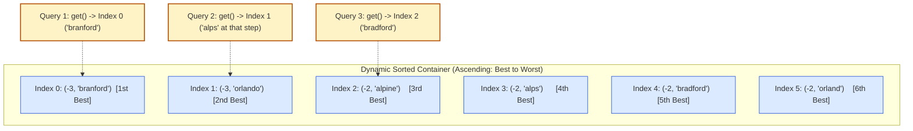

# Guided Example: Sequentially Ordinal Rank Tracker

We trace the streaming composite total-order metric, dynamic rank-pointer advancement, and ordered container partitioning on a representative stream of scenic locations:

- **Operations Sequence:**
  `["SORTracker", "add", "add", "get", "add", "get", "add", "get", "add", "get", "add", "get", "get"]`
- **Arguments:**
  `[[], ["bradford", 2], ["branford", 3], [], ["alps", 2], [], ["orland", 2], [], ["orlando", 3], [], ["alpine", 2], [], []]`
- **Expected Returns:**
  `[null, null, null, "branford", null, "alps", null, "bradford", null, "bradford", null, "bradford", "orland"]`

---

## 1. Problem Overview & Representative Instance

We are asked to design a data structure, `SORTracker`, that dynamically records scenic locations and responds to rank queries.
Each location consists of a unique string `name` and an integer attractiveness `score`.
The locations are strictly ordered from best to worst according to two criteria:
1. **Primary Key (Score):** A higher score represents a strictly better location.
2. **Secondary Key (Name):** If two locations share the exact same score, the one with the lexicographically smaller name is better.

### Query Contract: Monotonically Advancing Rank
- The method `add(name, score)` inserts a new location into the tracker.
- The method `get()` returns the $k$-th best location overall, where $k$ is the number of times `get()` has been invoked so far (1st invocation returns the 1st best, 2nd returns the 2nd best, etc.).
- Re-sorting all $m$ elements upon each query costs $\mathcal{O}(m \log m)$, which is prohibitively slow over $4 \times 10^4$ operations. Instead, maintaining an ordered multiset or a balanced dual-heap structure allows both insertion and retrieval in $\mathcal{O}(\log m)$ time.

---

## 2. Invariants & Dynamic Ordinal Selection Theory

Let $m$ be the number of locations currently stored in the system.

### Invariant 1: Canonical Sortable Tuple Representation
To map the "higher score is better, lexicographically smaller name is better" rule into standard ascending container ordering, each location is represented as a 2-tuple:
$$\tau = (-\text{score}, \text{name})$$
- Negating the score inverts numeric order: $\text{score}_A > \text{score}_B \iff -\text{score}_A < -\text{score}_B$.
- When scores are equal ($-\text{score}_A = -\text{score}_B$), standard lexicographical comparison applies to `name`: $\text{name}_A < \text{name}_B$.
- Because each `name` is unique, $\tau$ defines a strict total order over all locations.
- Under this mapping, index $0$ in the sorted sequence corresponds to the $1$-st best location, index $1$ to the $2$-nd best, and index $k$ to the $(k + 1)$-th best.

### Invariant 2: Monotonic Query Ordinal Counter
Let the integer counter $i$ track the zero-indexed query rank, initialized to $-1$.
On each `get()` invocation:
$$i \leftarrow i + 1$$
The method retrieves the element at position $i$ in the dynamically maintained sorted order.

| Location Name | Attractiveness Score | Stored Tuple $(-\text{score}, \text{name})$ | Global Rank Position |
|---|---|---|---|
| `"branford"` | $3$ | $(-3, \text{"branford"})$ | $1$st Best (Smallest tuple) |
| `"orlando"` | $3$ | $(-3, \text{"orlando"})$ | $2$nd Best |
| `"alpine"` | $2$ | $(-2, \text{"alpine"})$ | $3$rd Best |
| `"alps"` | $2$ | $(-2, \text{"alps"})$ | $4$th Best |
| `"bradford"` | $2$ | $(-2, \text{"bradford"})$ | $5$th Best |
| `"orland"` | $2$ | $(-2, \text{"orland"})$ | $6$th Best |

---

## 3. Step-by-Step Worked Execution

We trace the representative command sequence step by step.

### Step 0: Tracker Initialization
- Initialize sorted container: $\text{sl} = []$.
- Initialize query pointer: $i = -1$.

### Step 1: Add "bradford" (score 2)
- Tuple: $(-2, \text{"bradford"})$.
- $\text{sl} = [(-2, \text{"bradford"})]$. Output: `null`.

### Step 2: Add "branford" (score 3)
- Tuple: $(-3, \text{"branford"})$.
- Since $-3 < -2$, it is inserted at index $0$.
- $\text{sl} = [(-3, \text{"branford"}), (-2, \text{"bradford"})]$. Output: `null`.

### Step 3: Query 1 — get()
- Increment pointer: $i = -1 + 1 = 0$.
- Element at $\text{sl}[0]$ is $(-3, \text{"branford"})$.
- Output: `"branford"`.

### Step 4: Add "alps" (score 2)
- Tuple: $(-2, \text{"alps"})$.
- Compare with $(-2, \text{"bradford"})$: scores tie ($-2 == -2$), but $\text{"alps"} < \text{"bradford"}$.
- Inserted before `"bradford"`.
- $\text{sl} = [(-3, \text{"branford"}), (-2, \text{"alps"}), (-2, \text{"bradford"})]$. Output: `null`.

### Step 5: Query 2 — get()
- Increment pointer: $i = 0 + 1 = 1$.
- Element at $\text{sl}[1]$ is $(-2, \text{"alps"})$.
- Output: `"alps"`.

### Step 6: Add "orland" (score 2)
- Tuple: $(-2, \text{"orland"})$.
- Since $\text{"bradford"} < \text{"orland"}$, it is inserted at the end.
- $\text{sl} = [(-3, \text{"branford"}), (-2, \text{"alps"}), (-2, \text{"bradford"}), (-2, \text{"orland"})]$. Output: `null`.

### Step 7: Query 3 — get()
- Increment pointer: $i = 1 + 1 = 2$.
- Element at $\text{sl}[2]$ is $(-2, \text{"bradford"})$.
- Output: `"bradford"`.

### Step 8: Add "orlando" (score 3)
- Tuple: $(-3, \text{"orlando"})$.
- Inserted after $(-3, \text{"branford"})$ and before $(-2, \text{"alps"})$.
- $\text{sl} = [(-3, \text{"branford"}), (-3, \text{"orlando"}), (-2, \text{"alps"}), (-2, \text{"bradford"}), (-2, \text{"orland"})]$. Output: `null`.

### Step 9: Query 4 — get()
- Increment pointer: $i = 2 + 1 = 3$.
- Element at $\text{sl}[3]$ is $(-2, \text{"bradford"})$.
- Output: `"bradford"`.

### Step 10: Add "alpine" (score 2)
- Tuple: $(-2, \text{"alpine"})$.
- Since $\text{"alpine"} < \text{"alps"}$, inserted before `"alps"`.
- $\text{sl} = [(-3, \text{"branford"}), (-3, \text{"orlando"}), (-2, \text{"alpine"}), (-2, \text{"alps"}), (-2, \text{"bradford"}), (-2, \text{"orland"})]$. Output: `null`.

### Step 11: Query 5 — get()
- Increment pointer: $i = 3 + 1 = 4$.
- Element at $\text{sl}[4]$ is $(-2, \text{"bradford"})$.
- Output: `"bradford"`.

### Step 12: Query 6 — get()
- Increment pointer: $i = 4 + 1 = 5$.
- Element at $\text{sl}[5]$ is $(-2, \text{"orland"})$.
- Output: `"orland"`.

---

## 4. Complete Execution Trace & State Progression

| Op # | Method Invocation | Argument | Tuple Generated | Query Counter $i$ | Target Sorted Position | Emitted Output |
|---|---|---|---|---|---|---|
| $0$ | `SORTracker()` | None | Initial state | $-1$ | N/A | `null` |
| $1$ | `add` | `("bradford", 2)` | $(-2, \text{"bradford"})$ | $-1$ | Index $0$ | `null` |
| $2$ | `add` | `("branford", 3)` | $(-3, \text{"branford"})$ | $-1$ | Index $0$ | `null` |
| $3$ | `get` | None | N/A | $0$ | $\text{sl}[0]$ | `"branford"` |
| $4$ | `add` | `("alps", 2)` | $(-2, \text{"alps"})$ | $0$ | Index $1$ | `null` |
| $5$ | `get` | None | N/A | $1$ | $\text{sl}[1]$ | `"alps"` |
| $6$ | `add` | `("orland", 2)` | $(-2, \text{"orland"})$ | $1$ | Index $3$ | `null` |
| $7$ | `get` | None | N/A | $2$ | $\text{sl}[2]$ | `"bradford"` |
| $8$ | `add` | `("orlando", 3)` | $(-3, \text{"orlando"})$ | $2$ | Index $1$ | `null` |
| $9$ | `get` | None | N/A | $3$ | $\text{sl}[3]$ | `"bradford"` |
| $10$ | `add` | `("alpine", 2)` | $(-2, \text{"alpine"})$ | $3$ | Index $2$ | `null` |
| $11$ | `get` | None | N/A | $4$ | $\text{sl}[4]$ | `"bradford"` |
| $12$ | `get` | None | N/A | $5$ | $\text{sl}[5]$ | `"orland"` |

---

## 5. Algorithmic Correctness & Soundness

### Mathematical Proof of Invariant Preservation
1. **Total Ordering Invariance:**
   For any two distinct locations $A = (s_A, n_A)$ and $B = (s_B, n_B)$:
   - If $s_A \neq s_B$, $-s_A < -s_B \iff s_A > s_B$, matching the rule that larger score is superior.
   - If $s_A = s_B$, $-s_A = -s_B$, and tuple order is decided by $n_A < n_B$, matching the rule that smaller name lexicographically is superior.
   - Since all names are unique, $A \neq B \implies n_A \neq n_B$. Thus, ties cannot occur, establishing a strict total order.
2. **Ordinal Rank Retrieval Correctness:**
   On the $k$-th invocation of `get()`, the counter satisfies $i = k - 1$.
   In any $0$-indexed sorted list of elements ordered from best to worst, the element at index $k - 1$ has exactly $k - 1$ strictly superior elements preceding it. By definition, this element is the $k$-th best location.
3. **Dynamic Shift Resilience:**
   When a new element is inserted before index $i$, all subsequent elements shift rightward by one. Because every subsequent `get()` increments $i$, newly inserted high-scoring locations seamlessly take their place in future queries without invalidating past results.

---

## 6. Structural Implementation Trade-Offs

| Architecture | Insertion Complexity | Query Complexity | Space Complexity | Structural Characteristics |
|---|---|---|---|---|
| Ordered Multiset (`SortedList`) | $\mathcal{O}(\log m)$ | $\mathcal{O}(\log m)$ | $\mathcal{O}(m)$ | Direct index-based access via B-tree / augmented tree |
| Dual Heaps (`min_heap` + `max_heap`) | $\mathcal{O}(\log m)$ | $\mathcal{O}(\log m)$ | $\mathcal{O}(m)$ | `min_heap` holds top $k$ items; `max_heap` holds remainder |
| Naive Unsorted List | $\mathcal{O}(1)$ | $\mathcal{O}(m \log m)$ | $\mathcal{O}(m)$ | Degenerates under high query frequency |

---

## 7. Complexity Analysis

- **Time Complexity:**
  - `add(name, score)`: $\mathcal{O}(\log m)$. Inserting into an ordered sequence or dual-heap takes logarithmic time in the current number of locations $m$.
  - `get()`: $\mathcal{O}(\log m)$ (or $\mathcal{O}(1)$ in an augmented balanced search tree).
  - Total time across $N$ operations is $\mathcal{O}(N \log N)$, easily handling $N = 4 \times 10^4$ operations.
- **Auxiliary Space Complexity:** $\mathcal{O}(m)$.
  - Storing $m$ location tuples of string and integer types requires strictly linear memory $\mathcal{O}(m)$.
