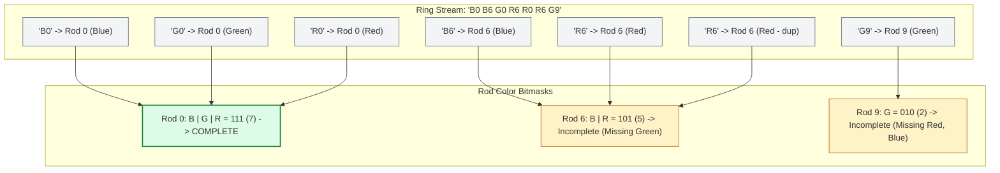

# Guided Example: Rings and Rods

We trace the stride-2 token parsing, idempotent bitmask color accumulation, and all-color rod qualification on a representative ring sequence:

- **Input Ring Sequence:** `rings = "B0B6G0R6R0R6G9"`
- **Number of Rings $n$:** `7` (String length $2n = 14$)
- **Rods Domain:** $10$ distinct rods, indexed $0$ through $9$
- **Expected Number of Complete Rods:** `1` (Rod $0$)

---

## 1. Problem Overview & Representative Instance

We are given a string `rings` of even length $2n$ describing $n$ colored rings placed onto $10$ rods labeled `'0'` through `'9'`.
Each ring is defined by two consecutive characters:
- `rings[2*i]`: the ring's color, which is one of `'R'` (Red), `'G'` (Green), or `'B'` (Blue).
- `rings[2*i+1]`: the rod index digit, from `'0'` to `'9'`.

The objective is to compute how many of the $10$ rods have rings of **all three colors** (at least one Red, at least one Green, and at least one Blue).

### Idempotent Color Accumulation via Bitmasks
A naive approach might maintain hash sets of characters for each rod, incurring unnecessary object allocation overhead.
- Because there are exactly three distinct colors, the presence of each color on rod $r$ can be encoded as a single bit in an integer bitmask.
- Bitwise OR ($\mid$) is inherently **idempotent** ($x \mid x = x$). Duplicate rings of the same color placed onto the same rod leave the accumulated state completely unchanged.
- A rod contains all three colors if and only if its accumulated bitmask equals binary `111` (decimal $7$).

---

## 2. Invariants & Bitmask Representation Mathematics

Let the $10$ rods be indexed $r \in \{0, 1, \dots, 9\}$.
We maintain a state array $\text{masks}[0 \dots 9]$, initialized to $0$.

### Invariant 1: Orthogonal Color Bit Mapping
We assign each color character to a distinct power of two:
$$\text{bit}(\text{'R'}) = 2^0 = 1 \quad (\text{binary } 001_2)$$
$$\text{bit}(\text{'G'}) = 2^1 = 2 \quad (\text{binary } 010_2)$$
$$\text{bit}(\text{'B'}) = 2^2 = 4 \quad (\text{binary } 100_2)$$

### Invariant 2: Idempotent State Transition
For each ring pair $(c, r)$ where $c \in \{\text{'R'}, \text{'G'}, \text{'B'}\}$ and $r \in \{0, \dots, 9\}$:
$$\text{masks}[r] \leftarrow \text{masks}[r] \mathbin{\vert} \text{bit}(c)$$
Because bitwise OR satisfies $b \mid b = b$, multiple rings of color $c$ on rod $r$ are idempotent and cannot corrupt the representation.

### Invariant 3: Three-Color Conjunction Criterion
A rod $r$ possesses at least one ring of each color if and only if:
$$\text{masks}[r] = \text{bit}(\text{'R'}) \mathbin{\vert} \text{bit}(\text{'G'}) \mathbin{\vert} \text{bit}(\text{'B'}) = 1 \mathbin{\vert} 2 \mathbin{\vert} 4 = 7$$
The total number of qualified rods is:
$$\text{ans} = \sum_{r=0}^{9} [\![\text{masks}[r] == 7]\!]$$

| Color Identifier | Binary Flag | Integer Value | Meaning When Bit is Set |
|---|---|---|---|
| `'R'` (Red) | `001` | $1$ | At least one Red ring is on this rod |
| `'G'` (Green) | `010` | $2$ | At least one Green ring is on this rod |
| `'B'` (Blue) | `100` | $4$ | At least one Blue ring is on this rod |
| Full Set Target | `111` | $7$ | All three colors present on this rod |

---

## 3. Step-by-Step Worked Execution

We trace `rings = "B0B6G0R6R0R6G9"`.
Initial state: $\text{masks}[r] = 0$ for all $r \in \{0, \dots, 9\}$.

### Step 1: Token `B0` (Index 0-1)
- Color: `'B'` $\implies \text{bit} = 4$. Rod: $0$.
- Update: $\text{masks}[0] \leftarrow 0 \mid 4 = 4$ (`100`).

### Step 2: Token `B6` (Index 2-3)
- Color: `'B'` $\implies \text{bit} = 4$. Rod: $6$.
- Update: $\text{masks}[6] \leftarrow 0 \mid 4 = 4$ (`100`).

### Step 3: Token `G0` (Index 4-5)
- Color: `'G'` $\implies \text{bit} = 2$. Rod: $0$.
- Update: $\text{masks}[0] \leftarrow 4 \mid 2 = 6$ (`110`).

### Step 4: Token `R6` (Index 6-7)
- Color: `'R'` $\implies \text{bit} = 1$. Rod: $6$.
- Update: $\text{masks}[6] \leftarrow 4 \mid 1 = 5$ (`101`).

### Step 5: Token `R0` (Index 8-9)
- Color: `'R'` $\implies \text{bit} = 1$. Rod: $0$.
- Update: $\text{masks}[0] \leftarrow 6 \mid 1 = 7$ (`111`).
- Rod $0$ now satisfies the target condition $\text{masks}[0] == 7$!

### Step 6: Token `R6` (Index 10-11)
- Color: `'R'` $\implies \text{bit} = 1$. Rod: $6$.
- Update: $\text{masks}[6] \leftarrow 5 \mid 1 = 5$ (`101`).
- Red was already present on rod $6$; state remains unchanged.

### Step 7: Token `G9` (Index 12-13)
- Color: `'G'` $\implies \text{bit} = 2$. Rod: $9$.
- Update: $\text{masks}[9] \leftarrow 0 \mid 2 = 2$ (`010`).

### Step 8: Final Rod Scan
We examine all $10$ masks:
- $\text{masks}[0] = 7$ (`111`): Complete $\implies +1$.
- $\text{masks}[6] = 5$ (`101`): Missing Green.
- $\text{masks}[9] = 2$ (`010`): Missing Red and Blue.
- All other rods have mask $0$.
- Total complete rods: $1$.

---

## 4. Complete Execution Trace & State Progression

| Ring # | Token | Color $c$ | Rod $r$ | Color Bit | Prior $\text{masks}[r]$ | Updated $\text{masks}[r]$ | Binary Representation |
|---|---|---|---|---|---|---|---|
| $1$ | `"B0"` | `'B'` | $0$ | $4$ | $0$ | $4$ | `100` |
| $2$ | `"B6"` | `'B'` | $6$ | $4$ | $0$ | $4$ | `100` |
| $3$ | `"G0"` | `'G'` | $0$ | $2$ | $4$ | $6$ | `110` |
| $4$ | `"R6"` | `'R'` | $6$ | $1$ | $4$ | $5$ | `101` |
| $5$ | `"R0"` | `'R'` | $0$ | $1$ | $6$ | $7$ | `111` (Complete) |
| $6$ | `"R6"` | `'R'` | $6$ | $1$ | $5$ | $5$ | `101` (Idempotent) |
| $7$ | `"G9"` | `'G'` | $9$ | $2$ | $0$ | $2$ | `010` |

---

## 5. Algorithmic Correctness & Soundness

### Mathematical Proof of Equivalence
1. **Bijective Color Mapping:**
   Because $\{1, 2, 4\}$ are distinct powers of two ($2^0, 2^1, 2^2$), every subset of $\{\text{'R'}, \text{'G'}, \text{'B'}\}$ maps to a unique integer in $\{0, 1, \dots, 7\}$ through bitwise summation.
2. **Idempotence of Accumulation:**
   The bitwise operation $S \leftarrow S \mid b$ ensures that adding color $b$ multiple times leaves the bit representation identical:
   $$S \mathbin{\vert} b \mathbin{\vert} b = S \mathbin{\vert} b$$
   Hence, the frequency of duplicate rings of the same color on the same rod does not alter presence status.
3. **Exact Completeness Criterion:**
   The condition $\text{masks}[r] == 7$ is satisfied if and only if bit $0$, bit $1$, and bit $2$ are all $1$. This holds if and only if rod $r$ has received at least one Red ring, at least one Green ring, and at least one Blue ring.
4. **Exhaustive Domain Evaluation:**
   Since there are exactly $10$ possible rod indices ($0 \dots 9$), scanning the $10$-element array guarantees every rod is evaluated exactly once without omissions.

---

## 6. Structural Edge Cases & Boundary Behaviors

| Configuration | Sample Input | Expected Evaluation | Output |
|---|---|---|---|
| Single Ring | `"G4"` | Only rod $4$ receives Green ($\text{masks}[4] = 2 \neq 7$) | $0$ |
| Repeated Duplicate Rings | `"B0R0G0R0B0G0"` | Rod $0$ receives duplicates of all colors; mask remains $7$ | $1$ |
| Multiple Qualified Rods | `"R0G0B0R4G4B4R9G9B9"` | Rods $0, 4, 9$ each reach mask $7$ | $3$ |
| All Rods Incomplete | `"R0R1R2R3R4R5R6R7R8R9"` | Every rod has only Red ($\text{mask} = 1 \neq 7$) | $0$ |

---

## 7. Complexity Analysis

- **Time Complexity:** $\mathcal{O}(n)$.
  - The input string has length $2n$.
  - We advance by $2$ characters per step, performing exactly $n$ loop iterations.
  - Each iteration performs $\mathcal{O}(1)$ dictionary lookup, bitwise OR, and array write.
  - The final qualification scan examines exactly $10$ rod masks in $\mathcal{O}(1)$ time.
  - Overall time complexity is strictly linear in the input length: $\mathcal{O}(n)$.
- **Auxiliary Space Complexity:** $\mathcal{O}(1)$.
  - The state is tracked using a fixed array of $10$ integers and a 3-element color mapping table.
  - Memory consumption is strictly constant and independent of $n$.
