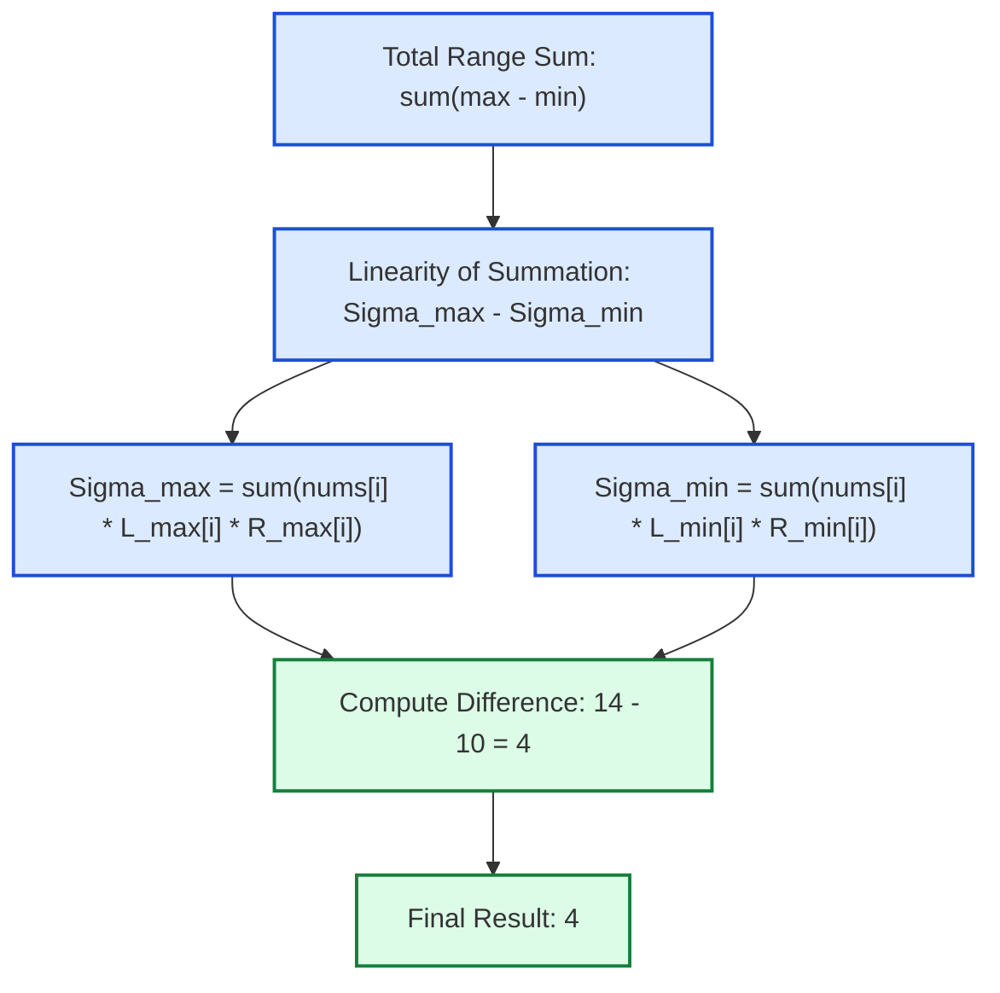

# Guided Example: Sum of Subarray Ranges

We trace the linearity of summation decomposition, asymmetric tie-breaking, and monotonic stack contribution counting on a representative integer array:

- **Input Array:** `nums = [1, 2, 3]`
- **Array Length $n$:** `3`
- **Total Subarrays $\binom{n+1}{2}$:** `6`
- **Expected Sum of Subarray Ranges:** `4`

---

## 1. Problem Overview & Representative Instance

We are given an integer array `nums`. The **range** of a contiguous subarray is defined as the difference between the maximum and minimum elements within that subarray:
$$\text{range}(\text{nums}[i \dots j]) = \max(\text{nums}[i \dots j]) - \min(\text{nums}[i \dots j])$$
The objective is to compute the sum of ranges across all possible contiguous subarrays of `nums`:
$$\text{Total Range Sum} = \sum_{0 \le i \le j < n} \Big( \max(\text{nums}[i \dots j]) - \min(\text{nums}[i \dots j]) \Big)$$

### The Linearity of Summation Principle
Directly computing the range for each of the $\mathcal{O}(n^2)$ subarrays takes $\mathcal{O}(n^3)$ naively, or $\mathcal{O}(n^2)$ with incremental min/max tracking.
However, by applying the algebraic **linearity of summation**, we can decouple the maximum and minimum terms entirely:
$$\sum_{i \le j} \Big( \max(\text{nums}[i \dots j]) - \min(\text{nums}[i \dots j]) \Big) = \sum_{i \le j} \max(\text{nums}[i \dots j]) - \sum_{i \le j} \min(\text{nums}[i \dots j])$$
Instead of asking "what are the extremes of this subarray?", we invert the question: **"in how many subarrays does element $\text{nums}[k]$ serve as the maximum, and in how many does it serve as the minimum?"**
Using a monotonic stack, each element's span of dominance is resolved in amortized $\mathcal{O}(1)$ time, yielding an optimal $\mathcal{O}(n)$ total solution.

---

## 2. Invariants & Contribution Summation Mathematics

Let $n$ be the length of `nums`.
For each index $k \in \{0, \dots, n-1\}$, let:
- $L_{\max}[k]$ be the number of valid starting indices $i \le k$ such that $\text{nums}[k]$ is the maximum in $\text{nums}[i \dots k]$.
- $R_{\max}[k]$ be the number of valid ending indices $j \ge k$ such that $\text{nums}[k]$ is the maximum in $\text{nums}[k \dots j]$.

### Invariant 1: Multiplicative Subarray Span Counting
Because choice of start index $i$ and end index $j$ are independent across the anchor index $k$:
$$\text{Count}_{\max}(k) = L_{\max}[k] \times R_{\max}[k]$$
$$\text{Count}_{\min}(k) = L_{\min}[k] \times R_{\min}[k]$$
The net contribution of $\text{nums}[k]$ to the total sum of ranges is:
$$\text{Contribution}(k) = \text{nums}[k] \times \Big( \text{Count}_{\max}(k) - \text{Count}_{\min}(k) \Big)$$

### Invariant 2: Asymmetric Boundary Tie-Breaking
When duplicate elements exist (e.g., $\text{nums} = [1, 3, 3]$), multiple occurrences of the maximum could claim the same subarray.
To guarantee that each subarray's extremum is attributed to **exactly one** index, we enforce asymmetric inequality comparisons:
- **Left boundary:** Extend while strictly greater ($>$) or strictly smaller ($<$).
- **Right boundary:** Extend while greater-than-or-equal ($\ge$) or smaller-than-or-equal ($\le$).
This strictly partitions all $\binom{n+1}{2}$ subarrays among unique representative indices.

| Metric / Parameter | Dominance Definition for Maxima | Dominance Definition for Minima | Role in Contribution |
|---|---|---|---|
| Left Span $L[k]$ | Distance to previous strictly greater element | Distance to previous strictly smaller element | Number of valid left endpoints |
| Right Span $R[k]$ | Distance to next greater-or-equal element | Distance to next smaller-or-equal element | Number of valid right endpoints |
| Total Subarrays | $L_{\max}[k] \times R_{\max}[k]$ | $L_{\min}[k] \times R_{\min}[k]$ | Multiplicative Cartesian product |
| Weighted Contribution | $+ \text{nums}[k] \times \text{Count}_{\max}(k)$ | $- \text{nums}[k] \times \text{Count}_{\min}(k)$ | Additive contribution to global answer |

---

## 3. Step-by-Step Worked Execution

We trace `nums = [1, 2, 3]`.

### Part A: Subarray Maxima Calculation ($\Sigma_{\max}$)

1. **Element $k = 0$ ($\text{nums}[0] = 1$):**
   - Left span $L_{\max}[0]$: No preceding elements $\implies L = 1$ (index $0$).
   - Right span $R_{\max}[0]$: Next element is $2 > 1$, stops immediately $\implies R = 1$ (index $0$).
   - Subarrays where $1$ is maximum: $1 \times 1 = 1$ (`[1]`).
   - Contribution: $1 \times 1 = 1$.

2. **Element $k = 1$ ($\text{nums}[1] = 2$):**
   - Left span $L_{\max}[1]$: Preceding element $1 < 2$, spans over $1$ and $2 \implies L = 2$ (indices $0, 1$).
   - Right span $R_{\max}[1]$: Next element is $3 > 2$, stops immediately $\implies R = 1$ (index $1$).
   - Subarrays where $2$ is maximum: $2 \times 1 = 2$ (`[2]`, `[1, 2]`).
   - Contribution: $2 \times 2 = 4$.

3. **Element $k = 2$ ($\text{nums}[2] = 3$):**
   - Left span $L_{\max}[2]$: Preceding elements $1, 2 < 3$, spans all $\implies L = 3$ (indices $0, 1, 2$).
   - Right span $R_{\max}[2]$: No succeeding elements $\implies R = 1$ (index $2$).
   - Subarrays where $3$ is maximum: $3 \times 1 = 3$ (`[3]`, `[2, 3]`, `[1, 2, 3]`).
   - Contribution: $3 \times 3 = 9$.

$$\Sigma_{\max} = 1 + 4 + 9 = 14$$

---

### Part B: Subarray Minima Calculation ($\Sigma_{\min}$)

1. **Element $k = 0$ ($\text{nums}[0] = 1$):**
   - Left span $L_{\min}[0]$: $L = 1$ (index $0$).
   - Right span $R_{\min}[0]$: Succeeding elements $2, 3 > 1$, spans all $\implies R = 3$ (indices $0, 1, 2$).
   - Subarrays where $1$ is minimum: $1 \times 3 = 3$ (`[1]`, `[1, 2]`, `[1, 2, 3]`).
   - Contribution: $1 \times 3 = 3$.

2. **Element $k = 1$ ($\text{nums}[1] = 2$):**
   - Left span $L_{\min}[1]$: Preceding element $1 < 2$, stops $\implies L = 1$ (index $1$).
   - Right span $R_{\min}[1]$: Succeeding element $3 > 2$, spans over $2$ and $3 \implies R = 2$ (indices $1, 2$).
   - Subarrays where $2$ is minimum: $1 \times 2 = 2$ (`[2]`, `[2, 3]`).
   - Contribution: $2 \times 2 = 4$.

3. **Element $k = 2$ ($\text{nums}[2] = 3$):**
   - Left span $L_{\min}[2]$: Preceding element $2 < 3$, stops $\implies L = 1$ (index $2$).
   - Right span $R_{\min}[2]$: $R = 1$ (index $2$).
   - Subarrays where $3$ is minimum: $1 \times 1 = 1$ (`[3]`).
   - Contribution: $3 \times 1 = 3$.

$$\Sigma_{\min} = 3 + 4 + 3 = 10$$

---

### Part C: Net Range Summation
$$\text{Total Range Sum} = \Sigma_{\max} - \Sigma_{\min} = 14 - 10 = 4$$

---

## 4. Complete Execution Trace & State Progression

| Index $k$ | Value | $L_{\max}$ | $R_{\max}$ | $\text{Count}_{\max}$ | Max Contrib | $L_{\min}$ | $R_{\min}$ | $\text{Count}_{\min}$ | Min Contrib | Net Contrib |
|---|---|---|---|---|---|---|---|---|---|---|
| $0$ | $1$ | $1$ | $1$ | $1$ | $+1$ | $1$ | $3$ | $3$ | $-3$ | $-2$ |
| $1$ | $2$ | $2$ | $1$ | $2$ | $+4$ | $1$ | $2$ | $2$ | $-4$ | $0$ |
| $2$ | $3$ | $3$ | $1$ | $3$ | $+9$ | $1$ | $1$ | $1$ | $-3$ | $+6$ |
| **Sum** | — | — | — | **6** | **+14** | — | — | **6** | **-10** | **+4** |

### Direct Subarray Verification Table
To independently verify the aggregate outcome, we enumerate all $6$ individual contiguous intervals:

| Subarray $\text{nums}[i \dots j]$ | Elements | Subarray Minimum | Subarray Maximum | Range $(\max - \min)$ |
|---|---|---|---|---|
| $[0 \dots 0]$ | `[1]` | $1$ | $1$ | $1 - 1 = 0$ |
| $[0 \dots 1]$ | `[1, 2]` | $1$ | $2$ | $2 - 1 = 1$ |
| $[0 \dots 2]$ | `[1, 2, 3]` | $1$ | $3$ | $3 - 1 = 2$ |
| $[1 \dots 1]$ | `[2]` | $2$ | $2$ | $2 - 2 = 0$ |
| $[1 \dots 2]$ | `[2, 3]` | $2$ | $3$ | $3 - 2 = 1$ |
| $[2 \dots 2]$ | `[3]` | $3$ | $3$ | $3 - 3 = 0$ |
| **Sum** | — | — | — | **4** |

---

## 5. Algorithmic Correctness & Soundness

### Proof of Bijective Subarray Partitioning
1. **Uniqueness of Attribution:**
   For any subarray $\text{nums}[i \dots j]$, let $M = \max_{t=i}^j \text{nums}[t]$.
   If multiple indices attain value $M$, the asymmetric tie-breaking rule ($>$ on left, $\ge$ on right) attributes the subarray exclusively to the *first* (or uniquely designated) index $k \in [i, j]$ where $\text{nums}[k] = M$.
   Therefore, each subarray has exactly one index $k$ such that $i \in [k - L_{\max}[k] + 1, k]$ and $j \in [k, k + R_{\max}[k] - 1]$.
2. **Completeness of Summation:**
   Summing $\text{nums}[k] \times L_{\max}[k] \times R_{\max}[k]$ over all $k$ counts the maximum of each subarray exactly once.
   Similarly, summing $\text{nums}[k] \times L_{\min}[k] \times R_{\min}[k]$ counts the minimum of each subarray exactly once.
3. **Exact Range Sum Identity:**
   Subtracting $\Sigma_{\min}$ from $\Sigma_{\max}$ yields the exact sum of $\max - \min$ across all $\binom{n+1}{2}$ subarrays.

---

## 6. Structural Edge Cases & Boundary Behaviors

| Array Structure | Concrete Sample | Behavioral Characteristic | Range Sum Result |
|---|---|---|---|
| Single Element | `[5]` | Only subarray is `[5]`; $\max = \min = 5$ | $0$ |
| All Equal Elements | `[3, 3, 3, 3]` | Every subarray has $\max = \min = 3$; all ranges $0$ | $0$ |
| Strictly Decreasing | `[3, 2, 1]` | Symmetric to increasing; $L$ and $R$ spans mirror | $4$ |
| Repeated Maxima | `[1, 3, 3]` | Asymmetric tie-breaking splits duplicates without overlap | $4$ |
| Negative Elements | `[4, -2, -3, 4, 1]` | Signed arithmetic preserves $(+ \text{max} - \text{min})$ cancellation | $59$ |

---

## 7. Complexity Analysis

- **Time Complexity:** $\mathcal{O}(n)$ (Optimal Monotonic Stack) or $\mathcal{O}(n^2)$ (Nested Sweep).
  - With monotonic stacks, each index is pushed and popped at most once across each of the four boundary scans ($L_{\max}, R_{\max}, L_{\min}, R_{\min}$).
  - All four scans execute in $\mathcal{O}(n)$ time.
  - Accumulating the linear combination takes $\mathcal{O}(n)$ time.
  - Total time complexity is strictly linear: $\mathcal{O}(n)$.
- **Auxiliary Space Complexity:** $\mathcal{O}(n)$ (or $\mathcal{O}(1)$).
  - Storing the span arrays and monotonic stack buffers requires $\mathcal{O}(n)$ memory.
  - (If implemented via the nested two-pointer sweep, space is $\mathcal{O}(1)$ at the cost of $\mathcal{O}(n^2)$ time).
