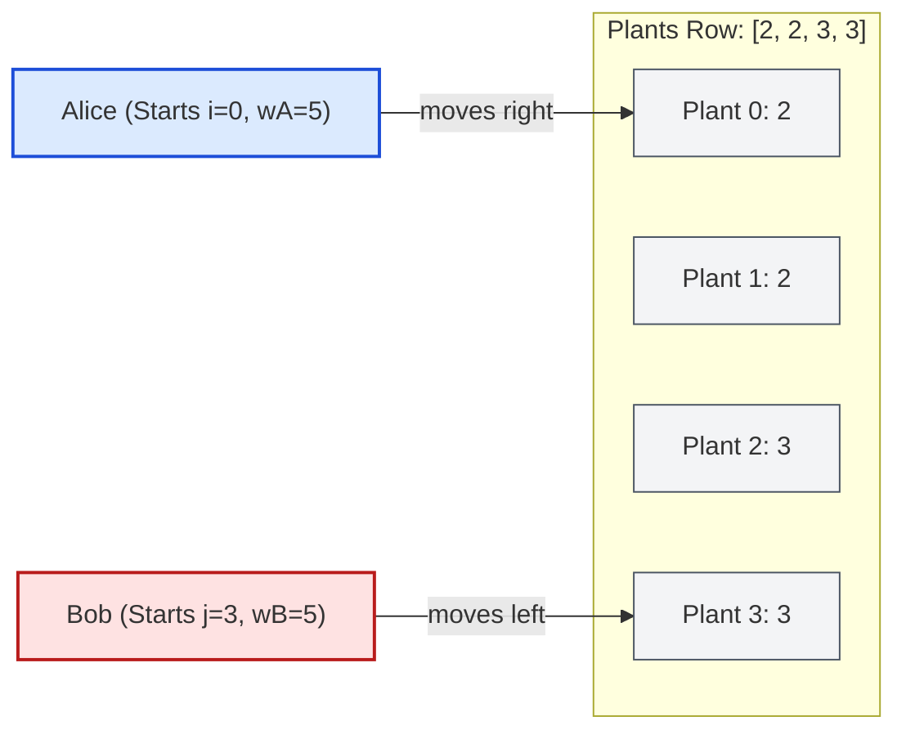

# Guided Example: Watering Plants II

We trace the two-pointer convergent simulation, greedy refill trigger evaluation, and center collision arbitration on a representative garden arrangement:

- **Plants Array:** `plants = [2, 2, 3, 3]`
- **Alice's Capacity $C_A$:** `5`
- **Bob's Capacity $C_B$:** `5`
- **Garden Length $n$:** `4`
- **Expected Total Refills:** `1` (Bob refills at plant $2$)

---

## 1. Problem Overview & Representative Instance

Alice and Bob are watering $n$ plants arranged in a straight row, indexed from $0$ to $n - 1$.
- Alice starts at the leftmost plant ($i = 0$) moving rightward.
- Bob starts at the rightmost plant ($j = n - 1$) moving leftward.
- Alice's watering can has capacity $C_A$, and Bob's watering can has capacity $C_B$. Both begin with fully filled cans ($w_A = C_A, w_B = C_B$).
- Both move at the same speed, watering their respective plants simultaneously.
- If a gardener lacks sufficient water to fully water their assigned plant, they must refill their can to full capacity before watering.
- If both gardeners meet at the exact same plant ($i == j$ in an odd-length garden):
  - The gardener with **strictly more water** waters the plant.
  - If they have the **same amount of water**, Alice waters the plant.
  - If the chosen gardener lacks sufficient water, they must refill.

The objective is to determine the **total number of times** either Alice or Bob must refill their can.

---

## 2. Invariants & Two-Pointer Capacity Simulation Mathematics

Let $i$ and $j$ be the indices currently attended by Alice and Bob respectively, initialized to $i = 0$ and $j = n - 1$.
Their current water amounts are $w_A$ and $w_B$.

### Invariant 1: Independent Disjoint Operation ($i < j$)
When $i < j$, Alice and Bob operate on separate plants. Because neither gardener affects the other's remaining water or plant requirements:
- **Alice's Transition at Plant $i$:**
  $$\text{refill}_A = [\![w_A < \text{plants}[i]]\!]$$
  $$w_A \leftarrow (\text{if } \text{refill}_A \text{ then } C_A \text{ else } w_A) - \text{plants}[i]$$
- **Bob's Transition at Plant $j$:**
  $$\text{refill}_B = [\![w_B < \text{plants}[j]]\!]$$
  $$w_B \leftarrow (\text{if } \text{refill}_B \text{ then } C_B \text{ else } w_B) - \text{plants}[j]$$
- Inward advancement: $i \leftarrow i + 1, \quad j \leftarrow j - 1$.

### Invariant 2: Center Collision Resolution ($i == j$)
If $n$ is odd, the pointers converge at the unique middle plant $m = \lfloor n / 2 \rfloor$.
By the tie-breaking rules:
- Alice waters if $w_A \ge w_B$.
- Bob waters if $w_A < w_B$.
In either case, the chosen gardener holds $\max(w_A, w_B)$ units of water.
A refill occurs if and only if this maximal amount is strictly less than the plant's demand:
$$\text{refill}_{\text{center}} = [\![\max(w_A, w_B) < \text{plants}[m]]\!]$$

| Operational Phase | Condition | Active Gardeners | Refill Evaluation Rule |
|---|---|---|---|
| Inward Convergence | $i < j$ | Both Alice and Bob | $\text{refills} \mathrel{+}= [\![w_A < \text{plants}[i]]\!] + [\![w_B < \text{plants}[j]]\!]$ |
| Center Meeting | $i == j$ | Designated Gardener | $\text{refills} \mathrel{+}= [\![\max(w_A, w_B) < \text{plants}[i]]\!]$ |
| Termination | $i > j$ | None | All $n$ plants watered; emit total refills |

---

## 3. Step-by-Step Worked Execution

We trace `plants = [2, 2, 3, 3]` with $C_A = 5, C_B = 5$.
Initial state: $i = 0, j = 3$, $w_A = 5, w_B = 5$, $\text{refills} = 0$.

### Round 1: Processing Plant $0$ and Plant $3$ ($i = 0 < j = 3$)
- **Alice at Plant $0$ (Demand: $2$):**
  - Current water: $w_A = 5 \ge 2$.
  - Sufficient water available $\implies$ No refill.
  - Remaining water: $w_A \leftarrow 5 - 2 = 3$.
- **Bob at Plant $3$ (Demand: $3$):**
  - Current water: $w_B = 5 \ge 3$.
  - Sufficient water available $\implies$ No refill.
  - Remaining water: $w_B \leftarrow 5 - 3 = 2$.
- **Advance Pointers:**
  - $i \leftarrow 0 + 1 = 1$.
  - $j \leftarrow 3 - 1 = 2$.

### Round 2: Processing Plant $1$ and Plant $2$ ($i = 1 < j = 2$)
- **Alice at Plant $1$ (Demand: $2$):**
  - Current water: $w_A = 3 \ge 2$.
  - Sufficient water available $\implies$ No refill.
  - Remaining water: $w_A \leftarrow 3 - 2 = 1$.
- **Bob at Plant $2$ (Demand: $3$):**
  - Current water: $w_B = 2 < 3$.
  - Insufficient water! Bob must refill before watering.
  - Refill triggered: $\text{refills} \leftarrow 0 + 1 = 1$.
  - Bob refills to $C_B = 5$, then waters:
    $$w_B \leftarrow 5 - 3 = 2$$
- **Advance Pointers:**
  - $i \leftarrow 1 + 1 = 2$.
  - $j \leftarrow 2 - 1 = 1$.

### Loop Termination
- Now $i = 2 > j = 1$.
- Because $n = 4$ is even, pointers cross without a middle collision.
- Final refills count: $1$.

---

## 4. Complete Execution Trace & State Progression

| Round | Alice Index $i$ | Plant $[i]$ | Alice Water $w_A$ | Alice Refill? | Bob Index $j$ | Plant $[j]$ | Bob Water $w_B$ | Bob Refill? | Cumulative Refills |
|---|---|---|---|---|---|---|---|---|---|
| Start | $0$ | — | $5$ | — | $3$ | — | $5$ | — | $0$ |
| $1$ | $0$ | $2$ | $5 \to 3$ | No | $3$ | $3$ | $5 \to 2$ | No | $0$ |
| $2$ | $1$ | $2$ | $3 \to 1$ | No | $2$ | $3$ | $2 \to 5 \to 2$ | **Yes (+1)** | **1** |
| Finish | $2$ | — | $1$ | — | $1$ | — | $2$ | — | **1** |

### Contrast: Odd-Length Garden Meeting Plant Trace
Consider `plants = [2, 2, 5, 2, 2]`, $C_A = 5, C_B = 5$ ($n = 5$):
1. **Round 1 ($i=0, j=4$):**
   - Alice waters plant $0$ (demand $2$): $w_A = 5 - 2 = 3$.
   - Bob waters plant $4$ (demand $2$): $w_B = 5 - 2 = 3$.
2. **Round 2 ($i=1, j=3$):**
   - Alice waters plant $1$ (demand $2$): $w_A = 3 - 2 = 1$.
   - Bob waters plant $3$ (demand $2$): $w_B = 3 - 2 = 1$.
3. **Collision at Plant $2$ ($i = j = 2$, demand $5$):**
   - Alice and Bob both have $w_A = 1, w_B = 1$.
   - By tie-breaker, Alice waters.
   - Alice has $1 < 5 \implies$ **Refill triggered (+1)**.
   - Total refills: $1$.

---

## 5. Algorithmic Correctness & Soundness

### Proof of Simulation Soundness
1. **Step Invariance:**
   Because Alice and Bob move at identical rates from opposite ends, Alice waters plant $k$ at the exact same time step that Bob waters plant $n - 1 - k$.
2. **Independence of Separate Cans:**
   Each gardener maintains a private watering can. Refilling Alice's can has no effect on Bob's water level, and vice versa. Therefore, evaluating their decisions in parallel or sequentially within the same iteration produces the identical physical trajectory.
3. **Optimality of Greedy Refilling:**
   The problem specifies that a refill is mandatory if and only if the current water is strictly less than the plant's requirement ($w < \text{plants}[k]$). No speculative early refilling is permitted, so the greedy rule deterministically models the exact problem requirements.
4. **Collision Completeness:**
   For odd $n$, exactly one plant remains unwatered when $i == j$. Evaluating $\max(w_A, w_B) < \text{plants}[i]$ guarantees that whichever gardener is selected by the problem's preference rules is tested correctly for refill sufficiency.

---

## 6. Structural Edge Cases & Boundary Behaviors

| Configuration | Scenario | Invariant Behavior | Output |
|---|---|---|---|
| Single Plant ($n = 1$) | `plants = [5]`, $C_A = 10, C_B = 8$ | Loop $i < j$ skips; Alice waters with $10 \ge 5$ | $0$ |
| Exact Capacity Fit | $w_A == \text{plants}[i]$ | Condition is strict ($<$); waters directly, ending at $0$ | No refill |
| Both Refill at Midpoint | $i == j$ and both $w_A, w_B < \text{demand}$ | Only the designated gardener refills, not both | $+1$ refill |
| Both Refill on Flanks | $w_A < \text{plants}[i] \land w_B < \text{plants}[j]$ | Both independent conditions trigger | $+2$ refills |

---

## 7. Complexity Analysis

- **Time Complexity:** $\mathcal{O}(n)$.
  - The pointers $i$ and $j$ advance towards each other by $1$ step each round.
  - Exactly $\lceil n / 2 \rceil$ iterations are executed.
  - Each iteration performs $\mathcal{O}(1)$ comparisons and arithmetic updates.
  - Overall time complexity is strictly linear: $\mathcal{O}(n)$.
- **Auxiliary Space Complexity:** $\mathcal{O}(1)$.
  - Only scalar state variables ($i, j, w_A, w_B, \text{refills}$) are maintained.
  - No heap allocations or dynamic structures are utilized.
