# Guided Example: Maximum Fruits Harvested After at Most K Steps

We trace the number-line turnaround geometry, minimal step interval metric, and two-pointer sliding window harvesting on a representative fruit coordinate array:

- **Fruit Positions & Amounts:** `fruits = [[2, 8], [6, 3], [8, 6]]`
- **Initial Position $S$ (`startPos`):** `5`
- **Maximum Step Budget $k$:** `4`
- **Expected Maximum Fruits Harvested:** `9` (Visiting positions $6$ and $8$)

---

## 1. Problem Overview & Representative Instance

Fruits are placed at distinct coordinates on an infinite 1D number line, represented by a sorted 2D array `fruits` where $\text{fruits}[i] = [p_i, a_i]$ specifies that $a_i$ fruits are located at integer position $p_i$.
We start at coordinate $S = \text{startPos}$ with an allowance of at most $k$ single-unit steps (moving either left or right).
When reaching a position containing fruits, we harvest all fruits at that location.
The objective is to compute the **maximum total fruits** that can be harvested within $k$ steps.

### Path Geometry: The Turn-At-Most-Once Theorem
Any walk that harvests a contiguous set of fruit locations covers a closed spatial interval $[l, r]$ containing $S$ (or reached directly from $S$).
- Because turning around wastes steps by retracing covered ground, any optimal path covering $[l, r]$ turns around **at most once**:
  1. Move from $S$ to one extremity (say, $l$), turn around, and walk across to the other extremity ($r$). Total steps: $(S - l) + (r - l)$.
  2. Move from $S$ to $r$, turn around, and walk across to $l$. Total steps: $(r - S) + (r - l)$.
- The minimum steps required to cover any interval $[l, r]$ is:
  $$\text{cost}(l, r) = (r - l) + \min(|S - l|, |r - S|)$$
- This convexity and monotonicity enables a two-pointer sliding window: expanding the right endpoint $r$ monotonically increases the required steps, which can be compensated by advancing the left endpoint $l$.

```mermaid
flowchart TD
    accTitle: Number Line Turnaround Interval Geometry
    accDescr: Diagram illustrating start position at 5, fruit positions at 2, 6, and 8, and path options choosing either leftward or rightward initial strides.
    subgraph Axis["1D Coordinate Line"]
        P2["Pos 2 (8 fruits)"] --- P5["Pos 5 (Start S)"] --- P6["Pos 6 (3 fruits)"] --- P8["Pos 8 (6 fruits)"]
    end
    RouteRight["Rightward Route: 5 -> 6 -> 8 (Steps: 3 <= 4, Fruits: 3 + 6 = 9)"]
    RouteLeft["Leftward Route: 5 -> 2 (Steps: 3 <= 4, Fruits: 8)"]
    RouteBoth["Turnaround Route: 5 -> 6 -> 2 (Steps: 1 + 4 = 5 > 4, Infeasible)"]

    classDef opt fill:#dcfce7,stroke:#15803d,stroke-width:2px;
    classDef sub fill:#dbeafe,stroke:#1d4ed8,stroke-width:1px;
    classDef inf fill:#fee2e2,stroke:#b91c1c,stroke-width:1px;
    class RouteRight opt;
    class RouteLeft sub;
    class RouteBoth inf;
```

---

## 2. Invariants & Turn-At-Most-Once Path Geometry

Let an active window of fruit entries span indices from $i$ to $j$ ($0 \le i \le j < n$), corresponding to spatial interval $[l, r] = [\text{fruits}[i][0], \text{fruits}[j][0]]$.

### Invariant 1: Universal Minimal Step Cost Formula
For any target interval $[l, r]$ on the real line relative to start coordinate $S$:
$$\text{cost}(l, r) = (r - l) + \min(|S - l|, |r - S|)$$
This formula holds universally across all topological relationships:
1. **Both endpoints to the right ($S \le l \le r$):**
   $\text{cost}(l, r) = (r - l) + (l - S) = r - S$ (Single rightward stride).
2. **Both endpoints to the left ($l \le r \le S$):**
   $\text{cost}(l, r) = (r - l) + (S - r) = S - l$ (Single leftward stride).
3. **Straddling the start ($l \le S \le r$):**
   $\text{cost}(l, r) = (r - l) + \min(S - l, r - S)$ (Walk to closest extremity first, then traverse full span $(r - l)$).

### Invariant 2: Sliding Window Monotonicity
For a fixed left fruit index $i$, as right fruit index $j$ increases, the position $r = \text{fruits}[j][0]$ increases, so $\text{cost}(l, r)$ is monotonically non-decreasing.
When $\text{cost}(l, r) > k$, incrementing $i$ increases $l = \text{fruits}[i][0]$, strictly decreasing $(r - l)$ and restoring feasibility.

| Geometric Configuration | Spatial Relation | Step Cost Formula $\text{cost}(l, r)$ | Physical Trajectory |
|---|---|---|---|
| Unidirectional Right | $S \le l \le r$ | $r - S$ | Move right from $S$ to $r$ |
| Unidirectional Left | $l \le r \le S$ | $S - l$ | Move left from $S$ to $l$ |
| Turn Left First | $l \le S \le r \land (S - l \le r - S)$ | $2(S - l) + (r - S)$ | Visit $l$ first, turnaround to $r$ |
| Turn Right First | $l \le S \le r \land (r - S < S - l)$ | $2(r - S) + (S - l)$ | Visit $r$ first, turnaround to $l$ |

---

## 3. Step-by-Step Worked Execution

We trace `fruits = [[2, 8], [6, 3], [8, 6]]`, $S = 5$, $k = 4$.
Initialize: $i = 0$, $\text{current\_fruits} = 0$, $\text{ans} = 0$.

### Step 1: Expand Right Pointer to $j = 0$
- Fruit at index $0$: position $p_0 = 2$, amount $a_0 = 8$.
- Add to window: $\text{current\_fruits} \leftarrow 0 + 8 = 8$.
- Window $[i, j] = [0, 0] \implies [l, r] = [2, 2]$.
- Compute step cost:
  $$\text{cost}(2, 2) = (2 - 2) + \min(|5 - 2|, |2 - 5|) = 0 + 3 = 3$$
- Check feasibility: $3 \le k = 4$ (Feasible!).
- Update maximum: $\text{ans} \leftarrow \max(0, 8) = 8$.

### Step 2: Expand Right Pointer to $j = 1$
- Fruit at index $1$: position $p_1 = 6$, amount $a_1 = 3$.
- Add to window: $\text{current\_fruits} \leftarrow 8 + 3 = 11$.
- Window $[i, j] = [0, 1] \implies [l, r] = [2, 6]$.
- Compute step cost:
  $$\text{cost}(2, 6) = (6 - 2) + \min(|5 - 2|, |6 - 5|) = 4 + \min(3, 1) = 4 + 1 = 5$$
- Check feasibility: $5 > k = 4$ (Infeasible!).
- **Contract left boundary:**
  - Evict fruit at $i = 0$: $\text{current\_fruits} \leftarrow 11 - 8 = 3$.
  - Advance left pointer: $i \leftarrow 0 + 1 = 1$.
- New window $[1, 1] \implies [l, r] = [6, 6]$:
  $$\text{cost}(6, 6) = (6 - 6) + |5 - 6| = 0 + 1 = 1 \le 4$$
- Feasibility restored!
- Update maximum: $\text{ans} \leftarrow \max(8, 3) = 8$.

### Step 3: Expand Right Pointer to $j = 2$
- Fruit at index $2$: position $p_2 = 8$, amount $a_2 = 6$.
- Add to window: $\text{current\_fruits} \leftarrow 3 + 6 = 9$.
- Window $[i, j] = [1, 2] \implies [l, r] = [6, 8]$.
- Compute step cost:
  $$\text{cost}(6, 8) = (8 - 6) + \min(|5 - 6|, |8 - 5|) = 2 + \min(1, 3) = 2 + 1 = 3$$
- Check feasibility: $3 \le k = 4$ (Feasible!).
- Update maximum: $\text{ans} \leftarrow \max(8, 9) = 9$.

All fruit locations processed. Optimal harvest: $9$.

---

## 4. Complete Execution Trace & State Progression

| Step | Right $j$ | Fruit $j$ | Left $i$ | Fruit $i$ | Interval $[l, r]$ | Cost Calculation | Valid $\le 4$? | Current Window Sum | Best $\text{ans}$ |
|---|---|---|---|---|---|---|---|---|---|
| $1$ | $0$ | $(2, 8)$ | $0$ | $(2, 8)$ | $[2, 2]$ | $0 + 3 = 3$ | Yes | $8$ | $8$ |
| $2\text{a}$ | $1$ | $(6, 3)$ | $0$ | $(2, 8)$ | $[2, 6]$ | $4 + 1 = 5$ | No | $11$ | $8$ |
| $2\text{b}$ | $1$ | $(6, 3)$ | $1$ | $(6, 3)$ | $[6, 6]$ | $0 + 1 = 1$ | Yes | $3$ | $8$ |
| $3$ | $2$ | $(8, 6)$ | $1$ | $(6, 3)$ | $[6, 8]$ | $2 + 1 = 3$ | Yes | $9$ | **9** |

---

## 5. Algorithmic Correctness & Soundness

### Proof of Path Minimality & Window Monotonicity
1. **Sufficiency of Single Turn:**
   To visit all positions in $[l, r]$ starting from $S \in [l, r]$, any valid path must visit both $l$ and $r$.
   - Any path doing $\ge 2$ direction reversals traverses internal subsegments three or more times.
   - The path visiting one extremity first and then continuing directly to the opposite extremity traverses the smaller distance $\min(S - l, r - S)$ twice and the remaining distance once, which is strictly minimal.
2. **Validity of Sliding Window Two-Pointer Contraction:**
   For any fixed $j$, let $i^*(j)$ be the smallest index such that $\text{cost}(\text{fruits}[i^*(j)][0], \text{fruits}[j][0]) \le k$.
   Because $\text{cost}(l, r)$ is monotonically non-increasing as $l$ increases, $i^*(j)$ is monotonically non-decreasing as $j$ increases:
   $$i^*(j) \le i^*(j + 1)$$
   Therefore, the left pointer $i$ never needs to move backwards, guaranteeing an exact, complete search over all maximal feasible intervals in $\mathcal{O}(n)$ total steps.

---

## 6. Structural Edge Cases & Boundary Behaviors

| Edge Scenario | Concrete Example | Behavioral Dynamics | Handled Result |
|---|---|---|---|
| Zero Step Budget ($k = 0$) | $k = 0, S = 5$ | Can only harvest fruit located exactly at $S = 5$ | Amount at $5$ or $0$ |
| Unreachable Fruits | $S = 0, k = 3, \text{fruits} = [[5, 10]]$ | Distance $5 > 3$; window cannot admit index $0$ | $0$ |
| Single Direction Stride | All fruits to right of $S$ | Cost reduces to $r - S \le k$; no turnaround penalty | Sum of all fruits in $[S, S + k]$ |
| High Step Budget | $k \ge \text{max\_pos} - \text{min\_pos} + S$ | Entire fruit array reachable | Sum of all fruits in array |

---

## 7. Complexity Analysis

- **Time Complexity:** $\mathcal{O}(n)$.
  - The right pointer $j$ advances from $0$ to $n - 1$ exactly $n$ times.
  - The left pointer $i$ advances at most $n$ times across the entire algorithm.
  - Computing the step cost $\text{cost}(l, r)$ and updating the window sum takes $\mathcal{O}(1)$ time per step.
  - Overall time complexity is strictly linear: $\mathcal{O}(n)$.
- **Auxiliary Space Complexity:** $\mathcal{O}(1)$.
  - Only scalar indices ($i, j$), coordinates ($l, r, S$), and sum accumulators are maintained.
  - Requires zero additional dynamic memory.