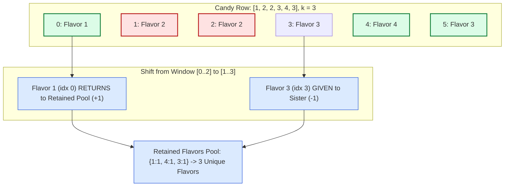

# Guided Example: Number of Unique Flavors After Sharing K Candies

We trace the complement frequency table inversion, fixed-size sliding window eviction, and maximum distinct flavor preservation on a representative candies array:

- **Input Candies Array:** `candies = [1, 2, 2, 3, 4, 3]`
- **Consecutive Candies Shared $k$:** `3`
- **Total Candies $n$:** `6`
- **Expected Maximum Unique Flavors:** `3` (Retaining flavors $\{1, 4, 3\}$ or $\{1, 2, 3\}$)

---

## 1. Problem Overview & Representative Instance

We are given a 0-indexed integer array `candies`, where `candies[i]` represents the flavor of the $i$-th candy in a row, and an integer $k$.
You must give away exactly $k$ **consecutive** candies to your sister.
After giving away that contiguous block, you wish to maximize the number of **unique flavors** among your remaining candies.
The goal is to determine the maximum number of unique flavors you can retain.

### Complement Set Inversion via Fixed-Size Sliding Window
Giving away a contiguous subarray of size $k$, $W = \text{candies}[i \dots i + k - 1]$, leaves you with the complement set of candies:
$$\text{Retained}(i) = \text{candies}[0 \dots i - 1] \cup \text{candies}[i + k \dots n - 1]$$
- Directly computing the number of distinct elements in the prefix and suffix for each possible start index $i$ would take $\mathcal{O}(n^2)$ time.
- However, as the shared block $W$ shifts one step to the right from index $i - 1$ to $i$:
  1. The candy at $i - 1$ exits the shared block and **returns** to your retained pool (its frequency increments).
  2. The candy at $i + k - 1$ enters the shared block and is **removed** from your retained pool (its frequency decrements).
- By maintaining a frequency map of your retained candies, each window slide updates the count of distinct flavors in strictly $\mathcal{O}(1)$ time.

---

## 2. Invariants & Retained Suffix/Prefix Frequency Mathematics

Let $n$ be the length of `candies`.
We maintain a hash table $\text{count}$ recording the frequency of each flavor currently present in our retained set.

### Invariant 1: Initial State (Base Suffix Window)
Before shifting, consider giving away the first $k$ candies ($[0 \dots k - 1]$).
Our retained set is the entire suffix $\text{candies}[k \dots n - 1]$:
$$\text{count} = \text{Histogram}(\text{candies}[k \dots n - 1])$$
The initial number of unique flavors is the number of keys in $\text{count}$ with positive frequency:
$$\text{unique} = |\text{keys}(\text{count})|$$

### Invariant 2: Constant-Time Sliding Transition
When shifting the shared window from $[i - 1 \dots i + k - 2]$ to $[i \dots i + k - 1]$:
1. **Admit Returned Candy ($u = \text{candies}[i - 1]$):**
   If $\text{count}[u] == 0$, a new flavor enters the retained pool; increment $\text{unique} \leftarrow \text{unique} + 1$.
   $\text{count}[u] \leftarrow \text{count}[u] + 1$.
2. **Evict Shared Candy ($v = \text{candies}[i + k - 1]$):**
   $\text{count}[v] \leftarrow \text{count}[v] - 1$.
   If $\text{count}[v] == 0$, that flavor is completely exhausted from the retained pool; decrement $\text{unique} \leftarrow \text{unique} - 1$.
3. **Running Maximization:**
   $$\text{ans} \leftarrow \max(\text{ans}, \text{unique})$$

| Window Position | Given to Sister | Returned to You | Frequency Map Update | Flavor Count Effect |
|---|---|---|---|---|
| Initial $[0 \dots k-1]$ | $\text{candies}[0 \dots k-1]$ | None | Initialized from $\text{candies}[k \dots n-1]$ | Baseline count |
| Slide to Right | $\text{candies}[i + k - 1]$ | $\text{candies}[i - 1]$ | $\text{count}[\text{ret}] \mathrel{+}= 1, \quad \text{count}[\text{shared}] \mathrel{-}= 1$ | $\Delta \in \{-1, 0, +1\}$ |
| Exhausted Flavor | $\text{count}[v] == 0$ | None | Flavor deleted from retained multiset | $\text{unique} \leftarrow \text{unique} - 1$ |
| Newly Retained Flavor | None | $\text{count}[u] == 1$ | Flavor newly introduced to multiset | $\text{unique} \leftarrow \text{unique} + 1$ |

---

## 3. Step-by-Step Worked Execution

We trace `candies = [1, 2, 2, 3, 4, 3]` with $k = 3$.

### Step 0: Baseline Window $[0 \dots 2]$ (Sharing `[1, 2, 2]`)
- Retained candies are suffix $[3 \dots 5]$: `[3, 4, 3]`.
- Build frequency table:
  - Flavor $3$: appears $2$ times $\implies \text{count}[3] = 2$.
  - Flavor $4$: appears $1$ time $\implies \text{count}[4] = 1$.
- Unique retained flavors: $|\{3, 4\}| = 2$.
- Initial best: $\text{ans} = 2$.

### Step 1: Slide Window to $[1 \dots 3]$ (Sharing `[2, 2, 3]`)
- **Return $\text{candies}[0] = 1$ to retained:**
  - $\text{count}[1]$ was $0$. Newly added $\implies \text{unique} \leftarrow 2 + 1 = 3$.
  - $\text{count}[1] \leftarrow 1$.
- **Give $\text{candies}[3] = 3$ to sister:**
  - $\text{count}[3]$ decreases: $2 - 1 = 1$.
  - Still positive ($1 > 0$); flavor $3$ is not lost.
- Retained state: $\{1: 1, 4: 1, 3: 1\}$.
- Unique flavors: $3$.
- Update: $\text{ans} \leftarrow \max(2, 3) = 3$.

### Step 2: Slide Window to $[2 \dots 4]$ (Sharing `[2, 3, 4]`)
- **Return $\text{candies}[1] = 2$ to retained:**
  - $\text{count}[2]$ was $0$. Newly added $\implies \text{unique} \leftarrow 3 + 1 = 4$.
  - $\text{count}[2] \leftarrow 1$.
- **Give $\text{candies}[4] = 4$ to sister:**
  - $\text{count}[4]$ decreases: $1 - 1 = 0$.
  - Reached zero! Flavor $4$ is lost $\implies \text{unique} \leftarrow 4 - 1 = 3$.
- Retained state: $\{1: 1, 3: 1, 2: 1\}$.
- Unique flavors: $3$.
- Update: $\text{ans} \leftarrow \max(3, 3) = 3$.

### Step 3: Slide Window to $[3 \dots 5]$ (Sharing `[3, 4, 3]`)
- **Return $\text{candies}[2] = 2$ to retained:**
  - $\text{count}[2]$ increases: $1 + 1 = 2$. Unique unchanged.
- **Give $\text{candies}[5] = 3$ to sister:**
  - $\text{count}[3]$ decreases: $1 - 1 = 0$.
  - Reached zero! Flavor $3$ is lost $\implies \text{unique} \leftarrow 3 - 1 = 2$.
- Retained state: $\{1: 1, 2: 2\}$.
- Unique flavors: $2$.
- Update: $\text{ans} \leftarrow \max(3, 2) = 3$.

All possible $k$-length windows evaluated. Maximum unique flavors: $3$.

---

## 4. Complete Execution Trace & State Progression

| Window Index $i$ | Shared Window $W$ | Returned Candy | Given Away Candy | Retained Frequency Map | Current Unique Flavors | Global Maximum $\text{ans}$ |
|---|---|---|---|---|---|---|
| Baseline | `[1, 2, 2]` ($[0 \dots 2]$) | None | None | `{3: 2, 4: 1}` | $2$ | $2$ |
| $1$ | `[2, 2, 3]` ($[1 \dots 3]$) | $\text{candies}[0] = 1$ | $\text{candies}[3] = 3$ | `{1: 1, 4: 1, 3: 1}` | $3$ | **3** |
| $2$ | `[2, 3, 4]` ($[2 \dots 4]$) | $\text{candies}[1] = 2$ | $\text{candies}[4] = 4$ | `{1: 1, 3: 1, 2: 1}` | $3$ | $3$ |
| $3$ | `[3, 4, 3]` ($[3 \dots 5]$) | $\text{candies}[2] = 2$ | $\text{candies}[5] = 3$ | `{1: 1, 2: 2}` | $2$ | $3$ |

---

## 5. Algorithmic Correctness & Soundness

### Proof of Complete Search & Exact Cardinality Tracking
1. **Contiguous Subarray Exhaustion:**
   A valid gift to the sister consists of any contiguous subarray of length $k$.
   There are exactly $n - k + 1$ such subarrays, corresponding to start indices $i \in \{0, 1, \dots, n - k\}$.
   The sliding window visits every $i$ from $0$ to $n - k$ in order, exhausting all viable sharing choices.
2. **Cardinality Invariance:**
   At any window step $i$, the retained multiset contains exactly the elements of $\text{candies}[0 \dots i - 1]$ and $\text{candies}[i + k \dots n - 1]$.
   Because the net change between step $i - 1$ and $i$ consists strictly of adding element $i - 1$ and removing element $i + k - 1$, updating the frequency map with $+1$ and $-1$ maintains exact multiset equivalence.
3. **Distinct Key Counting:**
   The variable $\text{unique}$ increments if and only if a count transitions from $0 \to 1$, and decrements if and only if a count transitions from $1 \to 0$.
   Hence, $\text{unique}$ tracks $|\{f \mid \text{count}[f] > 0\}|$ with zero drift.

---

## 6. Structural Edge Cases & Boundary Behaviors

| Edge Scenario | Concrete Input | Operational Dynamics | Result |
|---|---|---|---|
| Zero Candies Shared ($k = 0$) | `candies = [2, 4, 5]`, $k = 0$ | No candies given away; retains full array | Total distinct flavors ($3$) |
| All Candies Shared ($k = n$) | `candies = [1, 2, 3]`, $k = 3$ | Suffix is empty; all candies given to sister | $0$ |
| Uniform Flavors | `candies = [2, 2, 2, 2]`, $k = 2$ | Remaining candies still possess flavor $2$ | $1$ |
| Repeated Flank Candies | `candies = [2, 2, 2, 2, 3, 3]`, $k = 2$ | Sharing middle duplicates preserves both $2$ and $3$ | $2$ |

---

## 7. Complexity Analysis

- **Time Complexity:** $\mathcal{O}(n)$.
  - Precomputing the initial suffix frequency map of length $n - k$ takes $\mathcal{O}(n - k)$ time.
  - The window slides $n - k$ times. Each slide performs two $\mathcal{O}(1)$ hash map operations (one increment, one decrement).
  - Overall time complexity is strictly linear in the number of candies: $\mathcal{O}(n)$.
- **Auxiliary Space Complexity:** $\mathcal{O}(u) \le \mathcal{O}(n)$, where $u$ is the number of distinct flavors in `candies`.
  - The frequency table stores at most $u$ distinct keys at any time.