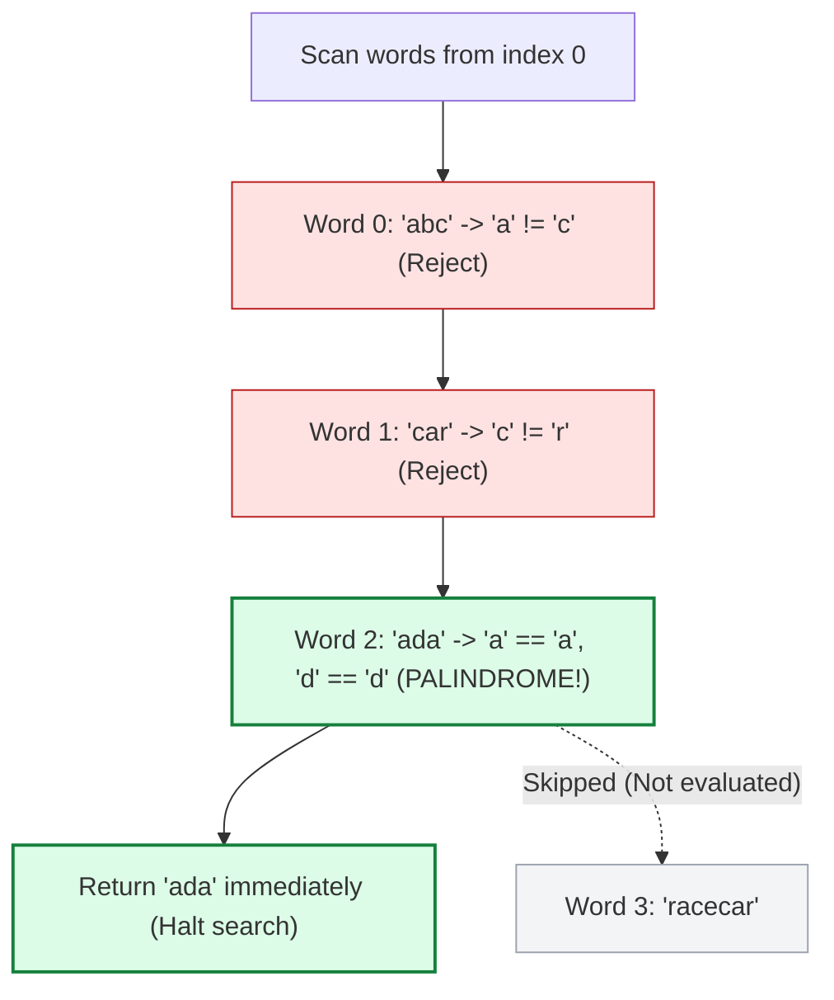

# Guided Example: Find First Palindromic String in the Array

We trace the sequential array scan, inward two-pointer character symmetry verification, and short-circuit early termination on a representative string array:

- **Input Array:** `words = ["abc", "car", "ada", "racecar", "cool"]`
- **Total Words $m$:** `5`
- **Expected Return Value:** `"ada"` (First palindrome; `"racecar"` is skipped)

---

## 1. Problem Overview & Representative Instance

We are given an array of strings `words`.
A string is defined as **palindromic** if it reads the exact same forward as backward (i.e., it equals its reversed form).
The objective is to return the **first palindromic string** in `words`. If no palindromic string exists anywhere in the array, we must return the empty string `""`.

### The First-Match Priority & Inward Short-Circuiting
- The requirement to return the *first* palindromic string establishes a strict left-to-right priority: the very first string $w_i$ that satisfies the palindromic condition must be returned immediately.
- Later palindromic words (such as `"racecar"` at index $3$) must not overwrite or delay the return of the earlier match (`"ada"` at index $2$).
- For each candidate word $w$, testing whether $w$ is a palindrome using two inward pointers ($l$ and $r$) enables immediate rejection on the first character mismatch, avoiding the $\mathcal{O}(|w|)$ auxiliary allocation required by allocating reversed string copies.

---

## 2. Invariants & Palindromic Symmetry Mathematics

Let $A = [w_0, w_1, \dots, w_{m-1}]$ denote the input list of words.

### Invariant 1: Left-to-Right Precedence
The return value is uniquely specified by:
$$\text{ans} = \begin{cases} w_{i^*} & \text{if } \exists i \text{ such that } \text{IsPalindrome}(w_i), \text{ where } i^* = \min \{i \mid \text{IsPalindrome}(w_i)\} \\ \text{""} & \text{if } \forall i \in \{0, \dots, m-1\}, \neg \text{IsPalindrome}(w_i) \end{cases}$$

### Invariant 2: Two-Pointer Reflexive Symmetry
A string $w$ of length $L$ is a palindrome if and only if:
$$w[k] = w[L - 1 - k] \quad \forall k \in \left\{0, 1, \dots, \left\lfloor \frac{L}{2} \right\rfloor \right\}$$
Using inward pointers $l = 0$ and $r = L - 1$:
- If $w[l] \neq w[r]$, the string violates reflection symmetry; reject $w$ immediately.
- If $w[l] == w[r]$, advance $l \leftarrow l + 1$ and $r \leftarrow r - 1$.
- If $l \ge r$, every mirrored pair has been verified; $w$ is a certified palindrome.

| Word $w$ | Candidate Index | Length $L$ | Pointer Invariant Checked | Mismatch Detected? | Verdict |
|---|---|---|---|---|---|
| `"abc"` | $0$ | $3$ | $w[0] == w[2] \iff \text{'a'} == \text{'c'}$ | Yes at step $0$ | Non-palindromic |
| `"car"` | $1$ | $3$ | $w[0] == w[2] \iff \text{'c'} == \text{'r'}$ | Yes at step $0$ | Non-palindromic |
| `"ada"` | $2$ | $3$ | $w[0] == w[2] \iff \text{'a'} == \text{'a'}$ | No ($l=1, r=1 \implies l \ge r$) | **Certified Palindrome** |
| `"racecar"` | $3$ | $7$ | Unprocessed | N/A | Skipped by early exit |

---

## 3. Step-by-Step Worked Execution

We trace `words = ["abc", "car", "ada", "racecar", "cool"]`.

### Candidate 0: $w = \text{"abc"}$
- String length $L = 3$. Pointers: $l = 0, r = 2$.
- Compare $w[0]$ and $w[2]$:
  $$\text{'a'} \neq \text{'c'}$$
- Mismatch identified on first check!
- Reject `"abc"`. Move to next word.

### Candidate 1: $w = \text{"car"}$
- String length $L = 3$. Pointers: $l = 0, r = 2$.
- Compare $w[0]$ and $w[2]$:
  $$\text{'c'} \neq \text{'r'}$$
- Mismatch identified on first check!
- Reject `"car"`. Move to next word.

### Candidate 2: $w = \text{"ada"}$
- String length $L = 3$. Pointers: $l = 0, r = 2$.
- **Step 1:** Compare $w[0]$ and $w[2]$:
  $$\text{'a'} == \text{'a'} \quad (\text{Match})$$
  Advance pointers: $l \leftarrow 0 + 1 = 1, \quad r \leftarrow 2 - 1 = 1$.
- **Step 2:** Check loop guard:
  $$l = 1 \ge r = 1$$
  Pointers meet at the center character `'d'`.
- All symmetric pairs verified. `"ada"` is a palindrome!
- **Early Exit Triggered:** Immediately return `"ada"` as the answer.
- Subsequent strings (`"racecar"`, `"cool"`) are intentionally left unread.

---

## 4. Complete Execution Trace & State Progression

| Word Index $i$ | Word $w_i$ | Pointers $(l, r)$ | Compared Chars | Comparison Result | Symmetry Status | Action Taken |
|---|---|---|---|---|---|---|
| $0$ | `"abc"` | $(0, 2)$ | $w[0]=\text{'a'}, w[2]=\text{'c'}$ | $\text{'a'} \neq \text{'c'}$ | Broken | Reject; proceed to index $1$ |
| $1$ | `"car"` | $(0, 2)$ | $w[0]=\text{'c'}, w[2]=\text{'r'}$ | $\text{'c'} \neq \text{'r'}$ | Broken | Reject; proceed to index $2$ |
| $2$ | `"ada"` | $(0, 2)$ | $w[0]=\text{'a'}, w[2]=\text{'a'}$ | $\text{'a'} == \text{'a'}$ | Maintained | Advance to $(1, 1)$ |
| $2$ | `"ada"` | $(1, 1)$ | Center meet | $l \ge r$ | Verified | **Halt & Return `"ada"`** |
| $3$ | `"racecar"` | — | — | — | — | Skipped |
| $4$ | `"cool"` | — | — | — | — | Skipped |

---

## 5. Algorithmic Correctness & Soundness

### Mathematical Proof of Correctness
1. **Preservation of Array Index Ordering:**
   The search processes words in increasing order of index: $i = 0, 1, \dots, m - 1$.
   The moment any word $w_{i^*}$ is verified as a palindrome, the algorithm terminates and returns $w_{i^*}$.
   By definition, no index $j < i^*$ satisfies $\text{IsPalindrome}(w_j)$, so $i^*$ is the minimal valid index.
2. **Soundness of Two-Pointer Palindrome Verification:**
   By mathematical induction on string length, checking $w[l] == w[r]$ for all $l \le r$ verifies that the sequence of characters is identical to its reversal $w^R$.
   Any deviation $w[l] \neq w[r]$ constitutes a counterexample to symmetry, immediately disproving palindromicity.
3. **Exhaustion to Empty String:**
   If the loop finishes all $m$ words without returning, then no word in the array is a palindrome. Returning `""` correctly satisfies the problem contract.

---

## 6. Structural Edge Cases & Boundary Behaviors

| Edge Scenario | Concrete Input | Operational Behavior | Expected Output |
|---|---|---|---|
| Single-Character Word | `["z", "abc"]` | $L = 1 \implies l = 0 \ge r = 0$; loops $0$ times | `"z"` |
| Even-Length Palindrome | `["noon", "racecar"]` | Pairs $(0, 3)$ and $(1, 2)$ match; $l$ crosses $r$ | `"noon"` |
| No Palindromes Present | `["def", "ghi", "jkl"]` | Scans all $3$ words; generator exhausts | `""` (empty string) |
| First Word is Palindrome | `["racecar", "ada"]` | Index $0$ matches; executes in $\mathcal{O}(\lvert w_0 \rvert)$ | `"racecar"` |

---

## 7. Complexity Analysis

- **Time Complexity:** $\mathcal{O}(S_{\text{evaluated}})$, where $S_{\text{evaluated}}$ is the sum of lengths of words examined up to and including the first palindrome.
  - In the worst case (no palindrome exists), every word is examined, requiring $\mathcal{O}(\sum_{i=0}^{m-1} |w_i|) = \mathcal{O}(S)$ time where $S$ is the total number of characters across all words.
  - In the best or typical case, the algorithm short-circuits early upon finding the first palindrome, avoiding scanning subsequent strings.
  - Comparing character pairs takes $\mathcal{O}(1)$ time per pair.
- **Auxiliary Space Complexity:** $\mathcal{O}(1)$.
  - Using two pointers requires only two scalar integer indices ($l, r$).
  - No new strings, reversed substrings, or dynamic arrays are allocated.
