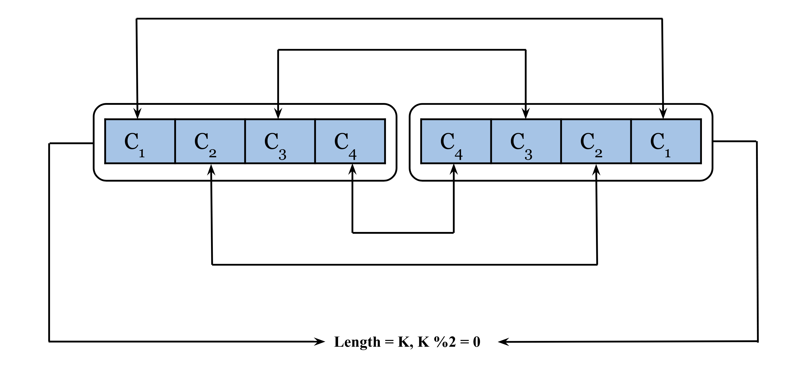
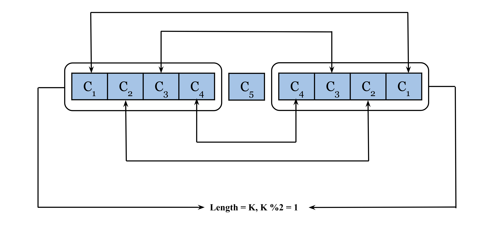

## Solution

---

### Approach 1: Reverse String

#### Intuition

A string is said to be a palindrome if it remains the same, reading forward and backward. An intuitive way to check if the string is a palindrome is to create a new string by reversing the characters and then comparing the original with it. If the reversed and original string are the same then the string is palindrome. In this approach, we will iterate over the list `words,` and then for each string `s` in it, we will reverse it and check if this is equal to the original string, and if true, then we will return this string.

#### Algorithm

1. Iterate over the list `words` and for each string `s`:
2. Create a new string `reversed` which is the reverse of the original string `s`.
3. If `s` and `reversed` are the same, then return the string; it is a valid palindrome.
4. Return the empty string after iterating over all the strings.  If the loop terminates without finding and returning a palindrome, it means `words` has no palindromes.

#### Implementation

```cpp
class Solution {
public:
    string firstPalindrome(vector<string>& words) {
        for (string s : words) {
            string reversed = s;
            reverse(reversed.begin(), reversed.end());

            if (s == reversed) {
                return s;
            }
        }
        return "";
    }
};
```

#### Complexity Analysis

Let $N$ be the number of strings in `words` and $M$ be the maximum length of a string in it.

* Time complexity: $O(N \cdot M)$

  We iterate over the strings in the list words which takes $O(N)$, and for each string, we reverse the string which takes $O(M)$ and compare it with the original. Hence, the time complexity is equal to $O(N \cdot M)$.

* Space complexity: $O(M)$

  We create a new string for each string in the list `words` and therefore the space complexity is equal to the maximum length of a string that is created which is $O(M)$.
  <br/>

---

### Approach 2: Two Pointers

#### Intuition

The above approach requires the creation of making new string by reversing it. Can we somehow avoid this space requirement?

One way to think of palindromes is that they read the same from both ends. So, if we compare the characters from the two ends of the string, they should be the same in a valid palindrome. If the string is of even length, then there would be a pair for each index; otherwise, if the string is odd, there would be one character in the middle that doesn't need to be compared with any counterpart.





$c_n$ represents a character

#### Algorithm

1. Define the method `isPalindrome()` which returns `true` if the provided string `s` is a palindrome and `false` otherwise:

1. Keep one pointer of left $start = 0$ and one on the right end $end = \text{s.size}() - 1$.
2. Keep iterating over the string until `start > end`.
3. If the characters at `start` and `end` are not the same then return `false`.
4. Increment `start` and decrement `end`.
5. Return `true` after iterating over all the characters.
2. Iterate over each string in `words` from left to right and call `isPalindrome()` for each string and return the first one for which the method returns `true`.
3. After the loop terminates, return an empty string. If the loop terminates without finding and returning a palindrome, it means `words` has no palindromes.

#### Implementation

```cpp
class Solution {
public:
    bool isPalindrome(string& s) {
        int start = 0;
        int end = s.size() - 1;

        while (start <= end) {
            // Return false if the characters are not the same.
            if (s[start] != s[end]) {
                return false;
            }

            start++;
            end--;
        }

        return true;
    }

    string firstPalindrome(vector<string>& words) {
        for (string s : words) {
            if (isPalindrome(s)) {
                return s;
            }
        }

        return "";
    }
};
```

#### Complexity Analysis

Let $N$ be the number of strings in `words` and $M$ be the maximum length of a string in it.

* Time complexity: $O(N \cdot M)$

  For each of the $N$ strings in the list `words`, we iterate over each character once, and hence the time complexity is equal to $O(N \cdot M)$.

* Space complexity: $O(1)$

  No extra space is required while checking for palindromes, and hence, the space complexity is constant.
  <br/>

---