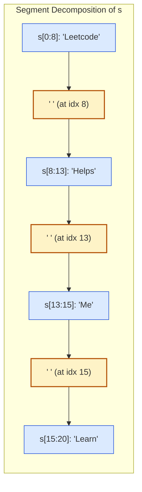

# Guided Example: Adding Spaces to a String

We trace the monotonic index stream alignment, coordinate-invariant slice partitioning, and linear-time buffer reconstruction on a representative string spacing instance:

- **Original String:** `s = "LeetcodeHelpsMeLearn"`
- **Insertion Indices Array:** `spaces = [8, 13, 15]`
- **String Length $n$:** `20`
- **Spaces Count $m$:** `3`
- **Expected Spaced String:** `"Leetcode Helps Me Learn"`

---

## 1. Problem Overview & Representative Instance

We are given a 0-indexed string `s` and a 0-indexed integer array `spaces` sorted in strictly ascending order.
Each entry $\text{spaces}[j]$ represents an index in the original string `s` where a single space `' '` must be inserted immediately **before** the character $s[\text{spaces}[j]]$.
The objective is to produce and return the modified string with all required spaces inserted.

### Avoiding Repeated String Mutation Pitfalls
Because strings in modern high-level languages are immutable, repeatedly inserting spaces in place by creating intermediate string slices produces quadratic $\mathcal{O}(n^2)$ copying overhead. Furthermore, every inserted space alters downstream character indices.
- However, because the array `spaces` is given in strictly increasing order, we can align the iteration pointer of `s` and the pointer of `spaces` in a single synchronized forward pass.
- By referencing the **original** immutable indices $0 \dots n - 1$, downstream shifts in the generated string do not perturb the lookup coordinates.
- Collecting the disjoint slices or character tokens into a list buffer and joining them once achieves strictly linear $\mathcal{O}(n + m)$ construction time.

---

## 2. Invariants & Monotonic Index Alignment Mathematics

Let $n = |s|$ be the length of the string and $m = |\text{spaces}|$ be the number of spaces to insert.
The output string will have length exactly:
$$L_{\text{out}} = n + m$$

### Invariant 1: Monotonic Disjoint Partitioning
Because $\text{spaces}[0] < \text{spaces}[1] < \dots < \text{spaces}[m-1]$, the array `spaces` partitions `s` into exactly $m + 1$ contiguous, non-overlapping substrings:
$$\text{Part}_0 = s[0 \dots \text{spaces}[0] - 1]$$
$$\text{Part}_j = s[\text{spaces}[j-1] \dots \text{spaces}[j] - 1] \quad \forall j \in \{1, \dots, m-1\}$$
$$\text{Part}_m = s[\text{spaces}[m-1] \dots n - 1]$$
The final string is synthesized by interspersing a single space character between consecutive parts:
$$s_{\text{modified}} = \text{Part}_0 + \text{' '} + \text{Part}_1 + \text{' '} + \dots + \text{' '} + \text{Part}_m$$

### Invariant 2: Original Index Stream Invariance
When iterating a pointer $i$ from $0$ to $n - 1$ and a pointer $j$ through `spaces`:
- At each step $i$, if $j < m$ and $i == \text{spaces}[j]$, a space is emitted before character $s[i]$, and $j$ increments by $1$.
- Because `spaces` contains strictly increasing values, at most one space is ever emitted per original character position $i$.
- Output coordinates never need to be adjusted; original indices remain immutable reference anchors.

| Segment Index $j$ | Slice Range in $s$ | Substring Extracted | Boundary Character Preceded by Space |
|---|---|---|---|
| $0$ | $s[0 \dots 7]$ | `"Leetcode"` | Initial prefix (before index $8$) |
| Space $0$ | — | `' '` | Precedes index $8$ (`'H'`) |
| $1$ | $s[8 \dots 12]$ | `"Helps"` | Spans indices $8$ through $12$ |
| Space $1$ | — | `' '` | Precedes index $13$ (`'M'`) |
| $2$ | $s[13 \dots 14]$ | `"Me"` | Spans indices $13$ through $14$ |
| Space $2$ | — | `' '` | Precedes index $15$ (`'L'`) |
| $3$ | $s[15 \dots 19]$ | `"Learn"` | Terminal suffix from index $15$ to end |

---

## 3. Step-by-Step Worked Execution

We trace `s = "LeetcodeHelpsMeLearn"` with $\text{spaces} = [8, 13, 15]$.
Initialize previous boundary anchor: $\text{prev} = 0$, buffer: $\text{parts} = []$.

### Step 1: Processing First Space at Index $8$
- Next space index: $\text{spaces}[0] = 8$.
- Extract preceding substring slice:
  $$\text{slice} = s[\text{prev} \dots 8] = s[0 \dots 8] = \text{"Leetcode"}$$
- Append slice and a space to buffer:
  $$\text{parts} \leftarrow [\text{"Leetcode"}, \text{" "}]$$
- Advance anchor: $\text{prev} \leftarrow 8$.

### Step 2: Processing Second Space at Index $13$
- Next space index: $\text{spaces}[1] = 13$.
- Extract preceding substring slice:
  $$\text{slice} = s[\text{prev} \dots 13] = s[8 \dots 13] = \text{"Helps"}$$
- Append slice and a space to buffer:
  $$\text{parts} \leftarrow [\text{"Leetcode"}, \text{" "}, \text{"Helps"}, \text{" "}]$$
- Advance anchor: $\text{prev} \leftarrow 13$.

### Step 3: Processing Third Space at Index $15$
- Next space index: $\text{spaces}[2] = 15$.
- Extract preceding substring slice:
  $$\text{slice} = s[\text{prev} \dots 15] = s[13 \dots 15] = \text{"Me"}$$
- Append slice and a space to buffer:
  $$\text{parts} \leftarrow [\text{"Leetcode"}, \text{" "}, \text{"Helps"}, \text{" "}, \text{"Me"}, \text{" "}]$$
- Advance anchor: $\text{prev} \leftarrow 15$.

### Step 4: Appending Remaining Terminal Suffix
- Array `spaces` is now exhausted.
- Extract remaining suffix from $\text{prev} = 15$ to end of string ($n = 20$):
  $$\text{suffix} = s[15 \dots 20] = \text{"Learn"}$$
- Append to buffer:
  $$\text{parts} \leftarrow [\text{"Leetcode"}, \text{" "}, \text{"Helps"}, \text{" "}, \text{"Me"}, \text{" "}, \text{"Learn"}]$$

### Step 5: Single-Pass Concatenation
- Join all elements of $\text{parts}$:
  $$\text{result} = \text{"Leetcode Helps Me Learn"}$$
- Final output length: $20 + 3 = 23$ characters.

---

## 4. Complete Execution Trace & State Progression

| Step | Current Boundary $[ \text{prev} \dots \text{idx} ]$ | Extracted Segment | Emitted Space? | Buffer State at Step End | Cumulative Length |
|---|---|---|---|---|---|
| $1$ | $s[0 \dots 8]$ | `"Leetcode"` | Yes (before idx $8$) | `["Leetcode", " "]` | $9$ |
| $2$ | $s[8 \dots 13]$ | `"Helps"` | Yes (before idx $13$) | `[..., "Helps", " "]` | $15$ |
| $3$ | $s[13 \dots 15]$ | `"Me"` | Yes (before idx $15$) | `[..., "Me", " "]` | $18$ |
| $4$ | $s[15 \dots 20]$ | `"Learn"` | No (Terminal suffix) | `[..., "Learn"]` | $23$ |

---

## 5. Algorithmic Correctness & Soundness

### Proof of Character Conservation and Order Preservation
1. **Contiguous Partition Completeness:**
   Let $0 = p_0 \le p_1 < p_2 < \dots < p_m < p_{m+1} = n$, where $p_1 \dots p_m$ are the values in `spaces`.
   The intervals $[p_j, p_{j+1})$ for $j \in \{0, \dots, m\}$ are pairwise disjoint and their union is exactly $[0, n)$.
   Every character of $s$ belongs to exactly one interval and appears in its original sequential order.
2. **Space Position Correctness:**
   A space character is inserted between interval $[p_{j-1}, p_j)$ and $[p_j, p_{j+1})$.
   Therefore, the space character appears immediately preceding the character at index $p_j$ in the original string, satisfying the exact problem definition.
3. **Linear Time Invariance:**
   Because each character of $s$ is copied into the output buffer exactly once and each space is written exactly once, the entire reconstruction runs in $\mathcal{O}(n + m)$ operations.

---

## 6. Structural Edge Cases & Boundary Behaviors

| Edge Configuration | Concrete Sample | Behavioral Execution | Result |
|---|---|---|---|
| Space at Index Zero | $s = \text{"abc"}$, $\text{spaces} = [0]$ | First segment $s[0:0] = \text{""}$; space inserted first | `" abc"` |
| Space Before Every Char | $s = \text{"hi"}$, $\text{spaces} = [0, 1]$ | Every character preceded by space | `" h i"` |
| Single Insertion | $s = \text{"abcdef"}$, $\text{spaces} = [3]$ | Splits into $s[0:3]$ and $s[3:6]$ | `"abc def"` |
| Space at Final Character | $s = \text{"code"}$, $\text{spaces} = [3]$ | Suffix is $s[3:4] = \text{"e"}$ preceded by space | `"cod e"` |

---

## 7. Complexity Analysis

- **Time Complexity:** $\mathcal{O}(n + m)$.
  - Slicing or streaming through $s$ visits all $n$ characters once.
  - Advancing through `spaces` inspects all $m$ indices once.
  - The final join allocates and populates a string of length $n + m$.
  - Total time complexity is strictly linear: $\mathcal{O}(n + m)$.
- **Auxiliary Space Complexity:** $\mathcal{O}(n + m)$.
  - The buffer storing the disjoint substring pieces and space tokens requires $\mathcal{O}(n + m)$ memory.
  - The returned output string has length $n + m$.
