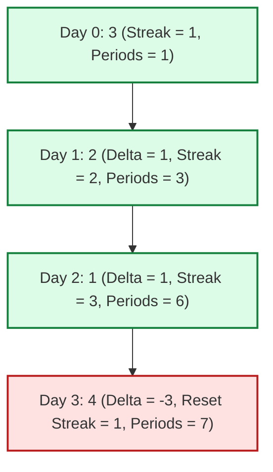

# Guided Example: Number of Smooth Descent Periods of a Stock

We trace the consecutive differential invariant, dynamic streak-length accumulation, and triangular subsegment decomposition on a representative stock price trajectory:

- **Daily Stock Prices:** `prices = [3, 2, 1, 4]`
- **Trading Days $n$:** `4`
- **Expected Total Smooth Descent Periods:** `7`

---

## 1. Problem Overview & Representative Instance

We are given an integer array `prices` representing the daily price of a stock over $n$ consecutive days.
A **smooth descent period** is defined as a contiguous subarray of prices of any length $L \ge 1$ such that each day's price is strictly $1$ less than the preceding day's price:
$$\text{prices}[t - 1] - \text{prices}[t] == 1 \quad \forall t \in [i + 1, j]$$
By definition, every individual day (a subarray of length $1$) is trivially a smooth descent period.
The objective is to compute the **total number** of smooth descent periods across the entire array.

### Subarray Suffix Inclusion & Inverted Counting
Directly enumerating all $\mathcal{O}(n^2)$ subarrays and validating their internal differences requires $\mathcal{O}(n^3)$ or $\mathcal{O}(n^2)$ time.
- However, smooth descent is a hereditary property: any contiguous subsegment of a smooth descent sequence is also a smooth descent sequence.
- If the maximal smooth descent run ending at day $i$ has length $L[i]$, then day $i$ serves as the right endpoint for exactly $L[i]$ distinct smooth descent periods (of lengths $1, 2, \dots, L[i]$).
- Summing $L[i]$ over all days $i \in \{0, \dots, n-1\}$ computes the exact total in a single $\mathcal{O}(n)$ pass with $\mathcal{O}(1)$ auxiliary space.

---

## 2. Invariants & Streak Contribution Mathematics

Let $L[i]$ denote the length of the contiguous smooth descent run terminating at index $i$.

### Invariant 1: Dynamic Streak Recurrence
The streak length evolves according to:
$$L[0] = 1$$
$$L[i] = \begin{cases} L[i-1] + 1 & \text{if } \text{prices}[i-1] - \text{prices}[i] == 1 \\ 1 & \text{otherwise} \end{cases} \quad \forall i \in \{1, \dots, n-1\}$$

### Invariant 2: Bijective Right-Endpoint Partitioning
Every valid smooth descent period has a unique right endpoint $j \in \{0, \dots, n-1\}$.
For a fixed right endpoint $j$, a valid start point $i \le j$ exists if and only if:
$$j - L[j] + 1 \le i \le j$$
Thus, there are exactly $L[j]$ valid start indices ending at $j$.
Because the sets of subarrays ending at distinct right endpoints are mutually disjoint, the total count is:
$$\text{Total Periods} = \sum_{j=0}^{n-1} L[j]$$

### Invariant 3: Equivalence to Triangular Maximal Run Sums
If the array partitions into maximal contiguous smooth descent segments of lengths $m_1, m_2, \dots, m_k$, each segment of length $m$ contains:
$$\sum_{r=1}^m r = \frac{m(m + 1)}{2}$$
smooth descent periods. Summing $L[j]$ incrementally accumulates these triangular numbers day by day.

| Day $i$ | Price Transition | Condition $\text{prices}[i-1] - \text{prices}[i] == 1$ | Updated Streak $L[i]$ | Suffix Subarrays Ending at $i$ |
|---|---|---|---|---|
| $0$ | First day | Baseline initialization | $1$ | `[prices[0]]` |
| Decrement by $1$ | Smooth descent continuation | True | $L[i-1] + 1$ | Extends all $L[i-1]$ prior periods $+ 1$ singleton |
| Any other delta | Streak broken | False | $1$ | Only singleton `[prices[i]]` |

---

## 3. Step-by-Step Worked Execution

We trace `prices = [3, 2, 1, 4]`.
Initialize cumulative counter: $\text{total} = 0$, active streak: $\text{streak} = 0$.

### Day 0: Price $3$
- First element of the array.
- Streak initialized: $\text{streak} = 1$.
- Subarrays ending at index $0$:
  1. `[3]` (length $1$)
- Add to total: $\text{total} \leftarrow 0 + 1 = 1$.

### Day 1: Price $2$
- Compare with preceding price:
  $$\Delta = \text{prices}[0] - \text{prices}[1] = 3 - 2 = 1$$
- Difference is exactly $1$! Smooth descent continues.
- Increment streak: $\text{streak} \leftarrow 1 + 1 = 2$.
- Subarrays ending at index $1$:
  1. `[2]` (length $1$)
  2. `[3, 2]` (length $2$)
- Add to total: $\text{total} \leftarrow 1 + 2 = 3$.

### Day 2: Price $1$
- Compare with preceding price:
  $$\Delta = \text{prices}[1] - \text{prices}[2] = 2 - 1 = 1$$
- Difference is exactly $1$! Smooth descent continues.
- Increment streak: $\text{streak} \leftarrow 2 + 1 = 3$.
- Subarrays ending at index $2$:
  1. `[1]` (length $1$)
  2. `[2, 1]` (length $2$)
  3. `[3, 2, 1]` (length $3$)
- Add to total: $\text{total} \leftarrow 3 + 3 = 6$.

### Day 3: Price $4$
- Compare with preceding price:
  $$\Delta = \text{prices}[2] - \text{prices}[3] = 1 - 4 = -3 \neq 1$$
- Condition fails! Price increased. Streak resets.
- Reset streak: $\text{streak} = 1$.
- Subarrays ending at index $3$:
  1. `[4]` (length $1$)
- Add to total: $\text{total} \leftarrow 6 + 1 = 7$.

All days evaluated. Total smooth descent periods: $7$.

---

## 4. Complete Execution Trace & State Progression

| Day $i$ | $\text{prices}[i]$ | Delta $\text{prices}[i-1] - \text{prices}[i]$ | Descent Condition? | Streak $L[i]$ | Subarrays Contributed | Daily Added | Cumulative Total |
|---|---|---|---|---|---|---|---|
| $0$ | $3$ | — | Baseline | $1$ | `[3]` | $+1$ | $1$ |
| $1$ | $2$ | $3 - 2 = 1$ | Holds | $2$ | `[2]`, `[3, 2]` | $+2$ | $3$ |
| $2$ | $1$ | $2 - 1 = 1$ | Holds | $3$ | `[1]`, `[2, 1]`, `[3, 2, 1]` | $+3$ | $6$ |
| $3$ | $4$ | $1 - 4 = -3$ | Fails (Reset) | $1$ | `[4]` | $+1$ | **7** |

---

## 5. Algorithmic Correctness & Soundness

### Proof of Complete Partitioning & Correctness
1. **Sufficiency of Suffix Slices:**
   Let a contiguous block $\text{prices}[a \dots b]$ satisfy $\text{prices}[t-1] - \text{prices}[t] = 1$ for all $t \in [a+1, b]$.
   For any $k \in [a, b]$, the subsegment $\text{prices}[k \dots b]$ also satisfies the identical adjacent difference constraint.
   Therefore, if the maximal smooth descent run ending at $b$ starts at $a = b - L[b] + 1$, every suffix $\text{prices}[k \dots b]$ with $k \in [a, b]$ is a valid smooth descent period.
2. **Exclusion of Non-Descent Subarrays:**
   Any subarray starting before $a$ contains the pair $(a - 1, a)$, which by definition violated the descent condition. Thus, no subarray starting before $a$ and ending at $b$ can be a smooth descent period.
3. **Disjoint Exhaustive Union:**
   Every contiguous subarray of $\text{prices}$ has a unique right endpoint $j \in \{0, \dots, n - 1\}$.
   Because the set of all subarrays is partitioned into disjoint subsets based on their ending index $j$, summing $L[j]$ counts every valid smooth descent period exactly once, with zero double-counting and zero omissions.

---

## 6. Structural Edge Cases & Boundary Behaviors

| Scenario | Input Array | Recurrence Dynamics | Total Output |
|---|---|---|---|
| Single Day | `[1]` | Loop executes $0$ times; initial day yields $1$ | $1$ |
| No Adjacent Descents | `[8, 6, 7, 7]` | Every delta $\neq 1$; streak remains $1$ every day | $1 + 1 + 1 + 1 = 4$ |
| Unbroken Descent | `[5, 4, 3, 2, 1]` | Streaks: $1, 2, 3, 4, 5$; triangular sum $\frac{5 \times 6}{2}$ | $15$ |
| Repeated Plateaus | `[3, 3, 3]` | Delta $0 \neq 1$; all singletons | $3$ |

---

## 7. Complexity Analysis

- **Time Complexity:** $\mathcal{O}(n)$.
  - The array is traversed in a single linear pass of $n$ steps.
  - Each step computes one integer difference, one branch comparison, and two arithmetic additions.
  - Overall time complexity is strictly linear: $\mathcal{O}(n)$.
- **Auxiliary Space Complexity:** $\mathcal{O}(1)$.
  - Only two scalar integer registers (`streak` and `total`) are maintained throughout the traversal.
  - Space consumption is strictly $\mathcal{O}(1)$ and independent of $n$.
