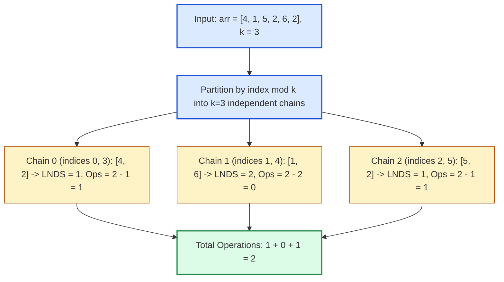

# Guided Example: Minimum Operations to Make the Array K-Increasing

We trace the modulo residue class decomposition, Longest Non-Decreasing Subsequence (LNDS) complement duality, and patience sorting binary search on a representative array:

- **Input Array:** `arr = [5, 4, 3, 2, 1]`
- **Stride Interval $k$:** `1`
- **Array Length $n$:** `5`
- **Expected Minimum Operations:** `4`

---

## 1. Problem Overview & Representative Instance

We are given an integer array `arr` and a positive integer $k$.
The array is defined as **$K$-increasing** if for every index $i$ such that $k \le i < n$:
$$\text{arr}[i - k] \le \text{arr}[i]$$
In one operation, we can choose any index $i$ and change $\text{arr}[i]$ to **any** positive integer.
The objective is to compute the **minimum number of operations** required to make `arr` $K$-increasing.

### Residue Class Decoupling & Complement Duality
The constraint $\text{arr}[i - k] \le \text{arr}[i]$ links only elements whose indices differ by a multiple of $k$.
- The array completely partitions into $k$ independent subsequences, each defined by an index residue class $r \in \{0, 1, \dots, k - 1\}$:
  $$S_r = [\text{arr}[r], \text{arr}[r + k], \text{arr}[r + 2k], \dots]$$
- Operations performed on one chain $S_r$ never impact any other chain $S_{r'}$.
- To make a single chain $S_r$ non-decreasing with minimal modifications, we should preserve as many existing elements as possible. The preserved elements must form a **Longest Non-Decreasing Subsequence (LNDS)**.
- Any elements not in the LNDS can be freely altered to fit the non-decreasing order, meaning the minimum operations for chain $S_r$ is precisely:
  $$\text{ops}(S_r) = |S_r| - \text{LNDS}(S_r)$$

---

## 2. Invariants & Longest Non-Decreasing Subsequence Duality

Let $n$ be the length of `arr`. For each residue $r \in \{0, 1, \dots, k - 1\}$:
$$S_r = [\text{arr}[r + t \cdot k] \mid 0 \le t, r + t \cdot k < n]$$
Let $m_r = |S_r|$ denote the length of chain $S_r$.

### Invariant 1: Mutual Disjoint Independence
Because the index sets $\{r + t \cdot k\}$ partition $\{0, \dots, n-1\}$ into $k$ disjoint sets with no cross-chain constraints:
$$\text{Total Minimum Operations} = \sum_{r=0}^{k-1} \Big( m_r - \text{LNDS}(S_r) \Big)$$

### Invariant 2: Patience Sorting Monotonicity with Upper Bound Bisection
To compute $\text{LNDS}(S_r)$ in $\mathcal{O}(m_r \log m_r)$ time, we maintain an array $\text{tails}$, where $\text{tails}[j]$ stores the smallest ending value among all non-decreasing subsequences of length $j + 1$.
Because equal values are valid in a non-decreasing subsequence ($a \le b$):
- For each element $x \in S_r$, we use **upper bound binary search** (`bisect_right`):
  $$\text{idx} = \min \{j \mid \text{tails}[j] > x\}$$
- If no such $j$ exists ($\text{idx} == |\text{tails}|$), $x$ extends the longest subsequence: append $x$ to $\text{tails}$.
- Otherwise, $\text{tails}[\text{idx}] \leftarrow x$ (tightening the bound for subsequences of length $\text{idx} + 1$).
- At the end of the scan, $|\text{tails}|$ is identically $\text{LNDS}(S_r)$.

| Chain Parameter | Definition / Formula | Invariant Role |
|---|---|---|
| Residue Chain $S_r$ | Subsequence at indices $i \equiv r \pmod k$ | Independent subproblem |
| Chain Length $m_r$ | Number of elements in $S_r$ | Total elements to regularize |
| Preserved Core | $\text{LNDS}(S_r)$ via patience sorting | Maximum subset requiring zero modification |
| Replacement Deficit | $m_r - \text{LNDS}(S_r)$ | Minimum operations for chain $r$ |

---

## 3. Step-by-Step Worked Execution

### Instance 1 (Sample): `arr = [5, 4, 3, 2, 1]`, $k = 1$
Here $k = 1$, so there is only $1$ group: $S_0 = [5, 4, 3, 2, 1]$ of length $m_0 = 5$.
We trace patience sorting computing $\text{LNDS}(S_0)$:

1. **Element $x = 5$:**
   - $\text{tails}$ is empty $\implies$ append $5$.
   - $\text{tails} = [5]$.
2. **Element $x = 4$:**
   - Binary search `bisect_right([5], 4)` finds index $0$ ($\text{tails}[0] = 5 > 4$).
   - Overwrite: $\text{tails}[0] \leftarrow 4$.
   - $\text{tails} = [4]$.
3. **Element $x = 3$:**
   - `bisect_right([4], 3)` finds index $0$ ($\text{tails}[0] = 4 > 3$).
   - Overwrite: $\text{tails}[0] \leftarrow 3$.
   - $\text{tails} = [3]$.
4. **Element $x = 2$:**
   - `bisect_right([3], 2)` finds index $0$.
   - Overwrite: $\text{tails}[0] \leftarrow 2$.
   - $\text{tails} = [2]$.
5. **Element $x = 1$:**
   - `bisect_right([2], 1)` finds index $0$.
   - Overwrite: $\text{tails}[0] \leftarrow 1$.
   - $\text{tails} = [1]$.

Final $|\text{tails}| = 1 \implies \text{LNDS}(S_0) = 1$.
$$\text{ops} = m_0 - \text{LNDS}(S_0) = 5 - 1 = 4$$

---

### Instance 2 (Multi-Group Contrast): `arr = [4, 1, 5, 2, 6, 2]`, $k = 3$
Array has length $n = 6$. The $k = 3$ residue chains are:
- **Residue $r = 0$ (Indices $0, 3$):** $S_0 = [\text{arr}[0], \text{arr}[3]] = [4, 2]$.
  - Process $4$: $\text{tails} = [4]$.
  - Process $2$: replace $4 \implies \text{tails} = [2]$.
  - $\text{LNDS} = 1 \implies \text{ops}_0 = 2 - 1 = 1$.
- **Residue $r = 1$ (Indices $1, 4$):** $S_1 = [\text{arr}[1], \text{arr}[4]] = [1, 6]$.
  - Process $1$: $\text{tails} = [1]$.
  - Process $6$: $6 \ge 1 \implies$ append $6 \implies \text{tails} = [1, 6]$.
  - $\text{LNDS} = 2 \implies \text{ops}_1 = 2 - 2 = 0$.
- **Residue $r = 2$ (Indices $2, 5$):** $S_2 = [\text{arr}[2], \text{arr}[5]] = [5, 2]$.
  - Process $5$: $\text{tails} = [5]$.
  - Process $2$: replace $5 \implies \text{tails} = [2]$.
  - $\text{LNDS} = 1 \implies \text{ops}_2 = 2 - 1 = 1$.

Total operations:
$$\text{Total Ops} = 1 + 0 + 1 = 2$$

---

## 4. Complete Execution Trace & State Progression

| Instance | Group $r$ | Chain Indices | Chain Elements $S_r$ | Length $m_r$ | Final $\text{tails}$ | $\text{LNDS}$ | Operations $(m_r - \text{LNDS})$ |
|---|---|---|---|---|---|---|---|
| Sample 1 | $0$ | $0, 1, 2, 3, 4$ | `[5, 4, 3, 2, 1]` | $5$ | `[1]` | $1$ | $5 - 1 = \mathbf{4}$ |
| Sample 2 ($k=2$) | $0$ | $0, 2, 4$ | `[4, 5, 6]` | $3$ | `[4, 5, 6]` | $3$ | $3 - 3 = 0$ |
| Sample 2 ($k=2$) | $1$ | $1, 3, 5$ | `[1, 2, 2]` | $3$ | `[1, 2, 2]` | $3$ | $3 - 3 = 0$ |
| Contrast ($k=3$) | $0$ | $0, 3$ | `[4, 2]` | $2$ | `[2]` | $1$ | $2 - 1 = 1$ |
| Contrast ($k=3$) | $1$ | $1, 4$ | `[1, 6]` | $2$ | `[1, 6]` | $2$ | $2 - 2 = 0$ |
| Contrast ($k=3$) | $2$ | $2, 5$ | `[5, 2]` | $2$ | `[2]` | $1$ | $2 - 1 = 1$ |

---

## 5. Algorithmic Correctness & Soundness

### Mathematical Proof of Minimality
1. **Sufficiency of LNDS Complement:**
   Let $P \subseteq S_r$ be a non-decreasing subsequence of elements that we choose not to modify.
   Because we are allowed to replace modified elements with *any* positive integers, we can always choose values for the modified elements such that the entire sequence becomes non-decreasing (e.g., setting modified elements between $P[i]$ and $P[i+1]$ to equal $P[i]$).
   Therefore, any non-decreasing subsequence of size $|P|$ requires modifying exactly $|S_r| - |P|$ elements.
2. **Minimality via LNDS Maximality:**
   Minimizing $|S_r| - |P|$ is mathematically equivalent to maximizing $|P|$, which by definition is $\text{LNDS}(S_r)$.
3. **Patience Sorting with Duplicate Preservation:**
   Using `bisect_right` ensures that when an incoming value $x$ equals an existing tail, it does not overwrite the existing tail but instead appends or advances the next slot. This guarantees that equal consecutive values ($x \le x$) correctly extend the subsequence length, modeling non-decreasing rather than strictly increasing sequences.

---

## 6. Structural Edge Cases & Boundary Behaviors

| Edge Scenario | Concrete Input | Operational Behavior | Result |
|---|---|---|---|
| Large Stride ($k \ge n$) | $k = 5, n = 3$ | Each group contains at most $1$ element; $\text{LNDS} = 1$ | $0$ operations |
| Already $K$-Increasing | `arr = [2, 2, 2, 2]`, $k = 1$ | `bisect_right` extends for each $2$; $\text{LNDS} = 4$ | $0$ operations |
| Strictly Decreasing | `arr = [5, 4, 3, 2, 1]`, $k = 1$ | Every element overwrites index $0$; $\text{LNDS} = 1$ | $n - 1 = 4$ |
| Disparate Chain Sizes | $n = 7, k = 3$ | Chains have lengths $3, 2, 2$; processed independently | Sum of deficits |

---

## 7. Complexity Analysis

- **Time Complexity:** $\mathcal{O}(n \log(n / k))$.
  - The array of size $n$ is partitioned into $k$ chains of average size $m \approx n / k$.
  - Computing LNDS on chain $S_r$ using binary search takes $\mathcal{O}(m_r \log m_r)$ time.
  - Summing across all $k$ chains:
    $$\sum_{r=0}^{k-1} \mathcal{O}(m_r \log m_r) \le \mathcal{O}\left(k \cdot \frac{n}{k} \log \frac{n}{k}\right) = \mathcal{O}\left(n \log \frac{n}{k}\right) \le \mathcal{O}(n \log n)$$
  - This is optimal and drastically superior to dynamic programming $\mathcal{O}(n^2 / k)$.
- **Auxiliary Space Complexity:** $\mathcal{O}(n)$.
  - The `tails` array stores at most $\max_r m_r \le n$ elements.
  - Chain slicing or in-place index grouping requires at most $\mathcal{O}(n)$ memory.
