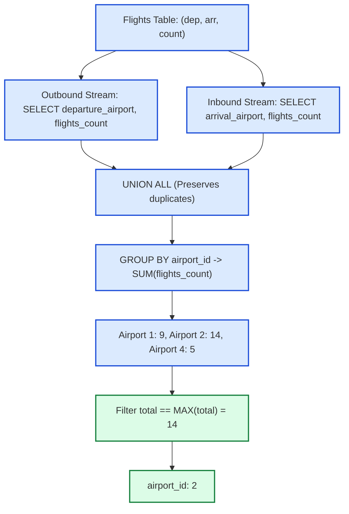

# Guided Example: The Airport With the Most Traffic

We trace the relational endpoint unpivoting, incident edge traffic summation, and equi-maximal ranking filter on a representative flight schedule:

- **Input Flights Table:**
  - Route $1 \to 2$: $4$ flights
  - Route $2 \to 1$: $5$ flights
  - Route $2 \to 4$: $5$ flights
- **Expected Result Table:** `airport_id = [2]` (Total Traffic: $14$)

---

## 1. Problem Overview & Representative Instance

We are given a database table `Flights` where each row $(\text{departure\_airport}, \text{arrival\_airport}, \text{flights\_count})$ records the number of flights taking off from a departure airport and landing at an arrival airport.
The **traffic** of an airport is defined as the total number of flights that either departed from or arrived at that airport.
The objective is to find the `airport_id` with the **most traffic**. If multiple airports tie for the highest traffic, all tied airports must be returned in any order.

### The Relational Unpivoting Challenge
In standard tabular databases, departures and arrivals are recorded in separate columns of the same row.
- Grouping only by `departure_airport` captures solely outbound flights, ignoring all inbound flights.
- Grouping only by `arrival_airport` captures solely inbound flights, ignoring outbound traffic.
- To compute total incident traffic per airport, we must **unpivot** each row into two independent contribution tuples: $(u, \text{flights\_count})$ for the departure airport and $(v, \text{flights\_count})$ for the arrival airport.
- Merging these two streams using `UNION ALL` (preserving multiset duplicates) and grouping by `airport_id` allows computing the exact aggregate traffic $T(u) = \text{Out}(u) + \text{In}(u)$.

---

## 2. Invariants & Relational Unpivoting Mathematics

Let $E$ be the multiset of flight records. Each row is a directed, weighted edge $e = (u, v, w)$.

### Invariant 1: Total Incident Traffic Conservation
The total traffic $T(x)$ of airport $x$ is the sum of weights of all edges incident to $x$, regardless of orientation:
$$T(x) = \sum_{(x, v, w) \in E} w + \sum_{(u, x, w) \in E} w$$

### Invariant 2: `UNION ALL` Multiset Preservation
Using `UNION` instead of `UNION ALL` would collapse identical tuples $(x, w)$ produced by different routes or between departures and arrivals.
Using `UNION ALL` guarantees that every flight count contributes with its exact multiplicity:
$$\text{TotalTuples} = 2 \times |E|$$

### Invariant 3: Equi-Maximal Rank Filtering
To handle ties seamlessly, we compute:
$$M = \max_{x} T(x)$$
The result relation is:
$$\{x \mid T(x) = M\}$$
This ensures that if multiple airports achieve the exact same highest traffic count, every one of them is included in the output.

| Airport ID | Outbound Flights ($\text{Out}$) | Inbound Flights ($\text{In}$) | Combined Traffic $T(x)$ | Max-Traffic Status |
|---|---|---|---|---|
| $1$ | $4$ (Route $1 \to 2$) | $5$ (Route $2 \to 1$) | $4 + 5 = 9$ | Below Maximum ($9 < 14$) |
| $2$ | $5 + 5 = 10$ (Routes $2 \to 1, 2 \to 4$) | $4$ (Route $1 \to 2$) | $10 + 4 = 14$ | **Global Maximum ($14$)** |
| $4$ | $0$ (No departures) | $5$ (Route $2 \to 4$) | $0 + 5 = 5$ | Below Maximum ($5 < 14$) |

---

## 3. Step-by-Step Worked Execution

We trace the sample data:
- Row 1: $(1, 2, 4)$
- Row 2: $(2, 1, 5)$
- Row 3: $(2, 4, 5)$

### Step 1: Unpivot Departures and Arrivals via `UNION ALL`
Generate the two streams:
- **Outbound Stream (`departure_airport`):**
  - $(1, 4)$
  - $(2, 5)$
  - $(2, 5)$
- **Inbound Stream (`arrival_airport`):**
  - $(2, 4)$
  - $(1, 5)$
  - $(4, 5)$
- **Unified Stream (`AllTraffic`):**
  $[(1, 4), (2, 5), (2, 5), (2, 4), (1, 5), (4, 5)]$.
  Total rows: $2 \times 3 = 6$.

### Step 2: Group By Airport and Aggregate Sums
Accumulate `flights_count` for each distinct `airport_id`:
- **Airport $1$:**
  $$T(1) = 4 + 5 = 9$$
- **Airport $2$:**
  $$T(2) = 5 + 5 + 4 = 14$$
- **Airport $4$:**
  $$T(4) = 5$$

### Step 3: Compute Global Maximum & Filter Winners
- Evaluate maximum:
  $$M = \max(9, 14, 5) = 14$$
- Filter airports where $T(x) == 14$:
  Only Airport $2$ has $T(2) = 14$.
- Output record:
  $$\text{airport\_id} = 2$$

---

## 4. Complete Execution Trace & State Progression

| Row # | Route $(u \to v)$ | Count $w$ | Outbound Contribution | Inbound Contribution | Grouped Total for Airport | Rank Position |
|---|---|---|---|---|---|---|
| $1$ | $1 \to 2$ | $4$ | Airport $1 \mathrel{+}= 4$ | Airport $2 \mathrel{+}= 4$ | — | — |
| $2$ | $2 \to 1$ | $5$ | Airport $2 \mathrel{+}= 5$ | Airport $1 \mathrel{+}= 5$ | — | — |
| $3$ | $2 \to 4$ | $5$ | Airport $2 \mathrel{+}= 5$ | Airport $4 \mathrel{+}= 5$ | — | — |
| **Sum** | Airport $1$ | — | $4$ | $5$ | $9$ | Rank 2 |
| **Sum** | Airport $2$ | — | $10$ | $4$ | **14** | **Rank 1 (Winner)** |
| **Sum** | Airport $4$ | — | $0$ | $5$ | $5$ | Rank 3 |

### Multi-Way Tie Contrast Instance
Consider a four-way tie where routes have equal weights:
- $1 \to 2$ (count 5), $2 \to 1$ (count 4) $\implies$ Airport 1: 9, Airport 2: 9.
- $3 \to 4$ (count 5), $4 \to 3$ (count 4) $\implies$ Airport 3: 9, Airport 4: 9.
- $M = \max(9, 9, 9, 9) = 9$.
- Filter $T(x) == 9$ returns all four rows: `[1, 2, 3, 4]`.
- Using `RANK()` or `WHERE cnt = (SELECT MAX(cnt) FROM ...)` correctly retains all tied airports, whereas `LIMIT 1` would erroneously omit three valid winners.

---

## 5. Algorithmic Correctness & Soundness

### Relational Proof of Soundness & Tie Completeness
1. **Double-Counting Prevention & Completeness:**
   Every physical flight departs once and arrives once.
   Unpivoting each row $(u, v, w)$ into $(u, w)$ and $(v, w)$ credits $w$ units of traffic to $u$ and $w$ units of traffic to $v$.
   Because $u \neq v$ in valid flight routes, no single flight adds more than once to any individual airport's traffic.
2. **`UNION ALL` vs `UNION`:**
   `UNION` applies an implicit `DISTINCT`, which would deduplicate identical tuples (e.g. $(2, 5)$ appearing twice from routes $2 \to 1$ and $2 \to 4$).
   `UNION ALL` preserves all instances, maintaining exact arithmetic equivalence with the underlying flight volumes.
3. **Equi-Join / Subquery Equality:**
   Comparing each airport's total with `(SELECT MAX(cnt) FROM TrafficSummary)` guarantees that the result set contains all airports matching the maximal traffic, perfectly satisfying the tie specification.

---

## 6. Structural Edge Cases & Boundary Behaviors

| Scenario | Database State | Relational Processing | Expected Output |
|---|---|---|---|
| Single Route | $10 \to 20$ (count 3) | Both endpoints have total traffic $3$ | Both `[10, 20]` (Tie) |
| Arrival-Only Airport | Airport receives flights, none depart | Inbound stream captures all its traffic | Evaluated correctly |
| Departure-Only Airport | Airport sends flights, none land | Outbound stream captures all its traffic | Evaluated correctly |
| Disconnected Routes | Two separate routes with same count | All 4 distinct endpoints tie at same count | All 4 airports returned |

---

## 7. Complexity Analysis

- **Time Complexity:** $\mathcal{O}(N \log N)$ (or $\mathcal{O}(N)$ with hash aggregation).
  - The `UNION ALL` scans the $N$ rows of `Flights` twice, generating $2N$ rows in $\mathcal{O}(N)$ time.
  - Grouping and aggregating $2N$ rows takes $\mathcal{O}(N)$ time with hash grouping (or $\mathcal{O}(N \log N)$ with sort-based grouping).
  - Computing the scalar maximum and filtering the winning rows takes $\mathcal{O}(N)$ time.
  - Overall time complexity is linear in the database table size: $\mathcal{O}(N)$.
- **Auxiliary Space Complexity:** $\mathcal{O}(N)$.
  - The intermediate unpivoted relation contains $2N$ tuples.
  - The aggregated summary relation contains at most $2N$ distinct airport keys.
