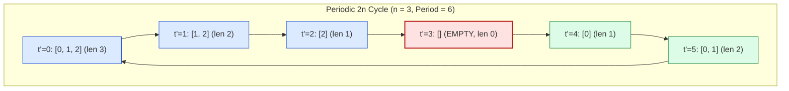

# Guided Example: Elements in Array After Removing and Replacing Elements

We trace the $2n$-periodic cyclical phase mapping, suffix/prefix closed-form coordinate resolution, and $\mathcal{O}(1)$ random-access query evaluation on a representative dynamic array schedule:

- **Original Array:** `nums = [0, 1, 2]`
- **Array Length $n$:** `3` (Cycle period $2n = 6$)
- **Queries:** `[[0, 2], [2, 0], [3, 2], [5, 0]]`
- **Expected Answers:** `[2, 2, -1, 0]`

---

## 1. Problem Overview & Representative Instance

We are given a 0-indexed integer array `nums` of length $n$.
Beginning at minute $0$, a deterministic transformation repeats indefinitely:
1. **Removal Phase (Minutes $0 \dots n - 1$):** Each minute, the leftmost element is removed.
2. **Empty Turnaround (Minute $n$):** All elements have been removed; the array is completely empty.
3. **Restoration Phase (Minutes $n + 1 \dots 2n - 1$):** Each minute, one element is appended to the end of the array in the order they were removed.
4. **Full Restoration (Minute $2n$):** The original array is fully restored, identically repeating the cycle.

We must answer multiple independent queries $(t_j, i_j)$, returning the value at index $i_j$ at minute $t_j$, or $-1$ if index $i_j$ is out of bounds at that minute.

### Direct Arithmetic vs. Simulation
Because query timestamps $t$ can reach $10^5$, literally simulating array removals and insertions minute by minute is wasteful.
- The entire system is strictly periodic with period $T = 2n$.
- Any timestamp $t$ maps to a canonical offset $t' = t \pmod{2n}$.
- The array at time $t'$ is always either a suffix $\text{nums}[t' \dots n - 1]$ or a prefix $\text{nums}[0 \dots t' - n - 1]$.
- Every query is resolved in strictly $\mathcal{O}(1)$ time without modifying or allocating arrays.

---

## 2. Invariants & Cyclic Modulo Array Coordinate Theory

Let $n$ be the length of `nums`. For any query $(t, i)$, we compute the canonical time offset:
$$t' = t \pmod{2n}$$

### Invariant 1: Removal Phase ($0 \le t' < n$)
During the first $n$ minutes, $t'$ elements have been removed from the front.
- The current array represents the suffix:
  $$\text{CurrentArray}(t') = \text{nums}[t' \dots n - 1]$$
- Current length is:
  $$L(t') = n - t'$$
- If the requested index $i < L(t')$, the element resides at shifted index $t' + i$ in the original array:
  $$\text{Value} = \text{nums}[t' + i]$$
- If $i \ge L(t')$, index $i$ exceeds the current bounds: $\text{Value} = -1$.

### Invariant 2: Restoration Phase ($n \le t' < 2n$)
At $t' = n$, the array is empty ($L(n) = 0$). For $t' > n$, exactly $t' - n$ elements have been restored to the end.
- The current array represents the prefix:
  $$\text{CurrentArray}(t') = \text{nums}[0 \dots t' - n - 1]$$
- Current length is:
  $$L(t') = t' - n$$
- If the requested index $i < L(t')$, the element resides at original index $i$:
  $$\text{Value} = \text{nums}[i]$$
- If $i \ge L(t')$, index $i$ exceeds the current bounds: $\text{Value} = -1$.

| Phase | Canonical Time $t'$ | Subarray Sliced from `nums` | Active Length $L(t')$ | Valid Range of $i$ | In-Bounds Original Index |
|---|---|---|---|---|---|
| Removal Phase | $t' \in [0, n - 1]$ | $\text{nums}[t' \dots n - 1]$ (Suffix) | $n - t'$ | $0 \le i < n - t'$ | $t' + i$ |
| Empty Turnaround | $t' = n$ | $\emptyset$ (Empty) | $0$ | None ($i \ge 0$) | Out of bounds ($-1$) |
| Restoration Phase | $t' \in [n + 1, 2n - 1]$ | $\text{nums}[0 \dots t' - n - 1]$ (Prefix) | $t' - n$ | $0 \le i < t' - n$ | $i$ |

---

## 3. Step-by-Step Worked Execution

We trace `nums = [0, 1, 2]` ($n = 3$, period $2n = 6$) for the queries:
`queries = [[0, 2], [2, 0], [3, 2], [5, 0]]`.

### Query 0: `[t = 0, i = 2]`
- Canonical time: $t' = 0 \pmod 6 = 0$.
- Phase check: $t' = 0 < n = 3 \implies$ **Removal Phase**.
- Current length: $L = n - t' = 3 - 0 = 3$.
- Bounds check: $i = 2 < L = 3$ (Valid!).
- Coordinate mapping: index in `nums` is $t' + i = 0 + 2 = 2$.
- Result: $\text{nums}[2] = 2$.

### Query 1: `[t = 2, i = 0]`
- Canonical time: $t' = 2 \pmod 6 = 2$.
- Phase check: $t' = 2 < n = 3 \implies$ **Removal Phase**.
- Current length: $L = n - t' = 3 - 2 = 1$.
  (Current array contains only `nums[2:]` = `[2]`).
- Bounds check: $i = 0 < L = 1$ (Valid!).
- Coordinate mapping: index in `nums` is $t' + i = 2 + 0 = 2$.
- Result: $\text{nums}[2] = 2$.

### Query 2: `[t = 3, i = 2]`
- Canonical time: $t' = 3 \pmod 6 = 3$.
- Phase check: $t' = 3 \ge n = 3 \implies$ **Restoration Phase / Empty Turnaround**.
- Current length: $L = t' - n = 3 - 3 = 0$.
  (The array is completely empty!).
- Bounds check: $i = 2 \ge L = 0$ (Out of bounds!).
- Result: $-1$.

### Query 3: `[t = 5, i = 0]`
- Canonical time: $t' = 5 \pmod 6 = 5$.
- Phase check: $t' = 5 \ge n = 3 \implies$ **Restoration Phase**.
- Current length: $L = t' - n = 5 - 3 = 2$.
  (Current array contains prefix `[0, 1]`).
- Bounds check: $i = 0 < L = 2$ (Valid!).
- Coordinate mapping: index in `nums` is $i = 0$.
- Result: $\text{nums}[0] = 0$.

Combined Query Results: `[2, 2, -1, 0]`.

---

## 4. Complete Execution Trace & State Progression

| Query # | Input $(t, i)$ | Modulo $t'$ | Active Phase | Suffix/Prefix State | Length $L$ | Bound Check $i < L$ | Value Emitted |
|---|---|---|---|---|---|---|---|
| $0$ | $(0, 2)$ | $0$ | Removal | $\text{nums}[0:] = [0, 1, 2]$ | $3$ | $2 < 3 \implies \text{True}$ | $\text{nums}[0+2] = \mathbf{2}$ |
| $1$ | $(2, 0)$ | $2$ | Removal | $\text{nums}[2:] = [2]$ | $1$ | $0 < 1 \implies \text{True}$ | $\text{nums}[2+0] = \mathbf{2}$ |
| $2$ | $(3, 2)$ | $3$ | Turnaround | $\emptyset = []$ | $0$ | $2 < 0 \implies \text{False}$ | $\mathbf{-1}$ |
| $3$ | $(5, 0)$ | $5$ | Restoration | $\text{nums}[:2] = [0, 1]$ | $2$ | $0 < 2 \implies \text{True}$ | $\text{nums}[0] = \mathbf{0}$ |

---

## 5. Algorithmic Correctness & Soundness

### Mathematical Proof of Periodicity and Index Mappings
1. **Periodicity Proof:**
   The removal phase executes for exactly $n$ steps ($t = 0 \dots n-1$), shrinking the array from length $n$ to $0$.
   The restoration phase executes for exactly $n$ steps ($t = n \dots 2n-1$), expanding the array from length $0$ to $n$.
   At $t = 2n$, the array is identical in content and order to $t = 0$.
   By induction, for any $k \in \mathbb{N}$, the array state at minute $t$ is identical to the array state at $t \pmod{2n}$.
2. **Coordinate Offset Equivalence:**
   - In the removal phase, after removing $t'$ elements from the front, the element at index $i$ was originally preceded by $t'$ elements, placing it at original index $t' + i$.
   - In the restoration phase, elements are appended to the back in their original order starting from index $0$. The element at index $i$ corresponds directly to original index $i$.
3. **Out-of-Bounds Integrity:**
   Whenever $i$ exceeds the current array length $L(t')$, evaluating the condition $i < L(t')$ safely falls through to $-1$, avoiding illegal memory access.

---

## 6. Structural Edge Cases & Boundary Behaviors

| Edge Scenario | Parameter Setup | Formula Behavior | Expected Outcome |
|---|---|---|---|
| Empty Array Timestamp | $t = n \implies t' = n$ | $L(n) = 0$; condition $i < 0$ always fails | $-1$ for all queries |
| Minute Before Reset | $t = 2n - 1 \implies t' = 2n - 1$ | $L = n - 1$; prefix contains first $n - 1$ elements | $\text{nums}[i]$ if $i < n - 1$, else $-1$ |
| Single-Element Array | $n = 1 \implies \text{Period} = 2$ | $t'=0$ has element; $t'=1$ is empty | Alternates $\text{nums}[0]$ and $-1$ |
| Arbitrarily Large Time | $t = 10^9$ | $t' = 10^9 \pmod{2n}$; answers immediately | Exact $\mathcal{O}(1)$ lookup |

---

## 7. Complexity Analysis

- **Time Complexity:** $\mathcal{O}(q)$ for $q$ queries.
  - Computing $t' = t \pmod{2n}$ takes $\mathcal{O}(1)$ time per query.
  - Determining the phase, checking bounds, and accessing the array take $\mathcal{O}(1)$ time.
  - Overall time complexity across $q$ queries is strictly linear in the query count: $\mathcal{O}(q)$.
- **Auxiliary Space Complexity:** $\mathcal{O}(1)$.
  - Zero auxiliary dynamic memory is allocated beyond the returned results array of size $q$.
  - The input array `nums` is accessed read-only.
