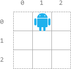
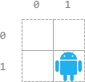
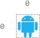

### 1. Description

There is an `n x n` grid, with the top-left cell at `(0, 0)` and the bottom-right cell at $(n - 1, n - 1)$. You are given the integer `n` and an integer array `startPos` where $startPos = [\text{start}_{row}, \text{start}_{col}]$ indicates that a robot is initially at cell $(\text{start}_{row}, \text{start}_{col})$.

You are also given a **0-indexed** string `s` of length `m` where $s[i]$ is the $$i^{\text{th}}$$ instruction for the robot: `'L'` (move left), `'R'` (move right), `'U'` (move up), and `'D'` (move down).

The robot can begin executing from any $$i^{\text{th}}$$ instruction in `s`. It executes the instructions one by one towards the end of `s` but it stops if either of these conditions is met:

- The next instruction will move the robot off the grid.

- There are no more instructions left to execute.

Return *an array* `answer` *of length* `m` *where* $\text{answer}[i]$ *is **the number of instructions** the robot can execute if the robot **begins executing from** the* $$i^{\text{th}}$$ *instruction in* `s`.

### 2. Function Contract

- `n`: Input parameter.
- Returns expected result.

### 3. Examples

#### Example 1

- **Input:** $n = 3, startPos = [0,1], s = "RRDDLU"$
- **Output:** `[1,5,4,3,1,0]`
- **Explanation:** Starting from startPos and beginning execution from the $i^{\text{th}}$ instruction:
- 0^th: "<u>**R**</u>RDDLU". Only one instruction "R" can be executed before it moves off the grid.
- 1^st:  "<u>**RDDLU**</u>". All five instructions can be executed while it stays in the grid and ends at (1, 1).
- 2^nd:   "<u>**DDLU**</u>". All four instructions can be executed while it stays in the grid and ends at (1, 0).
- 3^rd:    "<u>**DLU**</u>". All three instructions can be executed while it stays in the grid and ends at (0, 0).
- 4^th:     "<u>**L**</u>U". Only one instruction "L" can be executed before it moves off the grid.
- 5^th:      "U". If moving up, it would move off the grid.
#### Example 2

- **Input:** $n = 2, startPos = [1,1], s = "LURD"$
- **Output:** `[4,1,0,0]`
- **Explanation:**
- 0^th: "<u>**LURD**</u>".
- 1^st:  "<u>**U**</u>RD".
- 2^nd:   "RD".
- 3^rd:    "D".
#### Example 3

- **Input:** $n = 1, startPos = [0,0], s = "LRUD"$
- **Output:** `[0,0,0,0]`
- **Explanation:** No matter which instruction the robot begins execution from, it would move off the grid.

### 4. Constraints

- $m = \text{s.length}$

- $1 \le n, m \le 500$

- $\text{startPos.length} = 2$

- $0 \le \text{start}_{row}, \text{start}_{col} < n$

- `s` consists of `'L'`, `'R'`, `'U'`, and `'D'`.