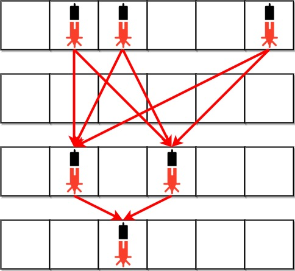
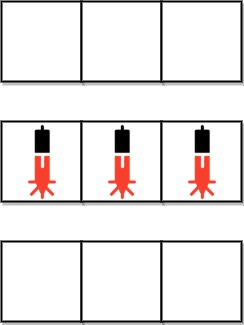

## Description

Anti-theft security devices are activated inside a bank. You are given a **0-indexed** binary string array `bank` representing the floor plan of the bank, which is an `m x n` 2D matrix. $\text{bank}[i]$ represents the $$i^{\text{th}}$$ row, consisting of `'0'`s and `'1'`s. `'0'` means the cell is empty, while`'1'` means the cell has a security device.

There is **one** laser beam between any **two** security devices **if both** conditions are met:

- The two devices are located on two **different rows**: $r_{1}$ and $r_{2}$, where $r_{1} < r_{2}$.

- For **each** row `i` where $r_{1} < i < r_{2}$, there are **no security devices** in the $$i^{\text{th}}$$ row.

Laser beams are independent, i.e., one beam does not interfere nor join with another.

Return *the total number of laser beams in the bank*.
### Function Contract

- `n`: Input parameter.
- Returns expected result.

### Examples
#### Example 1

- **Input:** $bank = ["011001","000000","010100","001000"]$
- **Output:** `8`
- **Explanation:** Between each of the following device pairs, there is one beam. In total, there are 8 beams:
* bank[0][1] -- bank[2][1]
* bank[0][1] -- bank[2][3]
* bank[0][2] -- bank[2][1]
* bank[0][2] -- bank[2][3]
* bank[0][5] -- bank[2][1]
* bank[0][5] -- bank[2][3]
* bank[2][1] -- bank[3][2]
* bank[2][3] -- bank[3][2]
Note that there is no beam between any device on the 0^th row with any on the 3^rd row.
This is because the 2^nd row contains security devices, which breaks the second condition.
#### Example 2

- **Input:** $bank = ["000","111","000"]$
- **Output:** `0`
- **Explanation:** There does not exist two devices located on two different rows.
### Constraints

- $m = \text{bank.length}$

- $n = \text{bank}[i].length$

- $1 \le m, n \le 500$

- $\text{bank}[i][j]$ is either `'0'` or `'1'`.