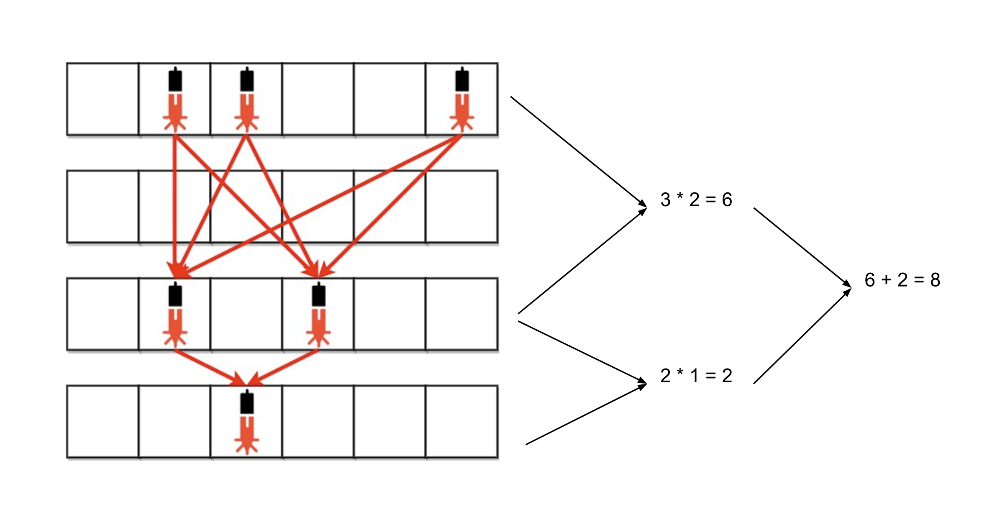

[TOC]

## Solution

---

### Approach: Greedy

**Intuition**

The laser beam will exist from one row (let's call it row `a`) to another (row `b`) if all rows in between have no security devices. In such cases, there will be a laser beam from each safety device in row `a` to every safety device in row `b`. Therefore, if the first row has `M` devices and the second one has `N` devices, then the total number of laser beams will be $M * N$ between these two rows. Note that it doesn't matter how many rows in between have no safety devices as the beams will only exist between the rows having the devices.

In continuation to the above scenario, the second row with safety devices has `N` devices, and suppose the third row with safety devices has `K` devices. Then the number of laser beams between the second and this third row will be $N * K$, and there will be no other beams between the third row and other previous rows. One thing to observe from here is that we can ignore the rows without safety devices as they will be passed through by the beams that are created by rows having devices. Also, the beams will only be there between adjacent rows with devices and the number of beams will be the product of their device count.

We will keep the count of devices in each row and then multiply it by the number of devices in the previous row which has devices (if it exists). The count of devices in the previous row will be stored in a variable `prev` and will be updated with the number of devices in the current row (only if the devices count is non zero). The sum of all these products of devices count of every adjacent row with non-zero devices will be our answer.



**Algorithm**

1. Initialize `prev` and `ans` to `0`.
2. Iterate over each string in `bank` and initialize the `count` to `0`. Iterate over each character in the string and increment the counter `count` if the character is a `1`.
3. After iterating over all characters of a string, if the `count` is not zero then add $prev * count$ to `ans`. Also update the value of `prev` to `count` if $count \neq 0$.
4. Return `ans`.

**Implementation**

```cpp
class Solution {
public:
    int numberOfBeams(vector<string>& bank) {
        int prev = 0, ans = 0;

        for (string s : bank) {
            int count = 0;
            for (char c : s) {
                if (c == '1') {
                    count++;
                }
            }
            if (count != 0) {
                ans += (prev * count);
                prev = count;
            }
        }

        return ans;
    }
};
```

**Complexity Analysis**

Here, $M$ is the number of strings in the `bank` and $N$ is the average length of the strings.

* Time complexity: $O(M * N)$

  We have to iterate over each character once to find the number of safety devices in each row and hence the time complexity is equal to $O(M * N)$.

* Space complexity: $O(1)$

  We only need three variables `prev`, `ans` and `count` and hence the space complexity is constant.
  <br/>

---