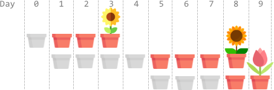
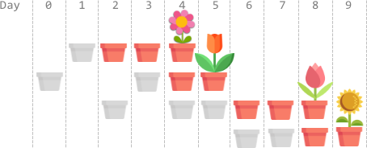

### 1. Description

You have `n` flower seeds. Every seed must be planted first before it can begin to grow, then bloom. Planting a seed takes time and so does the growth of a seed. You are given two **0-indexed** integer arrays `plantTime` and `growTime`, of length `n` each:

- $\text{plantTime}[i]$ is the number of **full days** it takes you to **plant** the $i^{\text{th}}$ seed. Every day, you can work on planting exactly one seed. You **do not** have to work on planting the same seed on consecutive days, but the planting of a seed is not complete **until** you have worked $\text{plantTime}[i]$ days on planting it in total.

- $\text{growTime}[i]$ is the number of **full days** it takes the $i^{\text{th}}$ seed to grow after being completely planted. **After** the last day of its growth, the flower **blooms** and stays bloomed forever.

From the beginning of day `0`, you can plant the seeds in **any** order.

Return *the **earliest** possible day where **all** seeds are blooming*.

### 2. Function Contract

**Inputs**

- `plantTime`: Input parameter (`List[int]`).
- `growTime`: Input parameter (`List[int]`).

**Return value**

- Returns `int`.

### 3. Examples

#### Example 1

- **Input:** $plantTime = [1,4,3], growTime = [2,3,1]$
- **Output:** `9`
- **Explanation:** The grayed out pots represent planting days, colored pots represent growing days, and the flower represents the day it blooms.
One optimal way is:
On day 0, plant the 0^th seed. The seed grows for 2 full days and blooms on day 3.
On days 1, 2, 3, and 4, plant the 1^st seed. The seed grows for 3 full days and blooms on day 8.
On days 5, 6, and 7, plant the 2^nd seed. The seed grows for 1 full day and blooms on day 9.
Thus, on day 9, all the seeds are blooming.

#### Example 2

- **Input:** $plantTime = [1,2,3,2], growTime = [2,1,2,1]$
- **Output:** `9`
- **Explanation:** The grayed out pots represent planting days, colored pots represent growing days, and the flower represents the day it blooms.
One optimal way is:
On day 1, plant the 0^th seed. The seed grows for 2 full days and blooms on day 4.
On days 0 and 3, plant the 1^st seed. The seed grows for 1 full day and blooms on day 5.
On days 2, 4, and 5, plant the 2^nd seed. The seed grows for 2 full days and blooms on day 8.
On days 6 and 7, plant the 3^rd seed. The seed grows for 1 full day and blooms on day 9.
Thus, on day 9, all the seeds are blooming.

#### Example 3

- **Input:** $plantTime = [1], growTime = [1]$
- **Output:** `2`
- **Explanation:** On day 0, plant the 0^th seed. The seed grows for 1 full day and blooms on day 2.
Thus, on day 2, all the seeds are blooming.

### 4. Constraints

- $n = \text{plantTime.length} = \text{growTime.length}$

- $1 \le n \le 10^{5}$

- $1 \le \text{plantTime}[i], \text{growTime}[i] \le 10^{4}$
