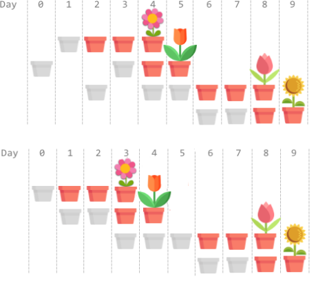
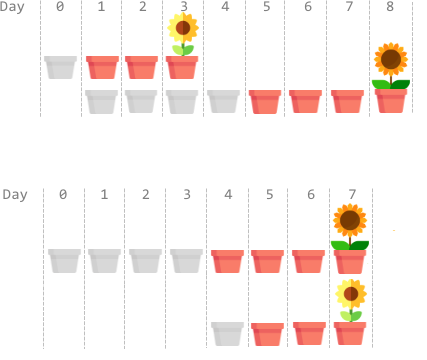
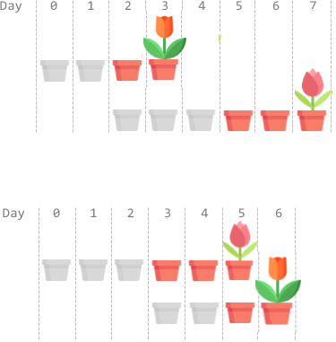
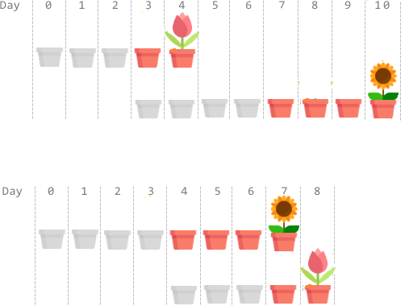
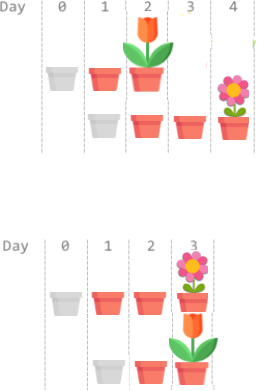

[TOC]

## Solution

---

### Greedy approach

#### Intuition

The first observation: there is no need to plant a seed during
non-consecutive days. In other words, if we begin to plant a
seed, we proceed until it starts to grow, and only after this
switch to another. Otherwise, one could always
modify the solution, as shown in the picture.



Although there might exist an optimal solution where we plant the
seeds during non-consecutive days (e.g., the first solution in the
picture), there always exists an optimal solution with the seeds planted
during consecutive days. It never harms to plant the seeds on adjacent days.

Now we want to know in which order to plant the seeds. Have a
look at several examples.









In all these examples, it is better to plant the seed with a
longer growth time before the one with a shorter growth time. One may
assume that it is always optimal to do so.

Let $t$ denote the answer to the problem, which is the minimum
possible time when all flowers bloom. In an optimal solution, the
seed $i$ has to begin growing no later than on the day
$t-\text{growTime}[i]$ so that it has enough time to grow until the day
$t$. The larger $growTime$ the seed has, the sooner it has to
start to grow and the sooner we have to plant it.

One may already have an intuition to order the seeds by
decreasing growth time. Let us prove it.

There exists a sequence where the last flower blooms on the day $t$ (this is an optimal sequence), but it's impossible to finish strictly earlier than day $t$.

Using this definition of $t$, one may formulate the following statement. The sequence of the seeds is optimal if and only if all the flowers bloom not later than day $t$.

The necessity of the condition implies directly from the definition of $t$. If some flower blooms later than day $t$, the sequence is not optimal.

Since it's impossible to finish earlier than $t$, the condition is also sufficient – if all the flowers bloom not later than day $t$, the sequence is optimal.

Consider an arbitrary **optimal** sequence of the seeds, i.e. the one
that achieves the minimum possible time $t$. Suppose there exist
two adjacent seeds (there are no other seeds between them) $i$ and $j$
in this sequence such that the $j$-th seed is planted after the
$i$-th one and $\text{growTime}[i] \le \text{growTime}[j]$. Let $s$ denote the
day we begin planting the $i$-th seed. We start to plant the
$j$-th seed on the day $s+\text{plantTime}[i]$ just after the $i$-th
seed. It takes $\text{plantTime}[j]$ to plant the $j$-th seed
and $\text{growTime}[j]$ for it to grow. The $j$-th seeds blooms on the
day $s+\text{plantTime}[i]+\text{plantTime}[j]+\text{growTime}[j]$. The inequality
$s+\text{plantTime}[i]+\text{plantTime}[j]+\text{growTime}[j] \le t$ must hold
because we consider the optimal sequence where all flowers,
including the $j$-th one, bloom not later than the day $t$.

Let us see what happens when we swap these two seeds. Now we will
plant the $i$-th seed after the $j$-th one. Such swap affects
neither the previous seeds nor the next ones. It only changes
the time when the $i$-th and the $j$-th flowers bloom. The seed
$j$ blooms on the day $s + \text{plantTime}[j] + \text{growTime}[j]$ and the
$i$-th one on the day $s + \text{plantTime}[j] + \text{plantTime}[i] + \text{growTime}[i]$.
For the new sequence to remain optimal, the two flowers must still
bloom before the day $t$, i.e. the inequalities
$s + \text{plantTime}[j] + \text{growTime}[j] \le t$ and
$s + \text{plantTime}[j] + \text{plantTime}[i] + \text{growTime}[i] \le t$ must hold.
Moreover, they are sufficient for the optimality of the new sequence.
The inequality from the previous paragraph implies these two inequalities
because $\text{plantTime}[i] > 0$ and $\text{growTime}[i] \le \text{growTime}[j]$.

Since we can achieve sorting by swapping,
it is possible to sort any optimal sequence by decreasing $growTime$
with the described above swaps, without violating the optimality.
It means the sorted sequence is optimal.

#### Algorithm

Sort the seeds by descending growth time. Plant the seeds in this
order. For each, find the day it blooms and update the answer.

#### Implementation

```python
class Solution:
    def earliestFullBloom(self, plantTime: List[int],
                          growTime: List[int]) -> int:
        cur_plant_time = 0
        result = 0
        indices = sorted(range(len(plantTime)), key=lambda x: -growTime[x])
        for i in indices:
            cur_plant_time += plantTime[i]
            result = max(result, cur_plant_time + growTime[i])
        return result

```

#### Complexity Analysis

Let $n$ denote the number of seeds.

* Time complexity: $O(n \log n)$.

	We sort the seeds with $O(n \log n)$ time and iterate it with $O(n)$ time.

* Space complexity: $O(n)$.

	We use $O(n)$ memory for `indices` and sorting.