[TOC]

## Solution

---

### Overview

First, we provide an example in the picture below. Note that $\text{questions}[0] = [\text{points}_{0}, \text{brainpower}_{0}] = [3, 2]$, so if we solve the first question, we can earn `3` points and have to skip at least `2` following questions.

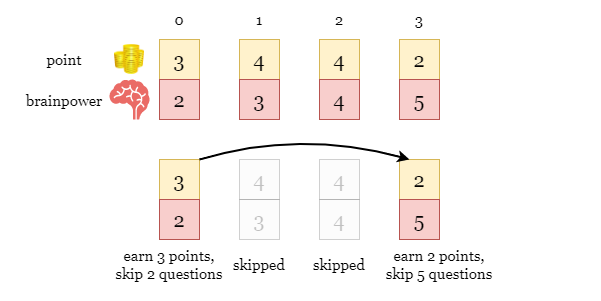

---

### Approach 1: Dynamic Programming (Iterative)

#### Intuition

For each question $\text{questions}[i]$, we have two options:
- Solve it, earn points, skip some following questions.
- Skip it.

Both choices affect the options on the remaining questions. This distinctive feature implies that we can use dynamic programming.

Let `n` be the number of questions. Define an array `dp` where $\text{dp}[i]$ is the maximum points we can get by processing the questions in the suffix subarray $questions[i ~ n - 1]$, as shown in the colored cells in the picture below.

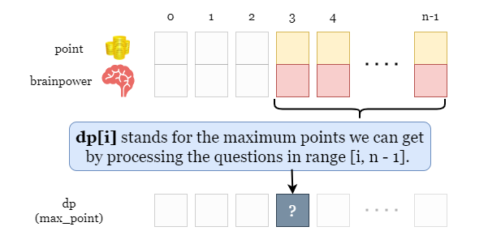

Now we try to fill `dp` backward. What is the value of $\text{dp}[i]$? Recall the two options we have for $\text{questions}[i]$, we can either solve it or skip it.

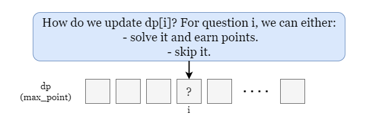

<br>

Notice the non-decreasing feature of `dp`, that is, $\text{dp}[i] ≥ dp[i + 1], (For i < n - 1)$. The reason is that:

- $\text{dp}[i]$ is the optimal points we get for $questions[i ~ n - 1]$.
- $dp[i + 1]$ is the optimal points we get for $questions[i + 1 ~ n - 1]$, which has one less question than $questions[i ~ n - 1]$.

In short, the question range for $\text{dp}[i]$ includes the question range for $dp[i + 1]$, so we can always have at least the same points as $dp[i + 1]$ for $\text{dp}[i]$.

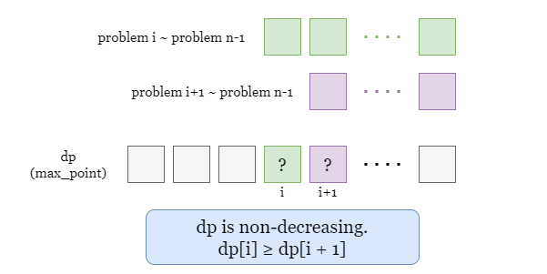

Now we can update each cell. For $\text{dp}[i]$, if we solve this problem, it means that we have to skip the following $\text{skip}[i]$ questions. Therefore, the maximum points we can get is determined by:

- The score of question `i`, which is $\text{points}[i]$.
- The maximum score we can get in the range $dp[i + \text{skip}[i] + 1 ~ n]$, since we have to skip at least $\text{skip}[i]$ following questions.

**You may wonder why we use $dp[i + \text{skip}[i] + 1]$ if we don't necessarily have to solve question $i + skip + 1$. What if we actually skipped more questions?**

> We have showed that `dp` is non-increasing, thus $dp[i + \text{skip}[i] + 1]$ is the maximum value in the range $dp[i + \text{skip}[i] + 1 ~ n]$. We can safely use $dp[i + \text{skip}[i] + 1]$ as the maximum points we can get among all possible plans, regardless of whether we solve $i + \text{skip}[i] + 1$.

Therefore, by solving the problem `i`, we have the maximum points as $\text{points}[i] + dp[i + \text{skip}[i] + 1]$.

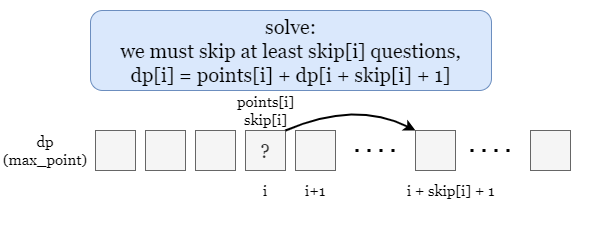

On the other hand, if we skip problem `i`, the maximum points we get is the same as the case for $i + 1$. That is, $\text{dp}[i] = dp[i + 1]$.

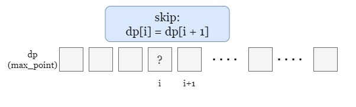

To sum up, we can update $\text{dp}[i]$ as the larger of the points of the two options:

$\text{dp}[i] = max(dp[i + 1], \text{points}[i] + dp[i + \text{skip}[i] + 1])$.

Note the boundary condition: If $i + \text{skip}[i] + 1 \ge n$, it means that after skipping $\text{skip}[i]$ questions, there are no more available questions or gainable points, so we can just treat $dp[i + \text{skip}[i] + 1]$ as `0`.

Finally, we just need to return $\text{dp}[0]$ after the update ends, which stands for the optimal solution for the whole question array $questions[0 ~ n - 1]$. Please take the following slides as an example.

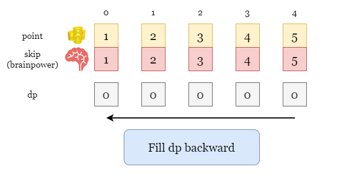

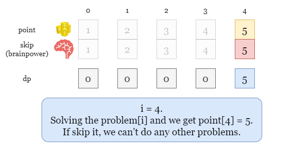

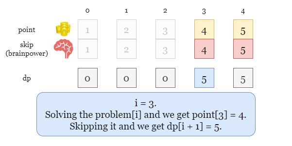

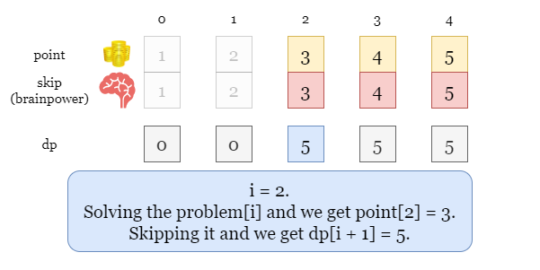

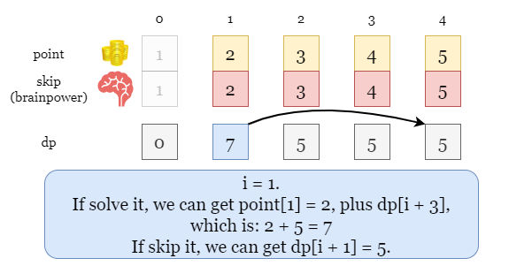

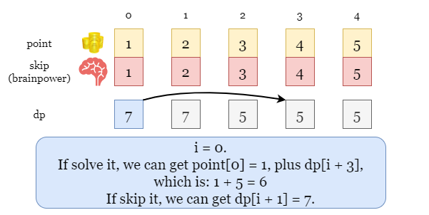

<br>

#### Algorithm

1) Initialize an array `dp` of size `n`, set $dp[n - 1] = questions[n - 1][0]$.

2) Iterate backward over index `i` from $n - 2$:
- If we skip question `i`, we have $\text{dp}[i] = dp[i + 1]$.
- If we solve question `i`, we have $\text{dp}[i] = \text{questions}[i][0] + dp[i + \text{questions}[i][1] + 1]$.

    Update $\text{dp}[i]$ as the larger one.

3) Return $\text{dp}[0]$ once we finish the iteration.

#### Implementation

```python
class Solution:
    def mostPoints(self, questions: List[List[int]]) -> int:
        n = len(questions)
        dp = [0] * n
        dp[-1] = questions[-1][0]

        for i in range(n - 2, -1, -1):
            dp[i] = questions[i][0]
            skip = questions[i][1]
            if i + skip + 1 < n:
                dp[i] += dp[i + skip + 1]

            # dp[i] = max(solve it, skip it)
            dp[i] = max(dp[i], dp[i + 1])

        return dp[0]
```

#### Complexity Analysis

Let $n$ be the length of the input array `questions`.

* Time complexity: $O(n)$

- We need to iterate over `dp`. At each step, we calculate and update $\text{dp}[i]$ which take $O(1)$ time.

* Space complexity: $O(n)$

- We initialize an array of size `n`.

<br/>

---

### Approach 2: Dynamic Programming (Recursive)

#### Intuition

We will implement the same algorithm as in approach 1, but using a recursive method.

The idea is that each time a recursive function calls itself, it reduces the given problem into subproblems. The recursion call continues until it reaches the base cases, where the subproblem can be solved without further recursion.

We define `dfs(i)` as the maximum points we can get by processing the problems in the range `[i ~ n - 1]`. Similar to approach 1, we have the same recursive formula where `dfs(i)` is the larger of the points of the two options:

$dfs(i) = max(dfs(i + 1), \text{points}[i] + dfs(i + \text{skip}[i] + 1))$

Once we move on from `dfs(i)` to either $dfs(i + 1)$ or $dfs(i + \text{skip}[i] + 1)$. Then the function calls itself for smaller subproblems. When we meet the case that `i ≥ n`, we have reached the base case where the problem can be solved by just returning `0` without further recursion!

As you may have noticed from the picture, there may be many repeated calls to `dfs`. To avoid repeated computation over the same case, we can use an array `dp` as memory.

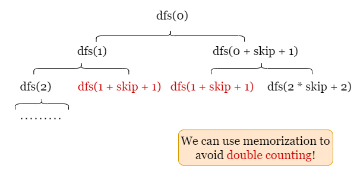

<br>

#### Algorithm

1) Initialize an array `dp` of size `n` as memory.
2) Define function `dfs(i)` as the maximum points in the range `[i ~ n - 1]`.
- If $i \ge n$, return `0`, since we can get `0` points from `0` question.
- If $\text{dp}[i] \neq 0$, it means we have already computed `dfs(i)`, return $\text{dp}[i]$.
- Otherwise, we can either solve question `i` or skip it.
- By solving it, the point we get is $\text{questions}[i][0] + dfs(i + \text{questions}[i][1] + 1)$.
- By skipping it, the point we get is $dfs(i + 1)$.
- Update $\text{dp}[i]$ as the larger one.
3) Call `dfs(0)` and return its result.

#### Implementation

```python
class Solution:
    def mostPoints(self, questions: List[List[int]]) -> int:
        n = len(questions)
        dp = [0] * n

        def dfs(i):
            if i >= n:
                return 0
            if dp[i]:
                return dp[i]
            points, skip = questions[i]

            # dp[i] = max(skip it, solve it)
            dp[i] = max(dfs(i + 1), points + dfs(i + skip + 1))
            return dp[i]

        return dfs(0)
```

#### Complexity Analysis

Let $n$ be the length of the input array `questions`.

* Time complexity: $O(n)$

- Recall the picture at the beginning of this approach, the time complexity is proportional to the number of the function calls. Since we use `dp` as memory, each `dfs(i)` will be called exactly once, so the time complexity is $O(n)$.

* Space complexity: $O(n)$

- The space complexity is proportional to the maximum depth of the recursion tree. We have up to $n$ questions, which results in a recursion tree of depth $O(n)$.
- Each function call takes $O(1)$ space.
- Additionally, we initialize an array `dp` of size `n` which also takes $O(n)$ space.
- Therefore, the overall space complexity is $O(n)$.

<br/>