[TOC]

## Solution

---

### Overview

From the first example, let's try another distribution plan first. Suppose we let 2 batteries support 2 computers continuously, we will end up with 2 empty batteries and 1 full battery. Then the running time is fixed at `3` since we can't use the only battery left to support 2 computers simultaneously.

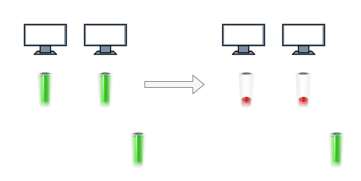

It implies that there is a strategy to distribute the batteries properly. Let's move on to finding the best patterns.

---

### Approach 1: Sorting and Prefix Sum

#### Intuition

First, we simplify the original problem a little bit:

**Suppose we have 4 computers (named A, B, C and D) and have to pick exactly 4 batteries. What is the maximum running time?**

This is quite straightforward. We just pick the largest 4 batteries and let them support these 4 computers separately (let's call the list that contains these 4 batteries `live`), and the running time is determined by the smallest battery picked.

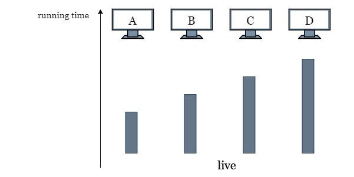

**What if we are allowed to pick a 5th battery?**

Let's pick the largest battery that isn't in use. Clearly, the smallest of these 4 batteries will be the bottleneck, so we use the power in the 5th battery to increase the running time of computer A that has the smallest battery.

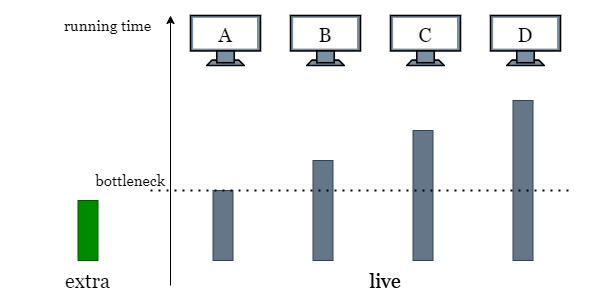

**What if we are allowed to pick more batteries?**

We can freely use every battery except the largest 4 to increase the total running time. Because we can freely swap batteries in 0 time, all the extra power is interchangeable. We can take this extra power and "transfer" it to the batteries in `live`. Let `extra` be the sum of all the extra power.

Let's say live is sorted. We try using some of our extra power to increase live[0] running time to live[1]. In the process, $extra -= \text{live}[1] - \text{live}[0]$.

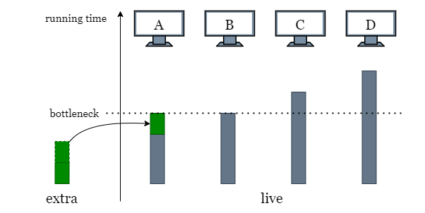

Now, $\text{live}[0] = \text{live}[1]$. Can we continue? We try increasing the running time to $\text{live}[2]$. However, not only would we need to increase $\text{live}[1]$ to $\text{live}[2]$, we also need to increase $\text{live}[0]$ to $\text{live}[2]$ so it doesn't bottleneck the running time. We already spent some power to increase $\text{live}[0]$ to $\text{live}[1]$, so we just need to spend twice as much power as the difference $\text{live}[2] - \text{live}[1]$.

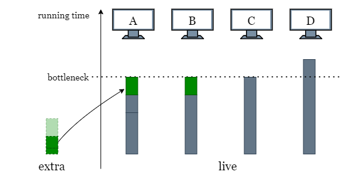

Now we have $\text{live}[0] = \text{live}[1] = \text{live}[2]$. If we want to increase the running time to $\text{live}[3]$, we need to spend three times as much power as the difference $(\text{live}[3] - \text{live}[2])$.

<br>

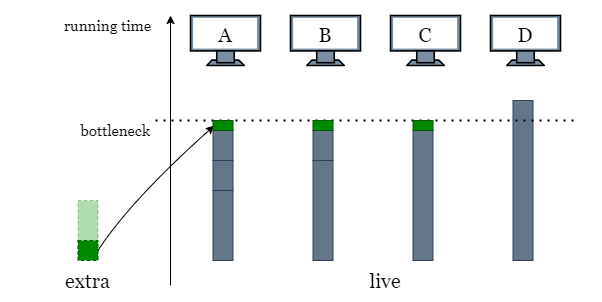

Oops, seems we are running out of `extra` power before reaching $\text{live}[3]$, so the bottleneck is decided by $\text{live}[2]$. We have some extra power remaining, so we do our best to increase the running time by evenly splitting the remaining power to the computers  ($extra / 3$).

<br>

What if we have an example where `extra` is large enough to support all batteries in `live` becoming equal to $live[n - 1]$. Any remaining power in `extra` should similarly be evenly split across all the computers to increase the final running time. The final running time is determined by $live[n - 1]$ plus the extra running time we can make using `extra` power, which is $extra / n$.

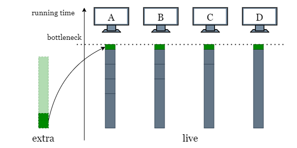

To generalize, at each battery $\text{live}[i]$, if we want to increase the running time to $live[i + 1]$, we need to spend $(i + 1)$ times as much power as $(live[i + 1] - \text{live}[i])$. With this formula, we don't actually need to update the values of `live`. Since after each iteration, we already know that $\text{live}[0] = \text{live}[1] = ... = \text{live}[i]$.

We iterate through `live` until we either cannot afford to increase to $live[i + 1]$ anymore, or we manage to iterate through the entire array. In both cases, we do our best to evenly allocate the remaining extra power.

<br>

You may be thinking that in the case below, since there is some unused power in the larger batteries (like the largest battery on the right), can we further increase the total running time using this unused power? The answer is NO.

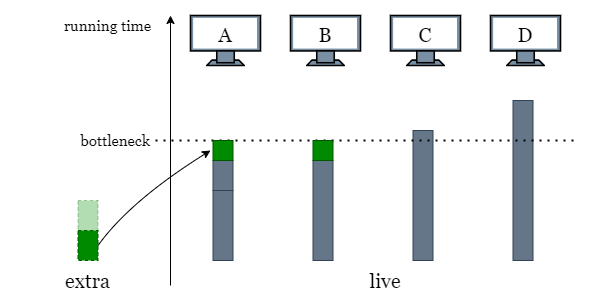

As shown in the following picture, suppose we do allocate the power "equally" by using the excess power of the largest battery (colored in red) on other computers. It means that there are times when the red battery is used on other computers, but the same battery also supports the computer D **all the time**. This contradicts the rule that *one battery can't support more than one computer at the same time*.

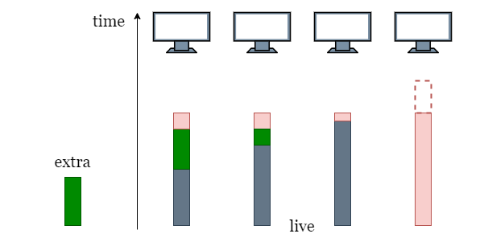

Therefore, we observe the pattern that:

> If a battery $\text{batteries}[i]$ has more power than the total running time, there is no way we can use its excess power to further increase the running time. Therefore, once we have picked the largest `n` batteries and assign them to `n` computers, these batteries are tied to their computer and swapping them does not bring any longer running time.

<br>

#### Algorithm

1) Sort `batteries`.

2) Find the largest `n` batteries and assign them to `n` computers, these `n` batteries are exclusively used by each computer and cannot be shared with other computers. Create an array `live` that contains the largest `n` batteries in sorted order, which represents the `n` computers.

3) Sum up the power of the remaining batteries as `extra`.

4) Iterate over `live` from `0` to $n - 2$, for each index `i`:
- If `extra` power can increase the running time of the first `i` computers from $\text{live}[i]$ to $live[i + 1]$, then we subtract the required power from `extra` and move on to the next index.
- Otherwise, we have to stop at this point and return $\text{live}[i] + extra / (i + 1)$.

5) If there is still power left after the iteration, it means we can further increase the total running time of `n` computers from $live[n - 1]$ by $extra / n$. Therefore, return $live[n - 1] + extra / n$.

#### Implementation

```python
class Solution:
    def maxRunTime(self, n: int, batteries: List[int]) -> int:
        # Get the sum of all extra batteries.
        batteries.sort()
        extra = sum(batteries[:-n])

        # live stands for the n largest batteries we chose for n computers.

        live = batteries[-n:]

        # We increase the total running time using 'extra' by increasing
        # the running time of the computer with the smallest battery.
        for i in range(n - 1):
            # If the target running time is between live[i] and live[i + 1].
            if extra // (i + 1) < live[i + 1] - live[i]:
                return live[i] + extra // (i + 1)

            # Reduce 'extra' by the total power used.
            extra -= (i + 1) * (live[i + 1] - live[i])

        # If there is power left, we can increase the running time
        # of all computers.
        return live[-1] + extra // n
```

#### Complexity Analysis

Let $m$ be the length of the input array `batteries`.

* Time complexity: $O(m \cdot\log m)$

- We sort $\text{batteries}$ in place, it takes $O(m \cdot\log m)$ time.
- Picking the largest n-th batteries from a sorted array takes $O(n)$ time. Note that since $n < m$, this term will be dominated.

- Then we iterate over the remaining part of the `batteries`, the computation at each step takes constant time. Thus it takes $O(m)$ time to finish the iteration.
- To sum up, the overall time complexity is $O(m \cdot\log m)$.

* Space complexity: $O(m)$

- Some extra space is used when we sort $\text{batteries}$ in place. The space complexity of the sorting algorithm depends on the programming language.
- In python, the `sort` method sorts a list using the Timsort algorithm, which is a combination of Merge Sort and Insertion Sort and uses $O(m)$ additional space.
- In Java, Arrays.sort() is implemented using a variant of the Quick Sort algorithm which has a space complexity of $O(\log m)$.
- We create an array of size $O(n)$ to record the power (running time) of each computer.
- To sum up, the overall space complexity is $O(m)$.

<br/>

---

### Approach 2: Binary Search

#### Intuition

In the previous approach, we began by selecting the largest `n` batteries (one for each computer) and then assigning the remaining power `extra` to these computers using a greedy approach until we reach the longest running time.

Alternatively, we can first set a target running time, `target`, then try to reach this running time using all batteries.

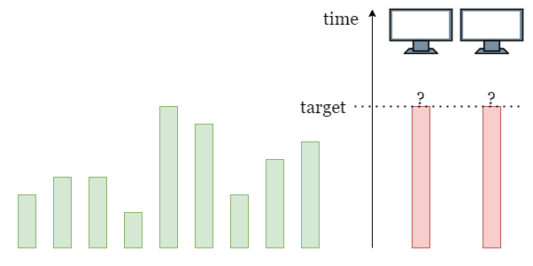

Here we still take advantage of the conclusion we reached at the end of the previous approach (Please refer to the previous approach):
- If the power of a battery is smaller than `target`, we can use all of its power.
- If the power of a battery is larger than `target`, we can only use `target` power from it.

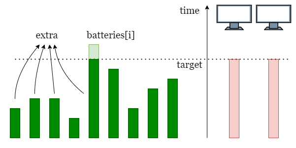

Therefore, we can traverse through `batteries` and collect all the power that can be used. If the sum of collected power is larger than or equal to $target * n$, all computers can run for `target` time.

As shown in the picture above, suppose we set a running time `target`, then we collect power from all batteries (colored in green). Finally, we check if the sum of the collected power is larger than or equals to $target * 2$.

**How to find the largest running time?**

Instead of trying every `target` from `1` until finding the largest possible running time, we can take advantage of binary search to locate the largest `target` faster than linear search.

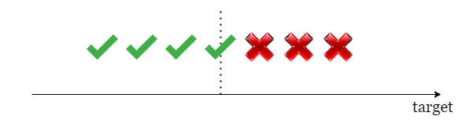

Initially, we set the left boundary as `1` as the minimum possible running time. Assuming we can use all the power perfectly, the maximum running time is $sum(batteries) / n$, so we set the right boundary as $sum(batteries) / n$. As a result, the largest `target` is limited to the inclusive range `[left, right]`, and we can apply binary search in this range to find it.

<br>

#### Algorithm

1) Initialize the boundaries of the search space as $left = 1$, and $right = sum(batteries) / n$.

2) While `left < right`:
- Find the middle value $target = right - (right - left) / 2$.
- Check if batteries can support `n` computers run `target` time. Iterate over `batteries` and record `extra`, the accumulative sum of $min(\text{batteries}[i], target)$.

3) Check if $extra \ge n * target$:
- If so, set $left = target$ and repeat step 2.
- Otherwise, set $right = target - 1$ and repeat step 2.

4) Once the binary search ends, return `left`.

#### Implementation

```python
class Solution:
    def maxRunTime(self, n: int, batteries: List[int]) -> int:
        left, right = 1, sum(batteries) // n

        while left < right:
            target = right - (right - left) // 2

            extra = 0
            for power in batteries:
                extra += min(power, target)

            if extra // n >= target:
                left = target
            else:
                right = target - 1

        return left
```

#### Complexity Analysis

Let $m$ be the length of the input array `batteries` and $k$ be the maximum power of one battery.

* Time complexity: $O(m \cdot\log k)$

- Initially, we set `1` as the left boundary and $sum(batteries) / n$ as the right boundary. Thus it takes $O(\log (\frac{m\cdot k}{n}))$ steps to locate the maximum running time in the worst-case scenario.
- At each step, we need to iterate over `batteries` to add up the power that can be used, which takes $O(m)$ time.
- Therefore, the overall time complexity is $O(m \cdot\log (\frac{m\cdot k}{n})) = O(m\cdot \log k)$
    $, k \gg m, n$

* Space complexity: $O(1)$

- During the binary search, we only need to record the boundaries of the searching space and the power `extra`, and the accumulative sum of `extra`, which only takes constant space.

<br/>