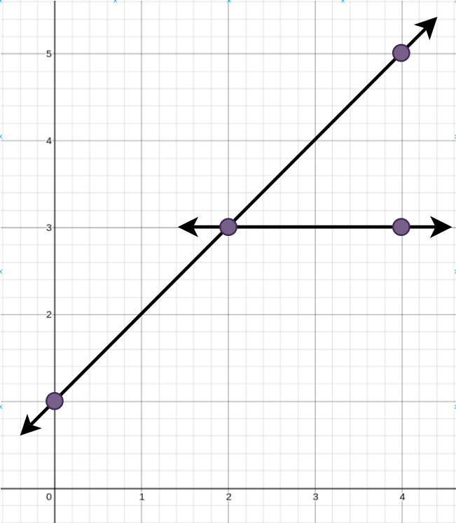
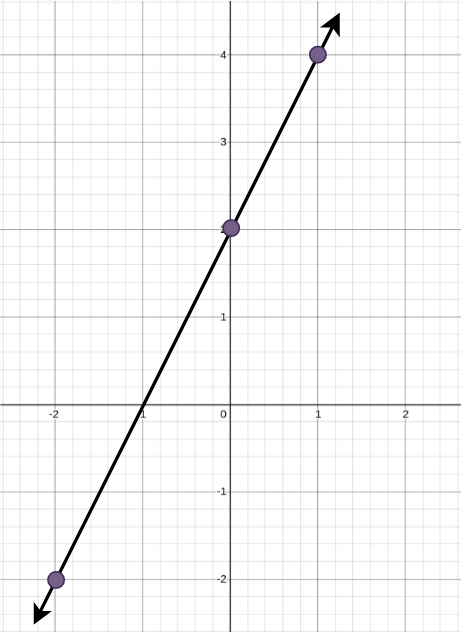

### 1. Description

You are given an array `points` where $\text{points}[i] = [x_{i}, y_{i}]$ represents a point on an **X-Y **plane.

**Straight lines** are going to be added to the **X-Y** plane, such that every point is covered by at **least **one line.

Return *the **minimum **number of **straight lines** needed to cover all the points*.

### 2. Function Contract

- Refer to method signature.

### 3. Examples

#### Example 1

- **Input:** $points = [[0,1],[2,3],[4,5],[4,3]]$
- **Output:** `2`
- **Explanation:** The minimum number of straight lines needed is two. One possible solution is to add:
- One line connecting the point at (0, 1) to the point at (4, 5).
- Another line connecting the point at (2, 3) to the point at (4, 3).

#### Example 2

- **Input:** $points = [[0,2],[-2,-2],[1,4]]$
- **Output:** `1`
- **Explanation:** The minimum number of straight lines needed is one. The only solution is to add:
- One line connecting the point at (-2, -2) to the point at (1, 4).

### 4. Constraints

- $1 \le \text{points.length} \le 10$

- $\text{points}[i].length = 2$

- $-100 \le x_{i}, y_{i} \le 100$

- All the `points` are **unique**.
