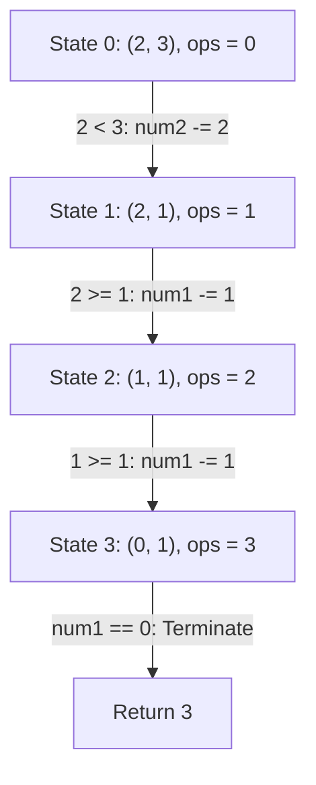

# Guided Example: Count Operations to Obtain Zero

We trace the step-by-step subtraction sequence and its Euclidean division acceleration on a representative integer pair, illustrating how the process computes the exact operation count to reach zero while relating directly to the Euclidean greatest common divisor algorithm.

- **Input:** `num1 = 2`, `num2 = 3`
- **Output:** `3`

This instance captures asymmetric magnitude reduction, alternating role reversals between minuend and subtrahend, boundary equality handling, and termination when one coordinate vanishes.

---

## 1. Problem Overview & Representative Instance

Given two non-negative integers `num1` and `num2`, we execute the following deterministic rule iteratively:
1. If `num1 >= num2`, subtract `num2` from `num1` (replacing `num1` with `num1 - num2`).
2. Otherwise (`num1 < num2`), subtract `num1` from `num2` (replacing `num2` with `num2 - num1`).

The process terminates as soon as either `num1 == 0` or `num2 == 0`. The goal is to return the total number of subtraction operations performed.

In our representative instance:
- Start with pair $(2, 3)$.
- Because $2 < 3$, subtract $2$ from $3$, yielding $(2, 1)$ after $1$ operation.
- Because $2 \ge 1$, subtract $1$ from $2$, yielding $(1, 1)$ after $2$ operations.
- Because $1 \ge 1$, subtract $1$ from $1$, yielding $(0, 1)$ after $3$ operations.
- Since `num1` is now $0$, the loop halts and reports $3$.

---

## 2. Mathematical & Algorithmic Principles

### Equivalence to Euclidean Subtraction and Division

The subtraction rule precisely reproduces the original subtraction-based Euclidean algorithm for computing the greatest common divisor $\gcd(a, b)$:
$$\gcd(a, b) = \begin{cases} a & \text{if } b = 0 \\ \gcd(a - b, b) & \text{if } a \ge b > 0 \\ \gcd(a, b - a) & \text{if } b > a > 0 \end{cases}$$

When one operand $a$ is substantially larger than $b$, repeated subtraction subtracts $b$ from $a$ exactly $q = \lfloor a / b \rfloor$ consecutive times until the remaining value is the remainder $r = a \bmod b$.
- In the naive simulation, each subtraction consumes one discrete step, leading to $q$ operations.
- In the accelerated Euclidean perspective, $q = \lfloor a / b \rfloor$ operations are batched in a single arithmetic division step:
  $$\text{operations} \leftarrow \text{operations} + \lfloor a / b \rfloor, \quad a \leftarrow a \bmod b$$

Both formulations yield the exact same cumulative operation count. The subtraction simulation executes in $O(\max(a, b))$ steps in the worst case (for example, when $a = 10^5$ and $b = 1$), whereas division acceleration terminates in $O(\log(\min(a, b)))$ steps by Lamé's theorem.

### State Transitions and Invariants

| State Component | Definition | Invariant Maintained |
|---|---|---|
| First Operand $a$ | Non-negative integer `num1` | Strictly decreases when $a \ge b$; non-negative throughout |
| Second Operand $b$ | Non-negative integer `num2` | Strictly decreases when $b > a$; non-negative throughout |
| Operation Counter $k$ | Cumulative subtractions performed | Equals the total count of unit reductions across all steps |
| Parity & Termination | Condition $a > 0 \land b > 0$ | Halts if and only if $\min(a, b) = 0$ |

---

## 3. Step-by-Step Walkthrough with Intermediate State

We trace the execution on `num1 = 2, num2 = 3`.

### Step 1: Initial Evaluation & First Subtraction
- **Current State:** `num1 = 2`, `num2 = 3`, `ops = 0`.
- **Condition Check:** Both `num1 > 0` and `num2 > 0` hold ($2 \ne 0 \land 3 \ne 0$).
- **Comparison:** $2 \ge 3$ is false ($2 < 3$).
- **Action:** Execute the alternative branch: `num2 -= num1` $\implies 3 - 2 = 1$.
- **Counter Increment:** `ops` increments from $0$ to $1$.
- **New State:** `num1 = 2`, `num2 = 1`, `ops = 1`.

### Step 2: Second Subtraction (Role Reversal)
- **Current State:** `num1 = 2`, `num2 = 1`, `ops = 1`.
- **Condition Check:** Both $2 > 0$ and $1 > 0$ hold.
- **Comparison:** $2 \ge 1$ is true.
- **Action:** Execute the primary branch: `num1 -= num2` $\implies 2 - 1 = 1$.
- **Counter Increment:** `ops` increments from $1$ to $2$.
- **New State:** `num1 = 1`, `num2 = 1`, `ops = 2`.

### Step 3: Boundary Equality & Final Subtraction
- **Current State:** `num1 = 1`, `num2 = 1`, `ops = 2`.
- **Condition Check:** Both $1 > 0$ and $1 > 0$ hold.
- **Comparison:** $1 \ge 1$ is true (the equality clause $1 \ge 1$ directs execution to `num1 -= num2`).
- **Action:** `num1 -= num2` $\implies 1 - 1 = 0$.
- **Counter Increment:** `ops` increments from $2$ to $3$.
- **New State:** `num1 = 0`, `num2 = 1`, `ops = 3`.

### Step 4: Loop Termination & Result Extraction
- **Current State:** `num1 = 0`, `num2 = 1`, `ops = 3`.
- **Condition Check:** `num1 > 0 and num2 > 0` is evaluated. Since `num1 == 0`, the loop condition evaluates to false.
- **Termination:** The loop terminates immediately without further subtractions.
- **Result:** Return `ops = 3`.

---

## 4. Comprehensive State Trace

The complete transition history for the representative instance `num1 = 2, num2 = 3` is summarized below:

| Step | Operand `num1` | Operand `num2` | Active Condition | Action Taken | Cumulative Operations |
|---|---|---|---|---|---|
| Start | 2 | 3 | $2 > 0 \land 3 > 0$ | Initial state setup | 0 |
| 1 | 2 | 3 | $2 < 3$ | `num2 = 3 - 2 = 1` | 1 |
| 2 | 2 | 1 | $2 \ge 1$ | `num1 = 2 - 1 = 1` | 2 |
| 3 | 1 | 1 | $1 \ge 1$ | `num1 = 1 - 1 = 0` | 3 |
| Halt | 0 | 1 | $0 > 0$ is False | Loop terminates | 3 |

### Parallel Batched Division Comparison

If solved via Euclidean division acceleration rather than unit subtraction:
- **Round 1:** $b > a$ ($3 > 2$). Quotient $q = \lfloor 3 / 2 \rfloor = 1$, remainder $r = 3 \bmod 2 = 1$. Add $q = 1$ to operations ($ops = 1$), set $b = 1$. State becomes $(2, 1)$.
- **Round 2:** $a \ge b$ ($2 \ge 1$). Quotient $q = \lfloor 2 / 1 \rfloor = 2$, remainder $r = 2 \bmod 1 = 0$. Add $q = 2$ to operations ($ops = 1 + 2 = 3$), set $a = 0$. State becomes $(0, 1)$.
- **Termination:** $a = 0$. Return $ops = 3$.
Both methods produce the identical operation count of $3$.

---

## 5. Algorithmic Correctness & Soundness

### Strict Monotonicity and Guaranteed Termination
At every step where both operands are strictly positive:
- The strictly smaller positive operand is subtracted from the greater or equal operand.
- The sum $S = \text{num1} + \text{num2}$ strictly decreases by at least $\min(\text{num1}, \text{num2}) \ge 1$ per step:
  $$S_{t+1} = S_t - \min(\text{num1}_t, \text{num2}_t) \le S_t - 1$$
- Since $S$ is a non-negative integer that strictly decreases at each step, the process cannot enter an infinite loop. It must terminate at a state where at least one operand equals zero.

### Soundness of the Equality Branch
When $\text{num1} = \text{num2} = v > 0$:
- The condition $\text{num1} \ge \text{num2}$ is satisfied.
- The assignment $\text{num1} \leftarrow v - v = 0$ zeroes `num1` in exactly one subtraction.
- In the next check, `num1 == 0` terminates the loop. Thus equal non-zero operands always require exactly one additional operation, which is mathematically sound.

---

## 6. Edge Cases & Anti-Patterns

### Edge Cases

1. **Either Input Already Zero at Start:**
   - E.g., `num1 = 0, num2 = 5` or `num1 = 10, num2 = 0`.
   - The loop condition `while num1 and num2` fails on the very first evaluation before any subtractions occur. The algorithm returns `0`, which is correct because zero operations are needed.
2. **Both Inputs Zero:**
   - `num1 = 0, num2 = 0`. Loop condition fails immediately, returning `0`.
3. **Equal Positive Inputs:**
   - `num1 = 7, num2 = 7`. After $1$ operation, `num1` becomes $0$, yielding `ops = 1`.
4. **Extreme Asymmetry ($10^5$ and $1$):**
   - E.g., `num1 = 100000, num2 = 1`.
   - Step-by-step subtraction performs $100{,}000$ iterations. Division acceleration computes $100000 // 1 = 100000$ in a single arithmetic step.

### Anti-Patterns to Avoid

- **Unconditional Decrements Without Value Check:** Never decrement the counter or mutate operands without confirming both are strictly positive.
- **Linear Recursion Overflow:** Implementing the subtraction loop recursively (`countOperations(num1 - num2, num2) + 1`) can trigger recursion depth limits in environments where $a = 10^5$ and $b = 1$. Iteration or division avoids call stack overhead.
- **Negative Integer Hazards:** Never perform subtraction from the smaller number; swapping or branching ensures the minuend is always greater than or equal to the subtrahend, preventing negative integer states.

---

## 7. Complexity Analysis

- **Time Complexity:**
  - **Simulation Method:** $O(\max(\text{num1}, \text{num2}))$ in the worst case where one operand is $1$ and the other is $N$. For $N \le 10^5$, this requires at most $10^5$ iterations, executing in under $10$ milliseconds.
  - **Division Accelerated Method:** $O(\log(\min(\text{num1}, \text{num2})))$ operations, identical to the Euclidean algorithm time complexity.
- **Auxiliary Space Complexity:** $O(1)$ auxiliary space. Only scalar integer variables (`num1`, `num2`, `ops`) are updated in-place without auxiliary data structures or recursion frames.
