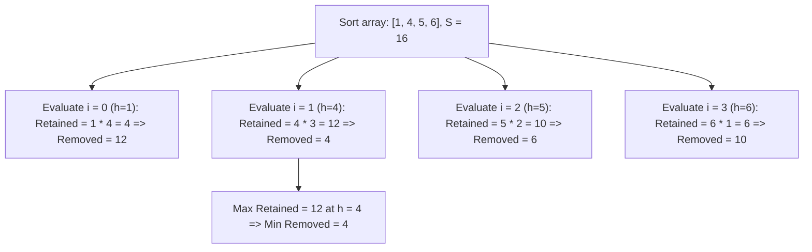

# Guided Example: Removing Minimum Number of Magic Beans

We trace the sorting-based prefix-suffix optimization algorithm for equalizing non-empty bag capacities on a representative bean multiset, demonstrating how duality between beans removed and beans retained reduces an exhaustive search to a linear scan over sorted pivots in $O(n \log n)$ time.

- **Input:** `beans = [4, 1, 6, 5]`
- **Output:** `4`

This instance illustrates sorting normalization, the geometric rectangle interpretation of retained beans, prefix emptying, suffix leveling, and minimum removal identification.

---

## 1. Problem Overview & Representative Instance

We are given an array of positive integers `beans`, where `beans[i]` represents the number of magic beans in the $i$-th bag.
In each operation, we may remove any number of beans from any bag.
Our objective is to make the number of beans in every **non-empty** bag equal, while **minimizing the total number of beans removed**.
Bags reduced to $0$ beans are considered empty and do not violate equality.

In our representative instance:
- `beans = [4, 1, 6, 5]` of length $n = 4$.
- Total beans across all bags: $S = 4 + 1 + 6 + 5 = 16$.
- If we target $4$ beans per non-empty bag:
  - Bag with $1$ bean cannot reach $4$ by removals, so it must be emptied entirely ($1 \to 0$, $1$ bean removed).
  - Bag with $4$ beans is kept as is ($4 \to 4$, $0$ beans removed).
  - Bag with $5$ beans is reduced to $4$ ($5 \to 4$, $1$ bean removed).
  - Bag with $6$ beans is reduced to $4$ ($6 \to 4$, $2$ beans removed).
  - Total removed: $1 + 0 + 1 + 2 = 4$ beans.
- Remaining configuration: $[0, 4, 4, 4]$ (all non-empty bags contain exactly $4$ beans).

---

## 2. Mathematical & Algorithmic Principles

### Complementary Duality: Retained vs. Removed Beans

Let $S = \sum_{j=0}^{n-1} \text{beans}[j]$ be the invariant total initial bean sum.
For any target height $h > 0$ chosen for the non-empty bags:
$$\text{removed}(h) = S - \text{retained}(h)$$

Minimizing the total removed beans is strictly equivalent to **maximizing the total retained beans**:
$$\min_h \text{removed}(h) \iff \max_h \text{retained}(h)$$

### The Pivot Candidate Theorem

If a bag originally has strictly fewer than $h$ beans, it cannot reach $h$ via removal and must be emptied to $0$.
If a bag originally has at least $h$ beans, it can be leveled down to retain exactly $h$ beans.
Therefore, if $k$ bags satisfy $\text{beans}[j] \ge h$, the total beans retained is exactly:
$$\text{retained}(h) = k \cdot h$$

Suppose $h$ does not equal any element in `beans`.
If we increase $h$ to the next smallest element actually present in `beans`, the number of qualifying bags $k$ does not change, but $h$ increases, strictly increasing $k \cdot h$.
Thus, the optimal target $h^*$ must coincide with an element present in the original input:
$$h^* \in \{\text{beans}[0], \text{beans}[1], \dots, \text{beans}[n-1]\}$$

### Sorted Suffix Formulation

Sorting the array in ascending order:
$$\text{beans}[0] \le \text{beans}[1] \le \dots \le \text{beans}[n-1]$$

When we choose the $i$-th sorted bag as the pivot height $h = \text{beans}[i]$:
- Every prefix bag $j < i$ has $\text{beans}[j] < \text{beans}[i]$ and is emptied to $0$.
- Every suffix bag $j \ge i$ has $\text{beans}[j] \ge \text{beans}[i]$ and retains exactly $\text{beans}[i]$ beans.
- There are exactly $n - i$ suffix bags.
- Total retained beans:
  $$\text{retained}(i) = \text{beans}[i] \times (n - i)$$
- Total removed beans:
  $$\text{removed}(i) = S - \text{beans}[i] \times (n - i)$$

A single pass over $i \in \{0, 1, \dots, n-1\}$ evaluates all candidate pivots in $O(n)$ time after sorting.

| Variable / Metric | Mathematical Expression | Algorithmic Meaning |
|---|---|---|
| Total Initial Sum $S$ | $\sum_{j=0}^{n-1} \text{beans}[j]$ | Invariant total bean inventory |
| Pivot Height $h_i$ | $\text{beans}[i]$ | Selected uniform capacity for non-empty bags |
| Suffix Bag Count $n - i$ | $n - i$ | Number of bags with initial capacity $\ge h_i$ |
| Retained Beans | $\text{beans}[i] \times (n - i)$ | Total beans surviving after leveling |
| Removed Beans | $S - \text{beans}[i] \times (n - i)$ | Objective function to minimize |

---

## 3. Step-by-Step Walkthrough with Intermediate State

We trace `beans = [4, 1, 6, 5]`.

### Step 1: Sorting and Sum Calculation
- Sort `beans` ascending: `beans = [1, 4, 5, 6]`.
- Array length $n = 4$.
- Compute total sum $S = 1 + 4 + 5 + 6 = 16$.
- Initialize `min_removed = infinity` (or `max_retained = 0`).

### Step 2: Evaluate Pivot $i = 0$ (`beans[0] = 1`)
- Target height $h = 1$.
- Suffix count: $n - 0 = 4$ bags ($[1, 4, 5, 6]$).
- Prefix bags emptied: none.
- Retained beans: $1 \times 4 = 4$.
- Removed beans: $S - \text{retained} = 16 - 4 = 12$.
- Resulting bags: $[1, 1, 1, 1]$.
- Update: `min_removed = min(infinity, 12) = 12`.

### Step 3: Evaluate Pivot $i = 1$ (`beans[1] = 4`)
- Target height $h = 4$.
- Suffix count: $n - 1 = 3$ bags ($[4, 5, 6]$).
- Prefix bags emptied: index $0$ (`beans[0] = 1`, removed: $1$).
- Retained beans: $4 \times 3 = 12$.
- Removed beans: $S - \text{retained} = 16 - 12 = 4$.
- Breakdown: Bag $0$ loses $1$, Bag $1$ loses $0$, Bag $2$ loses $1$, Bag $3$ loses $2$. Total removed: $1 + 0 + 1 + 2 = 4$.
- Resulting bags: $[0, 4, 4, 4]$.
- Update: `min_removed = min(12, 4) = 4`.

### Step 4: Evaluate Pivot $i = 2$ (`beans[2] = 5`)
- Target height $h = 5$.
- Suffix count: $n - 2 = 2$ bags ($[5, 6]$).
- Prefix bags emptied: index $0$ ($1$) and index $1$ ($4$).
- Retained beans: $5 \times 2 = 10$.
- Removed beans: $S - \text{retained} = 16 - 10 = 6$.
- Resulting bags: $[0, 0, 5, 5]$.
- Update: `min_removed = min(4, 6) = 4`.

### Step 5: Evaluate Pivot $i = 3$ (`beans[3] = 6`)
- Target height $h = 6$.
- Suffix count: $n - 3 = 1$ bag ($[6]$).
- Prefix bags emptied: indices $0, 1, 2$ (total $1 + 4 + 5 = 10$).
- Retained beans: $6 \times 1 = 6$.
- Removed beans: $S - \text{retained} = 16 - 6 = 10$.
- Resulting bags: $[0, 0, 0, 6]$.
- Update: `min_removed = min(4, 10) = 4`.

### Step 6: Finalization
- All $n = 4$ pivots evaluated.
- Minimum removal across all choices is $4$.

---

## 4. Comprehensive State Trace

The evaluation across all candidate pivots is documented below:

| Pivot Index $i$ | Pivot Height $h = \text{beans}[i]$ | Qualifying Suffix Bags $n - i$ | Retained Beans $h \times (n - i)$ | Total Removed $S - \text{Retained}$ | Best So Far |
|---|---|---|---|---|---|
| 0 | 1 | 4 | 4 | 12 | 12 |
| 1 | 4 | 3 | 12 | **4** | **4** |
| 2 | 5 | 2 | 10 | 6 | 4 |
| 3 | 6 | 1 | 6 | 10 | 4 |

### Bag State Transformation for the Optimal Pivot ($i = 1, h = 4$)

| Bag Index $j$ | Initial Beans | Action Taken | Final Beans | Beans Discarded |
|---|---|---|---|---|
| 0 | 1 | Empty bag entirely ($1 < 4$) | 0 | 1 |
| 1 | 4 | Retain unchanged ($4 = 4$) | 4 | 0 |
| 2 | 5 | Level down by removing $1$ | 4 | 1 |
| 3 | 6 | Level down by removing $2$ | 4 | 2 |
| **Sum** | **16** | **All non-empty bags equal $4$** | **12** | **4** |

---

## 5. Algorithmic Correctness & Soundness

### Exhaustive Optimality of Pivot Set
Let $h^*$ be the height of the non-empty bags in an optimal configuration.
1. If $h^*$ is strictly greater than the maximum element in `beans`, no bag can reach $h^*$, retaining $0$ beans, which is strictly suboptimal compared to retaining at least one bag.
2. If $h^*$ lies in an open interval $(\text{beans}[k], \text{beans}[k+1])$, then the set of bags with capacity $\ge h^*$ is identical to the set of bags with capacity $\ge \text{beans}[k+1]$. Let $m = n - (k + 1)$ be the count of such bags. The retained beans for height $h^*$ is $m \cdot h^* < m \cdot \text{beans}[k+1]$. Thus, snapping $h^*$ upward to $\text{beans}[k+1]$ strictly increases retained beans without losing any bag.
3. Therefore, the global maximum of $\text{retained}(h)$ must occur at some $h \in \{\text{beans}[0], \dots, \text{beans}[n-1]\}$.
Since our algorithm tests every element in the sorted array, it evaluates the complete set of candidate optimal heights, guaranteeing global optimality.

---

## 6. Edge Cases & Anti-Patterns

### Edge Cases
1. **Single Bag ($n = 1$):**
   - E.g., `beans = [7]`.
   - Pivot $i = 0, h = 7$. Retained: $7 \times 1 = 7$. Removed: $7 - 7 = 0$.
   - Already uniform; zero removals required.
2. **All Bags Identical Capacity:**
   - E.g., `beans = [3, 3, 3, 3]`.
   - Pivot $i = 0, h = 3$. Retained: $3 \times 4 = 12$. Removed: $12 - 12 = 0$.
   - No removals needed.
3. **Large Magnitude Values ($10^5$ elements of size $10^5$):**
   - Total sum $S$ can reach $10^{10}$, exceeding standard 32-bit signed integer limits ($2^{31} - 1 \approx 2.14 \times 10^9$).
   - Calculations must use 64-bit integer arithmetic to prevent arithmetic overflow.

### Anti-Patterns to Avoid
- **Simulating Removals Iteratively:** Trying to decrement bean counts one by one or exploring a search tree results in exponential or polynomial time blowup.
- **Testing Non-Element Heights:** Searching through all integer heights from $1$ to $\max(\text{beans})$ takes $O(\max(\text{beans}))$ time, which fails when bean counts are up to $10^5$.
- **Prefix Sum Accumulation Overhead:** Recomputing $\sum_{j<i} \text{beans}[j] + \sum_{j \ge i} (\text{beans}[j] - h)$ directly for each $i$ without using the algebraic simplification $S - h \times (n - i)$ creates unnecessary code complexity.

---

## 7. Complexity Analysis

- **Time Complexity:** $O(n \log n)$. Sorting the array of length $n$ takes $O(n \log n)$ time. Computing the total sum $S$ takes $O(n)$ time. The subsequent single-pass linear sweep over all $n$ pivots takes $O(n)$ time, with each pivot evaluated via $O(1)$ arithmetic operations. The overall time complexity is dominated by sorting, $O(n \log n)$.
- **Auxiliary Space Complexity:** $O(1)$ or $O(n)$ depending on the sorting implementation. In-place sorting algorithms require $O(1)$ or $O(\log n)$ call-stack space. No auxiliary arrays or lookup hash maps are required.
