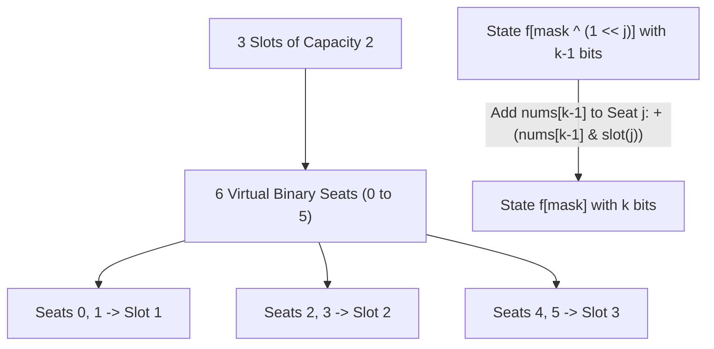

# Guided Example: Maximum AND Sum of Array

We analyze and execute the bitmask dynamic programming algorithm for optimal item-to-slot assignment on a representative instance, demonstrating how unfolding multi-capacity slots into binary virtual seats reduces a constrained matching problem to a single-dimensional DP over bitmasks in $O(m \cdot 2^m)$ time.

- **Input:** `nums = [1, 2, 3, 4, 5, 6]`, `numSlots = 3`
- **Output:** `9`

This instance demonstrates slot capacity unfolding, population-count prefix indexing, bitwise AND contribution scoring, and optimal substructure propagation across state subsets.

---

## 1. Problem Overview & Representative Instance

We are given an integer array `nums` of length $n$ and an integer `numSlots` denoting the number of available slots, labeled $1$ through $\text{numSlots}$.
- Each slot $s \in \{1, 2, \dots, \text{numSlots}\}$ can accommodate at most $2$ numbers.
- If a number $x$ is placed in slot $s$, it contributes $(x \ \& \ s)$ to the total sum.
- We seek the maximum possible total bitwise AND sum obtainable by assigning every number in `nums` to a slot.

In our representative instance:
- `nums = [1, 2, 3, 4, 5, 6]` with $n = 6$ numbers.
- `numSlots = 3` slots, each capable of holding $2$ numbers (total capacity $2 \times 3 = 6$).
- The maximum achievable AND sum is $9$, achieved by the assignment:
  - Slot 1 holds $\{1, 5\}$: contribution is $(1 \ \& \ 1) + (5 \ \& \ 1) = 1 + 1 = 2$.
  - Slot 2 holds $\{2, 6\}$: contribution is $(2 \ \& \ 2) + (6 \ \& \ 2) = 2 + 2 = 4$.
  - Slot 3 holds $\{3, 4\}$: contribution is $(3 \ \& \ 3) + (4 \ \& \ 3) = 3 + 0 = 3$.
  - Total sum: $2 + 4 + 3 = 9$.

---

## 2. Mathematical & Algorithmic Principles

### Unfolding Slots into Virtual Binary Seats

Each slot $s \in \{1, \dots, \text{numSlots}\}$ has a capacity of $2$. Rather than using ternary radix encoding ($0, 1, \text{ or } 2$ items per slot), we unfold each slot into two distinct single-occupancy **virtual seats**:
- Slot $s$ corresponds to virtual seat indices $2(s - 1)$ and $2(s - 1) + 1$.
- Total virtual seats $m = 2 \times \text{numSlots}$.
- For any seat index $j \in \{0, 1, \dots, m - 1\}$, the corresponding slot label is:
  $$\text{slot}(j) = \lfloor j / 2 \rfloor + 1$$

A subset of occupied virtual seats is uniquely represented by an integer bitmask $i \in [0, 2^m - 1]$, where the $j$-th bit of $i$ is $1$ if and only if virtual seat $j$ is occupied.

### Population Count Prefix Bijection

A crucial structural property eliminates the need for a 2D state:
$$\text{bit\_count}(i) = k \iff \text{exactly } k \text{ numbers have been placed in the seats marked by } i$$

Because all numbers in `nums` must be placed, and the order in which we place them is symmetric under permutation:
- Any valid state mask $i$ with $\text{bit\_count}(i) = k$ must contain the prefix of numbers `nums[0], nums[1], ..., nums[k - 1]`.
- The very last number placed to transition into state $i$ was `nums[k - 1]`.
- If seat $j$ was the seat chosen for `nums[k - 1]`, the previous state mask was $i \setminus \{j\} = i \oplus (1 \ll j)$.

### Dynamic Programming Recurrence

Let $f[i]$ be the maximum AND sum achievable by assigning the prefix of `nums` of length $k = \text{bit\_count}(i)$ to the subset of virtual seats indicated by mask $i$:
$$f[i] = \max_{\substack{0 \le j < m \\ (i \gg j) \& 1 = 1}} \left( f[i \oplus (1 \ll j)] + (\text{nums}[k - 1] \ \& \ (\lfloor j / 2 \rfloor + 1)) \right)$$

The base state is $f[0] = 0$.
The global answer is $\max_{i} f[i]$.

| State Dimension | Representation | Mathematical Meaning |
|---|---|---|
| Mask $i$ | Integer in $[0, 2^m - 1]$ | Set of occupied virtual single-capacity seats |
| Seat Count $k$ | $\text{bit\_count}(i)$ | Length of placed prefix `nums[0 ... k-1]` |
| Virtual Seat $j$ | Bit position $0 \le j < m$ | Specific seat mapping to slot $\lfloor j / 2 \rfloor + 1$ |
| Incremental Gain | $\text{nums}[k - 1] \ \& \ (\lfloor j / 2 \rfloor + 1)$ | AND value added by assigning `nums[k-1]` to seat $j$ |
| Optimal Value $f[i]$ | Non-negative integer | Maximum total AND sum achievable for mask $i$ |

---

## 3. Step-by-Step Walkthrough with Intermediate State

We trace `nums = [1, 2, 3, 4, 5, 6]` and `numSlots = 3` ($m = 6$ virtual seats, masks from $0$ to $63$).

### Step 1: Base State & Virtual Seat Mapping
- $m = 2 \times 3 = 6$ bits.
- Virtual seat mapping:
  - Seat 0: Slot 1 (weight contribution $x \ \& \ 1$)
  - Seat 1: Slot 1 (weight contribution $x \ \& \ 1$)
  - Seat 2: Slot 2 (weight contribution $x \ \& \ 2$)
  - Seat 3: Slot 2 (weight contribution $x \ \& \ 2$)
  - Seat 4: Slot 3 (weight contribution $x \ \& \ 3$)
  - Seat 5: Slot 3 (weight contribution $x \ \& \ 3$)
- Initialize $f[0] = 0$, all other $f[i] = 0$.

### Step 2: Placing First Number `nums[0] = 1` ($k = 1$, 1 set bit)
- Masks with $1$ set bit:
  - Mask `000001` (Seat 0, Slot 1): $f[1] = f[0] + (1 \ \& \ 1) = 1$.
  - Mask `000010` (Seat 1, Slot 1): $f[2] = f[0] + (1 \ \& \ 1) = 1$.
  - Mask `000100` (Seat 2, Slot 2): $f[4] = f[0] + (1 \ \& \ 2) = 0$.
  - Mask `001000` (Seat 3, Slot 2): $f[8] = f[0] + (1 \ \& \ 2) = 0$.
  - Mask `010000` (Seat 4, Slot 3): $f[16] = f[0] + (1 \ \& \ 3) = 1$.
  - Mask `100000` (Seat 5, Slot 3): $f[32] = f[0] + (1 \ \& \ 3) = 1$.

### Step 3: Placing Second Number `nums[1] = 2` ($k = 2$, 2 set bits)
- For mask `000101` (Seats 0 and 2: Slot 1 and Slot 2):
  - Transition from Seat 2: $f[1] + (2 \ \& \ 2) = 1 + 2 = 3$.
  - Transition from Seat 0: $f[4] + (2 \ \& \ 1) = 0 + 0 = 0$.
  - Maximum: $f[5] = \max(3, 0) = 3$.
- For mask `010001` (Seats 0 and 4: Slot 1 and Slot 3):
  - Transition from Seat 4: $f[1] + (2 \ \& \ 3) = 1 + 2 = 3$.
  - Transition from Seat 0: $f[16] + (2 \ \& \ 1) = 1 + 0 = 1$.
  - Maximum: $f[17] = 3$.

### Step 4: Propagating Through `nums[2] = 3` and `nums[3] = 4` ($k = 3, 4$)
- When placing `nums[2] = 3` into Seat 4 (Slot 3) on top of mask `000101` (Seats 0, 2):
  - Mask becomes `010101` (Seats 0, 2, 4):
  - Gain: $f[5] + (3 \ \& \ 3) = 3 + 3 = 6$.
- When placing `nums[3] = 4`:
  - Notice $4 \ \& \ 1 = 0$, $4 \ \& \ 2 = 0$, $4 \ \& \ 3 = 0$.
  - Every placement of $4$ yields an incremental score of $0$.
  - Placing $4$ into Seat 5 (Slot 3) yields mask `110101` with score $f[53] = 6 + 0 = 6$.

### Step 5: Placing `nums[4] = 5` and `nums[5] = 6` ($k = 5, 6$)
- Placing `nums[4] = 5` into Seat 1 (Slot 1) on top of mask `110101`:
  - Seat 1 maps to Slot 1.
  - Increment: $5 \ \& \ 1 = 1$.
  - Mask becomes `110111` (Seats 0, 1, 2, 4, 5) with score $f[55] = 6 + 1 = 7$.
- Placing `nums[5] = 6` into the only remaining Seat 3 (Slot 2):
  - Seat 3 maps to Slot 2.
  - Increment: $6 \ \& \ 2 = 2$.
  - Mask becomes `111111` ($63$, all 6 seats filled):
  - Final score: $f[63] = f[55] + (6 \ \& \ 2) = 7 + 2 = 9$.

---

## 4. Comprehensive State Trace

The sequence of optimal decisions for filling the representative subset leading to the global optimum is detailed below:

| Prefix Step $k$ | Placed Element $x$ | Chosen Virtual Seat $j$ | Associated Slot $\lfloor j / 2 \rfloor + 1$ | Bitwise AND Value $x \ \& \ \text{slot}$ | Resulting Bitmask $i$ (Binary) | Cumulative Max $f[i]$ |
|---|---|---|---|---|---|---|
| 0 | None | None | None | 0 | `000000` ($0$) | 0 |
| 1 | `nums[0] = 1` | 0 | Slot 1 | $1 \ \& \ 1 = 1$ | `000001` ($1$) | 1 |
| 2 | `nums[1] = 2` | 2 | Slot 2 | $2 \ \& \ 2 = 2$ | `000101` ($5$) | 3 |
| 3 | `nums[2] = 3` | 4 | Slot 3 | $3 \ \& \ 3 = 3$ | `010101` ($21$) | 6 |
| 4 | `nums[3] = 4` | 5 | Slot 3 | $4 \ \& \ 3 = 0$ | `110101` ($53$) | 6 |
| 5 | `nums[4] = 5` | 1 | Slot 1 | $5 \ \& \ 1 = 1$ | `110111` ($55$) | 7 |
| 6 | `nums[5] = 6` | 3 | Slot 2 | $6 \ \& \ 2 = 2$ | `111111` ($63$) | **9** |

### Final Slot Distribution Breakdown

| Slot Number | Virtual Seats Assigned | Elements Placed | Individual AND Calculations | Slot Total |
|---|---|---|---|---|
| Slot 1 | Seat 0, Seat 1 | $\{1, 5\}$ | $(1 \ \& \ 1) = 1, \; (5 \ \& \ 1) = 1$ | $1 + 1 = 2$ |
| Slot 2 | Seat 2, Seat 3 | $\{2, 6\}$ | $(2 \ \& \ 2) = 2, \; (6 \ \& \ 2) = 2$ | $2 + 2 = 4$ |
| Slot 3 | Seat 4, Seat 5 | $\{3, 4\}$ | $(3 \ \& \ 3) = 3, \; (4 \ \& \ 3) = 0$ | $3 + 0 = 3$ |
| **All Slots** | **Seats 0 through 5** | **$\{1, 2, 3, 4, 5, 6\}$** | **Sum of all 6 terms** | **9** |

---

## 5. Algorithmic Correctness & Soundness

### Soundness of State Transitions
Every mask $i$ with $\text{bit\_count}(i) = k$ represents a valid assignment of the multiset $\{nums[0], \dots, nums[k-1]\}$ to the seats marked by the set bits of $i$.
Because each virtual seat can only be set once (as bits are binary $0$ or $1$), no seat is double-booked.
Furthermore, because each slot contains exactly two distinct virtual seats ($2(s-1)$ and $2(s-1)+1$), no physical slot ever accommodates more than $2$ elements.

### Optimal Substructure and Completeness
Suppose an optimal assignment maps prefix $\{nums[0], \dots, nums[k-1]\}$ to seat set $i$.
Then the restriction of this assignment to prefix $\{nums[0], \dots, nums[k-2]\}$ must occupy some seat set $i \setminus \{j\}$ where $j \in i$.
By the principle of optimality, if this sub-assignment were not maximal for mask $i \setminus \{j\}$, replacing it with the optimal configuration for $i \setminus \{j\}$ would strictly increase the sum for mask $i$, a contradiction.
Because the dynamic programming iterates through all masks in increasing numerical order (or grouped by bit-count), every subproblem $i \setminus \{j\}$ is solved before evaluating $i$, guaranteeing that the true maximum is computed.

---

## 6. Edge Cases & Anti-Patterns

### Edge Cases
1. **Fewer Numbers than Slot Capacity ($n < 2 \cdot \text{numSlots}$):**
   - For example, $n = 3, \text{numSlots} = 3$ (capacity 6).
   - Only masks with $\text{bit\_count}(i) \le 3$ are processed.
   - The final answer is $\max_{i: \text{bit\_count}(i) = n} f[i]$.
2. **Numbers Yielding Zero AND ($x \ \& \ s = 0$):**
   - Like $4 \ \& \ 1 = 0, 4 \ \& \ 2 = 0, 4 \ \& \ 3 = 0$.
   - These numbers contribute $0$ but must still consume a slot seat without degrading the scores of other numbers.
3. **Maximum Constraints ($n = 18, \text{numSlots} = 9$):**
   - $m = 18$ virtual seats, $2^{18} = 262{,}144$ states.
   - Array $f$ requires $262{,}144$ integers ($\approx 1 \text{ MB}$ memory), well within operational limits.

### Anti-Patterns to Avoid
- **Ternary Base-3 Encoding Overhead:** Using base-3 representations requires repeated modulo and division operations per state query. Unfolding into $2 \times \text{numSlots}$ binary bits replaces all radix arithmetic with fast bitwise instructions (`i >> j & 1`, `i ^ (1 << j)`).
- **Greedy Assignment Trap:** Assigning each number to the slot that maximizes its immediate AND score fails globally because an element greedily taking a slot may block a later element that could have earned a much higher score in that same slot.
- **Processing Masks with Too Many Bits:** Iterating over masks where $\text{bit\_count}(i) > n$ wastes computation since at most $n$ items exist to fill seats. Skipping these masks (`cnt > n: continue`) preserves efficiency.

---

## 7. Complexity Analysis

- **Time Complexity:** $O(m \cdot 2^m)$ where $m = 2 \times \text{numSlots} \le 18$. The DP iterates over all $2^m$ masks. For each mask with $\text{bit\_count}(i) \le n$, it checks at most $m$ bits. For $\text{numSlots} = 9$, $m = 18$, and $18 \times 2^{18} \approx 4.7 \times 10^6$ operations, executing in under $0.1$ seconds.
- **Auxiliary Space Complexity:** $O(2^m)$. The table `f` requires an array of size $2^m$. With $m \le 18$, $2^{18} = 262{,}144$ entries, requiring roughly $1$ megabyte of RAM.
