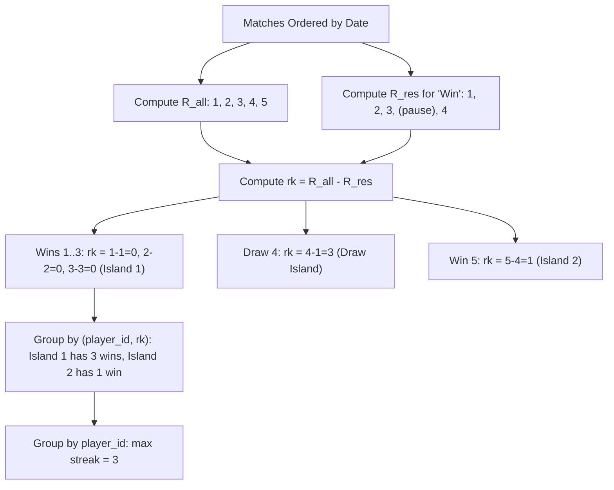

# Guided Example: Longest Winning Streak

We analyze and execute the relational dual-window ranking algorithm for consecutive streak identification on a representative match history dataset, demonstrating how the algebraic difference between an overall chronological sequence number and a result-partitioned sequence number isolates contiguous runs of identical outcomes in $O(n \log n)$ time.

- **Input:** Table `Matches` containing match histories for players 1, 2, and 3
- **Output:** Table with columns `player_id` and `longest_streak` producing `(1, 3)`, `(2, 0)`, and `(3, 1)`

This instance demonstrates gaps-and-islands partitioning, date-independent chronological ordering, zero-win player retention, and streak aggregation.

---

## 1. Problem Overview & Representative Instance

We are given a relational table `Matches` with schema `(player_id, match_day, result)`:
- `player_id`: The integer identifier of the player.
- `match_day`: The date on which the match was played. The composite key `(player_id, match_day)` is unique.
- `result`: The match outcome, restricted to `'Win'`, `'Draw'`, or `'Lose'`.

A **winning streak** is defined as a sequence of consecutive matches by the same player in chronological order whose results are all `'Win'`. Any match resulting in `'Draw'` or `'Lose'` terminates the current streak.
Importantly:
- Time gaps between match days do not break a streak; only intervening non-win match results do.
- Every player present in the `Matches` table must appear in the final report.
- Players who have never achieved a win must be reported with a `longest_streak` of `0`.

In our representative dataset:
- **Player 1:**
  - 2022-01-17: `Win`
  - 2022-01-18: `Win`
  - 2022-01-25: `Win` (streak = 3)
  - 2022-01-31: `Draw` (streak broken)
  - 2022-02-08: `Win` (streak = 1)
  - Maximum streak: $3$.
- **Player 2:**
  - 2022-02-06: `Lose`
  - 2022-02-08: `Lose`
  - Maximum streak: $0$.
- **Player 3:**
  - 2022-03-30: `Win`
  - Maximum streak: $1$.

---

## 2. Mathematical & Algorithmic Principles

### The Gaps-and-Islands Dual-Rank Invariant

Let a player's matches be ordered chronologically by `match_day`.
We define two window ranking functions:
1. **Overall Player Sequence Number ($R_{\text{all}}$):**
   $$R_{\text{all}} = \text{ROW\_NUMBER}() \text{ OVER } (\text{PARTITION BY } \text{player\_id} \text{ ORDER BY } \text{match\_day})$$
   This assigns consecutive integers $1, 2, 3, \dots$ to all matches played by the player, regardless of outcome.
2. **Outcome-Partitioned Sequence Number ($R_{\text{res}}$):**
   $$R_{\text{res}} = \text{ROW\_NUMBER}() \text{ OVER } (\text{PARTITION BY } \text{player\_id}, \text{result} \text{ ORDER BY } \text{match\_day})$$
   This assigns consecutive integers $1, 2, 3, \dots$ strictly within rows sharing the same outcome for that player.

### The Streak Grouping Theorem

Consider any contiguous run of $k$ matches with the same result (for example, consecutive `'Win'` matches) starting at overall position $p$:
- Within this contiguous block, for the $m$-th match of the run ($0 \le m < k$):
  $$R_{\text{all}}(m) = p + m, \quad R_{\text{res}}(m) = q + m$$
  where $q$ is the starting partitioned rank for that outcome.
- Taking their difference:
  $$\Delta = R_{\text{all}}(m) - R_{\text{res}}(m) = (p + m) - (q + m) = p - q = \text{constant}$$

Because both sequence numbers increment by exactly $1$ on each successive match of the streak, their difference $\Delta$ remains strictly **invariant** throughout the entire contiguous run.
When an intervening match of a different result occurs:
- $R_{\text{all}}$ advances by $1$.
- $R_{\text{res}}$ for `'Win'` does not advance.
- Consequently, when the next `'Win'` occurs later, the new difference $\Delta'$ will be strictly greater than $\Delta$:
  $$\Delta' > \Delta$$

Thus, the composite key `(player_id, rk)` where $\text{rk} = R_{\text{all}} - R_{\text{res}}$ uniquely partitions consecutive match runs into discrete islands.

| Ranking Metric | Definition / Window Specification | Role in Island Detection |
|---|---|---|
| Overall Rank $R_{\text{all}}$ | `ROW_NUMBER() OVER (PARTITION BY player_id ORDER BY match_day)` | Global chronological index of played matches |
| Result Rank $R_{\text{res}}$ | `ROW_NUMBER() OVER (PARTITION BY player_id, result ORDER BY match_day)` | Cumulative count of this specific outcome |
| Grouping Key $\text{rk}$ | $R_{\text{all}} - R_{\text{res}}$ | Constant across contiguous runs of identical outcome |
| Island Win Count | $\sum \mathbf{1}_{\{\text{result} = \text{'Win'}\}}$ grouped by `(player_id, rk)` | Total length of that particular winning streak |
| Longest Streak | $\max(\text{Island Win Count})$ grouped by `player_id` | Maximum consecutive wins achieved by the player |

---

## 3. Step-by-Step Walkthrough with Intermediate State

We trace the relational processing across all players.

### Step 1: Window Ranking Computation (CTE `S`)
For each row in `Matches`, calculate $R_{\text{all}}$, $R_{\text{res}}$, and $\text{rk} = R_{\text{all}} - R_{\text{res}}$:
- **Player 1:**
  - `2022-01-17`, `'Win'`: $R_{\text{all}} = 1, R_{\text{res}} = 1 \implies \text{rk} = 1 - 1 = 0$.
  - `2022-01-18`, `'Win'`: $R_{\text{all}} = 2, R_{\text{res}} = 2 \implies \text{rk} = 2 - 2 = 0$.
  - `2022-01-25`, `'Win'`: $R_{\text{all}} = 3, R_{\text{res}} = 3 \implies \text{rk} = 3 - 3 = 0$.
  - `2022-01-31`, `'Draw'`: $R_{\text{all}} = 4, R_{\text{res}} = 1 \implies \text{rk} = 4 - 1 = 3$.
  - `2022-02-08`, `'Win'`: $R_{\text{all}} = 5, R_{\text{res}} = 4 \implies \text{rk} = 5 - 4 = 1$.
- **Player 2:**
  - `2022-02-06`, `'Lose'`: $R_{\text{all}} = 1, R_{\text{res}} = 1 \implies \text{rk} = 1 - 1 = 0$.
  - `2022-02-08`, `'Lose'`: $R_{\text{all}} = 2, R_{\text{res}} = 2 \implies \text{rk} = 2 - 2 = 0$.
- **Player 3:**
  - `2022-03-30`, `'Win'`: $R_{\text{all}} = 1, R_{\text{res}} = 1 \implies \text{rk} = 1 - 1 = 0$.

### Step 2: Island Aggregation (CTE `T`)
Group by `(player_id, rk)` and sum wins: $s = \sum \mathbf{1}_{\{\text{result} = \text{'Win'}\}}$:
- **Player 1, $\text{rk} = 0$:** Rows with result `'Win'` count: $1 + 1 + 1 = 3$.
- **Player 1, $\text{rk} = 3$:** Row with result `'Draw'` count: $0$.
- **Player 1, $\text{rk} = 1$:** Row with result `'Win'` count: $1$.
- **Player 2, $\text{rk} = 0$:** Rows with result `'Lose'` count: $0 + 0 = 0$.
- **Player 3, $\text{rk} = 0$:** Row with result `'Win'` count: $1$.

### Step 3: Final Player Maximum Aggregation
Group table `T` by `player_id` and compute `longest_streak = MAX(s)`:
- **Player 1:** Streaks are $\{3, 0, 1\} \implies \max = 3$.
- **Player 2:** Streaks are $\{0\} \implies \max = 0$.
- **Player 3:** Streaks are $\{1\} \implies \max = 1$.

---

## 4. Comprehensive State Trace

The full relational transformation from raw records to island groups is recorded below:

| `player_id` | `match_day` | `result` | Global Rank $R_{\text{all}}$ | Result Rank $R_{\text{res}}$ | Difference $\text{rk}$ | Island Outcome Group |
|---|---|---|---|---|---|---|
| 1 | 2022-01-17 | `Win` | 1 | 1 | **0** | Player 1, Win Island A |
| 1 | 2022-01-18 | `Win` | 2 | 2 | **0** | Player 1, Win Island A |
| 1 | 2022-01-25 | `Win` | 3 | 3 | **0** | Player 1, Win Island A |
| 1 | 2022-01-31 | `Draw` | 4 | 1 | **3** | Player 1, Draw Island |
| 1 | 2022-02-08 | `Win` | 5 | 4 | **1** | Player 1, Win Island B |
| 2 | 2022-02-06 | `Lose` | 1 | 1 | **0** | Player 2, Lose Island |
| 2 | 2022-02-08 | `Lose` | 2 | 2 | **0** | Player 2, Lose Island |
| 3 | 2022-03-30 | `Win` | 1 | 1 | **0** | Player 3, Win Island |

### Intermediate Island Summary (`T`) and Final Result

| `player_id` | Island Identifier $\text{rk}$ | Evaluated Streak Length $s$ | Player Maximum $\max(s)$ | Final Output Tuple |
|---|---|---|---|---|
| 1 | 0 | 3 | **3** | `(1, 3)` |
| 1 | 3 | 0 | 3 | — |
| 1 | 1 | 1 | 3 | — |
| 2 | 0 | 0 | **0** | `(2, 0)` |
| 3 | 0 | 1 | **1** | `(3, 1)` |

---

## 5. Algorithmic Correctness & Soundness

### Soundness of Streak Discontinuity
Let match $A$ and match $B$ be two `'Win'` matches for player $P$ with overall positions $p_A < p_B$.
1. If all matches between $A$ and $B$ are also `'Win'`, then $R_{\text{all}}$ and $R_{\text{res}}$ advance by the same integer offset $(p_B - p_A)$, preserving $R_{\text{all}}(A) - R_{\text{res}}(A) = R_{\text{all}}(B) - R_{\text{res}}(B)$.
2. If at least one match $C$ between $A$ and $B$ is a `'Draw'` or `'Lose'`, then $R_{\text{all}}$ increments at $C$, but $R_{\text{res}}$ for `'Win'` does not increment. Thus:
   $$R_{\text{all}}(B) - R_{\text{res}}(B) \ge (R_{\text{all}}(A) - R_{\text{res}}(A)) + 1$$
Hence, two `'Win'` matches belong to the same group if and only if no non-win match intervenes.

### Completeness of Player Coverage
Because table `S` includes every row of `Matches`, any player present in `Matches` produces at least one row in `T`.
For a player who never wins (such as player 2), the sum $s = \sum \mathbf{1}_{\{\text{result} = \text{'Win'}\}}$ evaluates to $0$.
Taking $\max(s)$ over that player's islands correctly yields $0$ rather than `NULL` or omitting the player, satisfying the exact specification contract.

---

## 6. Edge Cases & Anti-Patterns

### Edge Cases
1. **Zero Total Wins:**
   - A player with only `'Lose'` or `'Draw'` matches (e.g., player 2).
   - Filtering `WHERE result = 'Win'` prior to the window function would discard this player entirely. The conditional summation `SUM(CASE WHEN result = 'Win' THEN 1 ELSE 0 END)` inside grouping preserves all players.
2. **All Matches Won:**
   - A player with only `'Win'` matches has $\text{rk} = 0$ across all rows, producing a single island whose length equals the total matches played.
3. **Alternating Outcomes:**
   - A player with `Win, Lose, Win, Lose`.
   - Each win forms an isolated island with $s = 1$, correctly yielding a maximum streak of $1$.
4. **Calendar Date Gaps:**
   - Matches on Jan 1st and Feb 1st with no match between them are consecutive in match order, maintaining streak continuity.

### Anti-Patterns to Avoid
- **Filtering by `WHERE result = 'Win'` in the Outer Query:** If non-win rows are excluded before performing outer joins or player grouping, players with zero wins vanish from the result set.
- **Date Arithmetic Differencing:** Using `DATEDIFF(day, prev_day, match_day) = 1` fails because players do not play every day; streaks depend on match sequence, not consecutive calendar days.
- **Correlated Subqueries / Self-Joins:** Joining `Matches` onto itself to find consecutive streaks produces $O(n^2)$ row expansions, causing query timeouts on large tables. Dual `ROW_NUMBER()` operates in $O(n \log n)$ sort time.

---

## 7. Complexity Analysis

- **Time Complexity:** $O(N \log N)$ where $N$ is the number of rows in `Matches`. Window functions partition and sort the dataset by `(player_id, match_day)` and `(player_id, result, match_day)`, requiring $O(N \log N)$ comparison sort time. The subsequent `GROUP BY` aggregations stream over presorted partitions in $O(N)$ time.
- **Auxiliary Space Complexity:** $O(N)$. Storing the intermediate CTE tuples for `S` and `T` requires linear auxiliary storage proportional to the number of input rows.
