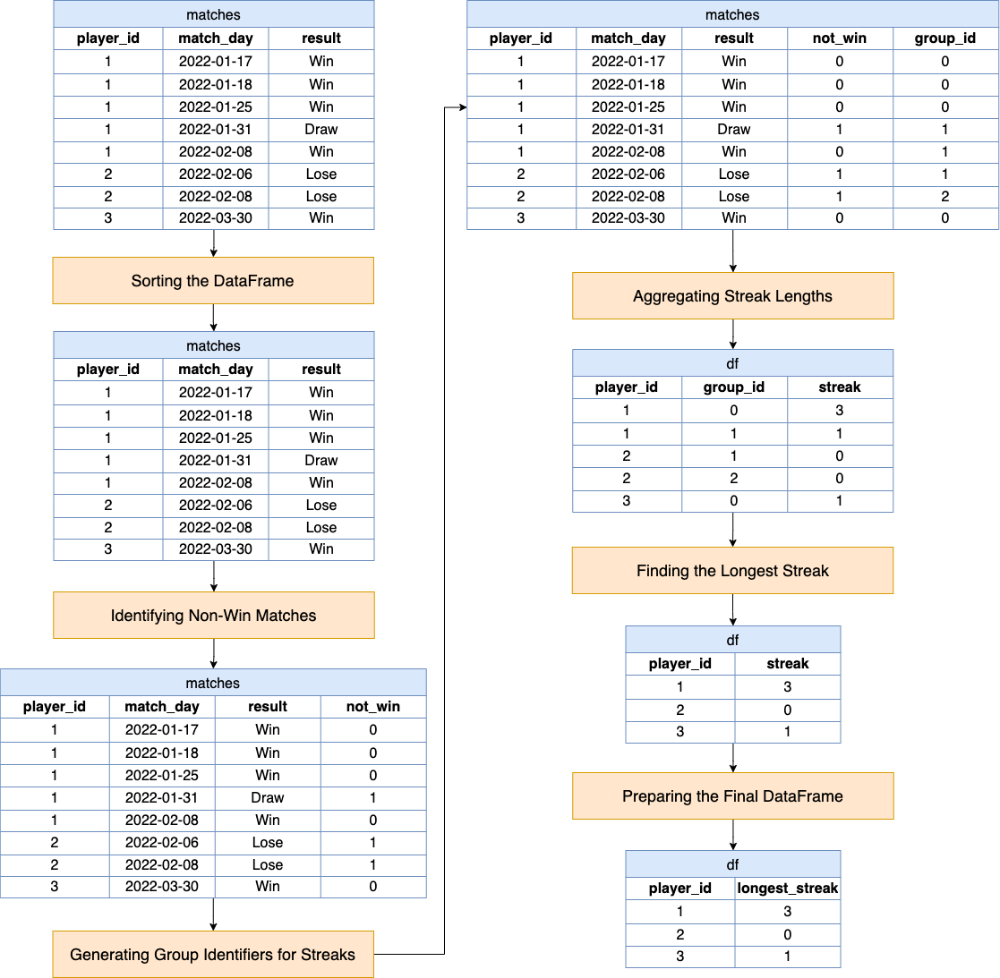

# Solution

---

## pandas

### Approach: Get the Cumulative Sum Using `cumsum`

This approach segments the data into streaks using a cumulative sum to create a streak identifier that resets on a non-win. It then aggregates this data to count consecutive wins and finally selects the longest streak for each player.

**Visualization of Approach**



#### Intuition

Let's break down the python function to understand the logic and intuition behind each step by walking through an example given the following two input DataFrames:

`matches`:
<table>
  <tr>
    <th>player_id</th>
    <th>match_day</th>
    <th>result</th>
  </tr>
  <tr>
    <td>1</td>
    <td>2022-01-17</td>
    <td>Win</td>
  </tr>
  <tr>
    <td>1</td>
    <td>2022-01-18</td>
    <td>Win</td>
  </tr>
  <tr>
    <td>1</td>
    <td>2022-01-25</td>
    <td>Win</td>
  </tr>
  <tr>
    <td>1</td>
    <td>2022-01-31</td>
    <td>Draw</td>
  </tr>
  <tr>
    <td>1</td>
    <td>2022-02-08</td>
    <td>Win</td>
  </tr>
  <tr>
    <td>2</td>
    <td>2022-02-06</td>
    <td>Lose</td>
  </tr>
  <tr>
    <td>2</td>
    <td>2022-02-08</td>
    <td>Lose</td>
  </tr>
  <tr>
    <td>3</td>
    <td>2022-03-30</td>
    <td>Win</td>
  </tr>
</table>
<br>

1.  **Sorting the DataFrame**

    The DataFrame is sorted by $\text{player}_{id}$ and $\text{match}_{day}$. This step is necessary to ensure that the matches for each player are in chronological order, which is critical for correctly identifying consecutive wins.

    ```python
    matches = matches.sort_values(by=["player_id", "match_day"])
    ```

<table>
    <tr><th>player_id</th><th>match_day</th><th>result</th></tr>
    <tr><td>1</td><td>2022-01-17</td><td>Win</td></tr>
    <tr><td>1</td><td>2022-01-18</td><td>Win</td></tr>
    <tr><td>1</td><td>2022-01-25</td><td>Win</td></tr>
    <tr><td>1</td><td>2022-01-31</td><td>Draw</td></tr>
    <tr><td>1</td><td>2022-02-08</td><td>Win</td></tr>
    <tr><td>2</td><td>2022-02-06</td><td>Lose</td></tr>
    <tr><td>2</td><td>2022-02-08</td><td>Lose</td></tr>
    <tr><td>3</td><td>2022-03-30</td><td>Win</td></tr>
</table>
<br>

2. **Identifying Non-Win Matches**

    A new column, $\text{not}_{win}$, is created using `apply` with a `lambda`, marking non-win matches with `1` and win matches with `0`. This will be used for grouping matches into streaks later.

    ```python
    matches["not_win"] = matches["result"].apply(lambda x: 0 if x == "Win" else 1)
    ```

<table>
    <tr><th>player_id</th><th>match_day</th><th>result</th><th>not_win</th></tr>
    <tr><td>1</td><td>2022-01-17</td><td>Win</td><td>0</td></tr>
    <tr><td>1</td><td>2022-01-18</td><td>Win</td><td>0</td></tr>
    <tr><td>1</td><td>2022-01-25</td><td>Win</td><td>0</td></tr>
    <tr><td>1</td><td>2022-01-31</td><td>Draw</td><td>1</td></tr>
    <tr><td>1</td><td>2022-02-08</td><td>Win</td><td>0</td></tr>
    <tr><td>2</td><td>2022-02-06</td><td>Lose</td><td>1</td></tr>
    <tr><td>2</td><td>2022-02-08</td><td>Lose</td><td>1</td></tr>
    <tr><td>3</td><td>2022-03-30</td><td>Win</td><td>0</td></tr>
</table>
<br>

3. **Generating Group Identifiers for Streaks**

    $\text{group}_{id}$ is calculated using the cumulative sum (`cumsum`) of the $\text{not}_{win}$ column within each $\text{player}_{id}$ group. Each time a player doesn't win, the cumulative sum increments, effectively starting a new streak group.

    ```python
    matches["group_id"] = matches.groupby("player_id")["not_win"].cumsum()
    ```

<table>
    <tr><th>player_id</th><th>match_day</th><th>result</th><th>not_win</th><th>group_id</th></tr>
    <tr><td>1</td><td>2022-01-17</td><td>Win</td><td>0</td><td>0</td></tr>
    <tr><td>1</td><td>2022-01-18</td><td>Win</td><td>0</td><td>0</td></tr>
    <tr><td>1</td><td>2022-01-25</td><td>Win</td><td>0</td><td>0</td></tr>
    <tr><td>1</td><td>2022-01-31</td><td>Draw</td><td>1</td><td>1</td></tr>
    <tr><td>1</td><td>2022-02-08</td><td>Win</td><td>0</td><td>1</td></tr>
    <tr><td>2</td><td>2022-02-06</td><td>Lose</td><td>1</td><td>1</td></tr>
    <tr><td>2</td><td>2022-02-08</td><td>Lose</td><td>1</td><td>2</td></tr>
    <tr><td>3</td><td>2022-03-30</td><td>Win</td><td>0</td><td>0</td></tr>
</table>
<br>

4. **Aggregating Streak Lengths**

    The DataFrame is grouped by both $\text{player}_{id}$ and $\text{group}_{id}$, then aggregated to calculate the streak lengths. The lambda function $(x = "Win").sum()$ counts the number of wins in each group, giving the length of each winning streak. Note that when we use `.sum()` on a boolean mask, it treats True as 1 and False as 0. Therefore, it effectively counts the number of True values in this boolean mask.

    ```python
    df = (
        matches.groupby(["player_id", "group_id"])
        .agg(streak=("result", lambda x: (x == "Win").sum()))
        .reset_index()
    )
    ```

<table>
    <tr><th>player_id</th><th>group_id</th><th>streak</th></tr>
    <tr><td>1</td><td>0</td><td>3</td></tr>
    <tr><td>1</td><td>1</td><td>1</td></tr>
    <tr><td>2</td><td>1</td><td>0</td></tr>
    <tr><td>2</td><td>2</td><td>0</td></tr>
    <tr><td>3</td><td>0</td><td>1</td></tr>
</table>
<br>

5. **Finding the Longest Streak**

    Now that each group contains the length of a winning streak, the DataFrame is grouped again by $\text{player}_{id}$ and the `max()` function is used to find the longest streak for each player.

    ```python
    df = df.groupby("player_id")["streak"].max().reset_index()
    ```

<table>
    <tr><th>player_id</th><th>streak</th></tr>
    <tr><td>1</td><td>3</td></tr>
    <tr><td>2</td><td>0</td></tr>
    <tr><td>3</td><td>1</td></tr>
</table>
<br>

6. **Preparing the Final DataFrame**

    The final step involves selecting the relevant columns ($\text{player}_{id}$ and `streak`) and renaming the `streak` column to $\text{longest}_{streak}$ for clarity.

    ```python
    return df[["player_id", "streak"]].rename(columns={"streak": "longest_streak"})
    ```

<table>
    <tr><th>player_id</th><th>longest_streak</th></tr>
    <tr><td>1</td><td>3</td></tr>
    <tr><td>2</td><td>0</td></tr>
    <tr><td>3</td><td>1</td></tr>
</table>
<br>

#### Implementation

```python
import pandas as pd

def longest_winning_streak(matches: pd.DataFrame) -> pd.DataFrame:
    matches = matches.sort_values(by=["player_id", "match_day"])
    matches["not_win"] = matches["result"].apply(lambda x: 0 if x == "Win" else 1)
    matches["group_id"] = matches.groupby("player_id")["not_win"].cumsum()
    df = (
        matches.groupby(["player_id", "group_id"])
        .agg(streak=("result", lambda x: (x == "Win").sum()))
        .reset_index()
    )
    df = df.groupby("player_id")["streak"].max().reset_index()

    return df[["player_id", "streak"]].rename(columns={"streak": "longest_streak"})

```

---

## Database

### Approach: Window Function

The query employs a clever method to track and calculate winning streaks in SQL, leveraging the power of window functions and common table expressions (CTEs). The overall goal is to create a continuous "streak counter" that only increments on consecutive wins and resets on either a draw or a loss.

In essence, this approach is creating a system to label each match with an identifier that groups it with other matches in its winning streak. If the match is not a win, it starts a new identifier group. Then it counts the matches in these groups to find the length of the streaks and finally picks out the longest streak for each player.

#### Intuition

Here's a step-by-step breakdown on building the query:

**Step 1. The `RankedMatches` CTE**

- Creating a Streak Group
  - We generate two sequences of numbers using $\text{ROW}_{NUMBER}()$ for each player's matches, but with different partitions and orderings. One sequence is ordered by $\text{match}_{day}$ alone, and the other is also partitioned by `result`.
  - By subtracting these two sequences, we create a $\text{streak}_{group}$ which is the key part of this query. When a player keeps winning, the difference between these two sequences stays the same, because for each row of win, the increment `1` is identical in both sequences. However, if there's a draw or a loss, the $\text{ROW}_{NUMBER}()$ that's partitioned by `result` resets because the result changes, hence changing the $\text{streak}_{group}$.
  - The intuition behind the $\text{streak}_{group}$ calculation is that it cleverly uses the ranking of rows to determine when a streak is broken. Whenever a player wins, their matches rank consistently in both row number sequences, but when they don't win, the rank based on result changes, causing the $\text{streak}_{group}$ to increment. This change in the $\text{streak}_{group}$ essentially "resets" the streak count.

- Identifying Non-Wins
  - We use a `CASE` statement to mark non-winning results (`Draw` or `Lose`) with a `1`, and winning results with a `0`. This will help us to identify matches that should not be part of a winning streak.

**Step 2. The `Streaks` CTE**

- Calculating Streak Lengths
  - Using the `SUM()` window function with the $1 - is_not_win$ expression, we accumulate a count for each player's match, partitioned by $\text{player}_{id}$ and $\text{streak}_{group}$. Since `is_not_win` is `0` for wins and `1` for non-wins, $1 - is_not_win$ will be `1` for a win and `0` otherwise.
  - This sum effectively counts the number of wins in the current streak group. It works because the sum is cumulative only within the current group of consecutive wins - as soon as a non-win is encountered, a new streak group starts, and the sum starts over.

**Step 3. The Main Query**

- Finding the Longest Streak
  - Finally, we select the $\text{player}_{id}$ and the maximum streak length they've achieved. We ensure that we only consider streaks of wins by checking $is_not_win = 0$ before taking the maximum.
  - We group by $\text{player}_{id}$ because we want to find the longest streak for each player individually.

#### Implementation

**MySQL**

```mysql []
WITH RankedMatches AS (
  SELECT
    player_id,
    match_day,
    result,
    CASE WHEN result = 'Win' THEN 0 ELSE 1 END AS is_not_win,
    ROW_NUMBER() OVER (
      PARTITION BY player_id
      ORDER BY
        match_day
    ) - ROW_NUMBER() OVER (
      PARTITION BY player_id,
      result
      ORDER BY
        match_day
    ) AS streak_group
  FROM
    Matches
),
Streaks AS (
  SELECT
    player_id,
    SUM(1 - is_not_win) OVER (
      PARTITION BY player_id,
      streak_group
      ORDER BY
        match_day
    ) AS streak_length,
    is_not_win
  FROM
    RankedMatches
)
SELECT
  player_id,
  MAX(
    CASE WHEN is_not_win = 0 THEN streak_length ELSE 0 END
  ) AS longest_streak
FROM
  Streaks
GROUP BY
  player_id;

```