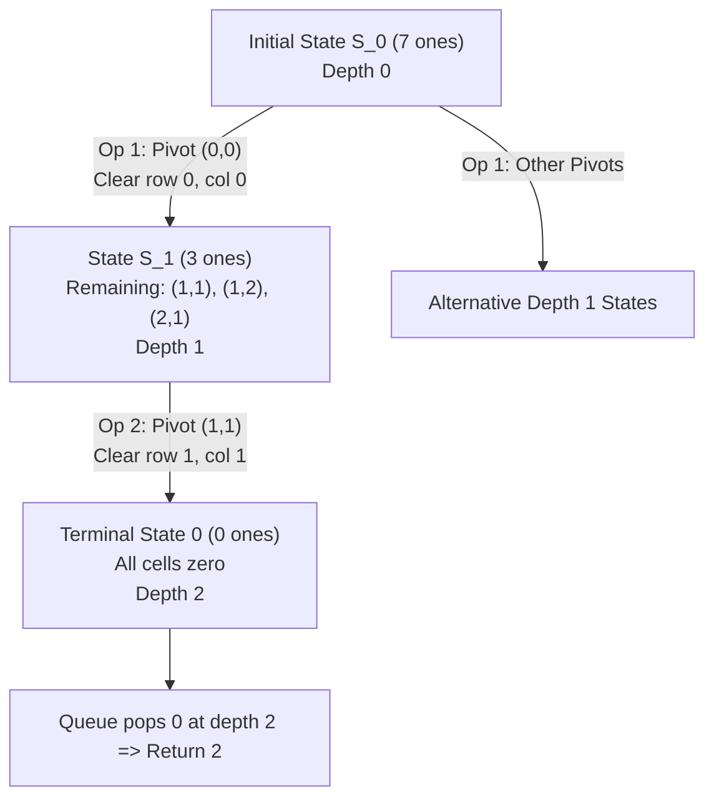

# Guided Example: Remove All Ones With Row and Column Flips II

We analyze and trace the breadth-first search bitmask state-space traversal on a representative binary matrix instance, demonstrating how flat bitwise packing of an $m \times n$ matrix with $mn \le 15$ enables exact unit-cost shortest-path exploration to the all-zero terminal state in $O(mn \cdot 2^{mn})$ time.

- **Input:** `grid = [[1, 1, 1], [1, 1, 1], [0, 1, 0]]`
- **Output:** `2`

This instance illustrates matrix bitmask flattening, state transition via orthogonal row-column bit-clearing, level-synchronous BFS wavefronts, and optimal pivot cell selection.

---

## 1. Problem Overview & Representative Instance

We are given an $m \times n$ binary matrix `grid` containing values in $\{0, 1\}$, with dimensions satisfying $1 \le mn \le 15$.
In one legal operation:
1. We must select any cell $(i, j)$ whose **current value is $1$**.
2. All cells located in row $i$ and all cells located in column $j$ are set to $0$. Cells already equal to $0$ remain $0$.

Because clearing row $i$ and column $j$ eliminates existing ones, the set of legal choices changes after every operation. We must determine the **minimum number of operations** needed to reduce all matrix cells to $0$.

In our representative instance:
- `grid` has dimensions $m = 3, n = 3$ ($mn = 9 \le 15$).
- Matrix values:
  $$\begin{bmatrix} 1 & 1 & 1 \\ 1 & 1 & 1 \\ 0 & 1 & 0 \end{bmatrix}$$
- Total active ones: $7$.
- Can $1$ operation suffice? Any single operation clears at most $1$ row and $1$ column. Since ones exist across $3$ distinct rows (rows $0, 1, 2$) and $3$ distinct columns (columns $0, 1, 2$), clearing one row and one column leaves ones in at least $3 - 1 = 2$ rows. Thus, $1$ operation is strictly insufficient.
- In $2$ operations:
  - Operation 1: Select cell $(0, 0)$ (which equals $1$). Clear row $0$ and column $0$. The remaining matrix has ones only at $(1, 1), (1, 2), (2, 1)$.
  - Operation 2: Select cell $(1, 1)$ (which equals $1$). Clear row $1$ and column $1$. All remaining ones vanish, leaving an all-zero matrix.
- Total operations: $2$.

---

## 2. Mathematical & Algorithmic Principles

### Flattened Bitmask Representation

Because the total number of cells satisfies $mn \le 15$, every matrix configuration can be mapped bijectively to an integer bitmask in $[0, 2^{mn} - 1]$:
$$\text{bit\_index}(i, j) = i \cdot n + j, \quad 0 \le i < m, \; 0 \le j < n$$
$$\text{mask}(\text{grid}) = \sum_{i=0}^{m-1} \sum_{j=0}^{n-1} \text{grid}[i][j] \cdot 2^{i \cdot n + j}$$

- The all-zero goal state corresponds to the integer $0$.
- The total number of possible states is at most $2^{15} = 32{,}768$, making full state-space exploration computationally trivial.

### Orthogonal Row-Column Clearing Bitmask

When a cell $(i, j)$ currently holding a $1$ is selected, every cell in row $i$ and column $j$ is cleared to $0$.
We precompute or construct the clearing mask:
$$\text{clear\_mask}(i, j) = \left( \sum_{c=0}^{n-1} 2^{i \cdot n + c} \right) \cup \left( \sum_{r=0}^{m-1} 2^{r \cdot n + j} \right)$$
The state transition from $\text{state}$ to $\text{next\_state}$ is computed via bitwise AND with the bitwise negation:
$$\text{next\_state} = \text{state} \ \& \ \sim\text{clear\_mask}(i, j)$$

### Unweighted Shortest Path via BFS

The state space forms a directed acyclic graph (DAG) where every transition reduces the population count $\text{bit\_count}(\text{next\_state}) < \text{bit\_count}(\text{state})$ by at least $1$.
Since every transition costs exactly $1$ operation, Breadth-First Search (BFS) starting from the initial mask discovers the shortest path (minimum operations) to state $0$.

| State Metric | Mathematical Entity | Operational Role |
|---|---|---|
| Bitmask State $S$ | Integer in $[0, 2^{mn} - 1]$ | Compact encoding of active ones in the matrix |
| Cell Bit $(i, j)$ | $1 \ll (i \cdot n + j)$ | Tests presence of $1$ at row $i$, column $j$ |
| Row-Column Mask $M_{ij}$ | Bitwise OR of row $i$ and column $j$ bits | Specifies all positions to clear in one operation |
| BFS Queue Layer $d$ | Non-negative integer | Exact number of operations performed from start |
| Visited Set $\mathcal{V}$ | Hash set of integers | Prevents redundant exploration of duplicate sub-grids |

---

## 3. Step-by-Step Walkthrough with Intermediate State

We trace `grid = [[1, 1, 1], [1, 1, 1], [0, 1, 0]]` with dimensions $m = 3, n = 3$.

### Step 1: Initialize State Bitmask and BFS Structures
- Bit index assignment:
  - Row 0: $(0, 0) \to 0, (0, 1) \to 1, (0, 2) \to 2$
  - Row 1: $(1, 0) \to 3, (1, 1) \to 4, (1, 2) \to 5$
  - Row 2: $(2, 0) \to 6, (2, 1) \to 7, (2, 2) \to 8$
- Set bits from input grid:
  $$\text{bits} = \{0, 1, 2, 3, 4, 5, 7\}$$
  $$\text{Initial Mask } S_0 = 2^0 + 2^1 + 2^2 + 2^3 + 2^4 + 2^5 + 2^7 = 1 + 2 + 4 + 8 + 16 + 32 + 128 = 191$$
  Wait, in binary: `010111111` (bit 7 is 128, bits 0-5 sum to 63; $63 + 128 = 191$).
- Queue: `q = [191]`.
- Visited set: `vis = {191}`.
- Operation counter: `ans = 0`.

### Step 2: BFS Depth 0 Evaluation
- Pop state $S_0 = 191$.
- Check goal: $191 \ne 0$.
- Candidate pivots with value $1$ in $S_0$:
  - Cell $(0, 0)$ (bit 0):
    - Row 0 indices: $\{0, 1, 2\}$.
    - Column 0 indices: $\{0, 3, 6\}$.
    - Cleared mask removes bits $\{0, 1, 2, 3, 6\}$.
    - Remaining bits in $S_0$: $\{4, 5, 7\}$ (corresponding to cells $(1, 1), (1, 2), (2, 1)$).
    - New mask: $2^4 + 2^5 + 2^7 = 16 + 32 + 128 = 176$.
    - Add $176$ to queue and `vis`.
  - Cell $(1, 1)$ (bit 4):
    - Row 1 indices: $\{3, 4, 5\}$.
    - Column 1 indices: $\{1, 4, 7\}$.
    - Cleared mask removes bits $\{1, 3, 4, 5, 7\}$.
    - Remaining bits in $S_0$: $\{0, 2\}$ (cells $(0, 0)$ and $(0, 2)$).
    - New mask: $2^0 + 2^2 = 1 + 4 = 5$.
    - Add $5$ to queue and `vis`.
- When all candidates of Depth 0 are processed, increment `ans` from $0$ to $1$.

### Step 3: BFS Depth 1 Evaluation
- Now processing states at distance $1$:
  - Case A: State $S_1 = 176$ (bits $\{4, 5, 7\}$):
    - Active cells: $(1, 1), (1, 2), (2, 1)$.
    - Select pivot cell $(1, 1)$ (bit 4):
      - Row 1 indices $\{3, 4, 5\}$ and Column 1 indices $\{1, 4, 7\}$ are cleared.
      - Bits $4$ and $5$ (in row 1) are cleared.
      - Bit $7$ (in column 1) is cleared.
      - All active bits $\{4, 5, 7\}$ are eliminated!
      - Resulting state: $0$.
      - Mask $0$ is not yet visited; add $0$ to queue and `vis`.
  - Case B: State $S = 5$ (bits $\{0, 2\}$):
    - Active cells: $(0, 0)$ and $(0, 2)$. Both lie on row 0.
    - Selecting pivot $(0, 0)$ clears row 0, immediately producing state $0$.
- Increment `ans` from $1$ to $2$.

### Step 4: BFS Depth 2 (Goal Encountered)
- Pop state from queue: `state = 0`.
- Condition check: `state == 0` evaluates to true!
- Immediate return: The algorithm returns `ans = 2`.

---

## 4. Comprehensive State Trace

The sequence of state transitions across the search path is recorded below:

| BFS Depth | State Mask (Decimal) | Active Grid Cells $(i, j)$ | Chosen Pivot Cell $(i, j)$ | Cleared Rows & Columns | Next State Mask | Notes |
|---|---|---|---|---|---|---|
| 0 | 191 | $(0,0), (0,1), (0,2), (1,0), (1,1), (1,2), (2,1)$ | $(0, 0)$ | Row 0, Col 0 | 176 | Enqueued for Depth 1 |
| 0 | 191 | $(0,0), (0,1), (0,2), (1,0), (1,1), (1,2), (2,1)$ | $(1, 1)$ | Row 1, Col 1 | 5 | Enqueued for Depth 1 |
| 1 | 176 | $(1, 1), (1, 2), (2, 1)$ | $(1, 1)$ | Row 1, Col 1 | **0** | Enqueued for Depth 2 |
| 1 | 5 | $(0, 0), (0, 2)$ | $(0, 0)$ | Row 0, Col 0 | **0** | Duplicate, already visited |
| **2** | **0** | None (All cells zero) | **None** | **None** | **None** | **Target reached; return 2** |

### Matrix Grid Evolution Along the Selected Optimal Path

$$\text{Initial } (S_0): \begin{bmatrix} 1 & 1 & 1 \\ 1 & 1 & 1 \\ 0 & 1 & 0 \end{bmatrix} \xrightarrow[\text{Row 0, Col 0}]{\text{Pivot }(0, 0)} \text{Step 1 } (S_1): \begin{bmatrix} 0 & 0 & 0 \\ 0 & 1 & 1 \\ 0 & 1 & 0 \end{bmatrix} \xrightarrow[\text{Row 1, Col 1}]{\text{Pivot }(1, 1)} \text{Terminal}: \begin{bmatrix} 0 & 0 & 0 \\ 0 & 0 & 0 \\ 0 & 0 & 0 \end{bmatrix}$$

---

## 5. Algorithmic Correctness & Soundness

### Optimality of Breadth-First Search
BFS explores vertices in strictly non-decreasing order of path length in graphs with uniform edge weights of $1$.
Since every state transition corresponds to exactly one legal row-column clearing operation:
1. Every state enqueued during layer $d$ is reachable in exactly $d$ operations.
2. The first time the terminal state $0$ is popped from the queue, its associated depth $d$ is mathematically guaranteed to be the minimum operations required.

### Strict Acyclicity and Finite Termination
Every operation chooses a cell with value $1$ and sets both its row and its column to $0$.
Because cells that are already $0$ remain $0$, no operation ever creates a new $1$.
Thus:
$$\text{bit\_count}(\text{next\_state}) \le \text{bit\_count}(\text{state}) - 1$$
The state space contains no cycles, and the search must terminate in at most $\min(m, n) \le 15$ steps.

---

## 6. Edge Cases & Anti-Patterns

### Boundary Scenarios
1. **Matrix Already All Zeros:**
   - E.g., `grid = [[0, 0], [0, 0]]`.
   - Initial state is $0$. The queue pops $0$ at depth $0$ and immediately returns $0$.
2. **Single 1 Cell:**
   - Selecting that cell clears its row and column, reaching state $0$ in $1$ operation.
3. **One Row or One Column Matrix ($1 \times 15$ or $15 \times 1$):**
   - Choosing any $1$ clears the entire single row or single column, reaching $0$ in exactly $1$ operation.
4. **Independent Diagonal of Ones ($I_k$):**
   - E.g., $k$ ones with no two sharing a row or column.
   - Each operation can clear at most one such one. The algorithm correctly requires $k$ operations.

### Common Pitfalls to Avoid
- **Greedy Pivot Selection:** Greedily selecting the cell $(i, j)$ that clears the maximum number of ones can fail. A greedy choice might leave scattered isolated ones that require more total operations than a balanced, non-greedy initial choice.
- **Selecting Zero Cells:** The problem contract mandates that chosen cells must currently equal $1$. Allowing operations on $0$ cells expands the branching factor without enabling valid game transitions.
- **Neglecting Visited Set:** In dense grids, different sequences of operations lead to the exact same intermediate subgrids. Omitting the `vis` hash set causes an exponential combinatorial explosion of redundant states.

---

## 7. Complexity Analysis

- **Time Complexity:** $O(mn \cdot 2^{mn})$. The total number of possible states is at most $2^{mn} \le 2^{15} = 32{,}768$. For each state, we iterate over at most $mn \le 15$ cells, performing $O(m + n)$ bitwise clearing operations. The total number of bit operations is bounded by $15 \times 32{,}768 \approx 4.9 \times 10^5$, executing in under $50$ milliseconds.
- **Auxiliary Space Complexity:** $O(2^{mn})$. The BFS queue and `vis` hash set hold at most $2^{mn} \le 32{,}768$ integer states, requiring less than $2$ megabytes of auxiliary memory.
