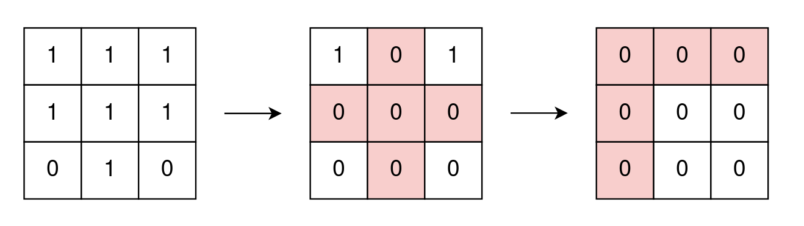
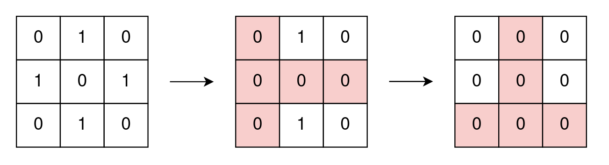
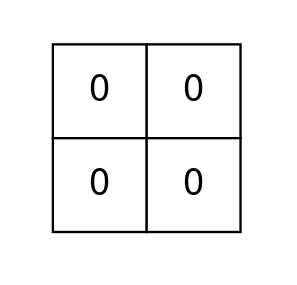

## Description

You are given a **0-indexed** `m x n` **binary** matrix `grid`.

In one operation, you can choose any `i` and `j` that meet the following conditions:

- $0 \le i < m$

- $0 \le j < n$

- $\text{grid}[i][j] = 1$

and change the values of **all** cells in row `i` and column `j` to zero.

Return *the **minimum** number of operations needed to remove all *`1`*'s from *`grid`*.*
### Function Contract

- Refer to method signature.

### Examples

#### Example 1

- **Input:** `grid = [[1,1,1],[1,1,1],[0,1,0]]`
- **Output:** `2`
- **Explanation:**
In the first operation, change all cell values of row 1 and column 1 to zero.
In the second operation, change all cell values of row 0 and column 0 to zero.
#### Example 2

- **Input:** `grid = [[0,1,0],[1,0,1],[0,1,0]]`
- **Output:** `2`
- **Explanation:**
In the first operation, change all cell values of row 1 and column 0 to zero.
In the second operation, change all cell values of row 2 and column 1 to zero.
Note that we cannot perform an operation using row 1 and column 1 because grid[1][1] != 1.
#### Example 3

- **Input:** `grid = [[0,0],[0,0]]`
- **Output:** `0`
- **Explanation:**
There are no 1's to remove so return 0.
### Constraints

- $m = \text{grid.length}$

- $n = \text{grid}[i].length$

- $1 \le m, n \le 15$

- $1 \le m * n \le 15$

- $\text{grid}[i][j]$ is either `0` or `1`.