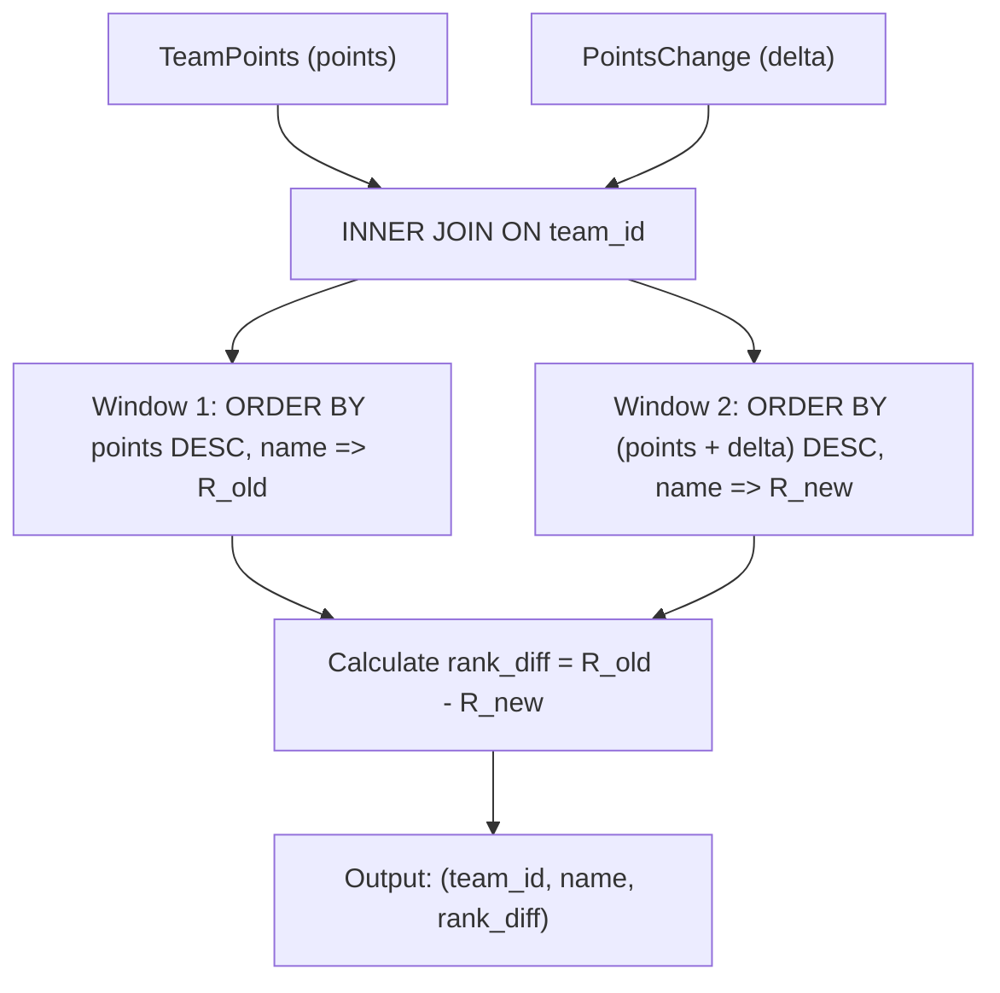

# Guided Example: The Change in Global Rankings

We analyze and execute the relational dual-ranking difference query on a representative international tournament standings dataset, demonstrating how parallel window functions evaluate simultaneous point adjustments and deterministic lexicographical tie-breaking in $O(N \log N)$ time.

- **Input:** Tables `TeamPoints` and `PointsChange` for teams Algeria, Senegal, New Zealand, and Croatia
- **Output:** Table with columns `team_id`, `name`, and `rank_diff` yielding `(1, "Senegal", 0)`, `(4, "Croatia", -1)`, `(3, "Algeria", 1)`, and `(2, "New Zealand", 0)`

This instance captures signed point modifications, strict total ordering via lexicographical tie-breakers, parallel window ranking expressions, and signed rank displacement conventions.

---

## 1. Problem Overview & Representative Instance

We are given two relational tables:
1. `TeamPoints`: Contains `(team_id, name, points)` where each team has a unique integer ID, a unique country name, and initial global ranking points.
2. `PointsChange`: Contains `(team_id, points_change)` specifying a signed point adjustment for each team.

The ranking criteria dictates:
- Teams are ordered by points in **descending order**.
- Any ties in points are resolved strictly by the team's country `name` in **ascending alphabetical order**.

We must compute the change in position for every team, defined as:
$$\text{rank\_diff} = \text{old\_rank} - \text{new\_rank}$$
Under this convention:
- A positive value indicates an **improvement** in standing (e.g., advancing from 3rd to 2nd gives $3 - 2 = +1$).
- A negative value indicates a **decline** in standing (e.g., dropping from 2nd to 3rd gives $2 - 3 = -1$).
- Zero indicates an **unchanged** standing ($1 - 1 = 0$).

In our representative dataset:
- **Senegal (ID 1):** Initial points $2132$, change $-22 \implies$ new points $2110$.
- **Croatia (ID 4):** Initial points $1817$, change $+13 \implies$ new points $1830$.
- **Algeria (ID 3):** Initial points $1431$, change $+399 \implies$ new points $1830$.
- **New Zealand (ID 2):** Initial points $1402$, change $0 \implies$ new points $1402$.

---

## 2. Mathematical & Algorithmic Principles

### Deterministic Total Ordering

For any set of teams, an ambiguous ranking where multiple teams share the same rank is prevented by appending the unique identifier `name` to the sorting specification:
$$\text{Tuple Order: } (\text{points} \downarrow, \; \text{name} \uparrow)$$

Because country names are globally unique across all rows:
$$(p_A, n_A) = (p_B, n_B) \iff A = B$$
Thus, every team receives a distinct, unique integer rank in $\{1, 2, \dots, N\}$ with zero rank collisions. Under this total order, `RANK()`, `DENSE_RANK()`, and `ROW_NUMBER()` produce identical numerical values.

### Parallel Window Execution

Rather than creating temporary tables or mutating the underlying data, the query performs two simultaneous window evaluations in a single query pass over the joined data:
1. **Original Global Rank ($R_{\text{old}}$):**
   $$R_{\text{old}} = \text{RANK}() \text{ OVER } (\text{ORDER BY points DESC, name ASC})$$
2. **Updated Global Rank ($R_{\text{new}}$):**
   $$R_{\text{new}} = \text{RANK}() \text{ OVER } (\text{ORDER BY (points + delta) DESC, name ASC})$$

The displacement metric is obtained directly by subtraction:
$$\text{rank\_diff} = R_{\text{old}} - R_{\text{new}}$$

| Analytical Component | SQL / Mathematical Expression | Semantic Significance |
|---|---|---|
| Aggregated Delta | `SUM(points_change) AS delta` | Net score adjustment per team |
| Base Rank $R_{\text{old}}$ | `RANK() OVER (ORDER BY points DESC, name)` | Baseline tournament standing |
| Updated Points | `points + delta` | Post-adjustment tournament score |
| Updated Rank $R_{\text{new}}$ | `RANK() OVER (ORDER BY (points + delta) DESC, name)` | Standings position after adjustments |
| Signed Displacement | $R_{\text{old}} - R_{\text{new}}$ | Positive for advancement, negative for demotion |

---

## 3. Step-by-Step Walkthrough with Intermediate State

We trace the relational computation on our representative dataset.

### Step 1: Aggregate and Join Adjustments
- Group `PointsChange` by `team_id` to produce delta per team:
  - Team 1 (Senegal): $\text{delta} = -22$
  - Team 2 (New Zealand): $\text{delta} = 0$
  - Team 3 (Algeria): $\text{delta} = +399$
  - Team 4 (Croatia): $\text{delta} = +13$
- Equijoin with `TeamPoints` on `team_id`:
  - Senegal: `points = 2132`, `delta = -22`, updated `points + delta = 2110`.
  - New Zealand: `points = 1402`, `delta = 0`, updated `points + delta = 1402`.
  - Algeria: `points = 1431`, `delta = +399`, updated `points + delta = 1830`.
  - Croatia: `points = 1817`, `delta = +13`, updated `points + delta = 1830`.

### Step 2: Evaluate Original Standings ($R_{\text{old}}$)
Sort all rows by `points DESC, name ASC`:
1. Senegal: $2132 \implies R_{\text{old}} = 1$.
2. Croatia: $1817 \implies R_{\text{old}} = 2$.
3. Algeria: $1431 \implies R_{\text{old}} = 3$.
4. New Zealand: $1402 \implies R_{\text{old}} = 4$.

### Step 3: Evaluate Updated Standings ($R_{\text{new}}$)
Sort all rows by `(points + delta) DESC, name ASC`:
- Updated scores: Senegal ($2110$), Algeria ($1830$), Croatia ($1830$), New Zealand ($1402$).
- Tie-break arbitration between Algeria and Croatia:
  - Both share identical points of $1830$.
  - Compare names alphabetically: `'Algeria' < 'Croatia'`.
  - Algeria is placed ahead of Croatia!
- Assigned new ranks:
  1. Senegal: $2110 \implies R_{\text{new}} = 1$.
  2. Algeria: $1830 \implies R_{\text{new}} = 2$.
  3. Croatia: $1830 \implies R_{\text{new}} = 3$.
  4. New Zealand: $1402 \implies R_{\text{new}} = 4$.

### Step 4: Compute Signed Displacement Difference
- **Senegal:** $R_{\text{old}} - R_{\text{new}} = 1 - 1 = 0$. Position unchanged.
- **Croatia:** $R_{\text{old}} - R_{\text{new}} = 2 - 3 = -1$. Demoted from 2nd to 3rd place.
- **Algeria:** $R_{\text{old}} - R_{\text{new}} = 3 - 2 = +1$. Promoted from 3rd to 2nd place.
- **New Zealand:** $R_{\text{old}} - R_{\text{new}} = 4 - 4 = 0$. Position unchanged.

---

## 4. Comprehensive State Trace

The full tabular trace across initial, intermediate, and final states is documented below:

| `team_id` | Country `name` | Initial `points` | Points Adjustment `delta` | Effective `points + delta` | Old Rank $R_{\text{old}}$ | New Rank $R_{\text{new}}$ | Signed Difference `rank_diff` |
|---|---|---|---|---|---|---|---|
| 1 | Senegal | 2132 | -22 | 2110 | 1 | 1 | **0** |
| 4 | Croatia | 1817 | +13 | 1830 | 2 | 3 | **-1** |
| 3 | Algeria | 1431 | +399 | 1830 | 3 | 2 | **+1** |
| 2 | New Zealand | 1402 | 0 | 1402 | 4 | 4 | **0** |

### Tie-Breaking Mechanics for Updated Points ($1830$)

| Team Name | Updated Points | Alphabetical Sort Key | Assigned New Rank $R_{\text{new}}$ | Rationale |
|---|---|---|---|---|
| Algeria | 1830 | `'Algeria'` | **2** | `'A'` precedes `'C'`, wins tie |
| Croatia | 1830 | `'Croatia'` | **3** | `'C'` follows `'A'`, takes subsequent rank |

---

## 5. Algorithmic Correctness & Soundness

### Soundness of Rank Displacement Metric
The problem specification requires that an increase in rank (improving toward rank 1) must be positive.
- Lower numerical rank values correspond to better standing ($1$st is better than $2$nd).
- If a team moves from rank $A$ to rank $B$ where $B < A$ (improved standing), the algebraic difference $A - B > 0$ correctly produces a positive integer.
- Conversely, if demoted ($B > A$), $A - B < 0$ produces a negative integer.
- Computing $R_{\text{old}} - R_{\text{new}}$ strictly adheres to this convention.

### Uniqueness and Completeness
Because every team in `TeamPoints` has a corresponding record in `PointsChange`, an inner join on `team_id` retains all teams.
Because `name` is unique, each team receives a strictly unique rank $1 \dots N$ in both rankings, ensuring that no artificial rank ties distort the displacement arithmetic.

---

## 6. Edge Cases & Anti-Patterns

### Boundary Scenarios
1. **Zero Point Adjustments for All Teams:**
   - All `delta = 0`. Old ranks and new ranks are identical; all `rank_diff = 0`.
2. **Multiple Teams Tied on Initial or Updated Points:**
   - E.g., multiple teams having exactly equal scores.
   - Lexicographical ordering by `name` guarantees a strict linear ordering without ties.
3. **Massive Point Swings Inverting Standings:**
   - The lowest-ranked team receives a large positive delta that elevates it to first place. The difference correctly yields $N - 1$.
4. **Type Casting of Window Subtractions:**
   - In PostgreSQL, subtracting two `bigint` window ranks produces a `bigint`. Casting with `::int` guarantees adherence to the integer schema.

### Anti-Patterns to Avoid
- **Inverted Difference Formula ($R_{\text{new}} - R_{\text{old}}$):** Using new minus old inverts the signs, falsely labeling promotions as negative and demotions as positive.
- **Omitting the Tie-Breaker in Window Specifications:** Writing `ORDER BY points DESC` without `name ASC` produces non-deterministic ranks when points tie, leading to arbitrary test rejections.
- **Using Correlated Subqueries:** Computing ranks by counting rows with strictly greater points via correlated subqueries takes $O(N^2)$ time. Native window functions execute in $O(N \log N)$ sort time.

---

## 7. Complexity Analysis

- **Time Complexity:** $O(N \log N)$ where $N$ is the number of teams. Aggregating `PointsChange` takes $O(N)$ time. The inner join takes $O(N)$ with hash joining. The two window functions sort $N$ rows by `(points DESC, name ASC)` and `((points + delta) DESC, name ASC)`, requiring $O(N \log N)$ comparison sort time. Overall query execution is strictly $O(N \log N)$.
- **Auxiliary Space Complexity:** $O(N)$. Memory is allocated for the joined relation and sort buffers for the two window evaluations, requiring linear auxiliary space proportional to $N$.
