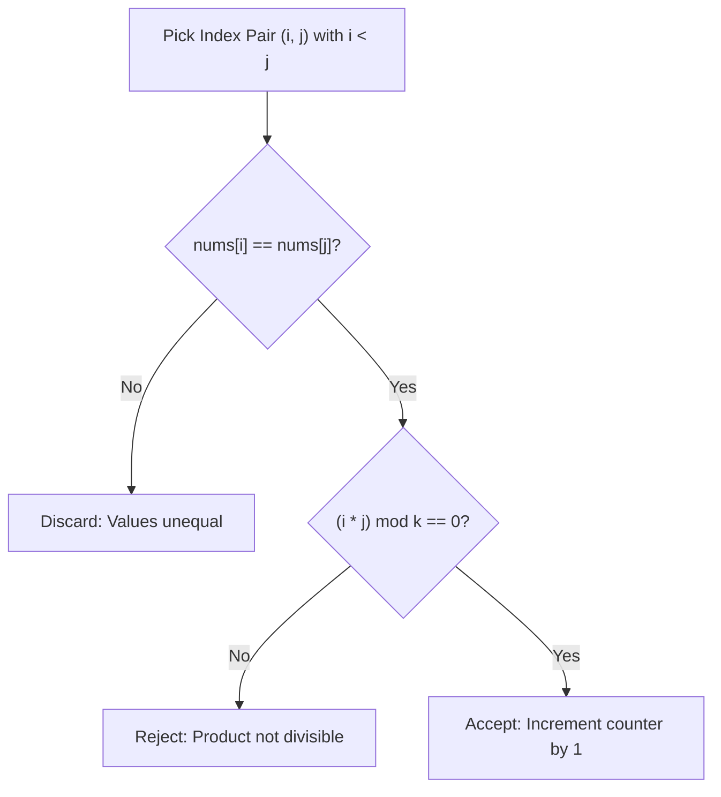

# Guided Example: Count Equal and Divisible Pairs in an Array

We analyze and trace the equal-value index-divisibility counting algorithm on a representative integer array, demonstrating how partitioning indices into value-equivalence buckets and testing modular divisibility criteria avoids false cross-value comparisons and counts qualifying pairs in $O(n^2)$ time.

- **Input:** `nums = [3, 1, 2, 2, 2, 1, 3]`, `k = 2`
- **Output:** `4`

This instance illustrates strict index ordering, the distinction between stored values and positional coordinates, the zero-index divisibility theorem, and modular product evaluation.

---

## 1. Problem Overview & Representative Instance

Given a 0-indexed integer array `nums` of length $n$ and a positive integer divisor $k$, we must count the total number of index pairs $(i, j)$ that simultaneously satisfy three conditions:
1. **Strict Index Ordering:** $0 \le i < j < n$.
2. **Value Equality:** $\text{nums}[i] = \text{nums}[j]$.
3. **Index Divisibility:** $(i \cdot j) \bmod k = 0$.

Crucially, condition 3 applies to the product of the **indices** ($i \cdot j$), not the values stored in the array ($\text{nums}[i] \cdot \text{nums}[j]$).

In our representative instance:
- `nums = [3, 1, 2, 2, 2, 1, 3]` ($n = 7$), divisor $k = 2$.
- Elements by index:
  - $\text{nums}[0] = 3, \; \text{nums}[1] = 1, \; \text{nums}[2] = 2$
  - $\text{nums}[3] = 2, \; \text{nums}[4] = 2, \; \text{nums}[5] = 1, \; \text{nums}[6] = 3$
- Candidate pairs with identical values:
  - Value `3` appears at indices $\{0, 6\}$: Pair $(0, 6)$ gives $0 \cdot 6 = 0$. Since $0 \bmod 2 = 0$, this pair qualifies.
  - Value `1` appears at indices $\{1, 5\}$: Pair $(1, 5)$ gives $1 \cdot 5 = 5$. Since $5 \bmod 2 = 1 \ne 0$, this pair fails divisibility.
  - Value `2` appears at indices $\{2, 3, 4\}$:
    - Pair $(2, 3)$ gives $2 \cdot 3 = 6$. Since $6 \bmod 2 = 0$, it qualifies.
    - Pair $(2, 4)$ gives $2 \cdot 4 = 8$. Since $8 \bmod 2 = 0$, it qualifies.
    - Pair $(3, 4)$ gives $3 \cdot 4 = 12$. Since $12 \bmod 2 = 0$, it qualifies.
- Total qualifying pairs: $1 + 0 + 3 = 4$.

---

## 2. Mathematical & Algorithmic Principles

### Value Equivalence Partitions

Let $\mathcal{I}_v = \{p \in \{0, 1, \dots, n-1\} \mid \text{nums}[p] = v\}$ denote the set of indices where value $v$ resides.
Because pairs with $\text{nums}[i] \ne \text{nums}[j]$ trivially fail condition 2, qualifying pairs exist only within the Cartesian product $\mathcal{I}_v \times \mathcal{I}_v$ for each distinct value $v$:
$$\text{Total Pairs} = \sum_{v} \sum_{\substack{i, j \in \mathcal{I}_v \\ i < j}} \mathbf{1}_{\{(i \cdot j) \equiv 0 \pmod k\}}$$

Evaluating pairs strictly within each value bucket $\mathcal{I}_v$ eliminates comparisons between unequal numbers.

### The Zero-Index Divisibility Property

When index $i = 0$:
$$i \cdot j = 0 \cdot j = 0$$
For any positive divisor $k \ge 1$:
$$0 \bmod k = 0$$
Consequently, index $0$ automatically satisfies the divisibility condition when paired with **any** index $j > 0$ sharing the same value:
$$\forall j > 0: \quad \text{nums}[j] = \text{nums}[0] \implies (0, j) \text{ is guaranteed valid}$$

### Number-Theoretic Divisibility Condition

For indices $i, j > 0$:
$$(i \cdot j) \equiv 0 \pmod k \iff k \mid (i \cdot j)$$
Let $g = \gcd(j, k)$. Then:
$$k \mid (i \cdot j) \iff \frac{k}{g} \;\Big|\; i$$
Thus, for a fixed index $j$, any earlier index $i$ sharing the same value qualifies if and only if $i$ is a multiple of $k / \gcd(j, k)$.

| Property / Component | Mathematical Definition | Role in Algorithm |
|---|---|---|
| Index Pair $(i, j)$ | $0 \le i < j < n$ | Search space coordinate |
| Value Match | $\text{nums}[i] = \text{nums}[j]$ | Prerequisite equivalence filter |
| Coordinate Product $P$ | $i \cdot j$ | Integer subject to divisibility test |
| Divisibility Test | $P \bmod k == 0$ | Final qualification gate |
| Pair Accumulator | $\sum \mathbf{1}_{\{\text{match } \land \text{ divisible}\}}$ | Running count of verified pairs |

---

## 3. Step-by-Step Walkthrough with Intermediate State

We trace the algorithm on `nums = [3, 1, 2, 2, 2, 1, 3]`, $k = 2$.
The search evaluates all pairs with $1 \le j < 7$ against prefix indices $0 \le i < j$.

### Step 1: Evaluating Outer Loop $j = 1$ (`nums[1] = 1`)
- $i = 0$ (`nums[0] = 3`): `nums[0] != nums[1]` ($3 \ne 1$). No match.

### Step 2: Evaluating Outer Loop $j = 2$ (`nums[2] = 2`)
- $i = 0$ (`3`): $3 \ne 2$. No match.
- $i = 1$ (`1`): $1 \ne 2$. No match.

### Step 3: Evaluating Outer Loop $j = 3$ (`nums[3] = 2`)
- $i = 0$ (`3`): $3 \ne 2$. No match.
- $i = 1$ (`1`): $1 \ne 2$. No match.
- $i = 2$ (`2`): Values match (`nums[2] == nums[3] == 2`)!
  - Test divisibility: $(2 \cdot 3) \bmod 2 = 6 \bmod 2 = 0$.
  - Condition satisfied! Increment `ans` from $0$ to $1$.
  - Discovered pair: $(2, 3)$.

### Step 4: Evaluating Outer Loop $j = 4$ (`nums[4] = 2`)
- $i = 0$ (`3`), $i = 1$ (`1`): Unequal.
- $i = 2$ (`2`): Values match!
  - Test divisibility: $(2 \cdot 4) \bmod 2 = 8 \bmod 2 = 0$.
  - Increment `ans` from $1$ to $2$. Discovered pair: $(2, 4)$.
- $i = 3$ (`2`): Values match!
  - Test divisibility: $(3 \cdot 4) \bmod 2 = 12 \bmod 2 = 0$.
  - Increment `ans` from $2$ to $3$. Discovered pair: $(3, 4)$.

### Step 5: Evaluating Outer Loop $j = 5$ (`nums[5] = 1`)
- $i = 0, 2, 3, 4$: Values unequal to $1$.
- $i = 1$ (`nums[1] = 1`): Values match!
  - Test divisibility: $(1 \cdot 5) \bmod 2 = 5 \bmod 2 = 1 \ne 0$.
  - Divisibility fails. `ans` remains $3$.

### Step 6: Evaluating Outer Loop $j = 6$ (`nums[6] = 3`)
- $i = 0$ (`nums[0] = 3`): Values match!
  - Test divisibility: $(0 \cdot 6) \bmod 2 = 0 \bmod 2 = 0$.
  - Condition satisfied! Increment `ans` from $3$ to $4$. Discovered pair: $(0, 6)$.
- $i = 1, 2, 3, 4, 5$: Values unequal to $3$.

### Step 7: Termination & Result Extraction
- All pairs examined. Final count is `ans = 4`.

---

## 4. Comprehensive State Trace

The full evaluation table for all pairs sharing identical values is recorded below:

| Pair $(i, j)$ | Stored Value $\text{nums}[i] = \text{nums}[j]$ | Index Product $i \cdot j$ | Divisor $k$ | Modulo Calculation $(i \cdot j) \bmod k$ | Divisible? | Cumulative Count `ans` |
|---|---|---|---|---|---|---|
| $(0, 6)$ | 3 | $0 \cdot 6 = 0$ | 2 | $0 \bmod 2 = 0$ | **Yes** | 1 |
| $(1, 5)$ | 1 | $1 \cdot 5 = 5$ | 2 | $5 \bmod 2 = 1$ | No | 1 |
| $(2, 3)$ | 2 | $2 \cdot 3 = 6$ | 2 | $6 \bmod 2 = 0$ | **Yes** | 2 |
| $(2, 4)$ | 2 | $2 \cdot 4 = 8$ | 2 | $8 \bmod 2 = 0$ | **Yes** | 3 |
| $(3, 4)$ | 2 | $3 \cdot 4 = 12$ | 2 | $12 \bmod 2 = 0$ | **Yes** | **4** |

### Equivalence Bucket Distribution

| Distinct Value | List of Indices $\mathcal{I}_v$ | Total Candidate Pairs $\binom{\lvert \mathcal{I}_v \rvert}{2}$ | Qualifying Pairs |
|---|---|---|---|
| 3 | $\{0, 6\}$ | 1 | 1 (Pair $(0, 6)$) |
| 1 | $\{1, 5\}$ | 1 | 0 |
| 2 | $\{2, 3, 4\}$ | 3 | 3 (Pairs $(2, 3), (2, 4), (3, 4)$) |
| **All Values** | **$\{0, 1, 2, 3, 4, 5, 6\}$** | **5** | **4** |

---

## 5. Algorithmic Correctness & Soundness

### Soundness of Pair Selection
A pair is included if and only if:
1. $i < j$, guaranteeing that every unordered pair $\{i, j\}$ is considered in canonical order exactly once.
2. $\text{nums}[i] = \text{nums}[j]$, ensuring the value equality predicate holds.
3. $(i \cdot j) \bmod k = 0$, ensuring the arithmetic divisibility predicate holds.
No false positive can enter the sum because all three boolean predicates are conjoined via logical AND.

### Completeness
The outer loop spans $j \in [1, n - 1]$ and the inner loop spans $i \in [0, j - 1]$.
The union of all tested pairs is precisely:
$$\{(i, j) \mid 0 \le i < j < n\}$$
This covers the entire space of $n(n - 1) / 2$ possible index pairs. No qualifying pair can be missed.

---

## 6. Edge Cases & Anti-Patterns

### Edge Cases
1. **Index 0 Guaranteed Divisibility:**
   - For any pair involving $i = 0$, $0 \cdot j = 0$ is divisible by all $k \ge 1$. Thus, if $\text{nums}[0] = \text{nums}[j]$, the pair is always valid.
2. **Divisor $k = 1$:**
   - Every integer product is divisible by $1$. When $k = 1$, the problem reduces purely to counting pairs with equal values ($\sum \binom{|\mathcal{I}_v|}{2}$).
3. **All Elements Distinct:**
   - E.g., `nums = [1, 2, 3, 4]`. No pair has equal values; the algorithm returns $0$.
4. **All Elements Identical:**
   - E.g., `nums = [5, 5, 5]`, $k = 3$. Indices are $\{0, 1, 2\}$.
   - Pairs: $(0, 1) \to 0$ (valid), $(0, 2) \to 0$ (valid), $(1, 2) \to 2$ ($2 \bmod 3 = 2 \ne 0$, invalid). Total: $2$.

### Anti-Patterns to Avoid
- **Multiplying Values Instead of Indices:** Testing `(nums[i] * nums[j]) % k == 0` is the most common conceptual trap. The question explicitly demands divisibility of the **indices** $(i \cdot j)$.
- **Double Counting Symmetric Pairs:** Looping over all $i$ and $j$ from $0$ to $n - 1$ without restricting to $i < j$ counts every pair twice and miscounts self-pairs $(i, i)$.
- **Unnecessary Hash Pre-computation for Small $n$:** With $n \le 100$, the maximum number of pairs is $\binom{100}{2} = 4{,}950$. A straightforward nested loop executes in a few microseconds without hash map allocation overhead.

---

## 7. Complexity Analysis

- **Time Complexity:** $O(n^2)$. The nested loops evaluate $\frac{n(n - 1)}{2}$ index pairs. For each pair, value comparison and integer multiplication/modulo take $O(1)$ constant time. For $n \le 100$, at most $4{,}950$ iterations execute, completing in under $1$ millisecond.
- **Auxiliary Space Complexity:** $O(1)$. Auxiliary space is strictly $O(1)$ as the simulation maintains only scalar integer counters (`ans`, `i`, `j`) without dynamically allocated collections.
