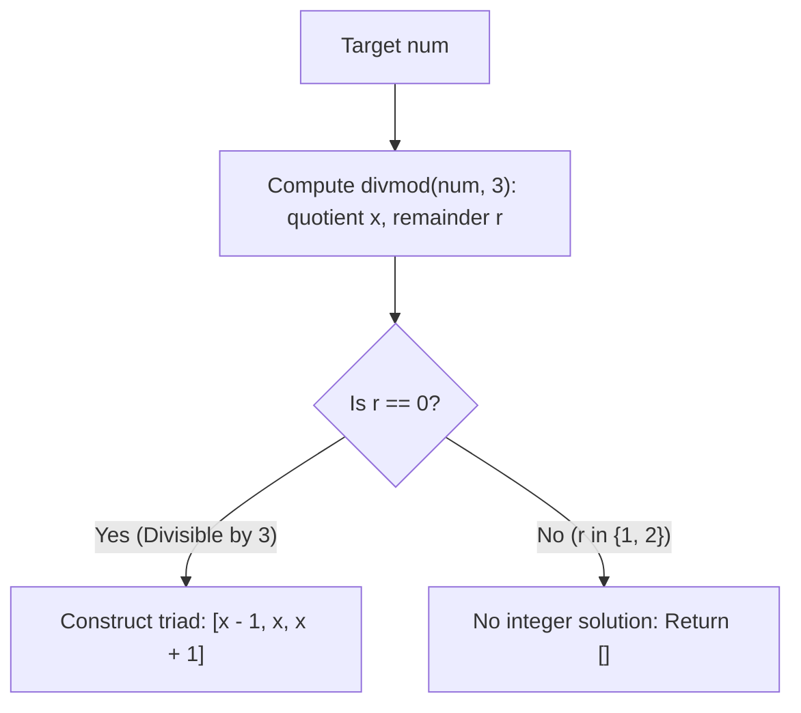

# Guided Example: Find Three Consecutive Integers That Sum to a Given Number

We analyze and execute the algebraic center-pivot arithmetic algorithm on a representative target integer, demonstrating how symmetry about the median reduces the search for three consecutive integers to a constant-time Euclidean divisibility test in $O(1)$ time.

- **Input:** `num = 33`
- **Output:** `[10, 11, 12]`

This instance captures symmetric algebraic formulation, quotient-remainder decomposition, exact integer solvability criteria, and negative coordinate boundary handling.

---

## 1. Problem Overview & Representative Instance

Given a non-negative integer `num`, we must find three consecutive integers in strictly ascending order:
$$[x - 1, \; x, \; x + 1]$$
such that their sum equals `num`:
$$(x - 1) + x + (x + 1) = \text{num}$$

If no such triplet of integers exists, we must return an empty array `[]`. If a solution exists, it is unique and must be returned in sorted order.

In our representative instance:
- Target `num = 33`.
- Let the middle integer be $x$.
- Sum of the triad: $(x - 1) + x + (x + 1) = 3x = 33$.
- Solving for $x$: $x = 33 / 3 = 11$.
- Because $33$ is exactly divisible by $3$ (remainder $0$), an integer solution exists.
- The three consecutive integers are $[11 - 1, 11, 11 + 1] = [10, 11, 12]$.
- Checking the sum: $10 + 11 + 12 = 33$.

---

## 2. Mathematical & Algorithmic Principles

### Symmetric Algebraic Formulation

Let three consecutive integers be parameterized by the middle integer $x \in \mathbb{Z}$:
$$a = x - 1, \quad b = x, \quad c = x + 1$$

Summing the three terms:
$$S = (x - 1) + x + (x + 1) = 3x$$

Notice that the offset $-1$ and $+1$ cancel out identically. Consequently, the sum of any three consecutive integers is **strictly a multiple of 3**.

### Divisibility and Solvability Criteria

By the Euclidean division theorem, for any integer `num`:
$$\text{num} = 3q + r, \quad q = \lfloor \text{num} / 3 \rfloor, \quad r = \text{num} \bmod 3 \in \{0, 1, 2\}$$

Equating the sum to `num`:
$$3x = 3q + r \iff 3(x - q) = r$$

Because $x$ and $q$ are integers, $3(x - q)$ must be an integer multiple of $3$.
- **Case 1 ($r = 0$):** $3(x - q) = 0 \implies x = q$. A unique integer solution exists: $[q - 1, q, q + 1]$.
- **Case 2 ($r \in \{1, 2\}$):** No integer $x$ can satisfy $3(x - q) \in \{1, 2\}$. Therefore, no three consecutive integers can sum to `num`, and the method must return `[]`.

| Parameter / Expression | Mathematical Meaning | Role in Algorithm |
|---|---|---|
| Target `num` | Input integer in $[0, 10^{15}]$ | Total required sum |
| Quotient $x = \lfloor \text{num} / 3 \rfloor$ | Candidate median integer | Center element of the triad |
| Remainder $r = \text{num} \bmod 3$ | Modulo residue $\in \{0, 1, 2\}$ | Solvability certificate ($r = 0$) |
| Left Neighbor | $x - 1$ | First element of the triad |
| Right Neighbor | $x + 1$ | Third element of the triad |

---

## 3. Step-by-Step Walkthrough with Intermediate State

We trace `num = 33` alongside contrasting counterexamples.

### Step 1: Compute Integer Division and Remainder
- Perform `divmod(33, 3)`:
  - Quotient: $x = \lfloor 33 / 3 \rfloor = 11$.
  - Remainder: $\text{mod} = 33 \bmod 3 = 0$.

### Step 2: Evaluate Remainder Condition
- Condition: `mod != 0` (or `if mod:`).
- Since $\text{mod} = 0$, the condition evaluates to false (no remainder).
- Solvability is confirmed: $33$ can be expressed as the sum of three consecutive integers.

### Step 3: Triad Synthesis
- Construct the ordered triplet $[x - 1, x, x + 1]$:
  - First element: $11 - 1 = 10$.
  - Second element: $11$.
  - Third element: $11 + 1 = 12$.
- Resulting array: `[10, 11, 12]`.

### Step 4: Verification of Sum and Ordering
- Verify consecutive property: $10 + 1 = 11$, $11 + 1 = 12$ (consecutive integers).
- Verify sum: $10 + 11 + 12 = 33$.
- Verify ascending order: $10 < 11 < 12$.
- Return `[10, 11, 12]`.

---

## 4. Comprehensive State Trace

The evaluation across representative test values spanning all residue classes is recorded below:

| Test Instance `num` | Quotient $x = \lfloor \text{num} / 3 \rfloor$ | Remainder $r = \text{num} \bmod 3$ | Residue Class | Resulting Triad $[x - 1, x, x + 1]$ | Arithmetic Verification |
|---|---|---|---|---|---|
| 33 | 11 | 0 | $0 \pmod 3$ | `[10, 11, 12]` | $10 + 11 + 12 = 33$ |
| 4 | 1 | 1 | $1 \pmod 3$ | `[]` | No solution ($1+2+3=6 \ne 4$) |
| 5 | 1 | 2 | $2 \pmod 3$ | `[]` | No solution ($0+1+2=3, 1+2+3=6$) |
| 0 | 0 | 0 | $0 \pmod 3$ | `[-1, 0, 1]` | $(-1) + 0 + 1 = 0$ |
| $10^{15}$ | $333{,}333{,}333{,}333{,}333$ | 1 | $1 \pmod 3$ | `[]` | No solution |
| $3 \times 10^{14}$ | $10^{14}$ | 0 | $0 \pmod 3$ | $[10^{14}-1, 10^{14}, 10^{14}+1]$ | Sum $= 3 \times 10^{14}$ |

---

## 5. Algorithmic Correctness & Soundness

### Proof of Uniqueness and Completeness
Let $S(x) = (x - 1) + x + (x + 1) = 3x$ be a function from $\mathbb{Z} \to \mathbb{Z}$.
1. **Strict Monotonicity:** For any $x_1 < x_2$, $S(x_1) = 3x_1 < 3x_2 = S(x_2)$. Because $S(x)$ is strictly increasing, it is an injective function:
   $$S(x_1) = S(x_2) \iff x_1 = x_2$$
   Therefore, if a solution exists, it is mathematically unique.
2. **Image of $S$:** The image of $S$ is precisely the set of integer multiples of $3$:
   $$\operatorname{Im}(S) = 3\mathbb{Z} = \{\dots, -6, -3, 0, 3, 6, 9, \dots\}$$
   - If $\text{num} \in 3\mathbb{Z}$, then $\text{num} \bmod 3 = 0$, and the unique pre-image is $x = \text{num} / 3$.
   - If $\text{num} \notin 3\mathbb{Z}$, no pre-image exists in $\mathbb{Z}$.
Thus, the condition $\text{num} \bmod 3 == 0$ is both **necessary and sufficient** for the existence of a solution.

---

## 6. Edge Cases & Anti-Patterns

### Edge Cases
1. **Zero Input (`num = 0`):**
   - $0 \bmod 3 = 0$, quotient $x = 0$.
   - Triad is $[-1, 0, 1]$.
   - Although `num` is non-negative, the problem permits negative integer values in the returned triad.
2. **Large Magnitude Values ($\text{num} \le 10^{15}$):**
   - Standard 32-bit signed integers overflow at $2 \times 10^9$.
   - The value $10^{15}$ requires a 64-bit integer (`long long` in C++, `long` in Java).
   - In Python, integers have arbitrary precision and do not overflow.
3. **Small Non-Multiples (`num = 1, 2`):**
   - Both produce nonzero remainders and correctly yield `[]`.

### Anti-Patterns to Avoid
- **Binary Search or Linear Scan:** Searching for $x$ via loops or binary search takes $O(\log(\text{num}))$ or $O(\text{num})$ time. A single division computes $x$ in $O(1)$ time.
- **Floating-Point Division:** Using `num / 3` in floating-point arithmetic can introduce rounding errors for large numbers up to $10^{15}$. Integer division (`divmod` or `//` and `%`) preserves exact precision.
- **Forbidding Negative Numbers:** Rejecting negative integers when `num = 0` produces an incorrect empty array; $[-1, 0, 1]$ are valid consecutive integers that sum to $0$.

---

## 7. Complexity Analysis

- **Time Complexity:** $O(1)$. Computing integer quotient and remainder via `divmod` requires a single CPU hardware division instruction. Constructing the 3-element list takes $O(1)$ constant time.
- **Auxiliary Space Complexity:** $O(1)$. Auxiliary memory is restricted to storing the 3-element result list and scalar quotient/remainder variables.
