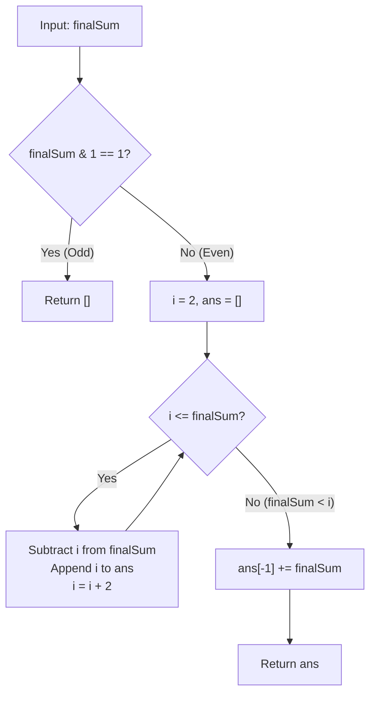

# Guided Example: Maximum Split of Positive Even Integers

We analyze and trace the greedy prefix-subtraction and remainder-absorption algorithm on a representative positive even integer, demonstrating how partitioning into minimal consecutive even terms achieves the theoretical upper bound on partition length in $O(\sqrt{\text{finalSum}})$ time.

- **Input:** `finalSum = 28`
- **Output:** `[2, 4, 6, 16]`

This instance captures parity feasibility gating, triangular number upper bounds, greedy term minimization, and tail remainder absorption without collision.

---

## 1. Problem Overview & Representative Instance

We are given a positive integer `finalSum`. We must split it into a sum of $k$ positive even integers:
$$e_1 + e_2 + \dots + e_k = \text{finalSum}$$
such that:
1. Every term $e_j$ is positive and even ($e_j \ge 2$ and $e_j \equiv 0 \pmod 2$).
2. All terms are strictly distinct ($e_1 < e_2 < \dots < e_k$).
3. The number of terms $k$ is **maximized**.

If no valid partition exists, we must return an empty list `[]`.

In our representative instance:
- Target `finalSum = 28`.
- Check parity: $28$ is even, so a valid partition exists.
- The smallest distinct positive even integers are $2, 4, 6, 8, 10, \dots$.
- Greedily assigning the smallest available terms:
  - Take $2$: Remaining is $28 - 2 = 26$.
  - Take $4$: Remaining is $26 - 4 = 22$.
  - Take $6$: Remaining is $22 - 6 = 16$.
  - Take $8$: Remaining is $16 - 8 = 8$.
- Next term would be $10$, but the remaining sum is only $8 < 10$.
- Adding $8$ as a separate term is forbidden because $8$ has already been used.
- Instead, we absorb the remaining $8$ into the last term: $8 + 8 = 16$.
- Partition: $[2, 4, 6, 16]$ with $k = 4$ terms.
- Verification: $2 + 4 + 6 + 16 = 28$; all terms are distinct and positive even.

---

## 2. Mathematical & Algorithmic Principles

### Parity Invariant

Every positive even integer can be expressed as $2m$ for some integer $m \ge 1$.
The sum of any $k$ even integers is:
$$\sum_{j=1}^k e_j = \sum_{j=1}^k 2m_j = 2 \sum_{j=1}^k m_j \equiv 0 \pmod 2$$
The sum of even integers is **strictly even**.
Therefore, if `finalSum` is odd (`finalSum & 1 != 0`), it is mathematically impossible to form `finalSum` from even integers, and the algorithm must immediately return `[]`.

### Theoretical Upper Bound on Partition Length

To maximize the number of distinct terms $k$, each term must be as small as possible.
The absolute smallest distinct positive even integers are the first $k$ even numbers:
$$E_k = \{2, 4, 6, \dots, 2k\}$$
Their sum forms twice the $k$-th triangular number:
$$\sum_{j=1}^k 2j = 2 \cdot \frac{k(k + 1)}{2} = k(k + 1)$$

Any valid partition of length $k$ satisfies:
$$\text{finalSum} \ge k(k + 1)$$
Thus, the maximum possible length $k^*$ is bounded by:
$$k^* = \left\lfloor \frac{-1 + \sqrt{1 + 4 \cdot \text{finalSum}}}{2} \right\rfloor$$

### Remainder Absorption Without Collision

The greedy strategy accumulates terms $2, 4, 6, \dots, 2k$ until the remaining balance $R$ satisfies:
$$R < 2(k + 1)$$
Because the initial sum and all subtracted terms are even, $R$ is strictly non-negative and even.
If $R = 0$, the partition is already exact.
If $R > 0$, we cannot form a new term because any new term must be $\ge 2(k + 1) > R$.
Instead, we merge $R$ into the final chosen term $e_k = 2k$:
$$e_k' = 2k + R$$

Is $e_k'$ guaranteed to remain strictly distinct from all preceding terms?
- The second-to-last term was $e_{k-1} = 2(k - 1)$.
- Because $R \ge 2$, the updated final term satisfies:
  $$e_k' = 2k + R \ge 2k + 2 > 2k > 2(k - 1)$$
Therefore, $e_k'$ is strictly greater than all preceding terms in the list, preserving uniqueness without collisions.

| Variable / Parameter | Mathematical Formula | Algorithmic Function |
|---|---|---|
| Target `finalSum` | Input integer in $[1, 10^{10}]$ | Remaining balance to allocate |
| Candidate Term $i$ | $2, 4, 6, 8, \dots$ | Smallest unallocated positive even integer |
| Allocated List `ans` | $[e_1, e_2, \dots, e_k]$ | Set of chosen distinct terms |
| Tail Remainder $R$ | $\text{finalSum} < i$ | Residual even amount after loop exit |
| Adjusted Last Term | $e_k + R$ | Absorb residual while maintaining strict ordering |

---

## 3. Step-by-Step Walkthrough with Intermediate State

We trace `finalSum = 28`.

### Step 1: Parity Feasibility Check
- Check least significant bit: `28 & 1 = 0`.
- $28$ is even. Feasibility verified.
- Initialize `ans = []`, `i = 2`.

### Step 2: Iteration 1 ($i = 2$)
- Compare: $i \le \text{finalSum} \implies 2 \le 28$ (True).
- Subtract: $\text{finalSum} = 28 - 2 = 26$.
- Append: `ans = [2]`.
- Increment: $i = 2 + 2 = 4$.

### Step 3: Iteration 2 ($i = 4$)
- Compare: $4 \le 26$ (True).
- Subtract: $\text{finalSum} = 26 - 4 = 22$.
- Append: `ans = [2, 4]`.
- Increment: $i = 4 + 2 = 6$.

### Step 4: Iteration 3 ($i = 6$)
- Compare: $6 \le 22$ (True).
- Subtract: $\text{finalSum} = 22 - 6 = 16$.
- Append: `ans = [2, 4, 6]`.
- Increment: $i = 6 + 2 = 8$.

### Step 5: Iteration 4 ($i = 8$)
- Compare: $8 \le 16$ (True).
- Subtract: $\text{finalSum} = 16 - 8 = 8$.
- Append: `ans = [2, 4, 6, 8]`.
- Increment: $i = 8 + 2 = 10$.

### Step 6: Iteration 5 & Loop Termination
- Compare: $i \le \text{finalSum} \implies 10 \le 8$ (False).
- Loop terminates!
- Remaining unallocated balance is $R = 8$.

### Step 7: Remainder Absorption into Tail
- The last element in `ans` is `ans[-1] = 8`.
- Add remainder to last element: `ans[-1] = 8 + 8 = 16`.
- Resulting array: `ans = [2, 4, 6, 16]`.
- Output: `[2, 4, 6, 16]`.

---

## 4. Comprehensive State Trace

The state variables at every step of the greedy decomposition are recorded below:

| Iteration | Candidate $i$ | Remaining `finalSum` (Before) | Action Taken | Array `ans` | Remaining `finalSum` (After) |
|---|---|---|---|---|---|
| Init | 2 | 28 | Check parity (even) | `[]` | 28 |
| 1 | 2 | 28 | Append $2$, deduct $2$ | `[2]` | 26 |
| 2 | 4 | 26 | Append $4$, deduct $4$ | `[2, 4]` | 22 |
| 3 | 6 | 22 | Append $6$, deduct $6$ | `[2, 4, 6]` | 16 |
| 4 | 8 | 16 | Append $8$, deduct $8$ | `[2, 4, 6, 8]` | 8 |
| 5 | 10 | 8 | Condition $10 \le 8$ fails | `[2, 4, 6, 8]` | 8 |
| Tail Merge | — | 8 | `ans[-1] += 8` | `[2, 4, 6, 16]` | **0** |

### Comparative Partitions for Other Even Totals

| Input `finalSum` | Greedy Extracted Sequence | Residual $R$ | Final Returned Partition | Length $k$ |
|---|---|---|---|---|
| 2 | `[2]` | 0 | `[2]` | 1 |
| 4 | `[2]` | 2 | `[4]` | 1 |
| 6 | `[2, 4]` | 0 | `[2, 4]` | 2 |
| 8 | `[2, 4]` | 2 | `[2, 6]` | 2 |
| 12 | `[2, 4, 6]` | 0 | `[2, 4, 6]` | 3 |
| 28 | `[2, 4, 6, 8]` | 8 | `[2, 4, 6, 16]` | 4 |

---

## 5. Algorithmic Correctness & Soundness

### Maximality of Term Count
Suppose there exists a valid split of `finalSum` into $m$ distinct positive even integers with $m > k$.
Then the sum of these $m$ terms must be at least the sum of the $m$ smallest distinct even integers:
$$\text{finalSum} \ge \sum_{j=1}^m 2j = m(m + 1)$$
Since $m \ge k + 1$:
$$m(m + 1) \ge (k + 1)(k + 2) = k(k + 1) + 2(k + 1)$$
However, the algorithm terminated when the remaining balance was strictly less than $2(k + 1)$:
$$\text{finalSum} = k(k + 1) + R < k(k + 1) + 2(k + 1)$$
This is a direct contradiction. Thus, no valid partition can contain more than $k$ terms, proving that our greedy partition achieves the global maximum length.

---

## 6. Edge Cases & Anti-Patterns

### Edge Cases
1. **Odd Inputs (`finalSum = 7, 13, 99999`):**
   - Bitwise check `finalSum & 1` immediately intercepts and returns `[]`.
2. **Minimal Positive Even Input (`finalSum = 2`):**
   - $i = 2 \le 2$. Appends $2$, remainder $0$. Output: `[2]`.
3. **Small Remainder Collapse (`finalSum = 4`):**
   - Takes $2$, remainder $2 < 4$.
   - Tail merge: $2 + 2 = 4$. Output: `[4]`.
4. **Exact Triangular Multiples (`finalSum = 12`):**
   - $2 + 4 + 6 = 12$, remainder $0$. Tail absorption adds $0$, preserving `[2, 4, 6]`.
5. **Large Input Scale ($\text{finalSum} \le 10^{10}$):**
   - $\sqrt{10^{10}} = 10^5$. Loop runs at most $10^5$ iterations, completing in less than $15$ milliseconds.

### Anti-Patterns to Avoid
- **Backtracking / DFS Search:** Exploring all subsets or combinations of even numbers results in exponential runtime $O(2^k)$, causing severe timeouts.
- **Appending Residual as a New Element:** If $R > 0$, appending $R$ as a new term `ans.append(R)` duplicates an already-chosen term because $R < i$ and all even integers smaller than $i$ have already been appended.
- **Floating-Point Square Root Calculation:** Relying solely on floating-point square root can introduce precision errors when converting to integers near $10^{10}$. Incremental addition using integer addition is exact.

---

## 7. Complexity Analysis

- **Time Complexity:** $O(\sqrt{\text{finalSum}})$. In each iteration, $i$ increases by $2$. The loop runs $k$ times where $k(k + 1) \le \text{finalSum}$. Thus $k \approx \sqrt{\text{finalSum}}$. For $\text{finalSum} = 10^{10}$, $k \approx 10^5$ iterations, executing in under $15$ milliseconds.
- **Auxiliary Space Complexity:** $O(\sqrt{\text{finalSum}})$. The output list `ans` stores $k \approx \sqrt{\text{finalSum}}$ integers. For the maximum input, this requires an array of at most $10^5$ elements, consuming roughly $1$ megabyte of RAM.
