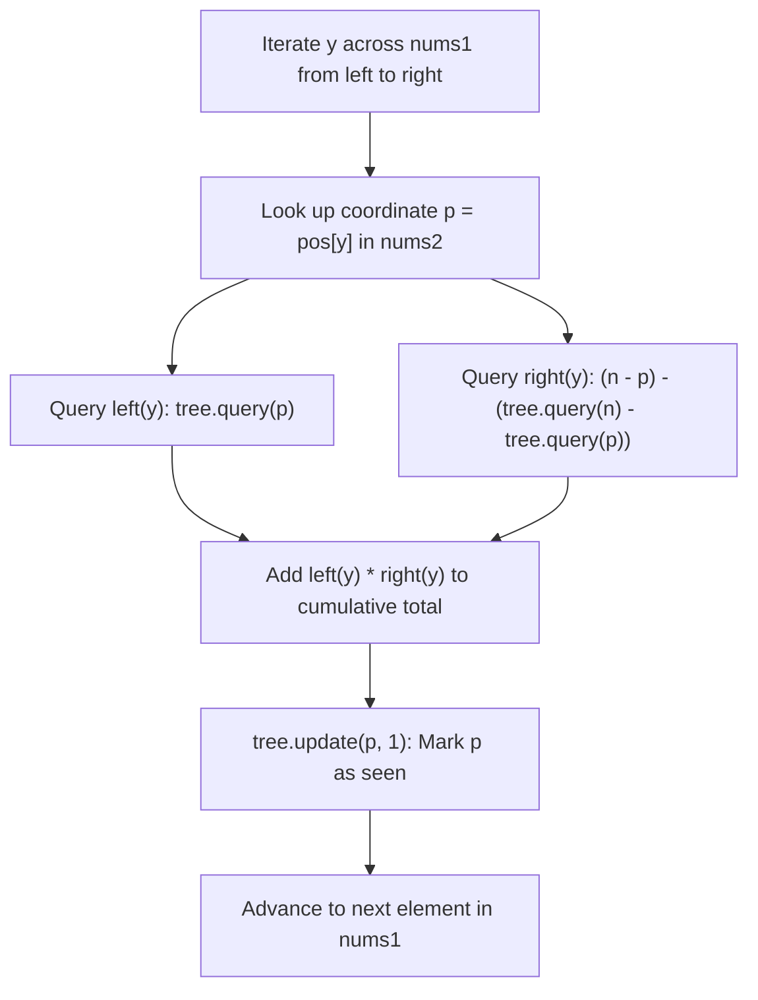

# Guided Example: Count Good Triplets in an Array

We analyze and trace the Fenwick tree (Binary Indexed Tree) permutation inversion counting algorithm on a representative dual-permutation instance, demonstrating how middle-element factorization and dynamic prefix-sum tracking over secondary permutation coordinates evaluates good triplets in $O(n \log n)$ time.

- **Input:** `nums1 = [2, 0, 1, 3]`, `nums2 = [0, 1, 2, 3]`
- **Output:** `1`

This instance illustrates coordinate re-indexing, middle-element combinatorial decoupling, prefix-suffix set complementation, and Fenwick tree point-update range-query mechanics.

---

## 1. Problem Overview & Representative Instance

We are given two permutations of length $n$, `nums1` and `nums2`, each containing all integers from $0$ to $n - 1$ exactly once.
A triplet of distinct values $(x, y, z)$ is defined as **good** if they appear in the same relative left-to-right order in both permutations:
$$idx_1(x) < idx_1(y) < idx_1(z) \quad \land \quad idx_2(x) < idx_2(y) < idx_2(z)$$
We must count the total number of good triplets.

In our representative instance:
- `nums1 = [2, 0, 1, 3]` of length $n = 4$.
- `nums2 = [0, 1, 2, 3]` of length $n = 4$.
- The only values that preserve their relative order in both arrays are $(0, 1, 3)$:
  - In `nums1`: $0$ is at index 1, $1$ is at index 2, $3$ is at index 3 ($1 < 2 < 3$).
  - In `nums2`: $0$ is at index 0, $1$ is at index 1, $3$ is at index 3 ($0 < 1 < 3$).
- Value $2$ appears first in `nums1` (index 0) but third in `nums2` (index 2), so any triplet involving $2$ has contradictory ordering between the two arrays.
- Total good triplets: $1$.

---

## 2. Mathematical & Algorithmic Principles

### Middle-Element Factorization

A brute-force check of all $\binom{n}{3}$ triplets requires $O(n^3)$ time, which is impossible for $n = 10^5$.
Instead of picking triplets as three coupled choices, we iterate over every value $y \in [0, n - 1]$ and treat $y$ as the **middle element** of candidate triplets $(x, y, z)$.

By fixing the center $y$:
1. A qualifying predecessor $x$ must satisfy:
   $$idx_1(x) < idx_1(y) \quad \land \quad idx_2(x) < idx_2(y)$$
2. A qualifying successor $z$ must satisfy:
   $$idx_1(z) > idx_1(y) \quad \land \quad idx_2(z) > idx_2(y)$$

Because the conditions on $x$ and $z$ involve completely disjoint index regions (one strictly before $y$ and one strictly after $y$), the choices for $x$ and $z$ are **statistically independent**.
By the fundamental counting principle:
$$\text{Good Triplets with Center } y = \text{left}(y) \times \text{right}(y)$$
where:
- $\text{left}(y) = |\{x \mid idx_1(x) < idx_1(y) \land idx_2(x) < idx_2(y)\}|$
- $\text{right}(y) = |\{z \mid idx_1(z) > idx_1(y) \land idx_2(z) > idx_2(y)\}|$

### Permutation Position Mapping & Fenwick Tree

We map each value $v \in [0, n - 1]$ to its 1-based coordinate in `nums2`:
$$\text{pos}[v] = \text{index of } v \text{ in } \text{nums2} + 1 \in [1, n]$$

We iterate through `nums1` in left-to-right sequential order.
At the moment we encounter element $y = \text{nums1}[i]$:
- Every element previously processed was located to the **left** of $y$ in `nums1`.
- We maintain a Fenwick tree (Binary Indexed Tree) of size $n$ over the coordinate space of `nums2`.
- $\text{tree.query}(p)$ returns how many previously processed elements have coordinate $\le p$ in `nums2`.

For element $y$ with coordinate $p = \text{pos}[y]$:
1. **Left Candidates ($\text{left}(y)$):**
   The number of elements appearing before $y$ in `nums1` that also have coordinate $< p$ in `nums2`:
   $$\text{left}(y) = \text{tree.query}(p)$$
   (using strict coordinate $< p$ or $p-1$ with 1-based indexing).
2. **Right Candidates ($\text{right}(y)$):**
   In `nums2`, there are exactly $n - p$ total positions strictly greater than $p$.
   Among elements already processed (which were to the left of $y$ in `nums1`), the count of elements with coordinate $> p$ in `nums2` is:
   $$\text{prior\_right} = \text{tree.query}(n) - \text{tree.query}(p)$$
   Therefore, the remaining elements with coordinate $> p$ in `nums2` that have **not yet been processed** (and therefore reside to the **right** of $y$ in `nums1`) is:
   $$\text{right}(y) = (n - p) - (\text{tree.query}(n) - \text{tree.query}(p))$$
3. **Accumulation & Insertion:**
   Add $\text{left}(y) \times \text{right}(y)$ to the cumulative answer, then insert $y$'s position into the tree:
   $$\text{tree.update}(p, 1)$$

| Metric / Variable | Mathematical Representation | Operational Meaning |
|---|---|---|
| Target Middle $y$ | Current element from `nums1` | Center node of potential good triplets |
| Position $p$ | $\text{pos}[y]$ | 1-based location of value $y$ inside `nums2` |
| $\text{left}(y)$ | $\text{tree.query}(p)$ | Prior elements in `nums1` also preceding $y$ in `nums2` |
| $\text{right}(y)$ | $(n - p) - (\text{tree.query}(n) - \text{tree.query}(p))$ | Subsequent elements in `nums1` also succeeding $y$ in `nums2` |
| Center Contribution | $\text{left}(y) \times \text{right}(y)$ | Total valid triplets centered at $y$ |

---

## 3. Step-by-Step Walkthrough with Intermediate State

We trace `nums1 = [2, 0, 1, 3]` and `nums2 = [0, 1, 2, 3]` with $n = 4$.

### Step 1: Precompute Position Map
- `nums2` indices (0-indexed): $0 \to 0, 1 \to 1, 2 \to 2, 3 \to 3$.
- 1-based `pos` map:
  - $\text{pos}[0] = 1$
  - $\text{pos}[1] = 2$
  - $\text{pos}[2] = 3$
  - $\text{pos}[3] = 4$
- Initialize Fenwick tree `tree` of size $4$ with all zeros.
- Initialize `ans = 0`.

### Step 2: Process First Element `num = 2`
- $y = 2$, coordinate $p = \text{pos}[2] = 3$.
- Calculate `left`:
  - $\text{left} = \text{tree.query}(3) = 0$ (no elements seen yet).
- Calculate `right`:
  - Total positions $> 3$ in `nums2`: $n - p = 4 - 3 = 1$.
  - Prior elements seen with position $> 3$: $\text{tree.query}(4) - \text{tree.query}(3) = 0 - 0 = 0$.
  - $\text{right} = 1 - 0 = 1$.
- Triplet contribution:
  - $\text{left} \times \text{right} = 0 \times 1 = 0$.
- Update tree:
  - Insert coordinate $3$: $\text{tree.update}(3, 1)$. Tree contains $\{3\}$.

### Step 3: Process Second Element `num = 0`
- $y = 0$, coordinate $p = \text{pos}[0] = 1$.
- Calculate `left`:
  - $\text{left} = \text{tree.query}(1) = 0$ (no element seen has position $\le 1$).
- Calculate `right`:
  - Total positions $> 1$ in `nums2`: $n - p = 4 - 1 = 3$.
  - Prior elements seen with position $> 1$: $\text{tree.query}(4) - \text{tree.query}(1) = 1 - 0 = 1$ (coordinate $3$).
  - $\text{right} = 3 - 1 = 2$ (coordinates $2$ and $4$, corresponding to values $1$ and $3$).
- Triplet contribution:
  - $\text{left} \times \text{right} = 0 \times 2 = 0$.
- Update tree:
  - Insert coordinate $1$: $\text{tree.update}(1, 1)$. Tree contains $\{1, 3\}$.

### Step 4: Process Third Element `num = 1`
- $y = 1$, coordinate $p = \text{pos}[1] = 2$.
- Calculate `left`:
  - $\text{left} = \text{tree.query}(2) = 1$ (coordinate $1$, corresponding to value $0$).
  - Value $0$ appeared before $1$ in `nums1`, and also appears before $1$ in `nums2`.
- Calculate `right`:
  - Total positions $> 2$ in `nums2`: $n - p = 4 - 2 = 2$ (positions $3, 4$).
  - Prior elements seen with position $> 2$: $\text{tree.query}(4) - \text{tree.query}(2) = 2 - 1 = 1$ (coordinate $3$, value $2$).
  - $\text{right} = 2 - 1 = 1$ (position $4$, corresponding to value $3$).
  - Value $3$ appears after $1$ in `nums1`, and also appears after $1$ in `nums2`.
- Triplet contribution:
  - $\text{left} \times \text{right} = 1 \times 1 = 1$.
  - Formed good triplet: $(0, 1, 3)$ with center $1$.
  - Update `ans`: $0 + 1 = 1$.
- Update tree:
  - Insert coordinate $2$: $\text{tree.update}(2, 1)$. Tree contains $\{1, 2, 3\}$.

### Step 5: Process Fourth Element `num = 3`
- $y = 3$, coordinate $p = \text{pos}[3] = 4$.
- Calculate `left`:
  - $\text{left} = \text{tree.query}(4) = 3$.
- Calculate `right`:
  - $n - p = 4 - 4 = 0$.
  - $\text{right} = 0$.
- Triplet contribution:
  - $\text{left} \times \text{right} = 3 \times 0 = 0$.
- Update tree:
  - $\text{tree.update}(4, 1)$.

### Step 6: Finalization
- All elements in `nums1` processed. Total good triplets: $1$.

---

## 4. Comprehensive State Trace

The sequence of calculations for every middle element $y$ in `nums1` is detailed below:

| Traversal Step | Middle Value $y$ | Coordinate $p = \text{pos}[y]$ | Tree Contents (Seen $p$) | $\text{left}(y)$ | $\text{right}(y)$ | Contribution $\text{left} \times \text{right}$ | Running Total `ans` |
|---|---|---|---|---|---|---|---|
| Start | None | None | $\emptyset$ | — | — | — | 0 |
| 1 | 2 | 3 | $\{3\}$ | 0 | 1 | 0 | 0 |
| 2 | 0 | 1 | $\{1, 3\}$ | 0 | 2 | 0 | 0 |
| 3 | 1 | 2 | $\{1, 2, 3\}$ | **1** | **1** | **1** | **1** |
| 4 | 3 | 4 | $\{1, 2, 3, 4\}$ | 3 | 0 | 0 | **1** |

### Triplet Verification Matrix

| Candidate Triplet $(x, y, z)$ | Indices in `nums1` | Valid in `nums1`? | Indices in `nums2` | Valid in `nums2`? | Status |
|---|---|---|---|---|---|
| $(2, 0, 1)$ | $(0, 1, 2)$ | Yes | $(2, 0, 1)$ | No ($2 \not< 0$) | Invalid |
| $(2, 0, 3)$ | $(0, 1, 3)$ | Yes | $(2, 0, 3)$ | No ($2 \not< 0$) | Invalid |
| $(2, 1, 3)$ | $(0, 2, 3)$ | Yes | $(2, 1, 3)$ | No ($2 \not< 1$) | Invalid |
| **$(0, 1, 3)$** | **$(1, 2, 3)$** | **Yes ($1 < 2 < 3$)** | **$(0, 1, 3)$** | **Yes ($0 < 1 < 3$)** | **Good Triplet** |

---

## 5. Algorithmic Correctness & Soundness

### Disjointness Across Middle Elements
Every triplet of distinct values $(x, y, z)$ has a strictly unique middle element $y$ in `nums1`.
Because we partition the universe of candidate good triplets by their exact center element $y \in \text{nums1}$, the sets of triplets evaluated across different iterations are pairwise disjoint:
$$\text{Total Good Triplets} = \sum_{y \in \text{nums1}} \text{Good Triplets Centered at } y$$
No triplet can ever be double counted.

### Exact Factorization Soundness
For a fixed center $y$:
- An element $x$ qualifies as a predecessor if and only if $x$ was visited prior to $y$ in `nums1` and $\text{pos}[x] < \text{pos}[y]$ in `nums2`. This count is exactly $\text{tree.query}(\text{pos}[y])$.
- An element $z$ qualifies as a successor if and only if $z$ is visited after $y$ in `nums1` and $\text{pos}[z] > \text{pos}[y]$ in `nums2`. Since every element $v \notin \text{seen}$ with $\text{pos}[v] > \text{pos}[y]$ will be visited in the future, the subtraction $(n - p) - (\text{tree.query}(n) - \text{tree.query}(p))$ measures this set with exact precision.
- Every choice of qualifying $x$ is compatible with every choice of qualifying $z$. Thus the product $\text{left}(y) \times \text{right}(y)$ is mathematically exact.

---

## 6. Edge Cases & Anti-Patterns

### Edge Cases
1. **64-Bit Integer Overflow:**
   - When $n = 10^5$, if `nums1 == nums2`, all $\binom{n}{3} \approx \frac{10^{15}}{6} \approx 1.66 \times 10^{14}$ triplets are valid.
   - This value exceeds the maximum signed 32-bit integer limit ($2^{31} - 1 \approx 2.14 \times 10^9$).
   - The accumulator `ans` must be maintained as a 64-bit integer (`long long` in C++, `long` in Java).
2. **Strict Inversion Permutations (`nums2 = nums1[::-1]`):**
   - The arrays are in reverse relative order. No three elements can preserve order; returns $0$.
3. **Identical Permutations (`nums1 == nums2`):**
   - Every triplet is valid. The algorithm sums $i \times (n - 1 - i)$ for all $i$, yielding $\binom{n}{3}$.

### Anti-Patterns to Avoid
- **Cubic or Quadratic Nested Iteration:** Searching for $x$ and $z$ with nested loops takes $O(n^3)$ or $O(n^2)$ time, causing massive time-limit exceeded failures when $n = 10^5$.
- **Recomputing Suffix Counts with a Second Fenwick Tree:** While maintainable with two trees (one for prefix, one for suffix), the identity $\text{right}(y) = (n - p) - (\text{total\_seen} - \text{left})$ requires only a single Fenwick tree, cutting memory and constant factors in half.
- **0-based Indexing in Fenwick Trees:** In a standard Binary Indexed Tree, index $0$ causes infinite loops in `x += x & -x`. 1-based indexing ($[1, n]$) is essential.

---

## 7. Complexity Analysis

- **Time Complexity:** $O(n \log n)$. Mapping positions takes $O(n)$ time. Iterating through `nums1` takes $n$ steps. In each step, querying the Fenwick tree and performing point updates each take $O(\log n)$ time. Total time is $O(n \log n)$. For $n = 10^5$, $10^5 \log_2(10^5) \approx 1.7 \times 10^6$ operations, running in under $0.2$ seconds.
- **Auxiliary Space Complexity:** $O(n)$. The coordinate map `pos` and Fenwick tree array `c` each require $O(n)$ auxiliary space to store $n$ integers.
