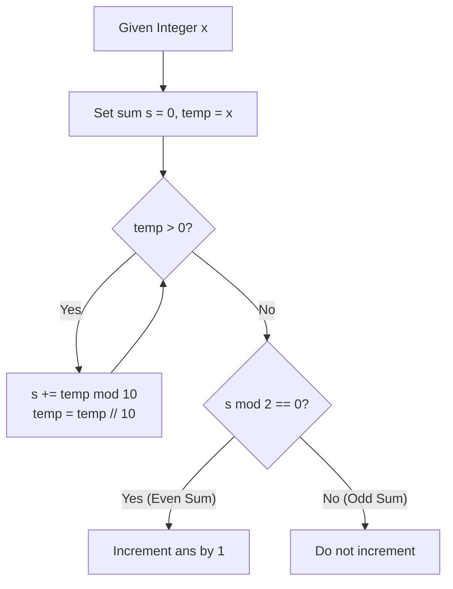

# Guided Example: Count Integers With Even Digit Sum

We analyze and trace the digit-sum parity evaluation algorithm on a representative integer range, demonstrating how base-10 decade equidistribution and radix digit decomposition count integers with even digit sums in $O(\text{num} \log_{10} \text{num})$ simulation time or $O(1)$ closed-form time.

- **Input:** `num = 30`
- **Output:** `14`

This instance illustrates decimal digit peeling, the crucial distinction between value parity and digit-sum parity, decade-block balance, and boundary parity arbitration.

---

## 1. Problem Overview & Representative Instance

Given a positive integer `num`, we must determine how many integers $x$ in the inclusive range $[1, \text{num}]$ have an **even digit sum**.
The digit sum $S(x)$ is defined as the sum of all individual decimal digits of $x$.
Importantly:
- An integer $x$ qualifies if and only if $S(x) \equiv 0 \pmod 2$.
- The parity of $S(x)$ is **not** determined solely by whether $x$ itself is even or odd:
  - $x = 11$ is odd, but $S(11) = 1 + 1 = 2$ (even, so $11$ qualifies).
  - $x = 10$ is even, but $S(10) = 1 + 0 = 1$ (odd, so $10$ does not qualify).

In our representative instance:
- Target range is $[1, 30]$ ($num = 30$).
- Breaking the range into decade intervals:
  - $[1, 9]$: Qualifying integers are $\{2, 4, 6, 8\}$ ($4$ values).
  - $[10, 19]$: Prefix digit is $1$ (odd). Adding an odd units digit yields an even sum: $\{11, 13, 15, 17, 19\}$ ($5$ values).
  - $[20, 29]$: Prefix digit is $2$ (even). Adding an even units digit yields an even sum: $\{20, 22, 24, 26, 28\}$ ($5$ values).
  - $\{30\}$: $S(30) = 3 + 0 = 3$ (odd, does not qualify).
- Total count: $4 + 5 + 5 + 0 = 14$.

---

## 2. Mathematical & Algorithmic Principles

### Digit Extraction via Successive Remainder Peeling

For any positive integer $x$, its decimal digits $d_0, d_1, \dots, d_{k-1}$ are extracted iteratively:
$$d_j = x \bmod 10, \quad x \leftarrow \lfloor x / 10 \rfloor$$
The digit sum is:
$$S(x) = \sum_{j=0}^{k-1} d_j$$
Since addition is commutative and associative, extracting digits from right to left (least significant to most significant) evaluates the exact arithmetic sum.

### The Decennial Equidistribution Theorem

Consider any complete decade block of ten consecutive numbers starting at an integer multiple of $10$:
$$B_m = [10m, \; 10m + 9] = \{10m + 0, \; 10m + 1, \; \dots, \; 10m + 9\}$$

For every number $10m + d$ in this block:
$$S(10m + d) = S(m) + d, \quad d \in \{0, 1, 2, \dots, 9\}$$
- The set of units digits $\{0, 1, 2, \dots, 9\}$ contains exactly $5$ even digits $\{0, 2, 4, 6, 8\}$ and $5$ odd digits $\{1, 3, 5, 7, 9\}$.
- If $S(m)$ is even, adding an even digit yields an even sum ($5$ numbers qualify).
- If $S(m)$ is odd, adding an odd digit yields an even sum ($5$ numbers qualify).

**Theorem.** In every complete decade block $[10m, 10m + 9]$, **exactly 5 numbers** have an even digit sum and **exactly 5 numbers** have an odd digit sum, regardless of the magnitude or parity of $m$.

### The Endpoint Parity Closed-Form Relation

Because full decade blocks split evenly $50/50$, the cumulative count of numbers with an even digit sum up to `num` depends only on `num` and the parity of $S(\text{num})$:
$$\text{countEven}(\text{num}) = \begin{cases} \lfloor \text{num} / 2 \rfloor & \text{if } S(\text{num}) \text{ is even} \\ \lfloor (\text{num} - 1) / 2 \rfloor & \text{if } S(\text{num}) \text{ is odd} \end{cases}$$

| Parameter | Mathematical Entity | Operational Role |
|---|---|---|
| Current Candidate $x$ | Integer in $[1, \text{num}]$ | Number being examined |
| Digit Sum $S(x)$ | $\sum d_j$ | Sum of decimal digits |
| Parity Predicate | $S(x) \bmod 2 == 0$ | Qualification condition |
| Decade Quotient | $\lfloor x / 10 \rfloor$ | Leading digits prefix |
| Cumulative Counter `ans` | $\sum_{x=1}^{\text{num}} \mathbf{1}_{\{S(x) \equiv 0 \pmod 2\}}$ | Total verified integers |

---

## 3. Step-by-Step Walkthrough with Intermediate State

We trace the evaluation across the representative range $[1, 30]$.

### Step 1: Evaluating the Single-Digit Decade $[1, 9]$
- Notice that $[1, 9]$ is the decade $[0, 9]$ excluding $0$.
- $x = 1: S(1) = 1$ (odd).
- $x = 2: S(2) = 2$ (even) $\implies \text{ans} = 1$.
- $x = 3: S(3) = 3$ (odd).
- $x = 4: S(4) = 4$ (even) $\implies \text{ans} = 2$.
- $x = 5: S(5) = 5$ (odd).
- $x = 6: S(6) = 6$ (even) $\implies \text{ans} = 3$.
- $x = 7: S(7) = 7$ (odd).
- $x = 8: S(8) = 8$ (even) $\implies \text{ans} = 4$.
- $x = 9: S(9) = 9$ (odd).
- Subtotal after $x = 9$: $\text{ans} = 4$.

### Step 2: Evaluating the Teens Decade $[10, 19]$
- The tens prefix is $1$ (digit sum of prefix is $1$, which is odd).
- To obtain an even sum, the units digit must be odd:
  - $x = 10: 1 + 0 = 1$ (odd).
  - $x = 11: 1 + 1 = 2$ (even) $\implies \text{ans} = 5$.
  - $x = 12: 1 + 2 = 3$ (odd).
  - $x = 13: 1 + 3 = 4$ (even) $\implies \text{ans} = 6$.
  - $x = 14: 1 + 4 = 5$ (odd).
  - $x = 15: 1 + 5 = 6$ (even) $\implies \text{ans} = 7$.
  - $x = 16: 1 + 6 = 7$ (odd).
  - $x = 17: 1 + 7 = 8$ (even) $\implies \text{ans} = 8$.
  - $x = 18: 1 + 8 = 9$ (odd).
  - $x = 19: 1 + 9 = 10$ (even) $\implies \text{ans} = 9$.
- Subtotal after $x = 19$: $\text{ans} = 4 + 5 = 9$.

### Step 3: Evaluating the Twenties Decade $[20, 29]$
- The tens prefix is $2$ (digit sum of prefix is $2$, which is even).
- To obtain an even sum, the units digit must be even:
  - $x = 20: 2 + 0 = 2$ (even) $\implies \text{ans} = 10$.
  - $x = 21: 2 + 1 = 3$ (odd).
  - $x = 22: 2 + 2 = 4$ (even) $\implies \text{ans} = 11$.
  - $x = 23: 2 + 3 = 5$ (odd).
  - $x = 24: 2 + 4 = 6$ (even) $\implies \text{ans} = 12$.
  - $x = 25: 2 + 5 = 7$ (odd).
  - $x = 26: 2 + 6 = 8$ (even) $\implies \text{ans} = 13$.
  - $x = 27: 2 + 7 = 9$ (odd).
  - $x = 28: 2 + 8 = 10$ (even) $\implies \text{ans} = 14$.
  - $x = 29: 2 + 9 = 11$ (odd).
- Subtotal after $x = 29$: $\text{ans} = 9 + 5 = 14$.

### Step 4: Evaluating the Boundary Endpoint $x = 30$
- $x = 30$: Peeling digits gives $30 \bmod 10 = 0$, $\lfloor 30 / 10 \rfloor = 3$, $3 \bmod 10 = 3$.
- Digit sum: $S(30) = 3 + 0 = 3$.
- Condition: $3 \bmod 2 = 1 \ne 0$ (odd sum).
- Counter `ans` remains unchanged at $14$.

### Step 5: Verification via Closed-Form Formula
- $S(30) = 3$ (odd).
- Apply odd formula: $\lfloor (30 - 1) / 2 \rfloor = \lfloor 29 / 2 \rfloor = 14$.
- Matches the simulation result identically.

---

## 4. Comprehensive State Trace

The evaluation across sample values in each decade block is summarized below:

| Range / Sub-interval | Numbers Evaluated | Qualifying Integers ($S(x)$ Even) | Disqualified Integers ($S(x)$ Odd) | Interval Count | Cumulative Total `ans` |
|---|---|---|---|---|---|
| $[1, 9]$ | 9 | $\{2, 4, 6, 8\}$ | $\{1, 3, 5, 7, 9\}$ | 4 | 4 |
| $[10, 19]$ | 10 | $\{11, 13, 15, 17, 19\}$ | $\{10, 12, 14, 16, 18\}$ | 5 | 9 |
| $[20, 29]$ | 10 | $\{20, 22, 24, 26, 28\}$ | $\{21, 23, 25, 27, 29\}$ | 5 | 14 |
| $\{30\}$ | 1 | None ($S(30) = 3$) | $\{30\}$ | 0 | **14** |

### Digit Breakdown for Selected Representative Numbers

| Integer $x$ | Decimal Digits | Sum $S(x)$ | Modulo Parity $S(x) \bmod 2$ | Qualifies? | Counter Impact |
|---|---|---|---|---|---|
| 2 | $[2]$ | 2 | 0 | **Yes** | $+1$ |
| 10 | $[1, 0]$ | 1 | 1 | No | $0$ |
| 11 | $[1, 1]$ | 2 | 0 | **Yes** | $+1$ |
| 19 | $[1, 9]$ | 10 | 0 | **Yes** | $+1$ |
| 20 | $[2, 0]$ | 2 | 0 | **Yes** | $+1$ |
| 30 | $[3, 0]$ | 3 | 1 | No | $0$ |

---

## 5. Algorithmic Correctness & Soundness

### Soundness of Loop Simulation
The loop iterates through every integer $x$ in $[1, \text{num}]$ exactly once.
The inner while loop extracts all base-10 digits via successive `x % 10` and `x //= 10` steps until $x$ reaches $0$.
By the properties of positional base-10 arithmetic:
$$x = \sum_{j=0}^{k-1} d_j \cdot 10^j \implies \text{digit sum } s = \sum_{j=0}^{k-1} d_j$$
The equality `s % 2 == 0` evaluates to true ($1$) if and only if $s$ is even.
Adding this boolean value to `ans` guarantees that every qualifying integer increments the count by $1$ and every non-qualifying integer contributes $0$.

---

## 6. Edge Cases & Anti-Patterns

### Edge Cases
1. **Minimal Positive Input (`num = 1`):**
   - $S(1) = 1$ (odd). Loop examines only $x = 1$, adding $0$. Returns $0$.
2. **First Qualifying Integer (`num = 2`):**
   - $S(1) = 1$ (odd), $S(2) = 2$ (even). Returns $1$.
3. **Decade Rollovers ($9 \to 10$, $19 \to 20$, $99 \to 100$):**
   - At $9 \to 10$: $S(9) = 9$ (odd) and $S(10) = 1$ (odd). Here, two consecutive numbers have odd digit sums.
   - At $19 \to 20$: $S(19) = 10$ (even) and $S(20) = 2$ (even). Here, two consecutive numbers have even digit sums.
   - The loop handles all carry-over parity discontinuities seamlessly by evaluating each number individually.
4. **Upper Constraint Bound (`num = 1000`):**
   - $S(1000) = 1 + 0 + 0 + 0 = 1$ (odd).
   - Closed-form gives $\lfloor (1000 - 1) / 2 \rfloor = 499$.

### Anti-Patterns to Avoid
- **Conflating Number Parity with Digit-Sum Parity:** Assuming that even numbers have even digit sums and odd numbers have odd digit sums is a common blunder. Numbers like $11$ (odd, sum 2) and $10$ (even, sum 1) refute this assumption.
- **String Conversion Overhead:** Converting integers to strings via `str(x)` and iterating over characters creates excessive heap allocations. Arithmetic extraction (`x % 10`, `x //= 10`) runs entirely in CPU registers.

---

## 7. Complexity Analysis

- **Time Complexity:**
  - **Simulation Approach:** $O(\text{num} \cdot \log_{10} \text{num})$. The outer loop runs $\text{num}$ times. The inner digit-extraction loop runs for the number of digits in $x$, which is $\lfloor \log_{10} x \rfloor + 1 \le 4$ for $\text{num} \le 1000$. The total operations are at most $4 \times 1000 = 4000$ arithmetic instructions, executing in under $1$ millisecond.
  - **Closed-Form Approach:** $O(\log_{10} \text{num})$ to compute the digit sum of $\text{num}$, then $O(1)$ arithmetic.
- **Auxiliary Space Complexity:** $O(1)$. Both approaches use a constant amount of memory for integer scalar variables (`ans`, `s`, `x`), allocating no dynamic collections.
