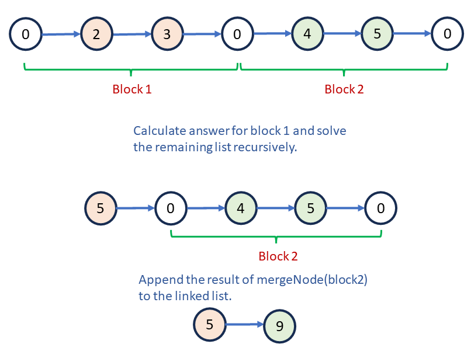

## Solution

---

### Approach 1: Two-Pointer (One-Pass)

#### Intuition

We can break this problem into two tasks: finding the sum of all the nodes between two consecutive `0`s, and merging these values into a single list. One brute force idea is to iterate through the linked list, summing the node values, and adding this sum to a new linked list when we encounter a `0`. However, we can modify the linked list in the given problem.

We can use a two-pointer approach to modify the list. The first pointer, `modify`, changes the linked list and the second pointer, `nextSum`, calculates the sum for each block between two `0`s. Initially, both pointers start at the beginning of the list.

How can we manage both pointers while traversing the list? After `nextSum` calculates the sum for the current block, we store this value at the `modify` node. Since `nextSum` is at a `0` at the end of the block, it moves to the next node to start summing the next block.

The number of nodes in the modified linked list matches the number of blocks between consecutive `0`s. After processing each block, we update `modify`'s next pointer to `nextSum`, helping maintain the size of the modified list, with both pointers reaching the end simultaneously.

#### Algorithm

1. Initialize `modify` and `nextSum` with `head->next` that stores the first node with a non-zero value.
2. Iterate through the list until `nextSum` is not null:
   - Initialize `sum` with `0` to store the sum of the current block.
   - Iterate through the block until `nextSum` encounters a `0`:
     - Add the value of the current node to `sum`.
     - Move `nextSum` to the next node.
   - Modify the node value at `modify` to `sum`.
   - Move `nextSum` to the next node that stores the next block's first non-zero value. Also, set `modify->next` to this node.
   - Move `modify` to it's next node.
3. Return `head->next`.

!?!../Documents/2181/slideshow1.json:960,454!?!

#### Implementation

```python
class Solution:
    def mergeNodes(self, head):
        # Initialize a sentinel/dummy node with the first non-zero value.
        modify = head.next
        next_sum = modify

        while next_sum:
            sum = 0
            # Find the sum of all nodes until you encounter a 0.
            while next_sum.val != 0:
                sum += next_sum.val
                next_sum = next_sum.next

            # Assign the sum to the current node's value.
            modify.val = sum
            # Move nextSum to the first non-zero value of the next block.
            next_sum = next_sum.next
            # Move modify also to this node.
            modify.next = next_sum
            modify = modify.next
        return head.next
```

#### Complexity Analysis

Let $n$ be the size of the linked list.

- Time complexity: $O(n)$

    All the nodes of the linked list are visited exactly once. Therefore, the total time complexity is given by $O(n)$.

- Space complexity: $O(1)$

    Apart from the original list, we don't use any additional space. Therefore, the total space complexity is given by $O(1)$.

---

### Approach 2: Recursion

#### Intuition

Recursion is useful for solving problems that can be broken down into smaller, repetitive sub-problems. Finding the sum of every 0-separated block is an example of such a sub-problem, making recursion an appropriate approach.

We can start at the beginning of a block with the current node's value as `0` and calculate the sum for this block by iterating through the list and adding values until encountering another `0`. At this point, the pointer will be at the start of the next block. The new list starting at this pointer resembles the original list but with one less block to compute. Therefore, we can pass this pointer to the recursive function as a new sub-problem, as explained below:



#### Algorithm

1. Store the first non-zero value, given by `head->next`, in `head`.
2. If `head` is null, return `head`.
3. Initialize a dummy node `temp` with `head`.
4. Initialize `sum` with `0`.
5. Iterate through the list until the value of `temp` is not `0`:
   - Increment `sum` with the value of `temp`.
   - Set `temp` as `temp->next`.
6. Store the updated `sum` in the value of `head`.
7. Store `head->next` as the solution of the sub-problem starting at `temp`, given by `mergeNodes(temp)`.
8. Return `head`.

#### Implementation

```python
class Solution:
    def mergeNodes(self, head):
        # Start with the first non-zero value.
        head = head.next
        if not head:
            return head

        # Initialize a dummy head node.
        temp = head
        sum = 0
        while temp.val != 0:
            sum += temp.val
            temp = temp.next

        # Store the sum in head's value.
        head.val = sum
        # Store head's next node as the recursive result for temp node.
        head.next = self.mergeNodes(temp)
        return head
```

#### Complexity Analysis

Let $n$ be the size of the linked list.

- Time complexity: $O(n)$

    All the nodes of the linked list are visited exactly once. Therefore, the total time complexity is given by $O(n)$.

- Space complexity: $O(n)$

    The extra space comes from implicit stack space due to recursion. The recursion could go up to $n$ levels deep. Therefore, the total space complexity is given by $O(n)$.

---