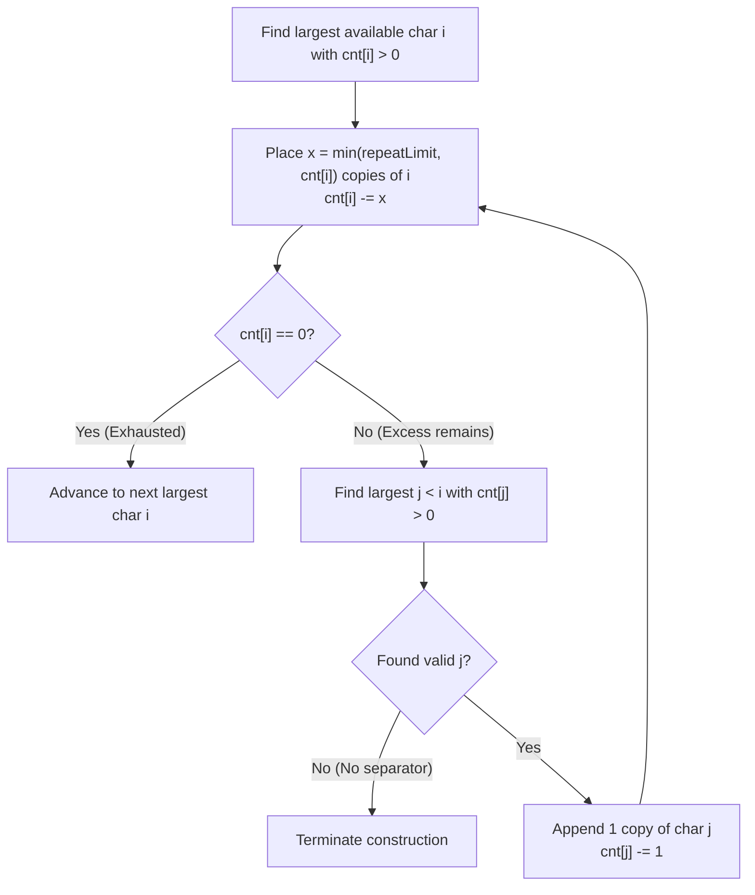

# Guided Example: Construct String With Repeat Limit

We analyze and trace the greedy alphabet-partitioned construction algorithm on a representative character multiset, demonstrating how alternating maximal runs of the largest available character with single-token separators maximizes lexicographical precedence under run-length constraints in $O(n + |\Sigma|)$ time.

- **Input:** `s = "cczazcc"`, `repeatLimit = 3`
- **Output:** `"zzcccac"`

This instance illustrates character frequency histogram compilation, maximal run chunking, secondary separator injection, and premature truncation when no viable separator exists.

---

## 1. Problem Overview & Representative Instance

Given a string `s` consisting of lowercase English letters and an integer `repeatLimit`, we must construct the **lexicographically largest** string using some or all characters from `s` such that:
1. No character appears more than `repeatLimit` times consecutively.
2. Unused characters may be discarded if incorporating them would violate the consecutive repeat limit.

In lexicographical comparison:
- Between two strings of the same length, the string having a later alphabetical letter at the first differing index is larger.
- If one string is a prefix of the other, the longer string is larger.

In our representative instance:
- `s = "cczazcc"`, `repeatLimit = 3`.
- Character inventory:
  - `'z'`: $2$ occurrences
  - `'c'`: $4$ occurrences
  - `'a'`: $1$ occurrence
- The absolute largest character is `'z'`. We place all $2$ copies: `"zz"`.
- The next largest character is `'c'`. We have $4$ copies, but `repeatLimit = 3` restricts consecutive copies to at most $3$. We place `"ccc"`, leaving $1$ copy of `'c'` remaining.
- String so far: `"zzccc"`.
- We cannot place the 4th `'c'` immediately. We must insert a separator. The largest available character strictly smaller than `'c'` is `'a'`.
- We insert exactly **one** copy of `'a'`, breaking the consecutive run: `"zzccca"`.
- With the run broken, we can now place the remaining $1$ copy of `'c'`: `"zzcccac"`.
- All available characters are exhausted; the final result is `"zzcccac"`.

---

## 2. Mathematical & Algorithmic Principles

### Lexicographical Greedy Choice Property

Let string $A$ and string $B$ differ at the earliest index $p$:
$$A[p] \ne B[p] \implies A > B \iff A[p] > B[p]$$
Because any difference at index $p$ dominates all positions $p + 1, p + 2, \dots$, the optimal construction policy must greedily place the largest possible character at each successive position from left to right:
1. Always attempt to place the largest available character $i$ from the alphabet ($\Sigma = \{\text{'z'}, \dots, \text{'a'}\}$).
2. To push larger characters as far left as possible, place the maximum legal block of character $i$:
   $$\text{run\_length} = \min(\text{repeatLimit}, \; \text{cnt}[i])$$

### Minimal Interleaving Separator

If $\text{cnt}[i] > 0$ after placing a full run of length $\text{repeatLimit}$:
- Placing another $i$ is illegal.
- To enable placing the remaining copies of $i$ later, we must insert a separator character $j$ where $j < i$ and $\text{cnt}[j] > 0$.
- To keep the string as lexicographically large as possible at this separator position, $j$ must be the **strictly largest available character smaller than $i$**.
- Furthermore, we must place **exactly 1 copy** of $j$. Placing more than 1 copy of $j$ would needlessly lower subsequent characters without providing any additional separation for character $i$.
- After placing $1$ copy of $j$, the run constraint on $i$ is reset, allowing up to another $\text{repeatLimit}$ copies of $i$ to follow immediately.

### Truncation on Exhaustion

If $\text{cnt}[i] > 0$ after a full run of $\text{repeatLimit}$, but no smaller character $j < i$ exists with $\text{cnt}[j] > 0$ (i.e. $j < 0$):
- We cannot legally separate the remaining copies of $i$.
- No smaller characters exist to place either.
- The construction must terminate immediately. Any residual copies of $i$ are discarded.

| Metric / Pointer | Role in Construction | Invariant Maintained |
|---|---|---|
| Index $i$ | Primary candidate character (descending from 25 to 0) | Always points to the highest priority letter currently available |
| Index $j$ | Separator pointer ($j < i$) | Locates the highest available character strictly smaller than $i$ |
| Run Length $x$ | $\min(\text{repeatLimit}, \text{cnt}[i])$ | Maximizes dominant character block without violation |
| Separator Quantity | Exactly $1$ token | Minimal required divergence to reset consecutive count |

---

## 3. Step-by-Step Walkthrough with Intermediate State

We trace `s = "cczazcc"` with `repeatLimit = 3`.

### Step 1: Character Counting
- Alphabet frequency table $\text{cnt}[0 \dots 25]$:
  - $\text{cnt}[\text{'a'}] = 1$
  - $\text{cnt}[\text{'c'}] = 4$
  - $\text{cnt}[\text{'z'}] = 2$
  - All other counts are $0$.
- Initialize output list `ans = []`.
- Initialize separator pointer `j = 24`.

### Step 2: Processing Character `'z'` ($i = 25$)
- Available count: $\text{cnt}[25] = 2$.
- Maximum allowed run: $x = \min(3, 2) = 2$.
- Append $2$ copies of `'z'`: `ans` becomes `["zz"]`.
- Decrement count: $\text{cnt}[25] = 2 - 2 = 0$.
- Since $\text{cnt}[25] == 0$, `'z'` is completely exhausted.
- Exit inner loop for $i = 25$.

### Step 3: Processing Character `'c'` ($i = 2$)
- Character `'c'` has index $2$.
- Available count: $\text{cnt}[2] = 4$.
- **First Chunk:**
  - $x = \min(3, 4) = 3$.
  - Append $3$ copies of `'c'`: `ans` becomes `["zz", "ccc"]`.
  - Decrement count: $\text{cnt}[2] = 4 - 3 = 1$.
  - Check remaining: $\text{cnt}[2] = 1 > 0$. Character `'c'` is NOT exhausted.
- **Locating Separator:**
  - We must find the largest $j < 2$ with $\text{cnt}[j] > 0$.
  - $j = 1$ (`'b'`): $\text{cnt}[1] = 0$.
  - $j = 0$ (`'a'`): $\text{cnt}[0] = 1 > 0$. Found $j = 0$!
- **Placing Separator:**
  - Append exactly $1$ copy of `'a'`: `ans` becomes `["zz", "ccc", "a"]`.
  - Decrement count: $\text{cnt}[0] = 1 - 1 = 0$.
- **Second Chunk (Resuming `'c'`):**
  - Next iteration for $i = 2$:
  - Available count: $\text{cnt}[2] = 1$.
  - $x = \min(3, 1) = 1$.
  - Append $1$ copy of `'c'`: `ans` becomes `["zz", "ccc", "a", "c"]`.
  - Decrement count: $\text{cnt}[2] = 1 - 1 = 0$.
  - Since $\text{cnt}[2] == 0$, `'c'` is exhausted!
  - Exit inner loop for $i = 2$.

### Step 4: Subsequent Characters ($i = 1, 0$)
- $i = 1$ (`'b'`): $\text{cnt}[1] = 0$.
- $i = 0$ (`'a'`): $\text{cnt}[0] = 0$.
- Outer loop finishes.
- Concatenate `ans`: `"zzcccac"`.

---

## 4. Comprehensive State Trace

The state of character frequencies and construction steps is detailed below:

| Construction Round | Active Letter $i$ | Action / Chunk Added | Remaining Counts $\text{cnt}$ | Resulting String Prefix | Notes |
|---|---|---|---|---|---|
| Start | None | Initialization | `{'z': 2, 'c': 4, 'a': 1}` | `""` | Frequency map built |
| 1 | `'z'` | Append `"zz"` ($x = 2$) | `{'z': 0, 'c': 4, 'a': 1}` | `"zz"` | `'z'` exhausted |
| 2 | `'c'` | Append `"ccc"` ($x = 3$) | `{'c': 1, 'a': 1}` | `"zzccc"` | Hit `repeatLimit` |
| 3 (Separator) | `'a'` | Append `"a"` ($1$ token) | `{'c': 1, 'a': 0}` | `"zzccca"` | Reset run constraint |
| 4 | `'c'` | Append `"c"` ($x = 1$) | `{'c': 0, 'a': 0}` | `"zzcccac"` | `'c'` exhausted |
| Halt | None | Final Join | All counts zero | `"zzcccac"` | All characters used |

### Character Inventory Consumption Matrix

| Character | Initial Inventory | Retained in Output | Discarded Count | Roles in Output String |
|---|---|---|---|---|
| `'z'` | 2 | 2 | 0 | Lead characters (positions 0, 1) |
| `'c'` | 4 | 4 | 0 | Primary run (positions 2, 3, 4) and tail (position 6) |
| `'a'` | 1 | 1 | 0 | Interleaving separator (position 5) |
| **Total** | **7** | **7** | **0** | **Length 7 result** |

---

## 5. Algorithmic Correctness & Soundness

### Optimality of Greedy Placement
Suppose there exists a valid string $S^*$ that is lexicographically strictly greater than our constructed string $S$.
Let $k$ be the first index where they differ: $S^*[k] > S[k]$.
- By our construction algorithm, $S[k]$ was chosen as the largest character available that did not violate the `repeatLimit` constraint.
- For $S^*[k]$ to be strictly greater than $S[k]$, $S^*$ must place a character $C > S[k]$ at position $k$.
- However, if $C$ had remaining positive count, the algorithm would have selected $C$ unless placing $C$ would exceed `repeatLimit` consecutive copies of $C$.
- If placing $C$ exceeded `repeatLimit`, then $S^*$ also has $\text{repeatLimit} + 1$ consecutive copies of $C$ up to index $k$, which violates the problem constraint and renders $S^*$ invalid.
Therefore, no valid string can be lexicographically strictly greater than $S$.

---

## 6. Edge Cases & Anti-Patterns

### Edge Cases
1. **No Separator Available (Early Truncation):**
   - E.g., `s = "aaaaa"`, `repeatLimit = 2`.
   - Character `'a'` has count 5.
   - We place `"aa"`. There is no character smaller than `'a'` ($j < 0$).
   - Construction halts immediately; returns `"aa"`, discarding the other 3 `'a'`s.
2. **`repeatLimit` Exceeds String Length:**
   - E.g., `s = "aababab"`, `repeatLimit = 10`.
   - Characters are simply sorted in descending order without needing separators: `"bbbaaaa"`.
3. **Alternating Run Depletion:**
   - E.g., `s = "aababab"`, `repeatLimit = 2`.
   - Initial counts: `'b': 3, 'a': 4`.
   - Append `"bb"`, separate with `"a"`, append `"b"`, append `"aa"`, separate with nothing. Returns `"bbabaa"` with 1 unused `'a'`.

### Anti-Patterns to Avoid
- **Placing Multiple Separator Characters at Once:** Taking more than $1$ separator token (e.g. appending `"aa"` instead of `"a"`) needlessly places smaller characters earlier than required, reducing the lexicographical rank.
- **Heap Allocation Overhead for Fixed Alphabet:** While a max-heap can track available characters, maintaining an array of size $26$ and two descending pointers runs in $O(1)$ auxiliary memory without heap rebalancing overhead.
- **String Concatenation in a Loop:** Using `s += char` creates $O(N^2)$ string copy operations. Appending to a list and calling `"".join(ans)` guarantees $O(N)$ runtime.

---

## 7. Complexity Analysis

- **Time Complexity:** $O(n + |\Sigma|)$ where $n = |s|$ and $|\Sigma| = 26$. Counting characters takes $O(n)$ time. The pointers $i$ and $j$ only decrement from $25$ down to $0$, visiting each alphabet index at most a constant number of times. Building the final string takes $O(n)$ time. The overall time is strictly linear $O(n)$.
- **Auxiliary Space Complexity:** $O(|\Sigma|) = O(1)$. The frequency array `cnt` requires exactly $26$ integers. Excluding the returned string memory, auxiliary memory is $O(1)$.
