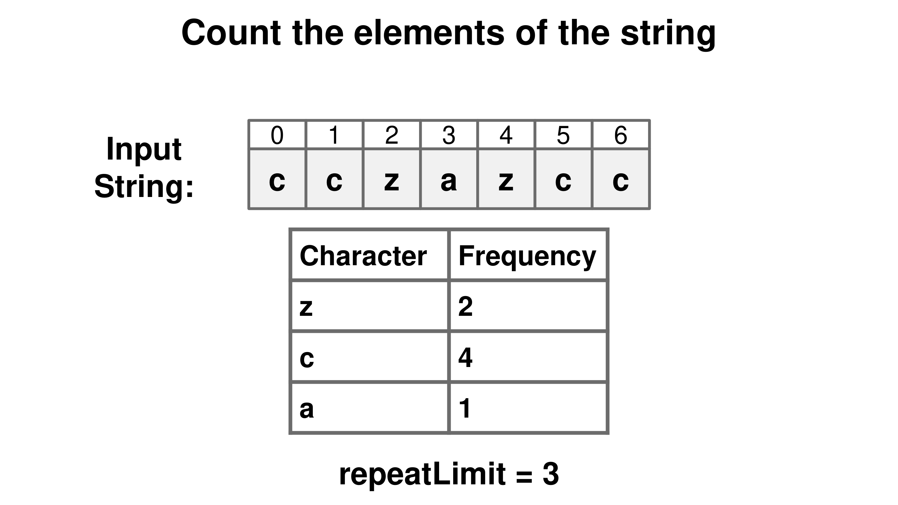
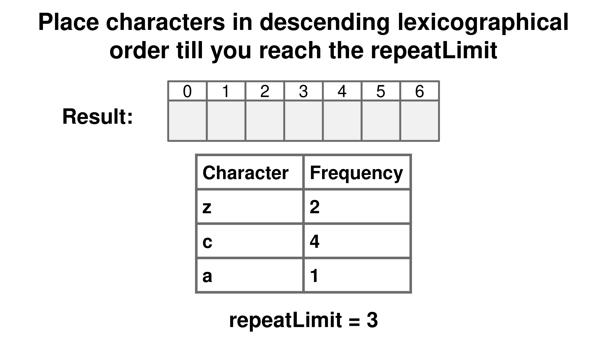
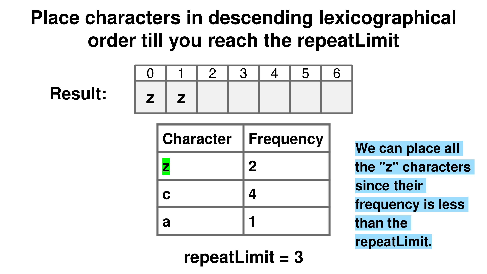
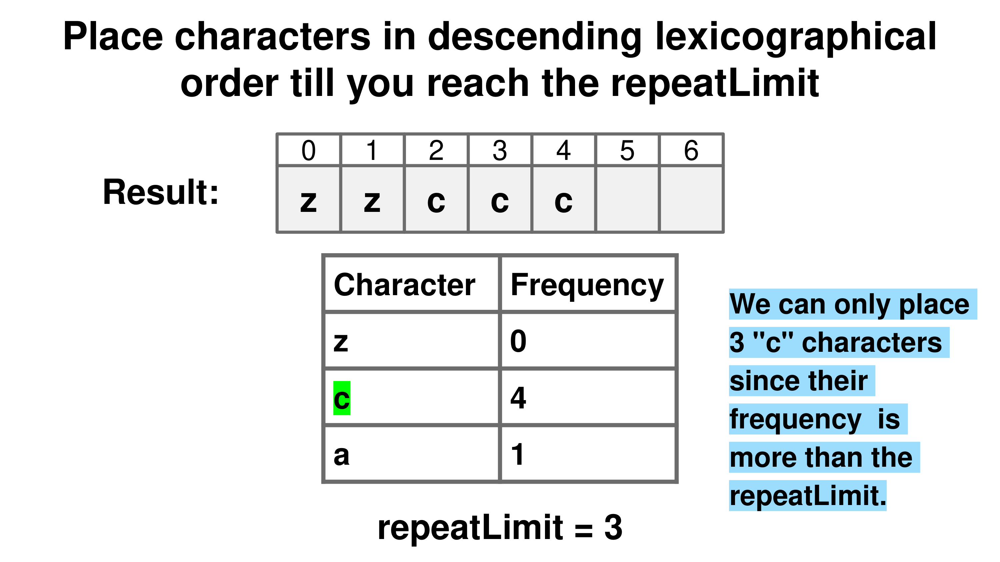
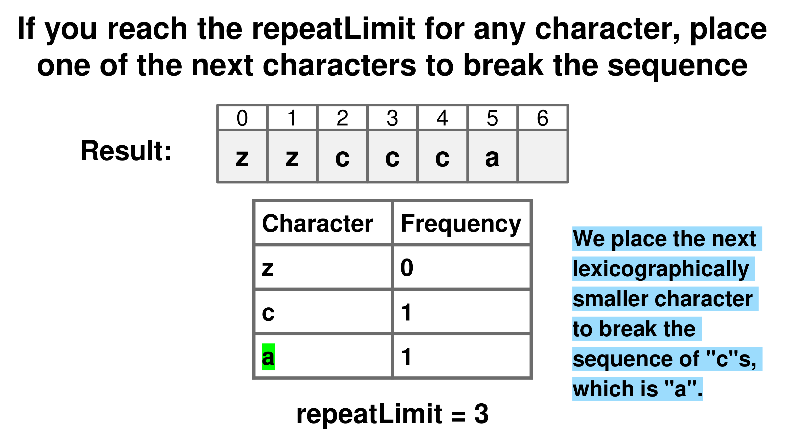
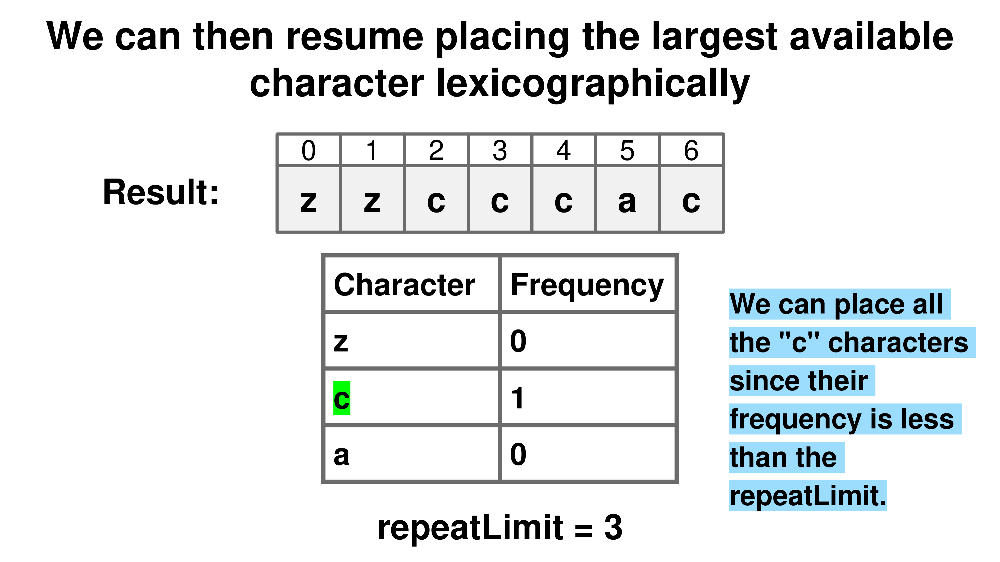
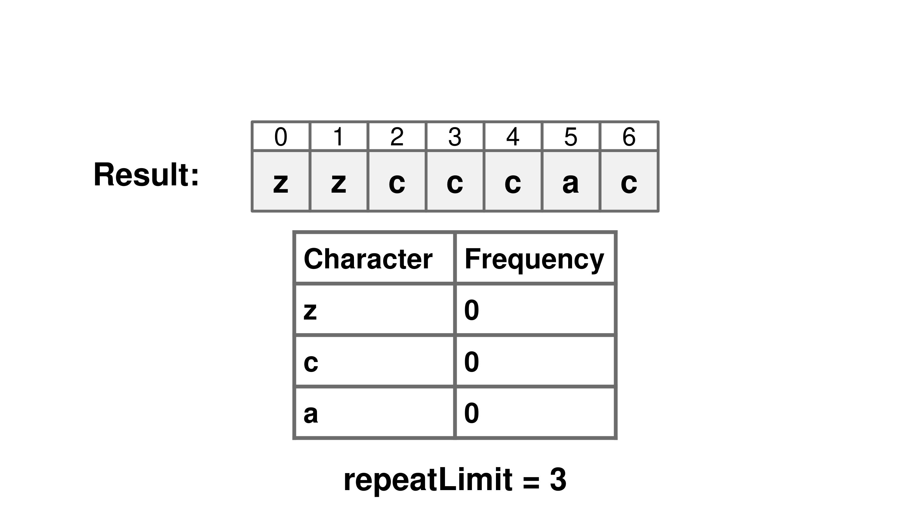

## Solution

---

### Overview

We need to construct the longest possible string under specific constraints, where no character can appear consecutively more than a given limit. A real-life application of this problem could be in designing passwords, where specific characters (letters, numbers, or symbols) need to be distributed without excessive repetition while adhering to complexity rules.

---

### Approach 1: Greedy Character Frequency Distribution

#### Intuition

The key to solving this problem is to focus on the largest letters first, as they help create a string that’s lexicographically larger. However, we need to be careful not to use the same letter too many times in a row due to the limit on consecutive usage. To handle this, we should alternate between letters to avoid hitting the limit. This involves keeping track of how many times each letter has been used and strategically choosing the largest permissible letter at each step.

The process works like this: we start with the largest letter available and add as many of it as we can, stopping just before we reach the limit. Once we hit the limit, we switch to a smaller letter to "break the streak". After adding the smaller letter, we can go back to the larger letter if it’s still available.

To switch to a smaller letter, we need to have one available as a "breaker". If we run out of smaller letters to alternate with, we have to stop, because adding more characters would break the rule.















#### Algorithm

- Create a frequency array (`freq`) of size 26 to count the occurrences of each character in the string.
- Iterate over the string, mapping each character to its corresponding index, and increment the respective value in `freq`.
- Initialize an empty list (`result`) to build the final result string.
- Set a pointer (`current_char_index`) to 25, representing the largest character (`z`).

- While `current_char_index` is greater than or equal to 0:
  - If the frequency of the current character is zero, decrement `current_char_index` to move to the next smaller character and continue.
  - Determine how many times the current character can be added to the result consecutively (`use`), which is the minimum of its frequency and `repeatLimit`.
  - Append `use` instances of the character to the `result` list.
  - Subtract `use` from the frequency of the current character in `freq`.
  - If the current character still has remaining occurrences:
- Find a smaller character to act as a breaker (`smaller_char_index`), starting from $current_char_index - 1$.
- Decrement `smaller_char_index` until a character with a non-zero frequency is found.
- If no such smaller character exists (all smaller frequencies are zero), break the loop as further construction of the result is not possible.
- Append one instance of the smaller character to the `result`.
- Decrement the frequency of the smaller character in `freq` by 1.

- Join the characters in `result` to form the final string and return it.

#### Implementation

```python
class Solution:
    def repeatLimitedString(self, s: str, repeatLimit: int) -> str:
        freq = [0] * 26
        for char in s:
            freq[ord(char) - ord("a")] += 1

        result = []
        current_char_index = 25  # Start from the largest character
        while current_char_index >= 0:
            if freq[current_char_index] == 0:
                current_char_index -= 1
                continue

            use = min(freq[current_char_index], repeatLimit)
            result.append(chr(current_char_index + ord("a")) * use)
            freq[current_char_index] -= use

            if freq[current_char_index] > 0:  # Need to add a smaller character
                smaller_char_index = current_char_index - 1
                while smaller_char_index >= 0 and freq[smaller_char_index] == 0:
                    smaller_char_index -= 1
                if smaller_char_index < 0:
                    break
                result.append(chr(smaller_char_index + ord("a")))
                freq[smaller_char_index] -= 1

        return "".join(result)
```

Let $N$ be the length of `s` and $K$ be the number of unique characters in `s`.

* Time Complexity: $O(N \cdot K)$

    The time complexity of the approach is $O(N \cdot K)$. The initial loop that counts character frequencies runs in $O(N)$ time.

    The outer while loop executes at most $K$ times, which is at most 26 times for this problem since there are at most 26 unique characters in the input string. The inner while loop, which finds the next available character with a non-zero frequency, runs at most 25 times in the worst case.

    For instance, consider the string `s = "zzzzzzzaaaaaaa"` with $repeatLimit = 1$. After exhausting the repeat limit for `z`, the inner loop iterates to locate `a`, which involves up to 25 steps. This results in an $O(N \cdot K)$ time complexity because for each character in the string of length $N$, we may need to perform up to K operations to find the next available character.

* Space Complexity: $O(K)$

    The space used by the `freq` array is $O(K)$, where $K$ is 26 characters at most.

    The `result` will store the final string, which in the worst case will be of size `N`, but this is not considered in the space complexity analysis as it is part of the output.

    Therefore, the overall space complexity is $O(K)$.

---

### Approach 2: Heap-Optimized Greedy Character Frequency Distribution

#### Intuition

The previous approach has a time complexity of $O(N \cdot K)$, where $K$ represents the number of unique characters in `s`. Given that $K$ is small for this problem (a maximum of 26 unique characters), this time complexity is manageable. However, this method will become less efficient if we need to handle a larger set of unique characters. So, let's explore ways to optimize it further.

Since the main goal is to consistently pick the largest available character, it’s better to use a data structure that lets us quickly access and update the count of the character with the highest priority. A priority queue (or max heap) is perfect for this because it dynamically keeps the characters organized by priority. This way, instead of scanning all characters repeatedly, we can focus only on the most relevant ones.

As we build the string, we always pick the largest character first and add as many of it as the repeat limit allows. Once we hit the limit, we face the challenge of finding a "breaker" — a different character to interrupt the sequence.

To find this breaker, we look for the next largest character in the priority queue. If one is available, we add it to the string and decrease its count. After using it, we check if it still has more occurrences left; if it does, we put it back into the priority queue for future use.

If no breaker is available, the construction of the string stops. This happens because no other characters can be inserted without violating the constraints, making it impossible to continue building the string while maintaining both the repeat limit and lexicographical order.

> For a more comprehensive understanding of heaps and priority queues, check out the [Heap Explore Card 🔗](https://leetcode.com/explore/learn/card/heap/). This resource provides an in-depth look at heap-based algorithms, explaining their key concepts and applications with a variety of problems to solidify understanding of the pattern.

#### Algorithm

- Create a frequency map (`freq`) to count the occurrences of each character in the string.
- Initialize a max-heap (`maxHeap`) to store the characters, ordered by their natural descending order.
- Add all characters from the frequency map to the max-heap.
- Initialize a string (`result`) to build the final result.

- While the max-heap is not empty:
  - Poll the character with the highest lexicographical value (`ch`) from the heap.
  - Retrieve its count from the frequency map (`freq`).
  - Determine the number of times the character can be used (`use`) as the minimum of `count` and `repeatLimit`.
  - Append `ch` to `result` exactly `use` times.
  - Update the frequency map for `ch` by subtracting `use`.
  - If `ch` still has remaining occurrences and the max-heap is not empty:
- Poll the next character with the highest lexicographical value (`nextCh`) from the heap.
- Append `nextCh` to `result`.
- Decrease its frequency in the map by 1.
- If `nextCh` still has occurrences remaining, reinsert it into the max-heap.
- Reinsert `ch` into the max-heap to process its remaining occurrences.

- Return the string representation of `result`.

#### Implementation

> **Note:** In the Python solution, we store the negative of the character's ordinal value (`-ord(c)`) in the heap to simulate a max-heap. This is necessary because Python's `heapq` library implements a min-heap by default. By negating the ordinal value, we ensure that characters with higher ASCII values (e.g., 'z') are prioritized when elements are popped from the heap, effectively mimicking the behavior of a max-heap.

```python
class Solution:
    def repeatLimitedString(self, s: str, repeatLimit: int) -> str:
        max_heap = [(-ord(c), cnt) for c, cnt in Counter(s).items()]
        heapify(max_heap)
        result = []

        while max_heap:
            char_neg, count = heappop(max_heap)
            char = chr(-char_neg)
            use = min(count, repeatLimit)
            result.append(char * use)

            if count > use and max_heap:
                next_char_neg, next_count = heappop(max_heap)
                result.append(chr(-next_char_neg))
                if next_count > 1:
                    heappush(max_heap, (next_char_neg, next_count - 1))
                heappush(max_heap, (char_neg, count - use))

        return "".join(result)
```

Let $N$ be the length of `s` and $K$ be the number of unique characters in `s`.

* Time Complexity: $O(N \cdot \log K)$

    The time complexity of this approach is dominated by the operations on the heap, which is used to efficiently access and modify the most frequent characters. The size of the heap is bounded by the number of unique characters, denoted as $K$, so the heap operations (push and pop) take $O(\log K)$ time.

    In the worst case, we perform two heap operations for every character in the string, resulting in $O(N)$ heap operations. Each heap operation involves pushing or popping an element, which takes $O(\log K)$ time.

    Therefore, the overall time complexity of the solution is $O(N \cdot \log K)$.

* Space Complexity: $O(K)$

    The space complexity of this approach is $O(K)$. This is because the heap and the frequency counter stores up to $K$ values.

---