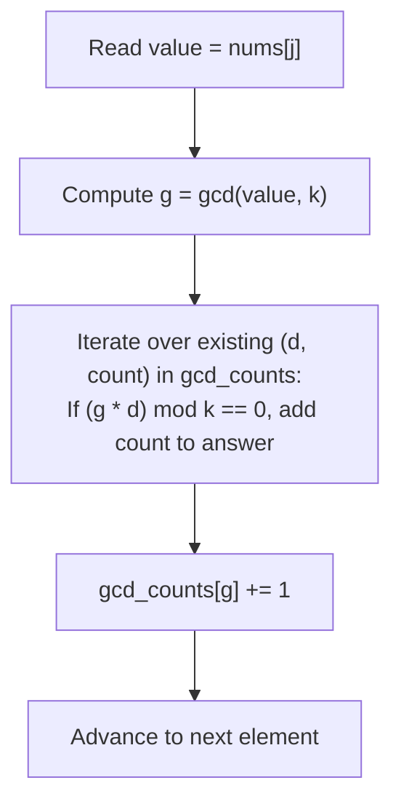

# Guided Example: Count Array Pairs Divisible by K

We analyze and trace the number-theoretic greatest common divisor (GCD) frequency aggregation algorithm on a representative integer array, demonstrating how projecting array values onto the divisor lattice of $k$ reduces pair divisibility checking from $O(n^2)$ to $O(n \cdot d(k))$ time.

- **Input:** `nums = [1, 2, 3, 4, 5]`, `k = 2`
- **Output:** `7`

This instance illustrates $p$-adic prime valuation equivalence, divisor lattice projection, streaming frequency histogram accumulation, and 64-bit pair counting.

---

## 1. Problem Overview & Representative Instance

Given a 0-indexed integer array `nums` of length $n$ and a positive integer $k$, we must count the number of index pairs $(i, j)$ with $0 \le i < j < n$ such that the product of their values is divisible by $k$:
$$(\text{nums}[i] \cdot \text{nums}[j]) \bmod k = 0$$

The values themselves do not need to be individually divisible by $k$; separate prime factors from $\text{nums}[i]$ and $\text{nums}[j]$ may combine to satisfy the factorization of $k$.

In our representative instance:
- `nums = [1, 2, 3, 4, 5]` of length $n = 5$, with divisor $k = 2$.
- The total number of index pairs is $\binom{5}{2} = 10$.
- For $k = 2$, a product $a \cdot b$ is even if and only if at least one of $a$ or $b$ is even.
- The even numbers in `nums` are $2$ (index 1) and $4$ (index 3).
- The odd numbers in `nums` are $1$ (index 0), $3$ (index 2), and $5$ (index 4).
- Pairs consisting of two odd numbers fail:
  - $(1, 3), (1, 5), (3, 5)$ fail ($3$ pairs).
- All other $10 - 3 = 7$ pairs contain at least one even number and qualify:
  - $(1, 2), (2, 3), (2, 4), (2, 5), (1, 4), (3, 4), (4, 5)$ ($7$ pairs).
- Total qualifying pairs: $7$.

---

## 2. Mathematical & Algorithmic Principles

### The GCD Divisibility Reduction Theorem

Let $a$ and $b$ be positive integers. Any prime factors of $a$ and $b$ that do not divide $k$ are irrelevant to whether $k$ divides $a \cdot b$.
Define:
$$g_a = \gcd(a, k), \quad g_b = \gcd(b, k)$$

**Theorem.** For any integers $a, b, k \ge 1$:
$$k \mid (a \cdot b) \iff k \mid (\gcd(a, k) \cdot \gcd(b, k))$$

*Proof.*
Consider the prime factorization of $k = \prod p_i^{e_i}$.
For each prime $p_i$, let the $p_i$-adic valuations of $a$ and $b$ be $u_i = v_{p_i}(a)$ and $w_i = v_{p_i}(b)$.
- $k \mid (a \cdot b) \iff u_i + w_i \ge e_i$ for all prime factors $p_i$.
- By definition of the greatest common divisor:
  $$v_{p_i}(\gcd(a, k)) = \min(u_i, e_i), \quad v_{p_i}(\gcd(b, k)) = \min(w_i, e_i)$$
- If $u_i + w_i \ge e_i$:
  - If either $u_i \ge e_i$ or $w_i \ge e_i$, then $\min(u_i, e_i) + \min(w_i, e_i) \ge e_i + 0 = e_i$.
  - If both $u_i < e_i$ and $w_i < e_i$, then $\min(u_i, e_i) + \min(w_i, e_i) = u_i + w_i \ge e_i$.
In all cases, $\min(u_i, e_i) + \min(w_i, e_i) \ge e_i \iff u_i + w_i \ge e_i$.
Thus, replacing each value $x$ by $\gcd(x, k)$ preserves divisibility by $k$ with zero loss of precision.

### The Bounded Divisor Space

Every value of $\gcd(x, k)$ is, by definition, a **divisor of $k$**.
Let $d(k)$ be the number of divisors of $k$.
For $k \le 10^5$:
$$\max_{k \le 10^5} d(k) = 128 \quad (\text{achieved at } k = 75{,}600 \text{ and } 90{,}720)$$

Even though the array `nums` can contain $10^5$ distinct elements, their projected GCD values belong to a set of size at most $128$.
By maintaining a frequency map of seen GCD values:
- For each number $x \in \text{nums}$, compute $g = \gcd(x, k)$ in $O(\log k)$ time.
- Iterate over the at most $128$ keys in the frequency map.
- If $(g \cdot d) \bmod k == 0$, add $\text{count}[d]$ to the answer.
- Increment $\text{count}[g] += 1$.

| Parameter / Entity | Mathematical Form | Meaning in Algorithm |
|---|---|---|
| Target Divisor $k$ | Integer in $[1, 10^5]$ | Universal modulus for pair products |
| Current GCD $g$ | $\gcd(\text{nums}[j], k)$ | Prime factor contribution of current element |
| Previous Divisor $d$ | Divisor of $k$ | GCD of an already-processed element |
| Compatibility Test | $(g \cdot d) \bmod k == 0$ | Verifies if pair product is a multiple of $k$ |
| Divisor Count $d(k)$ | $|\{d \in \mathbb{N} : d \mid k\}| \le 128$ | Upper bound on active hash map keys |

---

## 3. Step-by-Step Walkthrough with Intermediate State

We trace `nums = [1, 2, 3, 4, 5]` with $k = 2$.
Divisors of $k = 2$ are $\{1, 2\}$.
Initialize `gcd_counts = Counter()`, `answer = 0`.

### Step 1: Processing Index $j = 0$ (`nums[0] = 1`)
- Compute GCD: $g = \gcd(1, 2) = 1$.
- Query `gcd_counts`: Empty. No pairs formed.
- Update `gcd_counts`: `gcd_counts[1] += 1`.
- State: `gcd_counts = {1: 1}`, `answer = 0`.

### Step 2: Processing Index $j = 1$ (`nums[1] = 2`)
- Compute GCD: $g = \gcd(2, 2) = 2$.
- Query `gcd_counts`:
  - Divisor $d = 1$ (count 1): $(2 \cdot 1) \bmod 2 = 2 \bmod 2 = 0$. Condition holds!
  - Add count $1$ to `answer`: `answer = 0 + 1 = 1` (Pair $(1, 2)$).
- Update `gcd_counts`: `gcd_counts[2] += 1`.
- State: `gcd_counts = {1: 1, 2: 1}`, `answer = 1`.

### Step 3: Processing Index $j = 2$ (`nums[2] = 3`)
- Compute GCD: $g = \gcd(3, 2) = 1$.
- Query `gcd_counts`:
  - Divisor $d = 1$ (count 1): $(1 \cdot 1) \bmod 2 = 1 \ne 0$. Fails.
  - Divisor $d = 2$ (count 1): $(1 \cdot 2) \bmod 2 = 2 \bmod 2 = 0$. Condition holds!
  - Add count $1$ to `answer`: `answer = 1 + 1 = 2` (Pair $(2, 3)$).
- Update `gcd_counts`: `gcd_counts[1] += 1`.
- State: `gcd_counts = {1: 2, 2: 1}`, `answer = 2`.

### Step 4: Processing Index $j = 3$ (`nums[3] = 4`)
- Compute GCD: $g = \gcd(4, 2) = 2$.
- Query `gcd_counts`:
  - Divisor $d = 1$ (count 2): $(2 \cdot 1) \bmod 2 = 0$. Condition holds! Add $2$.
  - Divisor $d = 2$ (count 1): $(2 \cdot 2) \bmod 2 = 0$. Condition holds! Add $1$.
  - Added this step: $2 + 1 = 3$ (Pairs $(1, 4), (3, 4), (2, 4)$).
  - `answer = 2 + 3 = 5`.
- Update `gcd_counts`: `gcd_counts[2] += 1`.
- State: `gcd_counts = {1: 2, 2: 2}`, `answer = 5`.

### Step 5: Processing Index $j = 4$ (`nums[4] = 5`)
- Compute GCD: $g = \gcd(5, 2) = 1$.
- Query `gcd_counts`:
  - Divisor $d = 1$ (count 2): $(1 \cdot 1) \bmod 2 = 1 \ne 0$. Fails.
  - Divisor $d = 2$ (count 2): $(1 \cdot 2) \bmod 2 = 0$. Condition holds! Add $2$.
  - Added this step: $2$ (Pairs $(2, 5), (4, 5)$).
  - `answer = 5 + 2 = 7`.
- Update `gcd_counts`: `gcd_counts[1] += 1`.
- State: `gcd_counts = {1: 3, 2: 2}`, `answer = 7`.

### Step 6: Finalization
- Array fully traversed. Return `answer = 7`.

---

## 4. Comprehensive State Trace

The full state evolution across all elements is recorded below:

| Index $j$ | Element `nums[j]` | Current GCD $g$ | Compatible Stored Divisors $d$ | Additive Pairs Discovered | Cumulative `answer` | Updated `gcd_counts` |
|---|---|---|---|---|---|---|
| 0 | 1 | 1 | None (Map empty) | 0 | 0 | `{1: 1}` |
| 1 | 2 | 2 | $d = 1$ (count 1) | 1 (Pair $(1, 2)$) | 1 | `{1: 1, 2: 1}` |
| 2 | 3 | 1 | $d = 2$ (count 1) | 1 (Pair $(2, 3)$) | 2 | `{1: 2, 2: 1}` |
| 3 | 4 | 2 | $d = 1$ (cnt 2), $d = 2$ (cnt 1) | 3 (Pairs $(1, 4), (3, 4), (2, 4)$) | 5 | `{1: 2, 2: 2}` |
| 4 | 5 | 1 | $d = 2$ (count 2) | 2 (Pairs $(2, 5), (4, 5)$) | **7** | `{1: 3, 2: 2}` |

### Complementary Factor Analysis for $k = 6$ (`nums = [2, 3]`)

| Element | Computed GCD $g = \gcd(x, 6)$ | Prime Factors Supplied | Stored Complement $d$ | Combined Factors | Divisible by 6? |
|---|---|---|---|---|---|
| 2 | 2 | $\{2^1\}$ | — | — | — |
| 3 | 3 | $\{3^1\}$ | $d = 2$ | $\{2^1, 3^1\} = 6$ | **Yes** ($2 \times 3 = 6 \equiv 0 \pmod 6$) |

---

## 5. Algorithmic Correctness & Soundness

### Soundness of Left-to-Right Online Accumulation
Every pair $(i, j)$ satisfies $i < j$.
When processing index $j$, the map `gcd_counts` contains exactly the GCD projections of all indices $i < j$.
No future element $k > j$ is in the map, so $(j, k)$ is not counted prematurely.
When index $j$ finishes, its GCD is added to the map so that all future elements can pair with it.
Thus, every unordered pair $\{i, j\}$ is considered exactly once, guaranteeing completeness and zero double counting.

### Precision of Divisor Modulo Check
Because $\gcd(a, k)$ contains all and only the prime powers of $k$ that divide $a$, the product $\gcd(a, k) \cdot \gcd(b, k)$ is a multiple of $k$ if and only if $a \cdot b$ is a multiple of $k$.
Hence, no false positive or false negative can occur.

---

## 6. Edge Cases & Anti-Patterns

### Edge Cases
1. **$k = 1$ (Universal Divisibility):**
   - Every product is divisible by $1$.
   - $\gcd(x, 1) = 1$ for all $x$. The map contains only key $1$.
   - For each step $j$, adds $j$ to the answer, resulting in $\sum_{j=0}^{n-1} j = \frac{n(n - 1)}{2}$.
2. **Prime Modulus $k$ (e.g., $k = 7$):**
   - Divisors are only $\{1, k\}$.
   - $(g \cdot d) \bmod k == 0 \iff g = k \lor d = k$.
   - Exactly matches the requirement that at least one number must be a multiple of $k$.
3. **64-Bit Integer Overflow:**
   - For $n = 10^5$, the number of pairs can reach $\approx 5 \times 10^9$, exceeding standard 32-bit integer limits.
   - `answer` must be a 64-bit integer (`long long`).
4. **No Pairs Qualify (e.g. `nums = [1, 2, 3, 4]`, $k = 5$):**
   - No combination contains factor $5$; correctly returns $0$.

### Anti-Patterns to Avoid
- **Naive $O(n^2)$ Product Check:** Iterating through all pairs and checking `(nums[i] * nums[j]) % k == 0` requires $5 \times 10^9$ operations, causing immediate TLE.
- **Large Integer Overflow in Direct Multiplication:** If $nums[i] \approx 10^5$, direct product $10^{10}$ fits in 64 bits, but if extended to larger numbers, multiplying values directly can overflow standard machine registers. Multiplying GCDs $g \cdot d \le k^2 \le 10^{10}$ remains strictly bounded.
- **Iterating Over All Integers $1 \dots k$:** Iterating over all numbers instead of the populated keys in `gcd_counts` takes $O(k)$ per step instead of $O(d(k))$, degrading performance by orders of magnitude.

---

## 7. Complexity Analysis

- **Time Complexity:** $O(n \cdot (\log(\min(\max(\text{nums}), k)) + d(k)))$ where $n$ is array length and $d(k) \le 128$ is the number of divisors of $k$. For each of the $n$ numbers, computing the GCD takes $O(\log k)$ Euclidean steps ($\le 17$ iterations). Querying the active divisors takes at most $d(k) \le 128$ iterations. Total operations are bounded by $10^5 \times (17 + 128) \approx 1.45 \times 10^7$, running in under $0.2$ seconds.
- **Auxiliary Space Complexity:** $O(d(k))$. The hash map stores at most $d(k)$ distinct keys. For $k \le 10^5$, $d(k) \le 128$, requiring less than $1$ kilobyte of auxiliary memory.
