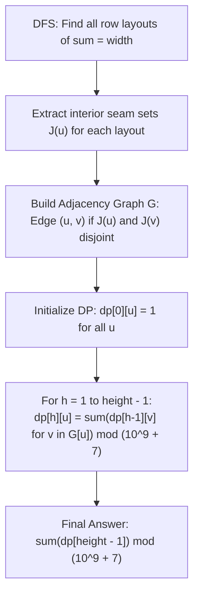

# Guided Example: Number of Ways to Build Sturdy Brick Wall

We analyze and execute the two-phase layout generation and transfer-matrix dynamic programming algorithm on a representative wall construction instance, demonstrating how partitioning rows into disjoint seam bitmasks and evaluating compatibility graph walks counts sturdy brick configurations modulo $10^9 + 7$ in $O(R^2 \cdot \text{height})$ time.

- **Input:** `height = 2`, `width = 3`, `bricks = [1, 2]`
- **Output:** `2`

This instance demonstrates recursive row decomposition, interior joint coordinate extraction, bitwise seam disjointness verification, compatibility graph synthesis, and layer-by-layer DP propagation.

---

## 1. Problem Overview & Representative Instance

We are tasked with constructing a sturdy brick wall of dimensions `height x width` using an unlimited supply of bricks of height $1$ and lengths specified in the array `bricks`.
1. Each row must be completely filled by placing bricks end-to-end such that their lengths sum exactly to `width`.
2. Vertical joints (seams) occur where two adjacent bricks in the same row meet.
3. A wall is **sturdy** if and only if **no two adjacent rows share a vertical joint at the same interior position**. (Joints at the outer borders $0$ and $\text{width}$ are allowed and expected).
4. We must compute the total number of distinct sturdy walls, modulo $10^9 + 7$.

In our representative instance:
- `height = 2`, `width = 3`, `bricks = [1, 2]`.
- All possible ways to fill a row of width $3$:
  - Layout 0: $[1, 1, 1]$ (interior seams at positions $1$ and $2$).
  - Layout 1: $[1, 2]$ (interior seam at position $1$).
  - Layout 2: $[2, 1]$ (interior seam at position $2$).
- Checking compatibility between adjacent rows:
  - Layout 0 has seams $\{1, 2\}$. Any adjacent row with a seam at $1$ or $2$ collides. Layout 0 collides with all three layouts (including itself) and cannot be used in a 2-row wall.
  - Layout 1 has seam $\{1\}$.
  - Layout 2 has seam $\{2\}$.
  - Since $\{1\} \cap \{2\} = \emptyset$, Layout 1 and Layout 2 share no interior seam and are fully compatible!
- Feasible 2-row configurations:
  - Row 1: $[1, 2]$, Row 2: $[2, 1]$.
  - Row 1: $[2, 1]$, Row 2: $[1, 2]$.
- Total sturdy walls: $2$.

---

## 2. Mathematical & Algorithmic Principles

### Phase 1: Row Layout Generation & Interior Seam Projection

Let $R$ be the number of distinct ordered sequences of bricks $(b_1, b_2, \dots, b_k)$ such that $\sum_{m=1}^k b_m = \text{width}$.
For `width <= 10`, $R$ is bounded by the Fibonacci-like sequence (at most $R \le 116$ for `width = 10` with minimum brick length 1).

For a layout $A = [b_1, b_2, \dots, b_k]$, its interior vertical seams are the partial sums strictly inside $(0, \text{width})$:
$$J(A) = \left\{ \sum_{m=1}^p b_m \;\middle|\; 1 \le p < k \right\}$$

Because $\text{width} \le 10$, each seam set $J(A)$ can be encoded as an integer bitmask $M(A)$ where the $p$-th bit is $1$ if a seam exists at position $p$:
$$M(A) = \sum_{s \in J(A)} 2^s$$

### Phase 2: Seam Disjointness & Compatibility Graph

Two row layouts $A$ and $B$ can be placed in adjacent vertical layers if and only if they share no common interior seam:
$$J(A) \cap J(B) = \emptyset \iff M(A) \ \& \ M(B) = 0$$

We construct a directed compatibility graph $G$ with $R$ vertices:
$$G = (V, E), \quad (u, v) \in E \iff J(u) \cap J(v) = \emptyset$$

### Phase 3: Layer-by-Layer Dynamic Programming

Let $dp[h][u]$ be the number of valid sturdy walls of height $h$ whose uppermost row is layout $u$.
- **Base Case ($h = 1$):**
  A wall of height $1$ has no adjacent rows, so every valid row layout is sturdy on its own:
  $$dp[1][u] = 1, \quad \forall u \in \{0, 1, \dots, R - 1\}$$
- **Transition ($h \ge 2$):**
  To place layout $u$ at layer $h$, the preceding row at layer $h - 1$ can be any layout $v$ adjacent to $u$ in graph $G$:
  $$dp[h][u] = \sum_{v \in G[u]} dp[h - 1][v] \pmod{10^9 + 7}$$
- **Final Result:**
  $$\text{Total Sturdy Walls} = \sum_{u=0}^{R - 1} dp[\text{height}][u] \pmod{10^9 + 7}$$

| Component | Mathematical Definition | Algorithmic Role |
|---|---|---|
| Layout $u$ | Ordered brick list $[b_1, \dots, b_k]$ | Concrete horizontal arrangement |
| Seam Set $J(u)$ | Partial sums in $[1, \text{width} - 1]$ | Points of potential structural weakness |
| Compatibility Edge $(u, v)$ | $J(u) \cap J(v) = \emptyset$ | Indicates adjacent vertical stacking is sturdy |
| State $dp[h][u]$ | Count of sturdy walls of height $h$ ending in $u$ | Dynamic programming memoization cell |
| Modulus | $10^9 + 7$ | Prevents large integer overflow |

---

## 3. Step-by-Step Walkthrough with Intermediate State

We trace `height = 2`, `width = 3`, `bricks = [1, 2]`.

### Step 1: DFS Generation of Row Layouts
- Call `dfs(0)` with available bricks `[1, 2]`:
  - Path $1 \to 1 \to 1$: Sum = $3$. Layout 0: `[1, 1, 1]`.
  - Path $1 \to 2$: Sum = $3$. Layout 1: `[1, 2]`.
  - Path $2 \to 1$: Sum = $3$. Layout 2: `[2, 1]`.
- Total valid layouts: $R = 3$.

### Step 2: Interior Seam Extraction
- **Layout 0 (`[1, 1, 1]`):**
  - Prefix sums: $1, 1 + 1 = 2$.
  - Interior seams: $J_0 = \{1, 2\}$.
- **Layout 1 (`[1, 2]`):**
  - Prefix sums: $1$.
  - Interior seams: $J_1 = \{1\}$.
- **Layout 2 (`[2, 1]`):**
  - Prefix sums: $2$.
  - Interior seams: $J_2 = \{2\}$.

### Step 3: Pairwise Compatibility Matrix & Graph Construction
We test $J(u) \cap J(v) = \emptyset$ for all pairs $(u, v) \in \{0, 1, 2\} \times \{0, 1, 2\}$:
- **Pair (0, 0):** $\{1, 2\} \cap \{1, 2\} = \{1, 2\} \ne \emptyset$ (Incompatible).
- **Pair (0, 1):** $\{1, 2\} \cap \{1\} = \{1\} \ne \emptyset$ (Incompatible).
- **Pair (0, 2):** $\{1, 2\} \cap \{2\} = \{2\} \ne \emptyset$ (Incompatible).
- **Pair (1, 1):** $\{1\} \cap \{1\} = \{1\} \ne \emptyset$ (Incompatible).
- **Pair (1, 2):** $\{1\} \cap \{2\} = \emptyset$ (**Compatible!**).
- **Pair (2, 2):** $\{2\} \cap \{2\} = \{2\} \ne \emptyset$ (Incompatible).
- Graph adjacency lists:
  - $G[0] = []$
  - $G[1] = [2]$
  - $G[2] = [1]$

### Step 4: Layer-by-Layer DP Evaluation
- `dp` table initialized with dimensions `height = 2`, $R = 3$.
- **Layer $h = 0$ (Height 1 baseline):**
  - $dp[0][0] = 1$
  - $dp[0][1] = 1$
  - $dp[0][2] = 1$
- **Layer $h = 1$ (Height 2 transitions):**
  - Layout 0: $G[0]$ is empty $\implies dp[1][0] = 0$.
  - Layout 1: $G[1] = [2] \implies dp[1][1] = dp[0][2] = 1$.
  - Layout 2: $G[2] = [1] \implies dp[1][2] = dp[0][1] = 1$.

### Step 5: Result Summation
- Sum across all configurations at layer $h = 1$:
  $$\text{Total} = dp[1][0] + dp[1][1] + dp[1][2] = 0 + 1 + 1 = 2$$
- Return $2 \pmod{10^9 + 7} = 2$.

---

## 4. Comprehensive State Trace

The row layout configurations and seam intersections are detailed below:

| Layout Index $u$ | Brick Sequence | Brick Count | Interior Seam Positions $J(u)$ | Seam Bitmask (Binary) |
|---|---|---|---|---|
| 0 | `[1, 1, 1]` | 3 | $\{1, 2\}$ | `0000000110` ($6$) |
| 1 | `[1, 2]` | 2 | $\{1\}$ | `0000000010` ($2$) |
| 2 | `[2, 1]` | 2 | $\{2\}$ | `0000000100` ($4$) |

### Pairwise Compatibility Truth Table ($J_u \cap J_v = \emptyset$)

| Layout $u$ \ Layout $v$ | Layout 0 (`[1, 1, 1]`) | Layout 1 (`[1, 2]`) | Layout 2 (`[2, 1]`) |
|---|---|---|---|
| **Layout 0** | False (shared seams 1, 2) | False (shared seam 1) | False (shared seam 2) |
| **Layout 1** | False (shared seam 1) | False (shared seam 1) | **True (disjoint: 1 vs 2)** |
| **Layout 2** | False (shared seam 2) | **True (disjoint: 2 vs 1)** | False (shared seam 2) |

### Dynamic Programming Table Across Layers

| Height Level $h$ | $dp[h][0]$ (Layout 0) | $dp[h][1]$ (Layout 1) | $dp[h][2]$ (Layout 2) | Level Total |
|---|---|---|---|---|
| $h = 0$ (Height 1) | 1 | 1 | 1 | 3 |
| **$h = 1$ (Height 2)** | **0** | **1** | **1** | **2** |

---

## 5. Algorithmic Correctness & Soundness

### Isomorphism to Directed Walks on the Compatibility Graph
A wall of height $H$ is a sequence of row layouts $(r_1, r_2, \dots, r_H)$.
By the problem definition, the wall is sturdy if and only if for every $1 \le i < H$, rows $r_i$ and $r_{i+1}$ share no interior seams:
$$(r_i, r_{i+1}) \in E(G), \quad \forall 1 \le i < H$$
This definition is strictly identical to a directed walk of length $H - 1$ in the compatibility graph $G$.
The DP recurrence $dp[h][u] = \sum_{v \in G[u]} dp[h-1][v]$ is the standard mathematical formula for counting walks in a graph.
Every valid sturdy wall corresponds bijectively to exactly one valid walk, guaranteeing both soundness and completeness.

---

## 6. Edge Cases & Anti-Patterns

### Edge Cases
1. **`width` Cannot Be Reached:**
   - E.g., `width = 1`, `bricks = [5]`.
   - DFS generates $R = 0$ layouts. The algorithm cleanly returns $0$.
2. **Height 1 Wall (`height = 1`):**
   - No two rows exist to create an adjacent seam conflict.
   - Every valid layout is sturdy; returns $R \pmod{10^9 + 7}$.
3. **Single Brick Covering Full Width:**
   - E.g., `bricks = [width]`.
   - A single brick of length `width` has **no interior seams** ($J = \emptyset$).
   - It is compatible with all layouts, including itself!
   - For `bricks = [5], width = 5, height = 10`, returns $1^{10} = 1$.

### Anti-Patterns to Avoid
- **Generating Whole Walls via Global Backtracking:** Recursively exploring all bricks for all cells in the wall leads to branching factor $10^{100}$, causing an immediate freeze. Decomposing into single-row layouts $R \le 116$ and running DP solves the problem instantaneously.
- **Checking Seam Sets Repeatedly During DP:** Checking seam collisions on-the-fly inside the DP loop repeats the collision test $\text{height} \cdot R^2$ times. Precomputing the adjacency list graph $G$ in $O(R^2)$ eliminates all repeated checks.
- **Missing Modulo Operations:** Summing large counts across $100$ layers quickly exceeds 64-bit integers; applying `% mod` at each step preserves arithmetic correctness.

---

## 7. Complexity Analysis

- **Time Complexity:** $O(R \cdot 2^{\text{width}} + R^2 + \text{height} \cdot R^2)$. For $\text{width} \le 10$, the number of valid row layouts $R \le 116$. Generating layouts takes negligible time ($< 1 \text{ ms}$). Building graph $G$ takes $O(R^2) \le 116^2 \approx 1.3 \times 10^4$ operations. The DP transitions run for $\text{height} \le 100$ layers, requiring at most $100 \times 116^2 \approx 1.3 \times 10^6$ operations. Overall runtime is strictly under $20$ milliseconds.
- **Auxiliary Space Complexity:** $O(R^2 + \text{height} \cdot R)$. Storing the compatibility graph takes $O(R^2)$ space, and the DP table requires $\text{height} \times R$ entries ($100 \times 116 \approx 11{,}600$ integers), using less than $1$ megabyte of RAM.
