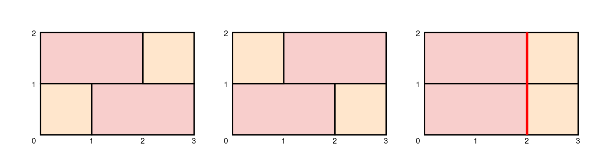

### 1. Description

You are given integers `height` and `width` which specify the dimensions of a brick wall you are building. You are also given a **0-indexed** array of **unique** integers `bricks`, where the $i^{\text{th}}$ brick has a height of `1` and a width of $\text{bricks}[i]$. You have an **infinite **supply of each type of brick and bricks may **not** be rotated.

Each row in the wall must be exactly `width` units long. For the wall to be **sturdy**, adjacent rows in the wall should **not **join bricks at the same location, except at the ends of the wall.

Return *the number of ways to build a **sturdy **wall.* Since the answer may be very large, return it **modulo** $10^{9} + 7$.

### 2. Function Contract

- Refer to method signature.

### 3. Examples

#### Example 1

- **Input:** $height = 2, width = 3, bricks = [1,2]$
- **Output:** `2`
- **Explanation:** The first two walls in the diagram show the only two ways to build a sturdy brick wall.
Note that the third wall in the diagram is not sturdy because adjacent rows join bricks 2 units from the left.

#### Example 2

- **Input:** $height = 1, width = 1, bricks = [5]$
- **Output:** `0`
- **Explanation:** There are no ways to build a sturdy wall because the only type of brick we have is longer than the width of the wall.

### 4. Constraints

- $1 \le height \le 100$

- $1 \le width \le 10$

- $1 \le \text{bricks.length} \le 10$

- $1 \le \text{bricks}[i] \le 10$

- All the values of `bricks` are **unique**.
