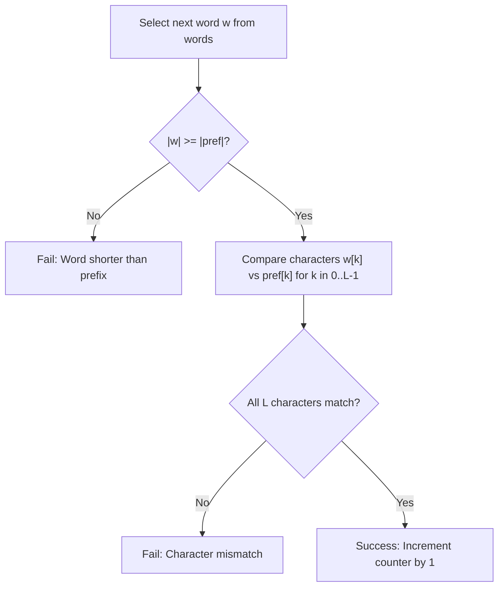

# Guided Example: Counting Words With a Given Prefix

We analyze and trace the linear prefix-matching verification algorithm on a representative word collection, demonstrating how positional string comparison and early-exit character validation count qualifying prefix matches in $O(\sum \min(|w|, |\text{pref}|))$ time.

- **Input:** `words = ["pay", "attention", "practice", "attend"]`, `pref = "at"`
- **Output:** `2`

This instance illustrates index-anchored substring comparisons, length prerequisite gating, character-by-character short-circuit verification, and running match accumulation.

---

## 1. Problem Overview & Representative Instance

Given an array of strings `words` and a target string `pref`, we must count the number of strings in `words` that contain `pref` as a **prefix**.
A string `pref` of length $L = |\text{pref}|$ is defined as a prefix of word $w$ if and only if:
1. The word is at least as long as the prefix: $|w| \ge L$.
2. The first $L$ characters of $w$ are identical to `pref`:
   $$w[0 \dots L - 1] = \text{pref}[0 \dots L - 1]$$

Occurrences of `pref` starting at any later index (in the interior or at the suffix of $w$) do not qualify.

In our representative instance:
- `words = ["pay", "attention", "practice", "attend"]`, target `pref = "at"` ($L = 2$).
- Word 0 (`"pay"`): Characters at $0 \dots 1$ are `"pa"`. `"pa" != "at"` $\implies$ No match.
- Word 1 (`"attention"`): Characters at $0 \dots 1$ are `"at"`. `"at" == "at"` $\implies$ Match!
- Word 2 (`"practice"`): Characters at $0 \dots 1$ are `"pr"`. `"pr" != "at"` $\implies$ No match.
- Word 3 (`"attend"`): Characters at $0 \dots 1$ are `"at"`. `"at" == "at"` $\implies$ Match!
- Total qualifying words: $2$.

---

## 2. Mathematical & Algorithmic Principles

### Formal Prefix Relation

Let $\Sigma^*$ be the set of strings over the alphabet. The prefix relation $\sqsubseteq$ is defined as:
$$\text{pref} \sqsubseteq w \iff |w| \ge |\text{pref}| \quad \land \quad \forall k \in \{0, 1, \dots, |\text{pref}| - 1\}: w[k] = \text{pref}[k]$$

This relation possesses two critical structural properties:
1. **Length Monotonicity:** If $|w| < |\text{pref}|$, then $\text{pref} \not\sqsubseteq w$ trivially. No character comparisons are necessary.
2. **Early Mismatch Short-Circuiting:** If $w[k] \ne \text{pref}[k]$ for any $k < |\text{pref}|$, the condition fails immediately, allowing the algorithm to abort the comparison for word $w$ without inspecting subsequent characters.

### Linear Scan with In-Place Comparison

Rather than slicing substrings (which allocates new string memory in memory-managed languages), each word $w \in \text{words}$ is tested via character indexing:
- If $|w| < |\text{pref}|$, return `False`.
- For $k = 0, 1, \dots, |\text{pref}| - 1$:
  - If $w[k] \ne \text{pref}[k]$, return `False`.
- Return `True`.

Summing the boolean verdicts across all $w \in \text{words}$ yields the exact count.

| Component / Variable | Mathematical Representation | Operational Meaning |
|---|---|---|
| Target Prefix `pref` | String of length $L = \lvert \text{pref} \rvert$ | Fixed template string |
| Candidate Word $w$ | String of length $\lvert w \rvert$ | Element being verified |
| Length Gate | $\lvert w \rvert \ge L$ | Necessary condition before character checks |
| Character Match | $w[k] == \text{pref}[k]$ | Pointwise character equivalence |
| Accumulator | $\sum_{w \in \text{words}} \mathbf{1}_{\{\text{pref} \sqsubseteq w\}}$ | Cumulative count of verified matches |

---

## 3. Step-by-Step Walkthrough with Intermediate State

We trace `words = ["pay", "attention", "practice", "attend"]` with `pref = "at"`.
Prefix length $L = 2$. Target characters: $\text{pref}[0] = \text{'a'}, \text{pref}[1] = \text{'t'}$.
Initialize `ans = 0`.

### Step 1: Evaluating `words[0] = "pay"`
- Length check: $|w| = 3 \ge 2$ (Pass).
- Compare $k = 0$: $w[0] = \text{'p'}$, $\text{pref}[0] = \text{'a'}$.
- Mismatch detected at $k = 0$ ($\text{'p'} \ne \text{'a'}$)!
- Short-circuit immediately. Verdict: False.
- Counter `ans` remains $0$.

### Step 2: Evaluating `words[1] = "attention"`
- Length check: $|w| = 9 \ge 2$ (Pass).
- Compare $k = 0$: $w[0] = \text{'a'}$, $\text{pref}[0] = \text{'a'}$ (Match).
- Compare $k = 1$: $w[1] = \text{'t'}$, $\text{pref}[1] = \text{'t'}$ (Match).
- All $L = 2$ characters verified! Verdict: True.
- Increment counter: `ans = 0 + 1 = 1`.

### Step 3: Evaluating `words[2] = "practice"`
- Length check: $|w| = 8 \ge 2$ (Pass).
- Compare $k = 0$: $w[0] = \text{'p'}$, $\text{pref}[0] = \text{'a'}$.
- Mismatch at $k = 0$ ($\text{'p'} \ne \text{'a'}$)!
- Short-circuit immediately. Verdict: False.
- Counter `ans` remains $1$.

### Step 4: Evaluating `words[3] = "attend"`
- Length check: $|w| = 6 \ge 2$ (Pass).
- Compare $k = 0$: $w[0] = \text{'a'}$, $\text{pref}[0] = \text{'a'}$ (Match).
- Compare $k = 1$: $w[1] = \text{'t'}$, $\text{pref}[1] = \text{'t'}$ (Match).
- All $L = 2$ characters verified! Verdict: True.
- Increment counter: `ans = 1 + 1 = 2`.

### Step 5: Termination
- All words evaluated. Final output: `ans = 2`.

---

## 4. Comprehensive State Trace

The evaluation of each candidate word against the target prefix is detailed below:

| Index | Candidate Word $w$ | Length $\lvert w \rvert$ | Length Check ($\lvert w \rvert \ge 2$) | Character $0$ ($w[0]$ vs `'a'`) | Character $1$ ($w[1]$ vs `'t'`) | Prefix Match? | Cumulative `ans` |
|---|---|---|---|---|---|---|---|
| 0 | `"pay"` | 3 | Pass | `'p'` vs `'a'` (Mismatch) | Skipped (Short-circuit) | False | 0 |
| 1 | `"attention"` | 9 | Pass | `'a'` vs `'a'` (Match) | `'t'` vs `'t'` (Match) | **True** | 1 |
| 2 | `"practice"` | 8 | Pass | `'p'` vs `'a'` (Mismatch) | Skipped (Short-circuit) | False | 1 |
| 3 | `"attend"` | 6 | Pass | `'a'` vs `'a'` (Match) | `'t'` vs `'t'` (Match) | **True** | **2** |

### Comparison Across Boundary Cases

| Word Category | Example Word | Target `pref` | Why It Fails / Passes | Result |
|---|---|---|---|---|
| Shorter than Prefix | `"a"` | `"at"` | Length $1 < 2$; cannot contain 2 characters | False |
| Exact Identity | `"at"` | `"at"` | Exact match across all characters | **True** |
| Interior Substring | `"format"` | `"at"` | Contains `"at"` at index 4, but index 0 is `'f'` | False |
| Suffix Only | `"cat"` | `"at"` | Ends with `"at"`, but index 0 is `'c'` | False |

---

## 5. Algorithmic Correctness & Soundness

### Soundness of Prefix Testing
By definition, a string $w$ has prefix `pref` if and only if the slice $w[0 \dots |\text{pref}| - 1]$ equals `pref`.
The comparison checks each character $w[k] == \text{pref}[k]$ from index $0$ to $|\text{pref}| - 1$.
Because equality of strings is equivalent to the conjunction of equality across all corresponding characters:
$$w[0 \dots L-1] = \text{pref} \iff \bigwedge_{k=0}^{L-1} (w[k] = \text{pref}[k])$$
The test returns true if and only if every character matches. No non-matching word can produce a true verdict.

### Independence and Completeness
Each word in `words` is evaluated independently.
Because the array traversal visits every word $w \in \text{words}$ exactly once, no word is skipped and no word is evaluated multiple times, ensuring completeness and exact counting.

---

## 6. Edge Cases & Anti-Patterns

### Edge Cases
1. **Word Shorter than Prefix ($|w| < |\text{pref}|$):**
   - E.g., $w = \text{"a"}$, $\text{pref} = \text{"app"}$.
   - Length check prevents index-out-of-bounds exceptions and returns false immediately.
2. **Exact Equality ($w == \text{pref}$):**
   - E.g., $w = \text{"at"}$, $\text{pref} = \text{"at"}$.
   - A string is always a prefix of itself; correctly evaluates to true.
3. **Internal Substrings That Are Not Prefixes:**
   - E.g., $w = \text{"format"}$, $\text{pref} = \text{"at"}$.
   - Checking `pref in w` would falsely return true because `"at"` is a substring. Checking index 0 ensures only true prefixes are accepted.
4. **Duplicate Words in Input:**
   - E.g., `words = ["a", "a", "ab"]`, `pref = "a"`.
   - Each position in `words` is counted independently, correctly returning $3$.

### Anti-Patterns to Avoid
- **Using `in` Substring Search:** Testing `if pref in w` is incorrect because it matches substrings anywhere in the word, not just at index 0.
- **Unnecessary Trie Construction for Single Query:** Building a prefix tree (Trie) takes additional time and memory allocations. A single-pass linear scan using native string operations runs in $O(\sum \min(|w|, |\text{pref}|))$ without data structure overhead.

---

## 7. Complexity Analysis

- **Time Complexity:** $O(\sum_{w \in \text{words}} \min(|w|, |\text{pref}|))$. For each word $w$, comparing characters stops at the first mismatch or after $|\text{pref}|$ characters. With $|\text{words}| \le 100$ and lengths $\le 100$, the maximum total character comparisons is $100 \times 100 = 10{,}000$, executing in under $0.5$ milliseconds.
- **Auxiliary Space Complexity:** $O(1)$. No dynamic memory, auxiliary arrays, or heap structures are allocated during the scan.
