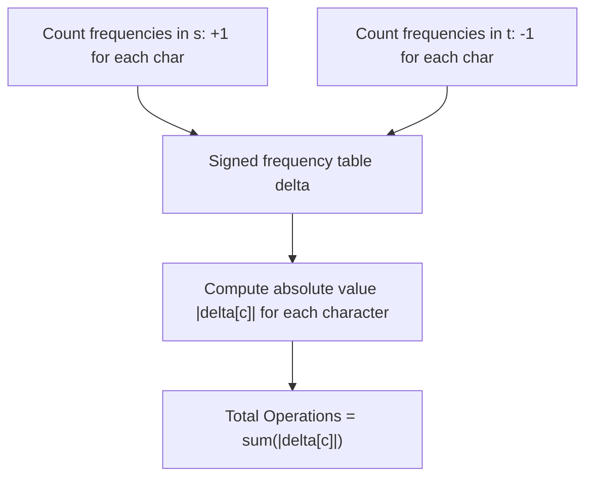

# Guided Example: Minimum Number of Steps to Make Two Strings Anagram II

We analyze and trace the differential character-frequency vector algorithm on a representative pair of strings, demonstrating how computing the $L_1$ Manhattan distance between the frequency histograms of two strings determines the exact minimum number of append operations needed to form anagrams in $O(|s| + |t|)$ time.

- **Input:** `s = "leetcode"`, `t = "coats"`
- **Output:** `7`

This instance demonstrates Parikh frequency vector decomposition, monotonic non-decreasing character counts under appends, asymmetric character deficits, and absolute difference summation.

---

## 1. Problem Overview & Representative Instance

Two strings $s$ and $t$ are anagrams if and only if every character in the alphabet occurs with the exact same frequency in both strings.
In one step, we may append any lowercase English letter to **either** $s$ or $t$. Existing characters cannot be deleted, replaced, or rearranged.
We must compute the **minimum total number of single-character appends** required to make $s$ and $t$ anagrams.

In our representative instance:
- String $s = \text{"leetcode"}$ of length $8$.
- String $t = \text{"coats"}$ of length $5$.
- Character inventories:
  - In $s$: `'c': 1, 'd': 1, 'e': 3, 'l': 1, 'o': 1, 't': 1`.
  - In $t$: `'a': 1, 'c': 1, 'o': 1, 's': 1, 't': 1`.
- Reconciling deficits:
  - $t$ has one `'a'`, but $s$ has none: Append $1$ copy of `'a'` to $s$.
  - $s$ and $t$ each have one `'c'`: Balanced ($0$ appends).
  - $s$ has one `'d'`, but $t$ has none: Append $1$ copy of `'d'` to $t$.
  - $s$ has three `'e'`s, but $t$ has none: Append $3$ copies of `'e'` to $t$.
  - $s$ has one `'l'`, but $t$ has none: Append $1$ copy of `'l'` to $t$.
  - $s$ and $t$ each have one `'o'`: Balanced ($0$ appends).
  - $t$ has one `'s'`, but $s$ has none: Append $1$ copy of `'s'` to $s$.
  - $s$ and $t$ each have one `'t'`: Balanced ($0$ appends).
- Appends to $s$: $1 + 1 = 2$ (letters `'a'`, `'s'`).
- Appends to $t$: $1 + 3 + 1 = 5$ (letters `'d'`, `'e'`, `'e'`, `'e'`, `'l'`).
- Total appends: $2 + 5 = 7$.

---

## 2. Mathematical & Algorithmic Principles

### Anagram Invariant via Parikh Vectors

Let $\Sigma = \{\text{'a'}, \dots, \text{'z'}\}$ be the English alphabet of size $|\Sigma| = 26$.
The Parikh vector $\vec{f}(s) \in \mathbb{N}^{26}$ assigns each character $c \in \Sigma$ its frequency in $s$:
$$\vec{f}(s)_c = \text{freq}_s(c)$$
Two strings $s'$ and $t'$ are anagrams if and only if their Parikh vectors are identical:
$$s' \sim_{\text{anagram}} t' \iff \forall c \in \Sigma: \; \vec{f}(s')_c = \vec{f}(t')_c$$

### Monotonic Appends and Target Frequency Lower Bound

Because the only permitted operation is **appending** a character, existing characters cannot be removed.
Therefore, for any valid resulting anagram strings $s'$ and $t'$ derived from $s$ and $t$:
$$\vec{f}(s')_c \ge \vec{f}(s)_c \quad \text{and} \quad \vec{f}(t')_c \ge \vec{f}(t)_c, \quad \forall c \in \Sigma$$
Because the final counts must be equal ($\vec{f}(s')_c = \vec{f}(t')_c = F(c)$), the target frequency $F(c)$ must satisfy:
$$F(c) \ge \max(\vec{f}(s)_c, \; \vec{f}(t)_c)$$

To minimize the total number of appended characters, we must set $F(c)$ to its minimum possible legal value:
$$F^*(c) = \max(\vec{f}(s)_c, \; \vec{f}(t)_c)$$
The number of characters appended to $s$ is:
$$\Delta_s = \sum_{c \in \Sigma} (F^*(c) - \vec{f}(s)_c) = \sum_{c \in \Sigma} \max(0, \; \vec{f}(t)_c - \vec{f}(s)_c)$$
The number of characters appended to $t$ is:
$$\Delta_t = \sum_{c \in \Sigma} (F^*(c) - \vec{f}(t)_c) = \sum_{c \in \Sigma} \max(0, \; \vec{f}(s)_c - \vec{f}(t)_c)$$

### The $L_1$ Manhattan Distance Equivalence

Summing the appends to both strings:
$$\text{Total Appends} = \Delta_s + \Delta_t = \sum_{c \in \Sigma} \left( \max(0, \vec{f}(t)_c - \vec{f}(s)_c) + \max(0, \vec{f}(s)_c - \vec{f}(t)_c) \right) = \sum_{c \in \Sigma} |\vec{f}(s)_c - \vec{f}(t)_c|$$
Thus, the minimum operations required is exactly the **$L_1$ norm** $\|\vec{f}(s) - \vec{f}(t)\|_1$ between the two frequency vectors.

| Parameter / Vector | Mathematical Definition | Operational Meaning |
|---|---|---|
| Frequency $\vec{f}(s)_c$ | Count of letter $c$ in string $s$ | Initial supply in first string |
| Frequency $\vec{f}(t)_c$ | Count of letter $c$ in string $t$ | Initial supply in second string |
| Net Difference $\Delta[c]$ | $\vec{f}(s)_c - \vec{f}(t)_c$ | Signed surplus / deficit for character $c$ |
| Absolute Cost $|\Delta[c]|$ | $|\vec{f}(s)_c - \vec{f}(t)_c|$ | Individual character appends needed |
| Total Steps | $\sum_{c \in \Sigma} |\Delta[c]|$ | Global minimum append operations |

---

## 3. Step-by-Step Walkthrough with Intermediate State

We trace `s = "leetcode"` and `t = "coats"`.

### Step 1: Initialize Frequency Counter from $s$
- Scan string $s = \text{"leetcode"}$:
  - `'l'`: $+1$
  - `'e'`: $+1 + 1 + 1 = +3$
  - `'t'`: $+1$
  - `'c'`: $+1$
  - `'o'`: $+1$
  - `'d'`: $+1$
- Intermediate table `cnt`:
  `{'c': 1, 'd': 1, 'e': 3, 'l': 1, 'o': 1, 't': 1}`.

### Step 2: Decrement Frequencies for Characters in $t$
- Scan string $t = \text{"coats"}$:
  - `'c'`: $\text{cnt}[\text{'c'}] = 1 - 1 = 0$.
  - `'o'`: $\text{cnt}[\text{'o'}] = 1 - 1 = 0$.
  - `'a'`: $\text{cnt}[\text{'a'}] = 0 - 1 = -1$.
  - `'t'`: $\text{cnt}[\text{'t'}] = 1 - 1 = 0$.
  - `'s'`: $\text{cnt}[\text{'s'}] = 0 - 1 = -1$.
- Final delta map:
  - `'a'`: $-1$ (deficit in $s$; $1$ append to $s$)
  - `'c'`: $0$
  - `'d'`: $+1$ (surplus in $s$; $1$ append to $t$)
  - `'e'`: $+3$ (surplus in $s$; $3$ appends to $t$)
  - `'l'`: $+1$ (surplus in $s$; $1$ append to $t$)
  - `'o'`: $0$
  - `'s'`: $-1$ (deficit in $s$; $1$ append to $s$)
  - `'t'`: $0$

### Step 3: Sum Absolute Values
- Summing over all non-zero entries:
  $$\text{Total} = |-1| + |0| + |1| + |3| + |1| + |0| + |-1| + |0| = 1 + 0 + 1 + 3 + 1 + 0 + 1 + 0 = 7$$
- Minimum append operations: $7$.

---

## 4. Comprehensive State Trace

The character-by-character frequency breakdown and append allocation is detailed below:

| Character $c$ | Frequency in $s$ | Frequency in $t$ | Signed Delta $\text{freq}_s - \text{freq}_t$ | Absolute Difference $|\Delta|$ | Required Action |
|---|---|---|---|---|---|
| `'a'` | 0 | 1 | -1 | **1** | Append $1$ copy of `'a'` to $s$ |
| `'c'` | 1 | 1 | 0 | **0** | No action needed |
| `'d'` | 1 | 0 | +1 | **1** | Append $1$ copy of `'d'` to $t$ |
| `'e'` | 3 | 0 | +3 | **3** | Append $3$ copies of `'e'` to $t$ |
| `'l'` | 1 | 0 | +1 | **1** | Append $1$ copy of `'l'` to $t$ |
| `'o'` | 1 | 1 | 0 | **0** | No action needed |
| `'s'` | 0 | 1 | -1 | **1** | Append $1$ copy of `'s'` to $s$ |
| `'t'` | 1 | 1 | 0 | **0** | No action needed |
| All Others | 0 | 0 | 0 | **0** | No action needed |
| **Sum** | **8** | **5** | — | **7** | **7 total appends** |

### Resulting Balanced Strings Configuration

| String Target | Initial Content | Characters Appended | Final Length | Resulting Character Multiset |
|---|---|---|---|---|
| Modified $s'$ | `"leetcode"` | `['a', 's']` | 10 | `{'a':1, 'c':1, 'd':1, 'e':3, 'l':1, 'o':1, 's':1, 't':1}` |
| Modified $t'$ | `"coats"` | `['d', 'e', 'e', 'e', 'l']` | 10 | `{'a':1, 'c':1, 'd':1, 'e':3, 'l':1, 'o':1, 's':1, 't':1}` |

---

## 5. Algorithmic Correctness & Soundness

### Lower Bound Proof
Let $k$ be the number of appends made to $s$ and $m$ be the number of appends made to $t$.
Then the final length of $s'$ is $|s| + k$ and the final length of $t'$ is $|t| + m$.
For each character $c \in \Sigma$, let $k_c$ and $m_c$ be the copies of $c$ appended to $s$ and $t$.
Because $s'$ and $t'$ are anagrams:
$$\text{freq}_s(c) + k_c = \text{freq}_t(c) + m_c$$
$$\iff k_c - m_c = \text{freq}_t(c) - \text{freq}_s(c)$$
Because $k_c \ge 0$ and $m_c \ge 0$:
$$k_c + m_c \ge |k_c - m_c| = |\text{freq}_t(c) - \text{freq}_s(c)|$$
Summing over all $c \in \Sigma$:
$$\text{Total Appends} = \sum_{c \in \Sigma} (k_c + m_c) \ge \sum_{c \in \Sigma} |\text{freq}_s(c) - \text{freq}_t(c)|$$
This proves that $\sum |\Delta[c]|$ is an unbreakable lower bound on any valid solution.

### Attainability Proof
Choosing $k_c = \max(0, \text{freq}_t(c) - \text{freq}_s(c))$ and $m_c = \max(0, \text{freq}_s(c) - \text{freq}_t(c))$ yields:
$$k_c + m_c = |\text{freq}_s(c) - \text{freq}_t(c)|$$
This assignment guarantees that the final counts match exactly and uses exactly the minimum bound, proving global optimality.

---

## 6. Edge Cases & Anti-Patterns

### Edge Cases
1. **Already Anagrams (`s = "night", t = "thing"`):**
   - Both strings have identical character frequencies.
   - All deltas are $0$. Sum is $0$.
2. **Completely Disjoint Strings (`s = "a", t = "b"`):**
   - $s$ has `'a'`, lacks `'b'`; $t$ has `'b'`, lacks `'a'`.
   - $|\Delta[\text{'a'}]| = 1, |\Delta[\text{'b'}]| = 1$. Total: $2$.
3. **Different Lengths with Subset Characters:**
   - Handled seamlessly by the vector difference without needing length normalization.

### Anti-Patterns to Avoid
- **Confusing with Character Replacement (LeetCode 1347):** When replacing characters in a string of equal length, one replacement fixes both an excess and a deficit, requiring $\frac{1}{2} \sum |\Delta|$. In this problem, characters are appended to either string, so every difference requires an independent append, making the cost the full $\sum |\Delta|$.
- **Sorting Strings:** Sorting both strings takes $O(|s| \log |s| + |t| \log |t|)$. Frequency counting over the 26-character alphabet runs in linear $O(|s| + |t|)$ time.

---

## 7. Complexity Analysis

- **Time Complexity:** $O(|s| + |t| + |\Sigma|)$ where $|\Sigma| = 26$. Counting characters in $s$ takes $O(|s|)$. Subtracting characters in $t$ takes $O(|t|)$. Summing the 26 absolute differences takes $O(26) = O(1)$. With $|s|, |t| \le 2 \cdot 10^5$, total execution takes under $10$ milliseconds.
- **Auxiliary Space Complexity:** $O(|\Sigma|) = O(1)$. The frequency map or fixed array of size $26$ requires $O(1)$ auxiliary space regardless of string lengths.
