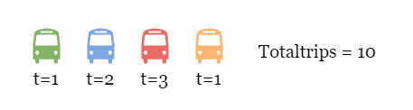
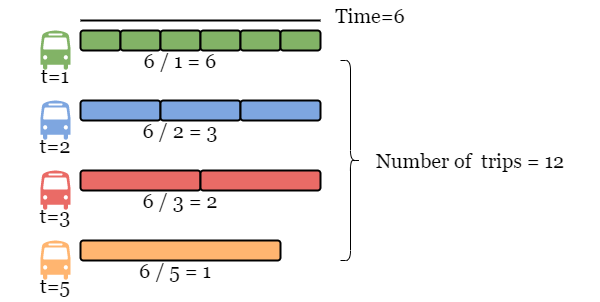
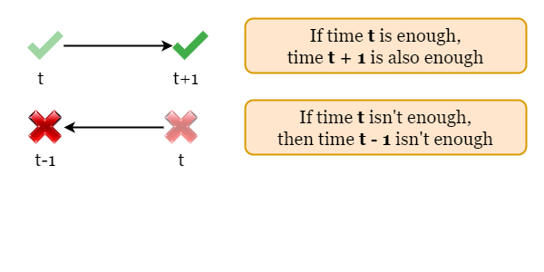
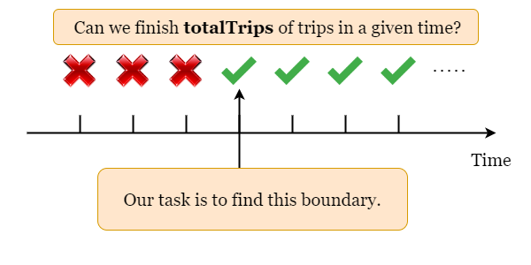

## Solution

---

### Overview

In this problem, we are given an array `time` representing some buses, the bus `i` needs $\text{time}[i]$ to complete a trip. Each bus works independently and doesn't need breaks between trips.

<br>

Take the following picture as an example, we are given four buses $time = [1, 2, 3, 1]$ and $totalTrips = 10$.



Assume the time needed is $\text{given}_{time}$, for bus `i`, the number of trips it can finish within $\text{given}_{time}$ is $\text{given}_{time} / \text{time}[i]$. Thus the total number of trips is the sum of $\text{given}_{time} / \text{time}[i]$ for all buses. In the following picture, we can tell that if the given time is `6`, these buses can finish (at least) `totalTrips` in time.



The task is, given `totalTrips`, what is the minimum time for all buses to finish `totalTrips`?

---

### Approach: Binary Search

#### Intuition

Start with the brute force solution: since we are asked to find the minimum valid time to finish `totalTrips`, it's safe to check each time starting from the smallest. If the current time $\text{curr}_{time}$ is not enough, we will move on to $\text{curr}_{time} + 1$. We keep trying each time until we find the first (and the minimum) time that is long enough for all buses to finish `totalTrips`.

However, according to the constraints given to us in the question, we can't afford to try every time from the smallest as this approach is likely to exceed the time limit, so we shall look for a better way to locate the minimum time.

After some observation, we can observe the following pattern:



Combining the two patterns we have found before, whether each time is long enough to finish `totalTrips` or not is shown in the figure below. We need to find the boundary, which is the minimum valid time.



Rather than brute force, we can take advantage of this feature and use binary search to cut the search space by half each time to locate the minimum valid time. Start with initializing the search space, we set the left boundary as $left = 1$ since it is the minimum possible valid time, we also set the right boundary as $right = totalTrips * \text{maximum}_{time}$ where $\text{maximum}_{time}$ equals the maximum time taken by one trip, so `right` is guaranteed to be long enough. Therefore, the minimum time is included in this search space.

Then we keep checking if the middle time `mid` is long enough.

If not, it means `mid` is too short and we shall cut the half containing smaller times, otherwise, we shall cut the half containing larger times. Then we move on to the remaining half and repeat the process until there is only one time left, which is the minimum valid time.

We can check if a given time `mid` is sufficient by iterating over the input and using the formula we introduced above (each bus can complete $mid / \text{time}[i]$ trips).

<br>

#### Algorithm

1) Initialize the search space by setting boundaries. The minimum possible valid time is `1` since we can't set a shorter time than this, thus we set the left boundary as $left = 1$. For the right boundary, we can set it as the `totalTrips` multiplied by the maximum time required by one bus, thus this time is long enough for buses to finish `totalTrips`, so we set the right boundary as $right = max(times) * totalTrips$.

2) While `left < right`, get the middle value as $mid = (left + right) / 2$.
3) Check if all buses can finish `totalTrips` in `mid` time, by iterating over `time` and adding up the result of the integer division of $\text{time}[i]$ by `mid`.

- If the sum is larger than or equals to `totalTrips`, it means `mid` is long enough, we cut the larger half of the searching space by setting $right = mid$ and repeat step 2.
- Otherwise, it means `mid` is too short, we shall cut the smaller half of the searching space by setting $left = mid + 1$ and repeat step 2.
4) Return `left` once the binary search ends.

#### Implementation

```python
class Solution:
    def minimumTime(self, time: List[int], totalTrips: int) -> int:
        # Initialize the left and right boundaries.
        left, right = 1, max(time) * totalTrips

        # Can these buses finish 'totalTrips' of trips in 'given_time'?
        def timeEnough(given_time):
            actual_trips = 0
            for t in time:
                actual_trips += given_time // t
            return actual_trips >= totalTrips

        # Binary search to find the minimum time to finish the task.
        while left < right:
            mid = (left + right) // 2
            if timeEnough(mid):
                right = mid
            else:
                left = mid + 1
        return left
```

#### Complexity Analysis

Let $n$ be the length of `time`, $m$ be the upper limit of `totalTrips` and $k$ be the maximum time taken by one trip.

* Time complexity: $O(n \cdot \log (m\cdot k))$

- We set the right boundary of the searching space as $m \cdot k$. The searching space is cut by half each time, thus it takes $O(\log (m\cdot k))$ steps to finish the binary search.
- In each step, we iterate the entire array `time` to calculate the number of trips made in the given time, it takes $O(n)$ time.
- To sum up, the time complexity is $O(n \cdot \log (m\cdot k))$.

* Space complexity: $O(1)$

- During the binary search, we only need to record the two boundaries `left` and `right`, and the number of trips made in each given time `mid`. Therefore the space complexity is $O(1)$.

<br/>