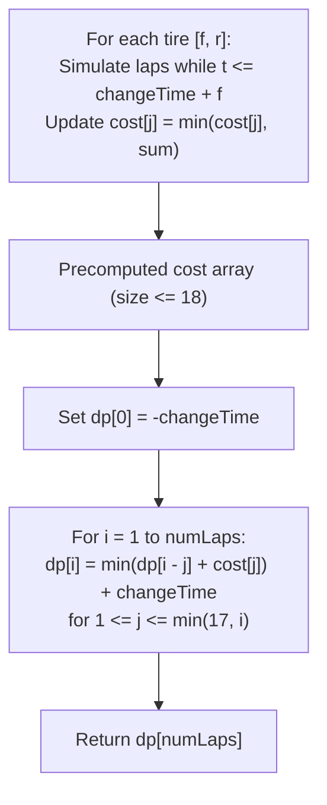

# Guided Example: Minimum Time to Finish the Race

We analyze and trace the two-stage geometric stint precomputation and 1D dynamic programming algorithm on a representative race instance, demonstrating how exponential degradation under base $r \ge 2$ bounds maximal continuous tire stints to at most $17$ laps and evaluates optimal race strategy in $O((|\text{tires}| + \text{numLaps}) \cdot 18)$ time.

- **Input:** `tires = [[2, 3], [3, 4]]`, `changeTime = 5`, `numLaps = 4`
- **Output:** `21`

This instance demonstrates geometric lap-time decay, the threshold boundary where tire changes become mandatory, continuous-stint memoization, and 1D partitioned DP optimization.

---

## 1. Problem Overview & Representative Instance

We are given a list of tire types `tires`, where each tire is described by a pair $[f, r]$:
- $f$: The base time in seconds required to complete the 1st lap on that tire.
- $r$: The degradation factor. The $x$-th consecutive lap completed on the same tire takes $f \cdot r^{x - 1}$ seconds.

Race rules:
1. We must complete exactly `numLaps` laps in minimal total time.
2. Any tire can be selected at the start without penalty.
3. Between any two consecutive laps, we may choose to spend `changeTime` seconds to install a fresh tire of any available type.
4. Tires can be reused indefinitely from an unlimited inventory.

In our representative instance:
- `tires = [[2, 3], [3, 4]]`, `changeTime = 5`, `numLaps = 4`.
- Evaluating Tire 0 ($[2, 3]$):
  - Lap 1: $2 \cdot 3^0 = 2$ seconds (Cumulative: $2$).
  - Lap 2: $2 \cdot 3^1 = 6$ seconds (Cumulative: $2 + 6 = 8$).
  - Lap 3: $2 \cdot 3^2 = 18$ seconds. Notice that $18 > \text{changeTime} + f = 5 + 2 = 7$. It is strictly faster to change tires ($5$ s) and run Lap 1 on a fresh tire ($2$ s) than to run Lap 3 on the worn tire ($18$ s)!
- Evaluating Tire 1 ($[3, 4]$):
  - Lap 1: $3$ seconds.
  - Lap 2: $3 \cdot 4 = 12$ seconds ($12 > 5 + 2 = 7$; slower than changing).
- Optimal strategy for $4$ laps:
  - Run $2$ consecutive laps on Tire 0: takes $8$ seconds.
  - Pay `changeTime`: takes $5$ seconds.
  - Run $2$ consecutive laps on a fresh Tire 0: takes $8$ seconds.
  - Total time: $8 + 5 + 8 = 21$ seconds.

---

## 2. Mathematical & Algorithmic Principles

### Exponential Degradation & The 17-Lap Stint Upper Bound

On any single tire with parameters $[f, r]$, the time required to complete the $x$-th consecutive lap is:
$$t_x = f \cdot r^{x - 1}$$

Because degradation factor $r \ge 2$, lap times grow exponentially:
$$t_x \ge f \cdot 2^{x - 1}$$

Suppose we run a worn tire for an additional lap. If that single lap takes longer than changing tires and completing a fresh lap on the best available tire:
$$t_x > \text{changeTime} + f_{\min}$$
Then continuing on the worn tire is strictly suboptimal under all circumstances.
Given problem constraints:
$$\text{changeTime} \le 10^5, \quad f \le 10^5 \implies \text{changeTime} + f \le 2 \times 10^5$$
Because $2^{17} = 131{,}072$ and $2^{18} = 262{,}144$, any stint of length $\ge 18$ laps forces a single lap time exceeding $2 \times 10^5$, which is guaranteed to be strictly worse than changing tires.
Therefore, the maximum consecutive laps run on any single tire is bounded by $L_{\max} \le 17$.

### Two-Stage Algorithm Formulation

#### Stage 1: Continuous Stint Cost Precomputation
Define $\text{cost}[j]$ as the minimum time to complete exactly $j$ consecutive laps on a single tire without changing, for $j \in [1, 17]$:
$$\text{cost}[j] = \min_{[f, r] \in \text{tires}} \sum_{x=1}^j f \cdot r^{x - 1}$$

#### Stage 2: 1D Dynamic Programming over Laps
Let $dp[i]$ be the minimum time to complete $i$ laps.
If the final stint used a tire for $j$ laps ($1 \le j \le \min(17, i)$):
$$dp[i] = \min_{1 \le j \le \min(17, i)} (dp[i - j] + \text{cost}[j] + \text{changeTime})$$

To normalize the fact that the very first tire does not incur a `changeTime` fee, we initialize:
$$dp[0] = -\text{changeTime}$$
Adding `changeTime` to every transition then correctly charges $0$ for the initial tire and `changeTime` for each subsequent tire swap.

| Metric / Array | Mathematical Definition | Algorithmic Function |
|---|---|---|
| Single Lap Cost $t_x$ | $f \cdot r^{x - 1}$ | Duration of the $x$-th consecutive lap on tire $[f, r]$ |
| Stint Array $\text{cost}[j]$ | $\min \sum_{x=1}^j t_x$ | Optimal time to run $j$ laps on a single tire |
| State $dp[i]$ | Minimum time for $i$ laps | Global DP memoization table |
| Base Anchor $dp[0]$ | $-\text{changeTime}$ | Offset compensating for zero startup change cost |
| Cutoff Horizon | $j \le 17$ | Upper limit on single tire stint length |

---

## 3. Step-by-Step Walkthrough with Intermediate State

We trace `tires = [[2, 3], [3, 4]]`, `changeTime = 5`, `numLaps = 4`.

### Step 1: Precompute Stint Costs (`cost[1 ... 17]`)
Initialize `cost = [inf] * 18`.
- **Tire 0 ($[2, 3]$):**
  - Lap 1 ($x=1$): $t = 2$, sum $s = 2$. $\text{cost}[1] = \min(\infty, 2) = 2$.
  - Next $t = 2 \times 3 = 6 \le 5 + 2 = 7$.
  - Lap 2 ($x=2$): sum $s = 2 + 6 = 8$. $\text{cost}[2] = \min(\infty, 8) = 8$.
  - Next $t = 6 \times 3 = 18 > 7$. Stint terminates for Tire 0.
- **Tire 1 ($[3, 4]$):**
  - Lap 1 ($x=1$): $t = 3$, sum $s = 3$. $\text{cost}[1] = \min(2, 3) = 2$.
  - Next $t = 3 \times 4 = 12 > 5 + 3 = 8$. Stint terminates for Tire 1.
- Final `cost` array:
  - $\text{cost}[1] = 2$
  - $\text{cost}[2] = 8$
  - $\text{cost}[j] = \infty$ for all $j \ge 3$.

### Step 2: 1D Dynamic Programming Transitions
Initialize `dp` array of size $5$ with $\infty$:
- $dp[0] = -5$ (cancels first change penalty).

- **Computing $dp[1]$ ($i = 1$ lap):**
  - Stint $j = 1$: $dp[1 - 1] + \text{cost}[1] = dp[0] + \text{cost}[1] = -5 + 2 = -3$.
  - Add changeTime: $dp[1] = -3 + 5 = 2$.
  - Meaning: 1 lap on Tire 0 takes $2$ seconds.

- **Computing $dp[2]$ ($i = 2$ laps):**
  - Stint $j = 1$: $dp[1] + \text{cost}[1] = 2 + 2 = 4$.
  - Stint $j = 2$: $dp[0] + \text{cost}[2] = -5 + 8 = 3$.
  - Minimum candidate: $\min(4, 3) = 3$.
  - Add changeTime: $dp[2] = 3 + 5 = 8$.
  - Meaning: 2 laps continuous on Tire 0 takes $8$ seconds (better than $2 + 5 + 2 = 9$).

- **Computing $dp[3]$ ($i = 3$ laps):**
  - Stint $j = 1$: $dp[2] + \text{cost}[1] = 8 + 2 = 10$.
  - Stint $j = 2$: $dp[1] + \text{cost}[2] = 2 + 8 = 10$.
  - Minimum candidate: $\min(10, 10) = 10$.
  - Add changeTime: $dp[3] = 10 + 5 = 15$.
  - Meaning: 2 laps continuous + change + 1 lap takes $8 + 5 + 2 = 15$ seconds.

- **Computing $dp[4]$ ($i = 4$ laps):**
  - Stint $j = 1$: $dp[3] + \text{cost}[1] = 15 + 2 = 17$.
  - Stint $j = 2$: $dp[2] + \text{cost}[2] = 8 + 8 = 16$.
  - Minimum candidate: $\min(17, 16) = 16$.
  - Add changeTime: $dp[4] = 16 + 5 = 21$.
  - Meaning: Two stints of $2$ laps separated by a change takes $8 + 5 + 8 = 21$ seconds.

### Step 3: Result Extraction
- Output $dp[4] = 21$.

---

## 4. Comprehensive State Trace

The dynamic programming evaluation across all laps is detailed below:

| Target Lap $i$ | Stint $j = 1$ ($dp[i-1] + 2$) | Stint $j = 2$ ($dp[i-2] + 8$) | Best Stint Candidate | $+ \text{changeTime}$ ($5$) | Final $dp[i]$ | Optimal Strategy Breakdown |
|---|---|---|---|---|---|---|
| 0 | — | — | — | — | **-5** | Base offset |
| 1 | $-5 + 2 = -3$ | — | -3 | $+5$ | **2** | 1 lap continuous (Tire 0) |
| 2 | $2 + 2 = 4$ | $-5 + 8 = 3$ | 3 | $+5$ | **8** | 2 laps continuous (Tire 0) |
| 3 | $8 + 2 = 10$ | $2 + 8 = 10$ | 10 | $+5$ | **15** | Stint of 2 + Change + Stint of 1 |
| 4 | $15 + 2 = 17$ | $8 + 8 = 16$ | 16 | $+5$ | **21** | **Stint of 2 + Change + Stint of 2** |

### Single Tire Lap Duration Breakdown

| Consecutive Lap $x$ | Tire 0 Duration ($2 \cdot 3^{x-1}$) | Cumulative Tire 0 Time | Tire 1 Duration ($3 \cdot 4^{x-1}$) | Fresh Tire Alternative ($5 + 2$) | Better to Change? |
|---|---|---|---|---|---|
| 1 | 2 | 2 | 3 | — | Run |
| 2 | 6 | 8 | 12 | 7 | Run Tire 0; Discard Tire 1 |
| 3 | 18 | 26 | 48 | 7 | **Change Tire (18 > 7)** |

---

## 5. Algorithmic Correctness & Soundness

### Soundness of Bounding Window
Because $r \ge 2$, the $x$-th lap cost is at least $f \cdot 2^{x-1}$.
If $f \cdot 2^{x-1} > \text{changeTime} + f_{\min}$, the single lap cost alone exceeds the total cost of installing a fresh tire and completing that lap on the fresh tire.
Therefore, any race plan containing a continuous stint of $x$ laps can be strictly improved by replacing lap $x$ with a tire change followed by a fresh lap 1.
Hence, the optimal solution never contains a stint exceeding $17$ laps. Restricting $j \le 17$ in the DP recurrence evaluates every potentially optimal decision.

### Optimal Substructure
The problem of completing $i$ laps decomposes into completing $i - j$ laps optimally, followed by paying one tire change fee and completing $j$ laps in the best single-stint time $\text{cost}[j]$.
Because the tire change completely resets the tire state, the past history and future stint are mutually independent.
Thus, optimal substructure holds, guaranteeing global optimality.

---

## 6. Edge Cases & Anti-Patterns

### Edge Cases
1. **Extremely High `changeTime` (e.g. `changeTime = 100`, `numLaps = 4`):**
   - Changing tires is penalized heavily.
   - Longer stints remain competitive because paying 100 s to change is worse than absorbing degradation up to lap 4.
2. **Single Lap Race (`numLaps = 1`):**
   - $dp[1] = \min(f)$. No tire changes occur.
3. **Identical Tires:**
   - Precomputation simply finds the minimum across copies without redundant states.

### Anti-Patterns to Avoid
- **Unbounded Stint Transitions ($j$ up to `numLaps`):** Allowing $j$ to range up to $1000$ requires calculating $f \cdot r^{1000}$, causing massive numerical overflow and $O(\text{numLaps}^2)$ runtime. Bounding $j \le 17$ eliminates overflow and keeps transitions $O(1)$.
- **Simulating Greedy Tire Swaps:** Greedily changing tires as soon as a lap feels slow fails because stint lengths must coordinate to hit the exact target `numLaps` without an inefficient leftover lap.

---

## 7. Complexity Analysis

- **Time Complexity:** $O(|\text{tires}| \cdot 18 + \text{numLaps} \cdot 18)$. Precomputing the cost array takes at most $18$ iterations per tire, totaling $18 \cdot |\text{tires}|$ operations. The DP table has $\text{numLaps}$ states, and each state evaluates at most $18$ transitions. With $|\text{tires}| \le 10^5$ and $\text{numLaps} \le 1000$, total operations are bounded by $1.8 \times 10^6 + 1.8 \times 10^4 \approx 1.82 \times 10^6$, running in under $25$ milliseconds.
- **Auxiliary Space Complexity:** $O(\text{numLaps})$. The `dp` array stores $\text{numLaps} + 1$ integers ($\le 1001$ entries). The `cost` array stores $18$ numbers. Total auxiliary space is under $50$ kilobytes.