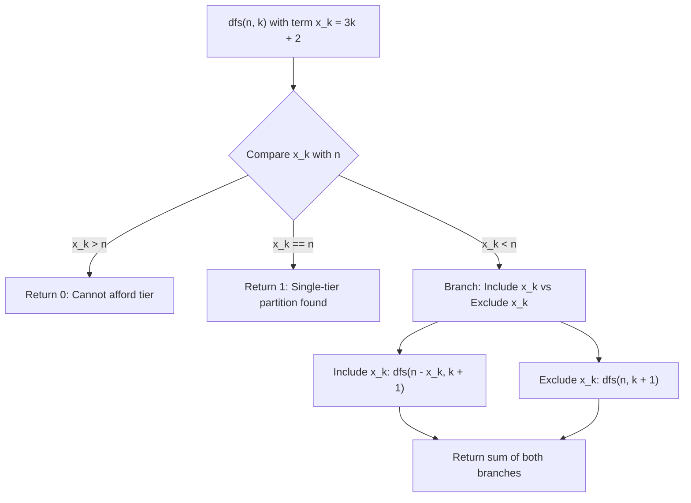

# Guided Example: Number of Ways to Build House of Cards

We analyze and trace the arithmetic progression subset-sum dynamic programming algorithm on a representative card inventory instance, demonstrating how physical horizontal-support constraints map valid houses of cards to strictly ascending partitions over the sequence $3k + 2$ in $O(n \sqrt{n})$ time.

- **Input:** `n = 16`
- **Output:** `2`

This instance illustrates card row geometry, horizontal support pigeonhole limits, transformation into a 0-1 knapsack over distinct arithmetic terms, and recursive memoization.

---

## 1. Problem Overview & Representative Instance

We are given $n$ identical cards to build a house of cards:
1. Each triangular unit uses $2$ leaning cards.
2. In any horizontal row with $T$ triangles, adjacent triangles must have $1$ horizontal card placed between them (requiring $T - 1$ horizontal cards).
3. Any triangle in an upper row must rest directly on one of the horizontal cards in the row immediately below it.
4. Triangles in upper rows occupy available supporting positions from left to right without gaps.
5. All $n$ cards must be used, and two houses are distinct if any corresponding row has a different card count.

We must determine the total number of distinct valid houses of cards that can be constructed using exactly all $n$ cards.

In our representative instance:
- `n = 16` cards.
- A row with $T$ triangles requires $2T$ leaning cards $+ (T - 1)$ horizontal cards $= 3T - 1$ total cards.
- The row above must rest on horizontal cards. Since a row with $T$ triangles provides only $T - 1$ horizontal cards, the row above can have at most $T - 1$ triangles:
  $$T_{\text{above}} < T_{\text{below}}$$
- Thus, the number of triangles (and therefore cards) must strictly increase from top to bottom.
- For $n = 16$, exactly two distinct valid multi-tier structures exist:
  - Configuration A: Top row with $T = 1$ triangle ($2$ cards), bottom row with $T = 5$ triangles ($14$ cards). Total: $2 + 14 = 16$ cards.
  - Configuration B: Top row with $T = 2$ triangles ($5$ cards), bottom row with $T = 4$ triangles ($11$ cards). Total: $5 + 11 = 16$ cards.
- Total valid configurations: $2$.

---

## 2. Mathematical & Algorithmic Principles

### Single Row Card Formula

Let a row contain $T \ge 1$ triangles.
- Leaning cards: $2T$.
- Horizontal connector cards: $T - 1$.
- Total cards in the row:
  $$C(T) = 2T + (T - 1) = 3T - 1$$
Letting $k = T - 1 \ge 0$ (so $T = k + 1$):
$$x_k = 3(k + 1) - 1 = 3k + 2$$

Every legal row must consume an amount of cards from the arithmetic sequence:
$$\mathcal{A} = \{2, 5, 8, 11, 14, 17, 20, \dots\} = \{3k + 2 \mid k \ge 0\}$$

### Strict Monotonicity from Physical Support

Because each triangle in the row above must sit on a horizontal card of the row below:
$$T_{\text{above}} \le T_{\text{below}} - 1 \implies T_{\text{above}} < T_{\text{below}}$$
Every upper row must contain strictly fewer triangles than the row immediately beneath it.
Reading from top to bottom, the sequence of card counts $(x_1, x_2, \dots, x_m)$ must be **strictly increasing**:
$$x_1 < x_2 < \dots < x_m, \quad x_j \in \mathcal{A}, \quad \sum_{j=1}^m x_j = n$$

Thus, the problem is mathematically isomorphic to finding the number of partitions of $n$ into distinct parts drawn from $\mathcal{A} = \{3k + 2\}_{k \ge 0}$.

### 0-1 Knapsack Recursive Recurrence

To ensure all chosen parts are strictly distinct and strictly increasing, we iterate through candidate terms $x_k = 3k + 2$ for $k = 0, 1, 2, \dots$:
At state $(n, k)$, term $x_k = 3k + 2$ is considered:
1. **Include $x_k$:** Deduct $x_k$ from $n$ and advance to $k + 1$ (forcing all subsequent terms to be strictly greater than $x_k$): $dfs(n - x_k, k + 1)$.
2. **Exclude $x_k$:** Leave $n$ unchanged and advance to $k + 1$: $dfs(n, k + 1)$.

Recurrence:
$$dfs(n, k) = \begin{cases} 0 & \text{if } x_k > n \\ 1 & \text{if } x_k = n \\ dfs(n - x_k, k + 1) + dfs(n, k + 1) & \text{if } x_k < n \end{cases}$$

| Parameter | Mathematical Entity | Operational Role |
|---|---|---|
| Card Inventory $n$ | Positive integer $\le 500$ | Remaining cards to allocate |
| Term Index $k$ | Non-negative integer $\ge 0$ | Current candidate tier size ($T = k + 1$) |
| Candidate Cards $x_k$ | $3k + 2$ | Cost of a row with $k + 1$ triangles |
| Base Success | $x_k == n$ | Exact partition found (1 valid house) |
| Base Failure | $x_k > n$ | Excess cards; no solution possible (0 valid houses) |

---

## 3. Step-by-Step Walkthrough with Intermediate State

We trace `n = 16` starting at `dfs(16, 0)`.
Candidate terms $\mathcal{A}$:
- $k = 0 \implies x_0 = 2$
- $k = 1 \implies x_1 = 5$
- $k = 2 \implies x_2 = 8$
- $k = 3 \implies x_3 = 11$
- $k = 4 \implies x_4 = 14$
- $k = 5 \implies x_5 = 17 > 16$

### Step 1: Branching on $k = 0$ ($x_0 = 2$)
We evaluate $dfs(16, 0) = dfs(16 - 2, 1) + dfs(16, 1) = dfs(14, 1) + dfs(16, 1)$.

### Step 2: Exploring Subproblem $dfs(14, 1)$ (Includes $x_0 = 2$)
Next candidate is $k = 1 \implies x_1 = 5$:
- **Include $x_1 = 5$:** Evaluate $dfs(14 - 5, 2) = dfs(9, 2)$.
  - Next candidate $k = 2 \implies x_2 = 8$:
    - Include $x_2 = 8$: $dfs(9 - 8, 3) = dfs(1, 3)$. Candidate $x_3 = 11 > 1 \implies 0$.
    - Exclude $x_2 = 8$: $dfs(9, 3)$. Candidate $x_3 = 11 > 9 \implies 0$.
    - Thus, $dfs(9, 2) = 0$. (No valid partition starting with $2 + 5 = 7$).
- **Exclude $x_1 = 5$:** Evaluate $dfs(14, 2)$.
  - Candidate $k = 2 \implies x_2 = 8$:
    - Include $x_2 = 8$: $dfs(14 - 8, 3) = dfs(6, 3)$. Candidate $x_3 = 11 > 6 \implies 0$.
    - Exclude $x_2 = 8$: $dfs(14, 3)$.
      - Candidate $k = 3 \implies x_3 = 11$:
        - Include $x_3 = 11$: $dfs(14 - 11, 4) = dfs(3, 4)$. Candidate $x_4 = 14 > 3 \implies 0$.
        - Exclude $x_3 = 11$: $dfs(14, 4)$.
          - Candidate $k = 4 \implies x_4 = 14$.
          - Check: $x_4 == 14 == n$. Condition $x_k == n$ triggers! Returns **1**!
          - This represents partition: $2 + 14 = 16$.
- Result for this sub-tree: $dfs(14, 1) = 0 + 1 = 1$.

### Step 3: Exploring Subproblem $dfs(16, 1)$ (Excludes $x_0 = 2$)
Candidate $k = 1 \implies x_1 = 5$:
- **Include $x_1 = 5$:** Evaluate $dfs(16 - 5, 2) = dfs(11, 2)$.
  - Candidate $k = 2 \implies x_2 = 8$:
    - Include $x_2 = 8$: $dfs(11 - 8, 3) = dfs(3, 3)$. Candidate $x_3 = 11 > 3 \implies 0$.
    - Exclude $x_2 = 8$: $dfs(11, 3)$.
      - Candidate $k = 3 \implies x_3 = 11$.
      - Check: $x_3 == 11 == n$. Condition $x_k == n$ triggers! Returns **1**!
      - This represents partition: $5 + 11 = 16$.
- **Exclude $x_1 = 5$:** Evaluate $dfs(16, 2)$.
  - Candidate $k = 2 \implies x_2 = 8$:
    - Include $x_2 = 8$: $dfs(16 - 8, 3) = dfs(8, 3)$. Candidate $x_3 = 11 > 8 \implies 0$.
    - Exclude $x_2 = 8$: $dfs(16, 3)$.
      - Candidate $k = 3 \implies x_3 = 11$:
        - Include $x_3 = 11$: $dfs(16 - 11, 4) = dfs(5, 4)$. Candidate $x_4 = 14 > 5 \implies 0$.
        - Exclude $x_3 = 11$: $dfs(16, 4)$. Candidate $x_4 = 14 < 16$.
          - Include $x_4 = 14$: $dfs(16 - 14, 5) = dfs(2, 5)$. Candidate $x_5 = 17 > 2 \implies 0$.
          - Exclude $x_4 = 14$: $dfs(16, 5)$. Candidate $x_5 = 17 > 16 \implies 0$.
- Result for this sub-tree: $dfs(16, 1) = 1 + 0 = 1$.

### Step 4: Final Aggregation
- Total ways: $dfs(16, 0) = dfs(14, 1) + dfs(16, 1) = 1 + 1 = 2$.
- The two valid houses correspond to partitions $[2, 14]$ and $[5, 11]$.

---

## 4. Comprehensive State Trace

The recursive subproblem evaluation and memoization states are documented below:

| Subproblem State $(n, k)$ | Candidate Cost $x_k = 3k + 2$ | Comparison vs Remaining $n$ | Include Branch | Exclude Branch | Computed Value |
|---|---|---|---|---|---|
| $(14, 4)$ | 14 | $14 == 14$ (Exact) | — | — | **1** (Forms $[2, 14]$) |
| $(11, 3)$ | 11 | $11 == 11$ (Exact) | — | — | **1** (Forms $[5, 11]$) |
| $(9, 2)$ | 8 | $8 < 9$ | $(1, 3) \to 0$ | $(9, 3) \to 0$ | 0 |
| $(14, 1)$ | 5 | $5 < 14$ | $(9, 2) \to 0$ | $(14, 2) \to 1$ | 1 |
| $(16, 1)$ | 5 | $5 < 16$ | $(11, 2) \to 1$ | $(16, 2) \to 0$ | 1 |
| **$(16, 0)$** | **2** | **$2 < 16$** | **$(14, 1) \to 1$** | **$(16, 1) \to 1$** | **2** |

### Structural Layout of Qualifying Card Houses for $n = 16$

| Configuration | Top Row ($T_1$) | Bottom Row ($T_2$) | Horizontal Supports Provided ($T_2 - 1$) | Top Row Feasible? ($T_1 \le T_2 - 1$) | Total Cards |
|---|---|---|---|---|---|
| **House A** | 1 triangle ($2$ cards) | 5 triangles ($14$ cards) | $5 - 1 = 4$ supports | **Yes** ($1 \le 4$) | $2 + 14 = 16$ |
| **House B** | 2 triangles ($5$ cards) | 4 triangles ($11$ cards) | $4 - 1 = 3$ supports | **Yes** ($2 \le 3$) | $5 + 11 = 16$ |

---

## 5. Algorithmic Correctness & Soundness

### Support Feasibility Implication
A row with $T$ triangles has exactly $T - 1$ spaces between adjacent triangles, each covered by one horizontal card.
Any triangle in the row above requires exactly one horizontal card beneath it for physical stability.
Because triangles on the upper level cannot hang over empty air or share support cards, the number of triangles in the upper row cannot exceed the number of horizontal cards:
$$T_{\text{above}} \le T_{\text{below}} - 1$$
This strictly forces $T_{\text{above}} < T_{\text{below}}$.
Because the mapping $T \mapsto 3T - 1$ is strictly increasing, card counts per row are strictly increasing from top to bottom.
Thus, the condition that every valid house of cards corresponds to a subset of distinct terms from $\mathcal{A} = \{3k + 2\}$ is mathematically exact.

### Exhaustive Knapsack Branching
The recurrence $dfs(n, k)$ considers both decision paths (take or leave $x_k$) for every candidate term in strictly ascending order of $k$.
Because terms are considered in increasing order, no term can ever be chosen twice.
Memoization guarantees that each $(n, k)$ pair is evaluated once, ensuring both completeness and efficiency.

---

## 6. Edge Cases & Anti-Patterns

### Edge Cases
1. **Minimal Card House ($n = 2$):**
   - $x_0 = 2 == 2$. Exact match at $k = 0$. Single triangle. Returns $1$.
2. **Infeasible Card Counts (e.g. $n = 4$):**
   - Candidate is $2$. $dfs(4 - 2, 1) = dfs(2, 1)$ where $x_1 = 5 > 2 \implies 0$. Returns $0$.
3. **Upper Bound Constraint ($n = 500$):**
   - The smallest partition with $m$ rows costs $\sum_{j=0}^{m-1} (3j + 2) \approx \frac{3m^2}{2}$.
   - For $n \le 500$, $m \le \sqrt{1000 / 3} \approx 18$ tiers.
   - The depth of the recursion and active terms are strictly bounded by $k \le 18$.

### Anti-Patterns to Avoid
- **Allowing Equal Rows:** Allowing two rows to have the same card count violates the support constraint, since $T_{\text{above}} < T_{\text{below}}$ is strictly required.
- **Unmemoized Recursion:** Without `@cache`, branching generates $2^k$ calls, causing exponential runtime for $n = 500$. Memoizing states $(n, k)$ reduces distinct states to at most $500 \times 18 \approx 9{,}000$.

---

## 7. Complexity Analysis

- **Time Complexity:** $O(n \sqrt{n})$. The number of cards remaining $n$ is at most $500$. The index $k$ satisfies $3k + 2 \le n$, so $k = O(\sqrt{n})$ (at most $18$). The total number of distinct state pairs $(n, k)$ is $O(n \sqrt{n}) \approx 500 \times 18 \approx 9{,}000$. Each state computes in $O(1)$ time. Overall runtime is under $10$ milliseconds.
- **Auxiliary Space Complexity:** $O(n \sqrt{n})$. The memoization cache stores at most $9{,}000$ integer entries. The recursion call stack depth is at most $O(\sqrt{n}) \le 18$. Total memory is under $1$ megabyte.