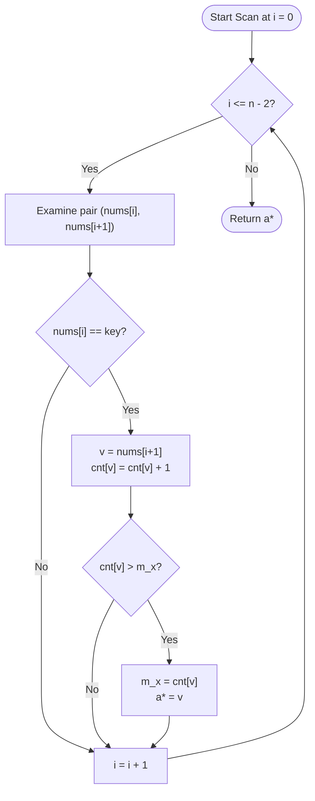

# Guided Example: Most Frequent Number Following Key In an Array

We analyze and trace the single-pass frequency aggregation algorithm for identifying the most frequent target integer immediately succeeding a specified key within a finite sequence, establishing $O(n)$ time complexity and $O(u)$ auxiliary space where $u \le 1000$ represents the domain of distinct candidate values.

- **Input:** `nums = [1, 200, 1, 300, 1, 200, 400, 1, 200]`, `key = 1`
- **Output:** `200`

This representative instance highlights adjacent pair inspection, selective conditional filtering against a target key, online tracking of running frequency maxima, and robust handling of interleaved non-key elements.

---

## 1. Problem Overview & Representative Instance

Given a 0-indexed integer array `nums` and an integer `key` guaranteed to be present in `nums`, we consider every index $i \in \{0, 1, \dots, n - 2\}$ such that $\text{nums}[i] = \text{key}$.
For each such index $i$, the element $\text{nums}[i + 1]$ is denoted as an immediate successor (or target) of `key`.

Our objective is to return the target integer that appears with the maximum frequency across all immediate successor positions following `key`. The problem specification guarantees that the maximum frequency is achieved by a unique target value.

### Representative Instance Breakdown

Consider the sequence:
$$\text{nums} = [1, 200, 1, 300, 1, 200, 400, 1, 200], \quad \text{key} = 1$$

Here, the total array length is $n = 9$. The key $1$ appears at indices $0, 2, 4,$ and $7$:
1. At index $0$: $\text{nums}[0] = 1$, followed by $\text{nums}[1] = 200$.
2. At index $2$: $\text{nums}[2] = 1$, followed by $\text{nums}[3] = 300$.
3. At index $4$: $\text{nums}[4] = 1$, followed by $\text{nums}[5] = 200$.
4. At index $7$: $\text{nums}[7] = 1$, followed by $\text{nums}[8] = 200$.

The observed successor multiset is $\{200, 300, 200, 200\}$. The frequency distribution is:
- $\text{freq}(200) = 3$
- $\text{freq}(300) = 1$

The unique maximum frequency is $3$, corresponding to target $200$.

---

## 2. Mathematical & Algorithmic Principles

### Formal Definition of Successor Multiset

Let $S_{\text{key}}(\text{nums})$ denote the multiset of values immediately succeeding `key`:
$$S_{\text{key}}(\text{nums}) = \{\!\{\text{nums}[i + 1] \mid 0 \le i \le n - 2 \land \text{nums}[i] = \text{key}\}\!\}$$

For each distinct value $v \in S_{\text{key}}(\text{nums})$, its count is defined as:
$$\text{count}(v) = \sum_{i=0}^{n-2} \mathbf{1}_{(\text{nums}[i] = \text{key} \land \text{nums}[i+1] = v)}$$

The target result is:
$$v^* = \arg\max_{v} \text{count}(v)$$

### Streaming Online Maximum Maintenance

Rather than performing a two-pass procedure (first accumulating all counts into a hash map and subsequently finding the global maximum), we can maintain the running maximum online during the single linear scan:
- Maintain a running map $\text{cnt}$ from value to integer frequency.
- Maintain the maximum observed count $m_x$ (initially $0$) and current optimal value $a^*$ (initially undefined or $0$).
- As each adjacent pair $(\text{nums}[i], \text{nums}[i + 1])$ is visited:
  - If $\text{nums}[i] = \text{key}$:
    - Let $v = \text{nums}[i + 1]$.
    - Increment $\text{cnt}[v] \leftarrow \text{cnt}[v] + 1$.
    - If $\text{cnt}[v] > m_x$, update $m_x \leftarrow \text{cnt}[v]$ and $a^* \leftarrow v$.

---

## 3. Step-by-Step Walkthrough with Intermediate State

We trace the representative instance `nums = [1, 200, 1, 300, 1, 200, 400, 1, 200]` with `key = 1`.

### Step 1: Pair $(0, 1) \to (1, 200)$
- Left element $\text{nums}[0] = 1 = \text{key}$.
- Successor $v = \text{nums}[1] = 200$.
- Counter update: $\text{cnt}[200] \leftarrow 0 + 1 = 1$.
- Comparison: $\text{cnt}[200] = 1 > m_x = 0 \implies m_x \leftarrow 1, a^* \leftarrow 200$.

### Step 2: Pair $(1, 2) \to (200, 1)$
- Left element $\text{nums}[1] = 200 \ne \text{key}$.
- Condition not met; counter and running maximum remain unchanged.

### Step 3: Pair $(2, 3) \to (1, 300)$
- Left element $\text{nums}[2] = 1 = \text{key}$.
- Successor $v = \text{nums}[3] = 300$.
- Counter update: $\text{cnt}[300] \leftarrow 0 + 1 = 1$.
- Comparison: $\text{cnt}[300] = 1 \ngtr m_x = 1 \implies m_x$ and $a^*$ remain $1$ and $200$.

### Step 4: Pair $(3, 4) \to (300, 1)$
- Left element $\text{nums}[3] = 300 \ne \text{key}$.
- Condition not met; no modification.

### Step 5: Pair $(4, 5) \to (1, 200)$
- Left element $\text{nums}[4] = 1 = \text{key}$.
- Successor $v = \text{nums}[5] = 200$.
- Counter update: $\text{cnt}[200] \leftarrow 1 + 1 = 2$.
- Comparison: $\text{cnt}[200] = 2 > m_x = 1 \implies m_x \leftarrow 2, a^* \leftarrow 200$.

### Step 6: Pair $(5, 6) \to (200, 400)$
- Left element $\text{nums}[5] = 200 \ne \text{key}$.
- Condition not met; no modification.

### Step 7: Pair $(6, 7) \to (400, 1)$
- Left element $\text{nums}[6] = 400 \ne \text{key}$.
- Condition not met; no modification.

### Step 8: Pair $(7, 8) \to (1, 200)$
- Left element $\text{nums}[7] = 1 = \text{key}$.
- Successor $v = \text{nums}[8] = 200$.
- Counter update: $\text{cnt}[200] \leftarrow 2 + 1 = 3$.
- Comparison: $\text{cnt}[200] = 3 > m_x = 2 \implies m_x \leftarrow 3, a^* \leftarrow 200$.

---

## 4. Comprehensive State Trace

The table below outlines the state evolution across all adjacent pairs of the input array.

| Index $i$ | Pair $(a, b)$ | Condition $a = 1$? | Target $b$ | Updated $\text{cnt}[b]$ | Running $m_x$ | Current Best $a^*$ |
|---|---|---|---|---|---|---|
| $0$ | $(1, 200)$ | Yes | $200$ | $1$ | $1$ | $200$ |
| $1$ | $(200, 1)$ | No | — | — | $1$ | $200$ |
| $2$ | $(1, 300)$ | Yes | $300$ | $1$ | $1$ | $200$ |
| $3$ | $(300, 1)$ | No | — | — | $1$ | $200$ |
| $4$ | $(1, 200)$ | Yes | $200$ | $2$ | $2$ | $200$ |
| $5$ | $(200, 400)$ | No | — | — | $2$ | $200$ |
| $6$ | $(400, 1)$ | No | — | — | $2$ | $200$ |
| $7$ | $(1, 200)$ | Yes | $200$ | $3$ | $3$ | $200$ |

### Successor Frequency Summary Table

| Candidate Target $v$ | Total Follower Occurrences | Relative Frequency in Multiset | Final Selection |
|---|---|---|---|
| $200$ | $3$ | $3 / 4 = 75\%$ | Selected (Maximum) |
| $300$ | $1$ | $1 / 4 = 25\%$ | Discarded |

---

## 5. Algorithmic Correctness & Soundness

### Loop Invariant

At index $k \in \{0, 1, \dots, n - 2\}$:
1. The frequency map $\text{cnt}$ accurately reflects the exact count of each target value occurring immediately after $\text{key}$ in the prefix subarray $\text{nums}[0 \dots k + 1]$.
2. The scalar $m_x$ equals $\max_{v} \text{cnt}[v]$ over the prefix.
3. The candidate $a^*$ holds a value $v$ whose count in the prefix equals $m_x$.

### Termination & Uniqueness Guarantee

When the loop terminates at $k = n - 2$, every valid adjacent pair in $\text{nums}$ has been inspected exactly once.
Because the problem statement guarantees that the global maximizer of the successor counts is strictly unique, there exists a unique value $v^*$ such that $\text{count}(v^*) > \text{count}(v)$ for all $v \ne v^*$.
Hence, upon the final increment of $\text{cnt}[v^*]$, the condition $\text{cnt}[v^*] > m_x$ will have been triggered, leaving $a^* = v^*$ at termination.

---

## 6. Edge Cases & Anti-Patterns

### Edge Case Considerations
- **Consecutive Keys:** When `nums = [1, 1, 1]`, the second element acts both as the successor of the first key and as the key for the second pair. In this scenario, the target $1$ occurs twice, correctly resulting in $1$.
- **Key at Array Tail:** If the final element $\text{nums}[n - 1] = \text{key}$, no element follows it. Iterating strictly over $0 \le i \le n - 2$ prevents an index out-of-bounds error.
- **Minimum Array Size ($n = 2$):** If `nums = [1, 2]` and `key = 1`, only pair $(0, 1)$ exists. The loop runs exactly once, immediately setting $a^* = 2$ with count $1$.

### Anti-Patterns to Avoid
- **Unbounded Index Lookahead:** Looping through $i \in \{0, \dots, n - 1\}$ and querying $i + 1$ without boundary checks raises out-of-bounds exceptions when $i = n - 1$.
- **Two-Pass Overhead:** Building a separate list of all followers before calling a sorting or full-table maximum routine incurs unnecessary extra allocations when a single online pass is sufficient.
- **Ignoring Consecutive Occurrences:** Treating pairs as non-overlapping disjoint blocks of size $2$ misses valid successor relationships where $\text{nums}[i + 1] = \text{nums}[(i + 1) + 1]$.

---

## 7. Complexity Analysis

### Time Complexity
- The adjacent pair generator inspects $n - 1$ consecutive pairs.
- For each pair where the first element equals `key`, map lookup and increment require $O(1)$ amortized time.
- Updating scalar values $m_x$ and $a^*$ takes $O(1)$ time.
- Total Time Complexity: $\mathcal{O}(n)$, which is asymptotically optimal as every element must be read at least once.

### Space Complexity
- The frequency map stores counts for distinct values that directly follow `key`.
- Under the problem constraints, $1 \le \text{nums}[i] \le 1000$, so the number of distinct values $u$ satisfies $u \le \min(n, 1000)$.
- Auxiliary Space Complexity: $\mathcal{O}(u) = \mathcal{O}(\min(n, 1000))$, which behaves as $\mathcal{O}(1)$ auxiliary space under bounded integer domains.
