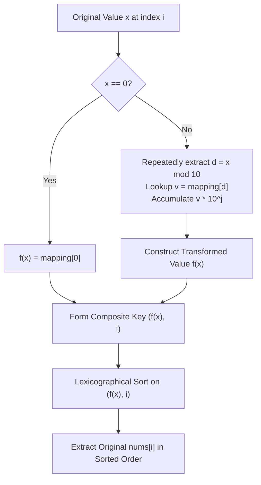

# Guided Example: Sort the Jumbled Numbers

We analyze and trace the digit-transformation and stable-sorting algorithm for reordering an integer sequence under a substitution cipher on base-10 digits, establishing $O(n \log n \cdot \log_{10} M)$ time complexity and $O(n)$ auxiliary space, where $n$ is the array length and $M$ is the maximum value in `nums`.

- **Input:** `mapping = [8, 9, 4, 0, 2, 1, 3, 5, 7, 6]`, `nums = [991, 338, 38]`
- **Output:** `[338, 38, 991]`

This representative instance demonstrates multi-digit substitution, suppression of leading zeros in mapped numerical values, and preservation of relative input order across equal mapped keys (stability).

---

## 1. Problem Overview & Representative Instance

We are provided with an array `mapping` of length $10$, where $\text{mapping}[d]$ defines the substitute digit for each digit $d \in \{0, 1, \dots, 9\}$.
We are also given an integer array `nums`.

For each integer $x \in \text{nums}$, we form its mapped numerical value $f(x)$ by replacing every decimal digit $d$ of $x$ with $\text{mapping}[d]$ while preserving digit positions. The mapped string of digits is then interpreted as a standard non-negative integer in base 10 (consequently dropping leading zeros, except when the original number is $0$, whose mapped value is $\text{mapping}[0]$).

The task is to sort the elements of `nums` in non-decreasing order according to their mapped values $f(x)$. Crucially, if two elements $x_i$ and $x_j$ share the same mapped value ($f(x_i) = f(x_j)$ with $i < j$), their relative order must remain unchanged ($x_i$ precedes $x_j$).

### Representative Instance Breakdown

Given:
$$\text{mapping} = [8, 9, 4, 0, 2, 1, 3, 5, 7, 6], \quad \text{nums} = [991, 338, 38]$$

Digit mapping lookup table:
- $0 \mapsto 8$, $1 \mapsto 9$, $2 \mapsto 4$, $3 \mapsto 0$, $4 \mapsto 2$
- $5 \mapsto 1$, $6 \mapsto 3$, $7 \mapsto 5$, $8 \mapsto 7$, $9 \mapsto 6$

Let us evaluate $f(x)$ for each element:
1. $x = 991$ at index $0$:
   - Digits: $9, 9, 1$.
   - Mapped digits: $\text{mapping}[9] = 6$, $\text{mapping}[9] = 6$, $\text{mapping}[1] = 9 \implies "669"$.
   - Value: $f(991) = 669$.
2. $x = 338$ at index $1$:
   - Digits: $3, 3, 8$.
   - Mapped digits: $\text{mapping}[3] = 0$, $\text{mapping}[3] = 0$, $\text{mapping}[8] = 7 \implies "007"$.
   - Numerical value: $f(338) = 7$.
3. $x = 38$ at index $2$:
   - Digits: $3, 8$.
   - Mapped digits: $\text{mapping}[3] = 0$, $\text{mapping}[8] = 7 \implies "07"$.
   - Numerical value: $f(38) = 7$.

Comparing mapped values:
- $f(338) = 7$ (index $1$)
- $f(38) = 7$ (index $2$)
- $f(991) = 669$ (index $0$)

Because $f(338) = f(38) = 7 < 669$, both $338$ and $38$ precede $991$. By stability, index $1$ precedes index $2$, yielding $[338, 38, 991]$.

---

## 2. Mathematical & Algorithmic Principles

### Decimal Digit Projection

Let $x \in \mathbb{N}_0$ have decimal expansion:
$$x = \sum_{j=0}^{k-1} d_j \cdot 10^j, \quad d_j \in \{0, 1, \dots, 9\}$$

For $x > 0$, the mapped numerical value is evaluated by substituting each digit with $\text{mapping}[d_j]$:
$$f(x) = \sum_{j=0}^{k-1} \text{mapping}[d_j] \cdot 10^j$$
For $x = 0$, $f(0) = \text{mapping}[0]$.

Notice that Horner-style or least-significant-digit modulo decomposition extracts $d_j = (x \div 10^j) \bmod 10$, building $f(x)$ without string conversions or memory reallocations.

### Stable Ordering Relation

To guarantee total ordering with stable tie-breaking, we decorate each element into a composite key tuple:
$$\text{key}(x_i) = (f(x_i), i)$$
where $i$ is the original 0-based array index of $x_i$.

The lexicographical comparator on tuples enforces:
$$(f(x_i), i) < (f(x_j), j) \iff (f(x_i) < f(x_j)) \lor (f(x_i) = f(x_j) \land i < j)$$

Since all indices $i$ are strictly distinct, no two tuples compare equal, ensuring a deterministic, strictly stable sorting permutation.

---

## 3. Step-by-Step Walkthrough with Intermediate State

We trace the representative instance `mapping = [8, 9, 4, 0, 2, 1, 3, 5, 7, 6]` and `nums = [991, 338, 38]`.

### Step 1: Compute Mapped Values for Each Element

#### Element 0: $x = 991$, index $i = 0$
- Digit extraction (least to most significant):
  - $j = 0$: $991 \bmod 10 = 1$, $\text{mapping}[1] = 9$, contribution $= 9 \times 10^0 = 9$, $x \leftarrow 99$.
  - $j = 1$: $99 \bmod 10 = 9$, $\text{mapping}[9] = 6$, contribution $= 6 \times 10^1 = 60$, $x \leftarrow 9$.
  - $j = 2$: $9 \bmod 10 = 9$, $\text{mapping}[9] = 6$, contribution $= 6 \times 10^2 = 600$, $x \leftarrow 0$.
- Reconstructed value: $9 + 60 + 600 = 669$.
- Composite key: $(669, 0)$.

#### Element 1: $x = 338$, index $i = 1$
- Digit extraction:
  - $j = 0$: $338 \bmod 10 = 8$, $\text{mapping}[8] = 7$, contribution $= 7 \times 10^0 = 7$, $x \leftarrow 33$.
  - $j = 1$: $33 \bmod 10 = 3$, $\text{mapping}[3] = 0$, contribution $= 0 \times 10^1 = 0$, $x \leftarrow 3$.
  - $j = 2$: $3 \bmod 10 = 3$, $\text{mapping}[3] = 0$, contribution $= 0 \times 10^2 = 0$, $x \leftarrow 0$.
- Reconstructed value: $7 + 0 + 0 = 7$.
- Composite key: $(7, 1)$.

#### Element 2: $x = 38$, index $i = 2$
- Digit extraction:
  - $j = 0$: $38 \bmod 10 = 8$, $\text{mapping}[8] = 7$, contribution $= 7 \times 10^0 = 7$, $x \leftarrow 3$.
  - $j = 1$: $3 \bmod 10 = 3$, $\text{mapping}[3] = 0$, contribution $= 0 \times 10^1 = 0$, $x \leftarrow 0$.
- Reconstructed value: $7 + 0 = 7$.
- Composite key: $(7, 2)$.

---

### Step 2: Sorting the Composite Keys

We sort the list of tuples $[(669, 0), (7, 1), (7, 2)]$ under standard lexicographical ordering:
1. Comparing $(669, 0)$ against $(7, 1)$: $7 < 669 \implies (7, 1)$ precedes $(669, 0)$.
2. Comparing $(7, 1)$ against $(7, 2)$: first components are equal ($7 = 7$). Secondary components resolve tie: $1 < 2 \implies (7, 1)$ precedes $(7, 2)$.
3. Comparing $(7, 2)$ against $(669, 0)$: $7 < 669 \implies (7, 2)$ precedes $(669, 0)$.

Sorted order of tuples:
$$[(7, 1), (7, 2), (669, 0)]$$

---

### Step 3: Permutation Projection

Projecting back to the original elements using the recorded indices:
- Tuple $(7, 1) \implies \text{nums}[1] = 338$.
- Tuple $(7, 2) \implies \text{nums}[2] = 38$.
- Tuple $(669, 0) \implies \text{nums}[0] = 991$.

Final reordered array: $[338, 38, 991]$.

---

## 4. Comprehensive State Trace

The table below illustrates the digit extraction, transformed value, composite key, and sorting rank for each element.

| Index $i$ | Original $x$ | Decimal Digits | Mapped Digits | Evaluated $f(x)$ | Sort Key $(f(x), i)$ | Final Rank | Resulting Output |
|---|---|---|---|---|---|---|---|
| $0$ | $991$ | $[9, 9, 1]$ | $[6, 6, 9]$ | $669$ | $(669, 0)$ | $3$ | $991$ |
| $1$ | $338$ | $[3, 3, 8]$ | $[0, 0, 7]$ | $7$ | $(7, 1)$ | $1$ | $338$ |
| $2$ | $38$ | $[3, 8]$ | $[0, 7]$ | $7$ | $(7, 2)$ | $2$ | $38$ |

### Digit Conversion Mechanics Summary

| Step Variable | Iteration $j=0$ | Iteration $j=1$ | Iteration $j=2$ | Final Value $f(x)$ |
|---|---|---|---|---|
| $x = 991$ | $d_0 = 1 \mapsto 9$, weight $1$ | $d_1 = 9 \mapsto 6$, weight $10$ | $d_2 = 9 \mapsto 6$, weight $100$ | $9 + 60 + 600 = 669$ |
| $x = 338$ | $d_0 = 8 \mapsto 7$, weight $1$ | $d_1 = 3 \mapsto 0$, weight $10$ | $d_2 = 3 \mapsto 0$, weight $100$ | $7 + 0 + 0 = 7$ |
| $x = 38$ | $d_0 = 8 \mapsto 7$, weight $1$ | $d_1 = 3 \mapsto 0$, weight $10$ | — | $7 + 0 = 7$ |

---

## 5. Algorithmic Correctness & Soundness

### Soundness of Digit Extraction
The arithmetic extraction loop computes quotient and remainder:
$$x = 10 \cdot q + r, \quad 0 \le r < 10$$
By induction on the number of digits, this visits digits in strictly increasing power-of-ten order ($10^0, 10^1, \dots$). Multiplying the mapped value $\text{mapping}[r]$ by the running place-value multiplier $k = 10^j$ guarantees that the resulting sum matches the base-10 numerical evaluation of the substituted string.

### Soundness of Tie-Breaking
The composite key $(f(x_i), i)$ is injective: because $i \ne j$ for all distinct positions in `nums`, no two tuples are identical. When $f(x_i) = f(x_j)$, the secondary key comparison $i < j$ exactly mirrors the original input ordering, satisfying the requirement of a stable sorting algorithm.

---

## 6. Edge Cases & Anti-Patterns

### Edge Cases
- **Original Zero ($x = 0$):** When $x = 0$, a standard `while x > 0` loop would perform zero iterations and return $0$, even if $\text{mapping}[0] \ne 0$. An explicit branch for $x = 0$ returning $\text{mapping}[0]$ is mandatory.
- **Leading Zeros in Mapped Representation:** Numbers like $338$ map to digits $0, 0, 7$. As integers, $007 = 7$. Our arithmetic reconstruction automatically handles this since $0 \times 10^2 + 0 \times 10^1 + 7 = 7$.
- **All Digits Mapping to Zero:** If a number maps to $000$, its numerical value correctly reduces to $0$.
- **Numbers Already Sorted:** The comparator $(f(x_i), i)$ preserves stability even when all mapped values are identical.

### Anti-Patterns to Avoid
- **In-Place Unstable Sort:** Using an unstable sorting routine directly on mapped keys destroys the required relative order of identical mapped values.
- **String Parsing Overhead:** Converting each number to a string, looking up characters, joining characters, and re-parsing to integer creates significant allocation overhead. Direct arithmetic digit extraction is substantially faster and avoids memory churn.

---

## 7. Complexity Analysis

### Time Complexity
- **Mapping Generation:** For each of the $n$ numbers, digit extraction takes $O(\log_{10} x)$ iterations. With $x \le 10^9$, the number of digits is at most $10 \approx O(1)$. Generating all composite keys requires $O(n \cdot L)$ operations, where $L \le 10$.
- **Sorting:** Sorting $n$ tuples of length $2$ using comparison-based sort takes $O(n \log n)$ key comparisons.
- **Reconstruction:** A single pass of length $n$ gathers the sorted numbers: $O(n)$.
- **Total Time Complexity:** $\mathcal{O}(n \log n)$, which easily operates within time limits for $n \le 3 \cdot 10^4$.

### Space Complexity
- Storing the decorated tuples $(f(x_i), i)$ requires $O(n)$ space.
- The output array requires $O(n)$ space.
- The mapping array uses $O(1)$ fixed space ($10$ entries).
- **Auxiliary Space Complexity:** $\mathcal{O}(n)$.
