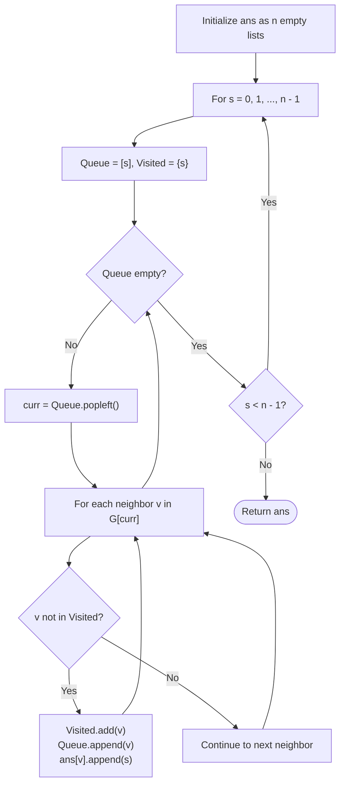

# Guided Example: All Ancestors of a Node in a Directed Acyclic Graph

We analyze and trace the forward reachability traversal algorithm for determining the complete ancestor sets of all vertices in a Directed Acyclic Graph (DAG), establishing $O(n(n + m))$ time complexity and $O(n + m)$ auxiliary graph storage.

- **Input:** `n = 5`, `edges = [[0, 1], [0, 2], [1, 3], [2, 3], [3, 4]]`
- **Output:** `[[], [0], [0], [0, 1, 2], [0, 1, 2, 3]]`

This representative instance highlights multi-path diamond convergence at node $3$, transitive propagation to terminal node $4$, and automatic ascending order generation through sequential source evaluation.

---

## 1. Problem Overview & Representative Instance

We are given a directed acyclic graph (DAG) consisting of $n$ vertices labeled from $0$ to $n - 1$, specified by a list of directed edges where each pair $[u, v]$ indicates a directed edge from $u$ to $v$.

A vertex $u$ is defined as an **ancestor** of vertex $v$ if there exists a directed path of length at least $1$ originating at $u$ and terminating at $v$.
Our goal is to construct a list `ans` of length $n$, where each `ans[i]` contains all ancestors of vertex $i$, sorted in strictly ascending order.

### Representative Instance Breakdown

Consider $n = 5$ with directed edges:
$$\text{edges} = [[0, 1], [0, 2], [1, 3], [2, 3], [3, 4]]$$

Graph connectivity:
- From node $0$, outgoing edges lead to $1$ and $2$.
- From node $1$, an edge leads to $3$.
- From node $2$, an edge leads to $3$.
- From node $3$, an edge leads to $4$.
- Node $4$ has no outgoing edges (sink).

Evaluating reachability from each candidate ancestor:
- **Node $0$** can reach: $\{1, 2, 3, 4\}$.
- **Node $1$** can reach: $\{3, 4\}$.
- **Node $2$** can reach: $\{3, 4\}$.
- **Node $3$** can reach: $\{4\}$.
- **Node $4$** can reach: $\emptyset$.

Inverting reachability to ancestor lists:
- Node $0$ is reached by: none $\implies []$.
- Node $1$ is reached by: $0 \implies [0]$.
- Node $2$ is reached by: $0 \implies [0]$.
- Node $3$ is reached by: $0, 1, 2 \implies [0, 1, 2]$.
- Node $4$ is reached by: $0, 1, 2, 3 \implies [0, 1, 2, 3]$.

---

## 2. Mathematical & Algorithmic Principles

### Duality of Ancestor Sets and Reachability

Let $G = (V, E)$ be a finite directed acyclic graph where $V = \{0, 1, \dots, n - 1\}$.
The ancestor relation is the transitive closure of the edge relation:
$$\text{Anc}(v) = \{u \in V \mid u \rightsquigarrow v, \, u \ne v\}$$

Observe the fundamental duality:
$$u \in \text{Anc}(v) \iff v \in \text{Reach}(u) \setminus \{u\}$$
where $\text{Reach}(u) = \{w \in V \mid u \rightsquigarrow w\}$.

### Inherent Sortedness via Sequential Exploration

Rather than reversing all edges and launching traversals to find predecessors (which requires sorting the accumulated predecessors of each node afterward), we explore the forward graph:
1. Iterate through candidate ancestor source nodes $s$ in natural increasing order: $s = 0, 1, \dots, n - 1$.
2. For each source $s$, execute a breadth-first search (BFS) or depth-first search (DFS) over the original graph $G$.
3. For every node $v$ visited during the traversal of source $s$ (excluding $s$ itself), append $s$ to the list of ancestors $\text{ans}[v]$.

Because $s$ is processed in strictly increasing order $0 < 1 < \dots < n - 1$, any node $v$ will have smaller ancestor IDs appended before larger ancestor IDs. Consequently, each list $\text{ans}[v]$ is automatically sorted in strictly ascending order without requiring any post-traversal sorting step.

---

## 3. Step-by-Step Walkthrough with Intermediate State

We trace the algorithm execution on $n = 5$ with edges $[[0, 1], [0, 2], [1, 3], [2, 3], [3, 4]]$.

### Iteration $s = 0$ (Source $0$)
- Queue: $[0]$, Visited: $\{0\}$.
- Pop $0$:
  - Neighbor $1$: not visited. Visited $\leftarrow \{0, 1\}$, append $1$ to Queue. Append $0$ to $\text{ans}[1]$.
  - Neighbor $2$: not visited. Visited $\leftarrow \{0, 1, 2\}$, append $2$ to Queue. Append $0$ to $\text{ans}[2]$.
- Pop $1$:
  - Neighbor $3$: not visited. Visited $\leftarrow \{0, 1, 2, 3\}$, append $3$ to Queue. Append $0$ to $\text{ans}[3]$.
- Pop $2$:
  - Neighbor $3$: already in Visited ($\{0, 1, 2, 3\}$), skip.
- Pop $3$:
  - Neighbor $4$: not visited. Visited $\leftarrow \{0, 1, 2, 3, 4\}$, append $4$ to Queue. Append $0$ to $\text{ans}[4]$.
- Pop $4$: no outgoing edges.
- State of `ans`:
  - $\text{ans}[0] = []$
  - $\text{ans}[1] = [0]$
  - $\text{ans}[2] = [0]$
  - $\text{ans}[3] = [0]$
  - $\text{ans}[4] = [0]$

---

### Iteration $s = 1$ (Source $1$)
- Queue: $[1]$, Visited: $\{1\}$.
- Pop $1$:
  - Neighbor $3$: not visited. Visited $\leftarrow \{1, 3\}$, append $3$ to Queue. Append $1$ to $\text{ans}[3]$.
- Pop $3$:
  - Neighbor $4$: not visited. Visited $\leftarrow \{1, 3, 4\}$, append $4$ to Queue. Append $1$ to $\text{ans}[4]$.
- Pop $4$: no outgoing edges.
- State of `ans`:
  - $\text{ans}[3] = [0, 1]$
  - $\text{ans}[4] = [0, 1]$

---

### Iteration $s = 2$ (Source $2$)
- Queue: $[2]$, Visited: $\{2\}$.
- Pop $2$:
  - Neighbor $3$: not visited. Visited $\leftarrow \{2, 3\}$, append $3$ to Queue. Append $2$ to $\text{ans}[3]$.
- Pop $3$:
  - Neighbor $4$: not visited. Visited $\leftarrow \{2, 3, 4\}$, append $4$ to Queue. Append $2$ to $\text{ans}[4]$.
- Pop $4$: no outgoing edges.
- State of `ans`:
  - $\text{ans}[3] = [0, 1, 2]$
  - $\text{ans}[4] = [0, 1, 2]$

---

### Iteration $s = 3$ (Source $3$)
- Queue: $[3]$, Visited: $\{3\}$.
- Pop $3$:
  - Neighbor $4$: not visited. Visited $\leftarrow \{3, 4\}$, append $4$ to Queue. Append $3$ to $\text{ans}[4]$.
- Pop $4$: no outgoing edges.
- State of `ans`:
  - $\text{ans}[4] = [0, 1, 2, 3]$

---

### Iteration $s = 4$ (Source $4$)
- Queue: $[4]$, Visited: $\{4\}$.
- Pop $4$: no outgoing edges. Traversal completes immediately.

---

## 4. Comprehensive State Trace

The table below summarizes the reachable set discovered during each source iteration and the resulting modifications to descendant ancestor lists.

| Source $s$ | Traversal Order | Nodes Reached ($v \ne s$) | Lists Updated | Updated State of `ans` |
|---|---|---|---|---|
| $0$ | $0 \to 1 \to 2 \to 3 \to 4$ | $\{1, 2, 3, 4\}$ | $\text{ans}[1], \text{ans}[2], \text{ans}[3], \text{ans}[4]$ | $[[], [0], [0], [0], [0]]$ |
| $1$ | $1 \to 3 \to 4$ | $\{3, 4\}$ | $\text{ans}[3], \text{ans}[4]$ | $[[], [0], [0], [0, 1], [0, 1]]$ |
| $2$ | $2 \to 3 \to 4$ | $\{3, 4\}$ | $\text{ans}[3], \text{ans}[4]$ | $[[], [0], [0], [0, 1, 2], [0, 1, 2]]$ |
| $3$ | $3 \to 4$ | $\{4\}$ | $\text{ans}[4]$ | $[[], [0], [0], [0, 1, 2], [0, 1, 2, 3]]$ |
| $4$ | $4$ | $\emptyset$ | None | $[[], [0], [0], [0, 1, 2], [0, 1, 2, 3]]$ |

### Final Ancestor Inventory

| Node ID $v$ | In-Degree | Predecessors (Direct) | All Ancestors (Transitive) | Ascending Order Verified |
|---|---|---|---|---|
| $0$ | $0$ | $\emptyset$ | $[]$ | Yes |
| $1$ | $1$ | $\{0\}$ | $[0]$ | Yes |
| $2$ | $1$ | $\{0\}$ | $[0]$ | Yes |
| $3$ | $2$ | $\{1, 2\}$ | $[0, 1, 2]$ | Yes |
| $4$ | $1$ | $\{3\}$ | $[0, 1, 2, 3]$ | Yes |

---

## 5. Algorithmic Correctness & Soundness

### Completeness
Let $u$ be an ancestor of $v$. By definition, there exists a directed path $P = (u = w_0, w_1, \dots, w_k = v)$ with $k \ge 1$.
When the outer loop sets $s = u$, standard breadth-first search from $s$ explores all vertices reachable via directed paths. Because $G$ is finite and the visited set tracks visited vertices without cycles, BFS will explore the path $P$ and visit $v$. Thus, $s = u$ is guaranteed to be appended to $\text{ans}[v]$.

### Uniqueness and Order Soundness
During the traversal of source $s$, the set `vis` prevents any vertex from being visited or enqueued more than once. Therefore, $s$ is appended to $\text{ans}[v]$ at most once.
Furthermore, the outer loop advances $s$ monotonically from $0$ to $n - 1$. Since elements are only appended to $\text{ans}[v]$ during their respective source iteration, the values in $\text{ans}[v]$ are strictly monotonically increasing, guaranteeing both uniqueness and sorted order without post-processing.

---

## 6. Edge Cases & Anti-Patterns

### Edge Cases
- **Completely Disconnected Graph ($E = \emptyset$):** Each node has in-degree $0$. The BFS terminates immediately at each step without appending to any other node. The output is $n$ empty lists, which is correct.
- **Linear Chain Graph ($0 \to 1 \to 2 \dots \to n-1$):** Each node $i$ has ancestor list $[0, 1, \dots, i - 1]$. The cumulative size of ancestor lists is $\frac{n(n-1)}{2}$, fitting comfortably in memory.
- **Dense Acyclic Tournaments:** Graphs with $O(n^2)$ edges. The BFS visits each edge once per source, completing well within time limits for $n \le 1000$.

### Anti-Patterns to Avoid
- **Naive Recursion Without Memoization / Visited Set:** In diamond-shaped graphs (such as nodes $0 \to 1, 2 \to 3$), branching DFS without a visited set visits common descendants exponentially many times ($O(2^n)$ paths).
- **Set Union via Post-Order / Topological Sort:** Merging ancestor sets at each vertex using topological sort requires taking unions of sets of size up to $n$. Unless implemented with bitsets, repeated hashing and sorting costs $O(n^2 \log n)$ or $O(n^3)$.
- **Sorting Ancestor Lists at the End:** Running reverse BFS and sorting each list adds an extra $O(n \cdot n \log n) = O(n^2 \log n)$ overhead. The forward sequential traversal produces sorted lists for free.

---

## 7. Complexity Analysis

### Time Complexity
- **Graph Construction:** Building the adjacency list from $m$ edges requires $O(n + m)$ operations.
- **Forward Traversals:** We launch $n$ BFS traversals, one for each node $s \in \{0, 1, \dots, n - 1\}$.
- In each BFS traversal, each vertex is visited at most once, and each outgoing edge is inspected at most once, taking $O(n + m)$ time.
- Across all $n$ sources, total traversal time is $O(n(n + m))$.
- With $n \le 1000$ and $m \le \min(2000, n(n-1)/2)$, $n(n + m) \approx 1000 \times 3000 = 3 \times 10^6$ operations, which executes in tens of milliseconds.
- **Total Time Complexity:** $\mathcal{O}(n(n + m))$.

### Space Complexity
- Adjacency list: $O(n + m)$.
- Visited hash set and queue per traversal: $O(n)$.
- Output ancestor list storage: at most $\sum_{i=0}^{n-1} i = \frac{n(n-1)}{2} = O(n^2)$ integers in the worst case (e.g. a total order chain).
- **Auxiliary Space Complexity:** $\mathcal{O}(n + m)$ (excluding returned result).
