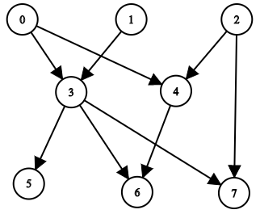
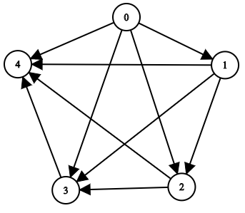

## Description

You are given a positive integer `n` representing the number of nodes of a **Directed Acyclic Graph** (DAG). The nodes are numbered from `0` to $n - 1$ (**inclusive**).

You are also given a 2D integer array `edges`, where $\text{edges}[i] = [\text{from}_{i}, \text{to}_{i}]$ denotes that there is a **unidirectional** edge from $\text{from}_{i}$ to $\text{to}_{i}$ in the graph.

Return *a list* `answer`*, where *$\text{answer}[i]$* is the **list of ancestors** of the* $$i^{\text{th}}$$ *node, sorted in **ascending order***.

A node `u` is an **ancestor** of another node `v` if `u` can reach `v` via a set of edges.
### Function Contract

- `n`: Input parameter.
- Returns expected result.

### Examples

#### Example 1

- **Input:** $n = 8, edgeList = [[0,3],[0,4],[1,3],[2,4],[2,7],[3,5],[3,6],[3,7],[4,6]]$
- **Output:** `[[],[],[],[0,1],[0,2],[0,1,3],[0,1,2,3,4],[0,1,2,3]]`
- **Explanation:**
The above diagram represents the input graph.
- Nodes 0, 1, and 2 do not have any ancestors.
- Node 3 has two ancestors 0 and 1.
- Node 4 has two ancestors 0 and 2.
- Node 5 has three ancestors 0, 1, and 3.
- Node 6 has five ancestors 0, 1, 2, 3, and 4.
- Node 7 has four ancestors 0, 1, 2, and 3.
#### Example 2

- **Input:** $n = 5, edgeList = [[0,1],[0,2],[0,3],[0,4],[1,2],[1,3],[1,4],[2,3],[2,4],[3,4]]$
- **Output:** `[[],[0],[0,1],[0,1,2],[0,1,2,3]]`
- **Explanation:**
The above diagram represents the input graph.
- Node 0 does not have any ancestor.
- Node 1 has one ancestor 0.
- Node 2 has two ancestors 0 and 1.
- Node 3 has three ancestors 0, 1, and 2.
- Node 4 has four ancestors 0, 1, 2, and 3.
### Constraints

- $1 \le n \le 1000$

- $0 \le \text{edges.length} \le min(2000, n * (n - 1) / 2)$

- $\text{edges}[i].length = 2$

- $0 \le \text{from}_{i}, \text{to}_{i} \le n - 1$

- $\text{from}_{i} \neq \text{to}_{i}$

- There are no duplicate edges.

- The graph is **directed** and **acyclic**.