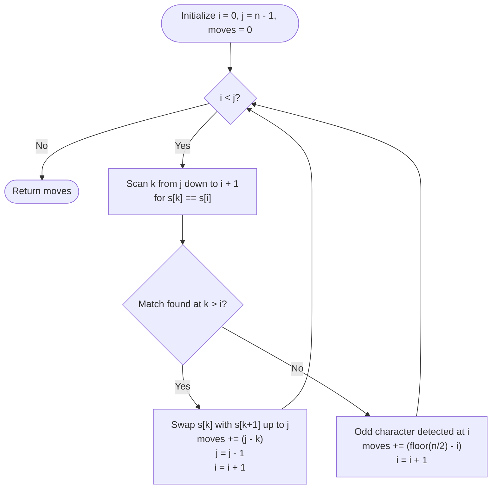

# Guided Example: Minimum Number of Moves to Make Palindrome

We analyze and trace the greedy two-pointer inward-matching algorithm for transforming a permutable string into a palindrome using the minimum number of adjacent character transpositions, establishing $O(n^2)$ time complexity and $O(n)$ auxiliary space.

- **Input:** `s = "ntiin"`
- **Output:** `1`

This representative instance illustrates outer character bilateral matching, detection of the unique odd-frequency character, deferred center-distance counting, and bubble transpositions.

---

## 1. Problem Overview & Representative Instance

We are given a string $s$ consisting of lowercase English letters that is guaranteed to be convertible into a palindrome through a sequence of adjacent character swaps.
In a single move, we can select any two adjacent indices $k$ and $k + 1$ and swap their characters: $s[k] \leftrightarrow s[k + 1]$.

Our goal is to compute the minimum number of adjacent swaps required to transform $s$ into a palindrome.

### Representative Instance Breakdown

Consider the string:
$$s = \text{"ntiin"}, \quad n = 5$$

Character frequency profile:
- $\text{freq}('n') = 2$ (even)
- $\text{freq}('i') = 2$ (even)
- $\text{freq}('t') = 1$ (odd, unique center character)

Notice the positions:
- Index $0$: $'n'$
- Index $1$: $'t'$
- Index $2$: $'i'$
- Index $3$: $'i'$
- Index $4$: $'n'$

1. The outer characters at index $0$ ($'n'$) and index $4$ ($'n'$) already match. Zero moves are needed to form the outermost shell.
2. At index $1$, we encounter $'t'$. Scanning the remaining inner suffix for a matching partner reveals that $'t'$ occurs with frequency $1$. It must ultimately occupy the exact center of the length-$5$ palindrome, which is index $\lfloor 5 / 2 \rfloor = 2$.
3. The displacement required to shift this odd center character from current index $1$ to center index $2$ is $2 - 1 = 1$ swap.
4. Moving $'t'$ to index $2$ leaves $'i'$ and $'i'$ adjacent, yielding the valid palindrome `"nitin"`.
5. Total minimum moves: $1$.

---

## 2. Mathematical & Algorithmic Principles

### Greedy Bilateral Matching Invariant

A palindrome of length $n$ satisfies $s[i] = s[n - 1 - i]$ for all $i \in \{0, 1, \dots, \lfloor n/2 \rfloor\}$.
Each adjacent swap alters the inversion count by exactly $\pm 1$. Minimizing adjacent swaps to reach a target permutation corresponds to computing the inversion distance between the original sequence and the nearest palindromic permutation.

The greedy choice theorem for palindromic transpositions states:
> For any character at the current left boundary $i$, pairing it with its **rightmost** identical counterpart at index $k \le j$ and shifting that partner to the right boundary $j$ via $j - k$ adjacent swaps minimizes the total inversion distance for the remaining inner substring.

### The Odd-Center Character Invariant

When the length $n$ is odd, exactly one character has an odd frequency in $s$.
If a character at index $i$ has no matching partner in the range $[i + 1, j]$, it must be the unique odd-frequency character destined for the center position $\lfloor n / 2 \rfloor$.
- Rather than immediately swapping it to the physical center (which would shift all intermediate character indices and disrupt the active window), we can mathematically add its required center displacement $\lfloor n / 2 \rfloor - i$ directly to the move accumulator.
- We then advance the left pointer $i \leftarrow i + 1$ while keeping the right pointer $j$ fixed, allowing all remaining even-frequency pairs to match around it.

---

## 3. Step-by-Step Walkthrough with Intermediate State

We trace the algorithm execution on $s = \text{"ntiin"}$ ($n = 5$).

### Initial Configuration
- Array representation: `cs = ['n', 't', 'i', 'i', 'n']`
- Pointers: $i = 0, j = 4$
- Running moves: $\text{ans} = 0$

### Iteration 1: $i = 0, j = 4$
- Target left character: $\text{cs}[0] = 'n'$.
- Search $k$ from $j = 4$ down to $i + 1 = 1$:
  - $k = 4$: $\text{cs}[4] = 'n' == \text{cs}[0]$. Match found!
- Bubble distance: $j - k = 4 - 4 = 0$ swaps.
- State of `cs` remains `['n', 't', 'i', 'i', 'n']`.
- Boundary update: matched outer pair resolved $\implies j \leftarrow 3, i \leftarrow 1$.
- Total moves: $\text{ans} = 0$.

### Iteration 2: $i = 1, j = 3$
- Target left character: $\text{cs}[1] = 't'$.
- Search $k$ from $j = 3$ down to $i + 1 = 2$:
  - $k = 3$: $\text{cs}[3] = 'i' \ne 't'$.
  - $k = 2$: $\text{cs}[2] = 'i' \ne 't'$.
- Search exhausted without match. $\text{cs}[1] = 't'$ is the unique odd-frequency center element.
- Displacement addition:
  $$\Delta = \lfloor n / 2 \rfloor - i = \lfloor 5 / 2 \rfloor - 1 = 2 - 1 = 1$$
- $\text{ans} \leftarrow 0 + 1 = 1$.
- Advance left pointer: $i \leftarrow 2$ (right pointer remains $j = 3$).

### Iteration 3: $i = 2, j = 3$
- Target left character: $\text{cs}[2] = 'i'$.
- Search $k$ from $j = 3$ down to $i + 1 = 3$:
  - $k = 3$: $\text{cs}[3] = 'i' == \text{cs}[2]$. Match found!
- Bubble distance: $j - k = 3 - 3 = 0$ swaps.
- State of `cs`: `['n', 't', 'i', 'i', 'n']`.
- Boundary update: $j \leftarrow 2, i \leftarrow 3$.
- Total moves: $\text{ans} = 1$.

### Loop Termination
- Current pointers: $i = 3, j = 2 \implies i \ge j$.
- Loop terminates.
- Final answer: $1$.

---

## 4. Comprehensive State Trace

The table below tracks pointer movements, character comparisons, match positions, and swap additions across all iterations.

| Iteration | Left Ptr $i$ | Right Ptr $j$ | Target $\text{cs}[i]$ | Match Index $k$ | Partner Found? | Swap Distance Added | Cumulative Moves | Updated String |
|---|---|---|---|---|---|---|---|---|
| Start | $0$ | $4$ | — | — | — | $0$ | $0$ | `"ntiin"` |
| $1$ | $0$ | $4$ | $'n'$ | $4$ | Yes | $4 - 4 = 0$ | $0$ | `"ntiin"` |
| $2$ | $1$ | $3$ | $'t'$ | None | No (Odd center) | $2 - 1 = 1$ | $1$ | `"ntiin"` |
| $3$ | $2$ | $3$ | $'i'$ | $3$ | Yes | $3 - 3 = 0$ | $1$ | `"ntiin"` |
| End | $3$ | $2$ | — | — | — | — | $1$ | `"ntiin"` |

### Trace on an Asymmetric Unbalanced Instance: `s = "aabb"`

To demonstrate physical adjacent bubbling, consider $s = \text{"aabb"}$ ($n = 4$):

| Step | Active Window | Inspected $i$ | Partner $k$ | Bubble Swaps Executed | Substring Transformation | Resulting Array | Moves Added |
|---|---|---|---|---|---|---|---|
| $1$ | $[0 \dots 3]$ | $\text{cs}[0] = 'a'$ | $k = 1$ | $k=1 \leftrightarrow 2$, then $2 \leftrightarrow 3$ | Bubble $'a'$ to index $3$ | `['a', 'b', 'b', 'a']` | $+2$ |
| $2$ | $[1 \dots 2]$ | $\text{cs}[1] = 'b'$ | $k = 2$ | Already at $j = 2$ | None needed | `['a', 'b', 'b', 'a']` | $+0$ |
| Total | — | — | — | — | Fully symmetric | `"abba"` | $2$ |

---

## 5. Algorithmic Correctness & Soundness

### Optimality of Greedy Matching
Suppose $s[i]$ has multiple candidate matches in the suffix. Selecting the **rightmost** match $k$ minimizes the distance $j - k$ to the right boundary. Because all intervening identical characters are interchangeable, choosing any earlier match $k' < k$ would require strictly more adjacent transpositions ($j - k' > j - k$) to reach $j$ without offering any advantage to the inner unplaced characters.

### Correctness of Deferred Center Displacement
Moving the single odd character to the exact center $\lfloor n / 2 \rfloor$ requires moving it across all characters that will end up between its current position and the center.
Because the remaining characters will form symmetric pairs distributed equally to the left and right of the center, the net number of inversions created between this odd character and the rest of the string is invariant to when the odd character is physically shifted. Thus, adding $\lfloor n / 2 \rfloor - i$ directly to the total cost and skipping it in the array yields the exact minimum move count.

---

## 6. Edge Cases & Anti-Patterns

### Edge Cases
- **Already Palindromic (`s = "racecar"`):** In every step, $\text{cs}[i] == \text{cs}[j]$, so $k = j$. Distance $j - k = 0$, requiring $0$ moves.
- **Identical Repeated Characters (`s = "aaaa"`):** Matches are immediately found at $k = j$, yielding $0$ swaps.
- **Odd Character Already at Center:** If the odd-frequency character is already at index $i = \lfloor n / 2 \rfloor$, the term $\lfloor n / 2 \rfloor - i$ evaluates to $0$.
- **Even Length with Symmetric Distances (`s = "letelt"`):** Even length strings have no odd-frequency characters; all characters match with $k > i$.

### Anti-Patterns to Avoid
- **Greedy Matching from Left to Right:** Choosing the leftmost match of $s[i]$ rather than the rightmost match requires dragging a character across a larger distance, producing suboptimal swap counts.
- **Physically Swapping the Center Character:** Performing actual swaps to push the center character to $\lfloor n / 2 \rfloor$ mid-traversal shifts all indices in the right half, complicating pointer arithmetic and risking out-of-bounds errors.
- **Brute Force Permutation BFS:** Exploring state space via BFS on adjacent swaps has factorial complexity $O(n!)$, which is completely infeasible for $n = 2000$.

---

## 7. Complexity Analysis

### Time Complexity
- The outer pointer $i$ advances by $1$ in each iteration, performing at most $n / 2$ iterations.
- In each iteration, scanning for $k$ takes at most $j - i \le n$ steps.
- If a match is found, bubbling $k$ to $j$ takes $j - k \le n$ swaps.
- Across all $n / 2$ iterations, the total number of character scans and swaps is bounded by $\sum_{m=1}^{n/2} 2(n - 2m) = O(n^2)$.
- With $n \le 2000$, $n^2 \approx 4 \cdot 10^6$ operations, executing within a few milliseconds.
- **Total Time Complexity:** $\mathcal{O}(n^2)$.

### Space Complexity
- Converting the string to a mutable list of characters requires $O(n)$ space.
- A handful of pointer and accumulator variables ($i, j, k, \text{ans}$) require $O(1)$ space.
- **Auxiliary Space Complexity:** $\mathcal{O}(n)$.
